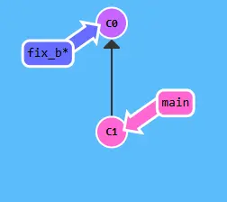
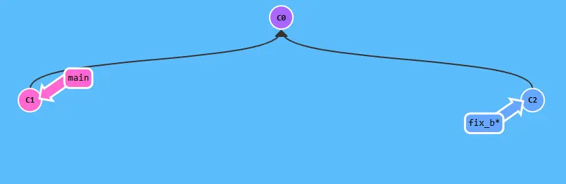

# 安装
https://git-scm.com/downloads
# 配置
## 用户信息
配置用户信息git的用户名和邮箱（引号里的改成自己的）
```bash
git config --global user.name "YiRen4922"
git config --global user.email "2976784922@qq.com"
```
> 如果要在某个特定的项目中使用其他名字或者电邮，只要去掉 --global 选项重新配置即可，新的设定保存在当前项目的 .git/config 文件里。

## 默认分支名
因为啥master有主奴什么不好的影响，所以现在都用main分支
```sh
git config --global init.defaultBranch main
```
## SSH（可选）

1. 生成密钥（包括公钥和私钥）
```bash
ssh-keygen -t rsa -C "2976784922@qq.com"
```
2. 获取公钥内容
- linux:
```bash
cat ~/.ssh/id_rsa.pub
```
- windows:
	公钥在`C:\Users\29767\.ssh\id_rsa.pub`，记事本打开复制内容，粘贴到github即可
3. 在github添加公钥
	路径：`Settings>SSH and GPG keys> New SSH Key`，输入Title（自定义），并将公钥内容粘贴到Key，点击`Add SSH Key`即可
4. 测试ssh是否连通
```bash
ssh -T git@github.com
```
- 成功：
```
Hi YiRen4922! You've successfully authenticated, but GitHub does not provide shell access.
```
- 失败：
```
ssh: connect to host github.com port 22: Connection refused
```
>国内貌似不支持git使用ssh访问github
>解决方法：
>1. 不用shh，使用https（简单）
>2. 更换ssh端口为443


# 本地使用

我是用Git的目的，主要就是版本管理，也就是==让我的代码可以随时随地的到达我以前的任意版本。==
而要达成这个目的就需要了解git（当然其他工具也行，如SVN），没有git之前我们的代码管理经常是将项目代码备份一份，比如`cp maim.c main_v1.0.c.bak`，当然这在项目规模比较小的时候，或许十分有用，但是当项目规模变得庞大，项目维护时间越来越长，这种手段就不那么优雅了，但是git出现后，版本管理这个过程变得十分的优雅，保存一个项目版本只要`git commit`，无论仓库大小，回到某个版本只要`git checkout <hash>`，这相比备份很多文件，管理命名，修改，版本等等来说，真的十分优雅。
### 工作区与暂存区
暂存区和工作区是git中重要的概念，工作区文件这个概念，就是当前确确实实在磁盘上存在的文件，与暂存区文件最大的区别就是工作区包含两种文件，tracked文件，untracked文件，这两个状态一种就是加入了git管理，另一则没有被git管理，而暂存区文件是有git管理的staged文件（tracked），而有管理就意味着可以回退！（工作区tracked文件只能回退，即撤回操作不可逆）。
首先，需要[[#^8367c6|将文件添加到git的管理之下]]：
```sh
yiren@YiRenJun:~/Project/C/git_repository$ git status
On branch main

No commits yet

Untracked files:
  (use "git add <file>..." to include in what will be committed)
        main.c

yiren@YiRenJun:~/Project/C/git_repository$ echo 'this is main.c' > main.c
yiren@YiRenJun:~/Project/C/git_repository$ git add main.c
yiren@YiRenJun:~/Project/C/git_repository$ git status
On branch main

No commits yet

Changes to be committed:
  (use "git rm --cached <file>..." to unstage)
        new file:   main.c

```
> 注意：`git status`命令可以查看文件状态，经常使用

此时main.c文件已经在git的管理之下了（tracked），但是他是工作区的最初版本（也是暂存区初版），没有能回退的版本，接下来我们，再增加一个版本，工作区怎么增加新版？还记得之前说的工作区文件与普通文件的区别吗？所以，其实直接更改文件，就是给工作区文件一个新版本了，那么我们来写经典的hello world吧！（其实hello git）。
```sh
yiren@YiRenJun:~/Project/C/git_repository$ cat main.c
// this is main.c
#include "stdio.h"

int main(int argc, char *argv[]) {
  printf("hello git");
  return 0;
}
yiren@YiRenJun:~/Project/C/git_repository$ git status main.c
On branch main

No commits yet

Changes to be committed:
  (use "git rm --cached <file>..." to unstage)
        new file:   main.c

Changes not staged for commit:
  (use "git add <file>..." to update what will be committed)
  (use "git restore <file>..." to discard changes in working directory)
        modified:   main.c
```
已经给main.c写入了经典的 hello git 程序，此时查看提示`git status`的输出内容，可以发现输出与未写hello git之前不同，标注出了main.c产生了修改（modified），也给出了两个选择。
这是因为工作区的实际文件与上次`git add`添加到暂存区的文件出现了不同，也就是工作区文件是基于暂存区的一次新的修改（版本），这时有两个选择，一是更新版本（[[#^efd3bc|更新文件修改到暂存区]]）`git add`，一是回退版本（[[#^efd3bc|抛弃此次修改]]，不可逆）`git restore`。

现在尝试回退（此时是内容是hello git），先回想一下回退之后`main.c`应该是什么内容（上次git add时），没错就是只有`echo 'this is main.c' > main.c`，this is mian.c 这一行内容。
如下：
```sh
yiren@YiRenJun:~/Project/C/git_repository$ git restore main.c
yiren@YiRenJun:~/Project/C/git_repository$ cat main.c
// this is main.c
yiren@YiRenJun:~/Project/C/git_repository$ git status
On branch main

No commits yet

Changes to be committed:
  (use "git rm --cached <file>..." to unstage)
        new file:   main.c

yiren@YiRenJun:~/Project/C/git_repository$
```
可以看到main.c的文件内容已经回到了`// this is main.c`，慎重丢弃工作区文件（不可逆）。
再来尝试一下`git add`更新版本，同样的先输入hello git程序，查看`git status`。
```sh
yiren@YiRenJun:~/Project/C/git_repository$ nvim main.c
yiren@YiRenJun:~/Project/C/git_repository$ cat main.c
// this is main.c
#include "stdio.h"

int main(int argc, char *argv[]) {
  printf("hello git");
  return 0;
}
yiren@YiRenJun:~/Project/C/git_repository$ git status
On branch main

No commits yet

Changes to be committed:
  (use "git rm --cached <file>..." to unstage)
        new file:   main.c

Changes not staged for commit:
  (use "git add <file>..." to update what will be committed)
  (use "git restore <file>..." to discard changes in working directory)
        modified:   main.c
```
main.c添加`hello git`之后使用`git add `更新状态，如下。
```sh
yiren@YiRenJun:~/Project/C/git_repository$ git add main.c
yiren@YiRenJun:~/Project/C/git_repository$ git status
On branch main

No commits yet

Changes to be committed:
  (use "git rm --cached <file>..." to unstage)
        new file:   main.c

yiren@YiRenJun:~/Project/C/git_repository$
```
哦对了，和`git add`将文件加入暂存区，相反的命令，`git rm --cached`[[#^06c83b|将文件移除暂存区]]，`git rm --cached`与`rm`类似，是移除文件，但是，`git rm --cached`是就文件从git管理中移出，而不是删除文件，文件还是以普通文件的形式存在在工作区，只是不再受git管理。

总之，工作区和暂存区就是这么个概念，工作区普通文件在使用`git add`命令追踪之后，就被纳入到了git的版本管理之中，可以通过`git add`继续更新版本或者通过`git restore`回退版本，当然，这只是git最基础的用法，仅仅只是这样还满足不了我使用git的目的，还记得吗？我的目的是==”让我的代码可以随时随地的到达我以前的任意版本“==，工作区和暂存区以及`git add`和`git restore`只是入门罢了。

### commit
前面说过，`git add` 只是把修改放进了暂存区，暂存暂存，顾名思义就是暂时保存，但还没真正保存。只有执行 `git commit`，暂存区修改才会真正变成一个可以回退的版本，[[#^78e09f|存储到 Git 仓库]]（repository）里。
那么好，现在使用`git commit`命令进行提交，注意`git commit -m ""`，引号中的内容需要填写此次提交的简单介绍。

```sh
yiren@YiRenJun:~/Project/C/git_repository$ git commit -m "feat: print hello git"
[main (root-commit) aadbde7] feat: print hello git
 1 file changed, 7 insertions(+)
 create mode 100644 main.c
yiren@YiRenJun:~/Project/C/git_repository$ git status
On branch main
nothing to commit, working tree clean
```
此时才是一个真正的版本，当然管理版本肯定不能只有一个版本，我再加一些代码，比如循环输出吧。
```sh
yiren@YiRenJun:~/Project/C/git_repository$ cat main.c
// this is main.c
#include "stdio.h"

int main(int argc, char *argv[]) {
  for (int i = 0; i < 5; i++) {
    printf("hello git");
  }
  return 0;
}
yiren@YiRenJun:~/Project/C/git_repository$ git status
On branch main
Changes not staged for commit:
  (use "git add <file>..." to update what will be committed)
  (use "git restore <file>..." to discard changes in working directory)
        modified:   main.c

no changes added to commit (use "git add" and/or "git commit -a")
```
修改完代码，然后还需要`git add`以及`git commit`，因为`git commit`提交到仓库的是暂存区的内容，也就是说，不管你在工作区怎么修改文件，如果不`git add`保存到暂存区的话`git commit`就不会提交到真正的版本库之中。
 ```sh
yiren@YiRenJun:~/Project/C/git_repository$ git add main.c
yiren@YiRenJun:~/Project/C/git_repository$ git status
On branch main
Changes to be committed:
  (use "git restore --staged <file>..." to unstage)
        modified:   main.c

yiren@YiRenJun:~/Project/C/git_repository$ git commit -m "feat: print 5 times"
[main 388bbf1] feat: print 5 times
 1 file changed, 3 insertions(+), 1 deletion(-)
yiren@YiRenJun:~/Project/C/git_repository$ git status
On branch main
nothing to commit, working tree clean
 ```
好了现在git仓库中有两个版本了，一是当前版本print 5 times，另一个是之前的版本print hello git，现在我们又可以实现我们的目标（==”让我的代码可以随时随地的到达我以前的任意版本“==）的一部分（==到达我以前的任意版本==）了。

首先应该使用`git log`，[[#^6af5a0|获取提交的历史记录]]，看看我们需要回到那个版本，在提交记录很多的时候，作用更加明显。
```
yiren@YiRenJun:~/Project/C/git_repository$ git log
commit 388bbf15b840af5ea383175de702317378182a99 (HEAD -> main)
Author: “YiRen4922” <2976784922@qq.com>
Date:   Sun Aug 31 17:57:06 2025 +0800

    feat: print 5 times

commit aadbde7413718401f2c3f1e9b675b239d71d37bc
Author: “YiRen4922” <2976784922@qq.com>
Date:   Sun Aug 31 17:23:03 2025 +0800

    feat: print hello git
yiren@YiRenJun:~/Project/C/git_repository$ git log --oneline
388bbf1 (HEAD -> main) feat: print 5 times
aadbde7 feat: print hello git
yiren@YiRenJun:~/Project/C/git_repository$
```
`git log`会展示出提交信息，以及每个版本唯一的提交哈希值（commit_id），也就是这一串无意义乱码，还有一个小细节`(HEAD -> main)`，这代表HEAD（HEAD也就是当前内容的抽象标志）指向main分支，现在让我回到上一版本看看吧，切换版本只需要使用`git chcekout`即可。
```sh
yiren@YiRenJun:~/Project/C/git_repository$ git checkout aadbde7
Note: switching to 'aadbde7'.

You are in 'detached HEAD' state. You can look around, make experimental
changes and commit them, and you can discard any commits you make in this
state without impacting any branches by switching back to a branch.

If you want to create a new branch to retain commits you create, you may
do so (now or later) by using -c with the switch command. Example:

  git switch -c <new-branch-name>

Or undo this operation with:

  git switch -

Turn off this advice by setting config variable advice.detachedHead to false

HEAD is now at aadbde7 feat: print hello git
yiren@YiRenJun:~/Project/C/git_repository$ git status
HEAD detached at aadbde7
nothing to commit, working tree clean
yiren@YiRenJun:~/Project/C/git_repository$ git log --oneline
aadbde7 (HEAD) feat: print hello git
yiren@YiRenJun:~/Project/C/git_repository$ cat main.c
// this is main.c
#include "stdio.h"

int main(int argc, char *argv[]) {
  printf("hello git");
  return 0;
}
yiren@YiRenJun:~/Project/C/git_repository$
```
现在可以看到文件内容回到了print hello git，此时要切换回最新的commit（main分支的话），可以使用git checkout或者git switch。
```
yiren@YiRenJun:~/Project/C/git_repository$ git checkout 388bbf1
Previous HEAD position was aadbde7 feat: print hello git
HEAD is now at 388bbf1 feat: print 5 times
yiren@YiRenJun:~/Project/C/git_repository$ git switch main
Switched to branch 'main'
yiren@YiRenJun:~/Project/C/git_repository$ cat main.c
// this is main.c
#include "stdio.h"

int main(int argc, char *argv[]) {
  for (int i = 0; i < 5; i++) {
    printf("hello git");
  }
  return 0;
}
```
就回到了最新的提交，当然，如果你有很多次commit也是一样的流程：
- `git log --oneline`查看提交记录
- `git checkout <commit_id>` 切换到指定提交记录
版本保存只需要
- git add .
- git commit -m "commit comments"
好了到这里算是完成了==到达我以前的任意版本==，这一目标。
#### 补充
回到指定版本看起来有点用，但是只回到版本其实也没什么用，因为需要基于旧的版本继续开发，这就涉及到了分支这一概念。
可以用是`git switch`命令切换分支，`-c`标志新建分支，也是说，本来只有一个main分支，我们可以使用git checkout 切换到指定的commit版本，然后使用git switch -c创建并切换到新建的分支，像这样
```sh
yiren@YiRenJun:~/Project/C/git_repository$ git checkout aadbde7
Note: switching to 'aadbde7'.

You are in 'detached HEAD' state. You can look around, make experimental
changes and commit them, and you can discard any commits you make in this
state without impacting any branches by switching back to a branch.

If you want to create a new branch to retain commits you create, you may
do so (now or later) by using -c with the switch command. Example:

  git switch -c <new-branch-name>

Or undo this operation with:

  git switch -

Turn off this advice by setting config variable advice.detachedHead to false

HEAD is now at aadbde7 feat: print hello git
yiren@YiRenJun:~/Project/C/git_repository$ git switch -c fix_branch
Switched to a new branch 'fix_branch'
yiren@YiRenJun:~/Project/C/git_repository$ git status
On branch fix_branch
nothing to commit, working tree clean
yiren@YiRenJun:~/Project/C/git_repository$ git branch
* fix_branch
  main
yiren@YiRenJun:~/Project/C/git_repository$
```
好了，现在你可以随意的修改保存提交你需要做的事情，并且这些操作都会在新的分支上保留下来。
大致像现在这样：

再做一次提交就是：

另外，这是一个git沙盒网站，可以测试git命令并直观的观察：
https://learngitbranching.js.org/

好了，现在真正完成了一部分目标==到达我以前的任意版本==，距完整的目标（==”让我的代码可以随时随地的到达我以前的任意版本“==）还有一部分，随时随地，这部分就与远程有关了，主要是push和pull，也比较简单，下次有时间再写，敬请期待。

#### 补充2
写完才想起来，再写一点，有关.gitignore文件，这个文件的作用就是，`git add .`的时候不会暂存.gitignore文件写出的文件（或路径）
```sh
yiren@YiRenJun:~/Project/C/git_repository$ cat main.c
// this is main.c
#include "stdio.h"

int main(int argc, char *argv[]) {
  printf("hello git");
  return 0;
}
yiren@YiRenJun:~/Project/C/git_repository$ gcc main.c -o main
yiren@YiRenJun:~/Project/C/git_repository$ ls
main  main.c
yiren@YiRenJun:~/Project/C/git_repository$ git status
On branch fix_branch
Untracked files:
  (use "git add <file>..." to include in what will be committed)
        main

nothing added to commit but untracked files present (use "git add" to track)
yiren@YiRenJun:~/Project/C/git_repository$ echo "main" > .gitignore
yiren@YiRenJun:~/Project/C/git_repository$ git status
On branch fix_branch
Untracked files:
  (use "git add <file>..." to include in what will be committed)
        .gitignore

nothing added to commit but untracked files present (use "git add" to track)

yiren@YiRenJun:~/Project/C/git_repository$ git add .
yiren@YiRenJun:~/Project/C/git_repository$ git status
On branch fix_branch
Changes to be committed:
  (use "git restore --staged <file>..." to unstage)
        new file:   .gitignore

yiren@YiRenJun:~/Project/C/git_repository$ echo "" > .gitignore
yiren@YiRenJun:~/Project/C/git_repository$ git status
On branch fix_branch
Changes to be committed:
  (use "git restore --staged <file>..." to unstage)
        new file:   .gitignore

Changes not staged for commit:
  (use "git add <file>..." to update what will be committed)
  (use "git restore <file>..." to discard changes in working directory)
        modified:   .gitignore

Untracked files:
  (use "git add <file>..." to include in what will be committed)
        main

yiren@YiRenJun:~/Project/C/git_repository$
```
当你在工作区根路径放入一个.gitignore文件git会自动识别文件内容，并立即生效，比如我写的main，他就不再识别main，常用来忽略一些个人的ide设置，编译中间文件，以及可执行文件（main）等，总之就是用来忽略的，还有各种匹配规则，也有写好的模板，可自行查询，这下这期真写完了。

## 常用命令
### 获取仓库
仓库分为远程和本地，远程仓库在github（或其他代码托管平台），而本地仓库在自己的电脑中存储（路径中有.git文件夹的是本地仓库），可以使用`push`或`pull`命令同步两个仓库（后续会有）
#### 新建仓库
在当前位置新建空仓库（Repository），新建的是本地仓库
```sh
git init
```
#### 克隆远程仓库
克隆远程仓库到本地当前位置，远程仓库是唯一的，使用用户名（username）和仓库名（repository）确认
```sh
git clone https://github.com/username/repository.git 
```
### 本地git操作
#### 添加文件到暂存区

^8367c6

将文件纳入git的管理之中，更新git管理的文件状态也是这个命令。
```sh
git add <file>  # 添加指定文件到暂存区
git add .  # 添加当前目录所有文件到暂存区
```
#### 丢弃工作区修改

^efd3bc

工作区文件内容回到暂存区状态，也是上次`git add`的状态的内容。

```bash
git restore <filename>
```
旧写法：
```bash
git checkout -- <filename>
```
#### 将文件移出暂存区

^06c83b

```sh
git rm --cached <file>
```

#### 获取提交的历史记录

^6af5a0

查看提交log，更常用的是--online参数的git log，因为只需要每次的简略提交信息（git commit -m ""，引号中的内容），就可以判断是哪个版本，以及要切换到指定版本需要的7位提交哈希值，而`git log --oneline`正好都有。

```sh
git log
git log --oneline
```

#### 提交暂存区内容到git仓库

^78e09f
```sh
git commit 
git commit -m "commit comments"
```

#### 切换分支
`git switch <branch-name>` 切换到指定分支
`git switch -c <branch-name>` 创建新分支并切换
`git switch -c <branch-name> <commit_id>` 基于指定commit版本创建新分支并切换
`git switch -` 可以快速切换回上一个所在的分支（类似命令行的 `cd -`）
```sh
git switch <branch-name>
git switch -c <new-branch-name> 
git switch -c <new-branch-name> <commit_id>
git switch -
```

# 远程使用
// todo