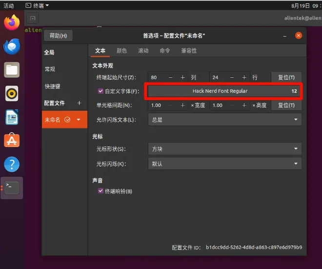

# 安装与配置
## 安装
### Ubuntu22.04
很多方法，下面说常用的两种：
1. appimage安装：
从 [github release](https://github.com/neovim/neovim/releases/tag/stable) 下载稳定版的appimage软件包：

```sh
chmod u+x nvim-linux-x86_64.appimage && ./nvim-linux-x86_64.appimage
sudo ln -s ~/Downloads/nvim-linux-x86_64.appimage /usr/local/bin/nvim
```
2. tar.gz安装：
从 [github release](https://github.com/neovim/neovim/releases/tag/stable) 下载稳定版的tar.gz，软件包：
```sh
cd ~/Downloads
wget https://github.com/neovim/neovim/releases/download/stable/nvim-linux-x86_64.tar.gz
sudo tar xzvf nvim-linux-x86_64.tar.gz
sudo mv nvim-linux-x86_64 /opt/
sudo ln -s /opt/nvim-linux-x86_64/bin/nvim /usr/local/bin/nvim
rm nvim-linux-x86_64.tar.gz
```
Ubuntu22或Ubuntu24可以使用上方链接下载的tar.gz。
### Ubuntu20.04
Ubuntu20用的glic版本较旧，使用其他链接：
```sh
cd ~/Downloads
wget https://github.com/neovim/neovim-releases/releases/download/stable/nvim-linux-x86_64.tar.gz
sudo tar xzvf nvim-linux-x86_64.tar.gz
sudo mv nvim-linux-x86_64 /opt/
sudo ln -s /opt/nvim-linux-x86_64/bin/nvim /usr/local/bin/nvim
rm nvim-linux-x86_64.tar.gz
```


## 配置
### 使用lazyvim配置
```
mv ~/.config/nvim ~/.config/nvim.bak
git clone https://github.com/LazyVim/starter ~/.config/nvim
rm -rf ~/.config/nvim/.git
nvim
```
`nvim`命令打开下载插件。
### Nerd Font（hack字体）
#### 全局安装
```sh
sudo wget https://github.com/ryanoasis/nerd-fonts/releases/download/v3.4.0/Hack.zip
sudo mv Hack.zip /usr/share/fonts  
cd /usr/share/fonts
sudo unzip Hack.zip
sudo rm Hack.zip
fc-cache -fv
fc-list | grep "Hack"
```
#### 个人安装
```sh
sudo wget https://github.com/ryanoasis/nerd-fonts/releases/download/v3.4.0/Hack.zip
sudo mv Hack.zip ~/.local/share/fonts
cd ~/.local/share/fonts
sudo unzip Hack.zip
sudo rm Hack.zip
fc-cache -fv
fc-list | grep "Hack"
```
#### 设置终端字体
##### ubuntu的gname-termina设置NerdFont(hack)


### 搜索工具
```sh
sudo apt install build-essential curl fzf ripgrep fd-find ripgrep
```
### kitty（全彩终端）
```sh
curl -L [https://sw.kovidgoyal.net/kitty/installer.sh](https://sw.kovidgoyal.net/kitty/installer.sh) | sh /dev/stdin
sudo ln -s ~/.local/kitty.app/bin/kitty /usr/local/bin/kitty
```
### lazygit（git图形）
```sh
LAZYGIT_VERSION=$(curl -s "https://api.github.com/repos/jesseduffield/lazygit/releases/latest" | \grep -Po '"tag_name": *"v\K[^"]*')
curl -Lo lazygit.tar.gz "https://github.com/jesseduffield/lazygit/releases/download/v${LAZYGIT_VERSION}/lazygit_${LAZYGIT_VERSION}_Linux_x86_64.tar.gz"
tar xf lazygit.tar.gz lazygit
sudo install lazygit -D -t /usr/local/bin/
```
### 剪切板
1. 下载剪切板
```sh
sudo apt install xclip xsel
```
2. 配置nvim
```lua config.lua

if not vim.env.SSH_TTY then
  opt.clipboard = "unnamedplus" -- 同步剪切板 和 +
else
  opt.clipboard = "" -- SSH 下禁用，避免报错
end
```
实际上有三种选择：
1. set clipboard=unnamed
	把 默认寄存器 " 绑定到 `*`（PRIMARY selection）。
	在 yy、dd、p 这些操作时，其实就是在操作 `*`。
2. set clipboard=unnamedplus
	把 默认寄存器 " 绑定到 +（CLIPBOARD selection）。
	这样 yy、dd、p 默认操作的就是 系统剪贴板 (Ctrl+C / Ctrl+V 那个)。
3. set clipboard=unnamed,unnamedplus
	同时绑定到 * 和 +。
	所以无论系统走 PRIMARY 还是 CLIPBOARD，都会同步。

## keymap

| keymap       | description               | 描述              |
| ------------ | ------------------------- | --------------- |
| `<leader>sd` | search diagnostics        | 搜索lsp诊断         |
| `<leader>sD` | search buffer diagnostics | 搜索lsp诊断         |
| `<leader>sb` | search buffer line        | 搜索当前buffer      |
| `<leader>sB` | search open  buffers      | 搜索当前所有打开的buffer |
| `<leader>sg` |                           |                 |
| `<leader>sG` |                           |                 |
| `<leader>sk` | search keymaps            | 查找键位映射          |
| `<leader>fc` | find config file          | 查找nvim的配置文件     |

## 开发嵌入式项目kernel内核
``` YAML
CompileFlags:
  # 1. 使用你指定的交叉编译器，让 clangd 能正确解析宏和头文件
  # 注意这里用的是 QueryDriver 而不是 Compiler，更通用
  # QueryDriver:
#     - /home/forlinx/work/OK3506_Linux_Source/prebuilts/gcc/linux-x86/arm/gcc-arm-10.3-2021.07-x86_64-arm-none-linux-# # # gnueabihf/bin/arm-none-linux-gnueabihf-*

  # 2. 去掉内核里 clang 不认识的 GCC 专用参数
  Remove:
    - -mno-fdpic
    - -fno-allow-store-data-races
    - -fno-ipa-sra
    - -fconserve-stack

  # 3. 额外添加一些忽略报错的选项，避免干扰
  Add:
    - -Wno-unknown-warning-option
    - -Wno-unused-command-line-argument
    - -Wno-gnu-variable-sized-type-not-at-end
    - -Wno-address-of-packed-member

# 4. 索引设置
Index:
  Background: Build    # 后台持续索引内核源码
  StandardLibrary: Yes # 启用标准库索引（必要时）

# 5. clangd 行为优化
Diagnostics:
  Suppress: [pp_including_main_file] # 避免大量 #include 报错干扰

```

# 开发
## lua语法

