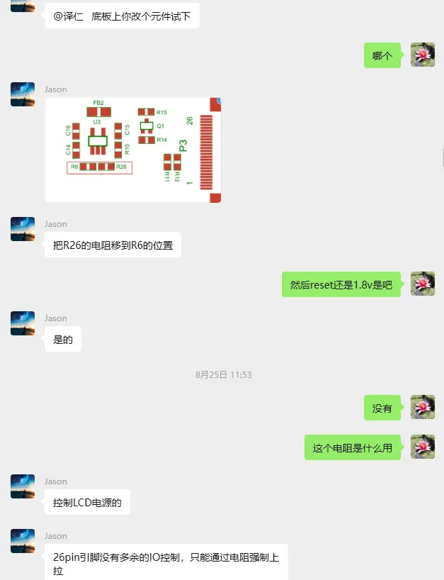
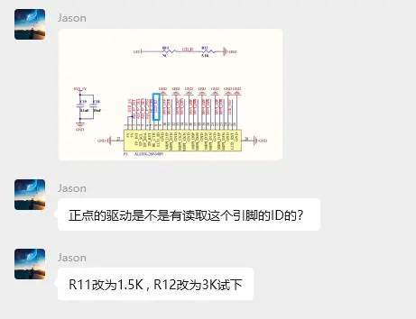

# 慧勤志远8寸MIPI
## ili9881c液晶驱动
1. LCD电源:
把R26的电阻移到R6的位置

2. ID引脚
R11改为1.5K，R12改为3K

3. I2C排阻
排阻RP2切换到RP1
4. 降频（设备树改动）
```dts
rockchip,lane-rate = <450>;
clock-frequency = <35000000>;
```
5. 显示驱动成功点亮
## 触摸驱动
