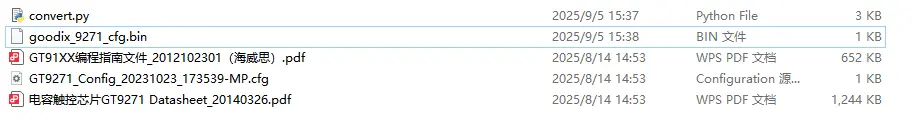
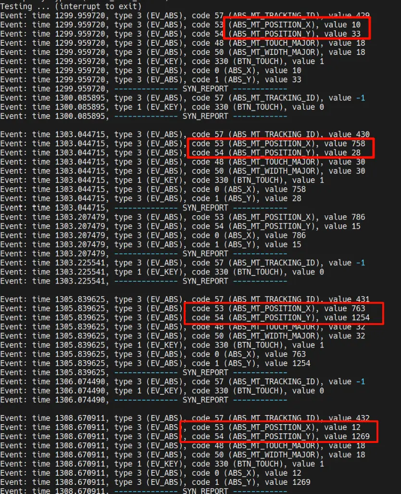

dts路径：
```sh
RK_KERNEL_DTS=kernel/arch/arm/boot/dts/OK3506-S_linux_emmc.dts
/home/forlinx/work/OK3506_Linux_Source/kernel/arch/arm/boot/dts/OK3506-S_linux_emmc.dts

```
deconfig路径：
```sh
RK_DEFCONFIG=OK3506-S_linux_emmc_defconfig
forlinx@ubuntu:~/work/OK3506_Linux_Source$ find . -name OK3506-S_linux_emmc_defconfig
./device/rockchip/.chips/ok3506/OK3506-S_linux_emmc_defconfig
/home/forlinx/work/OK3506_Linux_Source/device/rockchip/.chips/ok3506/OK3506-S_linux_emmc_defconfig
/home/forlinx/work/OK3506_Linux_Source/kernel-6.1/arch/arm/configs/OK3506-S_linux_defconfig
```

# 使用menuconfig更改内核配置并保存：
```
make ARCH=arm OK3506-S_linux_defconfig
make ARCH=arm menuconfig 
make ARCH=arm savedefconfig  
cp defconfig arch/arm/configs/OK3506-S_linux_defconfig  
```
开启gt9xx触摸驱动支持：
```
  
-> Device Drivers
	-> Input device support 
		-> Generic input layer (needed for keyboard, mouse, ...) (INPUT [=y])
			-> Touchscreens (INPUT_TOUCHSCREEN [=y])
```
修改设备树：
```dts  title=OK3506-s-common.dtsi
	gt9xx_rgb: gt9xx-rgb@14 {
		compatible = "goodix,gt9xx";
		reg = <0x14>;
		pinctrl-names = "defaults";
		pinctrl-0 = <&ft5x06_mipi_gpio>;
		reset-gpio = <&gpio4 RK_PB3 GPIO_ACTIVE_HIGH>;
		interrupt-parent = <&gpio4>;
		interrupts = <RK_PB2 IRQ_TYPE_EDGE_FALLING>;
		irq-gpio = <&gpio4 RK_PB2 GPIO_ACTIVE_HIGH>;
		touchscreen-size-x = <1280>;
		touchscreen-size-y = <800>;
		touchscreen-inverted-x;
		touchscreen-inverted-y;
		uniq = "rgb";
		status = "okay";
	};

```
触摸没效果，继续debug
dmesg和i2cdetect：
```
root@ok3506-buildroot:/# dmesg | grep failed
[    5.536593] dw-mipi-dsi-rockchip ff640000.dsi: failed to find panel or bridge: -517
[    7.009199] rtc-pcf8563: probe of 2-0051 failed with error -5
[    7.025172] [BT_RFKILL]: bluetooth_platdata_parse_dt: clk_get failed!!!.
[    7.087066] platform regulatory.0: Direct firmware load for regulatory.db failed with error -2
[    7.087099] cfg80211: failed to load regulatory.db
[    7.317804] edt_ft5x06 0-0038: touchscreen probe failed
root@ok3506-buildroot:/# i2cdetect -y 0
     0  1  2  3  4  5  6  7  8  9  a  b  c  d  e  f
00:          -- -- -- -- -- -- -- -- -- -- -- -- --
10: -- -- -- -- 14 -- -- -- -- -- -- -- -- -- -- --
20: -- -- -- -- -- -- -- -- -- -- -- -- -- -- -- --
30: -- -- -- -- -- -- -- -- -- -- -- -- -- -- -- --
40: -- -- -- -- -- -- -- -- -- -- -- -- -- -- -- --
50: -- -- -- -- -- -- -- -- -- -- -- -- -- -- -- --
60: -- -- -- -- -- -- -- -- -- -- -- -- -- -- -- --
70: -- -- -- -- -- -- -- --
root@ok3506-buildroot:/#
```
检测到了i2c设备地址是0x14，这就是gt9271的地址，但是加载驱动加载的`edt_ft5x06 0-0038: touchscreen probe failed`不正确，menuconfig禁用这个触摸驱动。

```
root@ok3506-buildroot:/# dmesg | grep -i "goodix\|gt9xx\|touch"
[    6.941605] Error: Driver 'Goodix-TS' is already registered, aborting...
[    6.943509] Goodix-TS 0-0014: supply AVDD28 not found, using dummy regulator
[    6.943792] Goodix-TS 0-0014: supply VDDIO not found, using dummy regulator
[    7.031887] Goodix-TS 0-0014: ID 9271, version: 1050
[    7.032024] Goodix-TS 0-0014: Direct firmware load for goodix_9271_cfg.bin failed with error -2
[    7.036745] input: Goodix Capacitive TouchScreen as /devices/platform/ff040000.i2c/i2c-0/0-0014/input/input0

```
还是有些问题，xy轴相反，以及上述报错，上述报错是因为menuconfig开启了两个兼容gt9271的驱动，关掉多余的即可。
查看输入设备：
```bash
ls /dev/input/
by-path  event0  event1  event2
```
用 `evtest` 测试触摸事件：
```bash
evtest /dev/input/event0
```
有消息，代表有一个触摸驱动生效，但是后来发现不是我需要的：
```sh
Event: time 1210.060844, -------------- SYN_REPORT ------------
Event: time 1210.079645, type 3 (EV_ABS), code 53 (ABS_MT_POSITION_X), value 1232
Event: time 1210.079645, type 3 (EV_ABS), code 0 (ABS_X), value 1232
Event: time 1210.079645, -------------- SYN_REPORT ------------
Event: time 1210.115990, type 3 (EV_ABS), code 53 (ABS_MT_POSITION_X), value 1231
Event: time 1210.115990, type 3 (EV_ABS), code 0 (ABS_X), value 1231
Event: time 1210.115990, -------------- SYN_REPORT ------------
Event: time 1210.152234, type 3 (EV_ABS), code 53 (ABS_MT_POSITION_X), value 1230
Event: time 1210.152234, type 3 (EV_ABS), code 0 (ABS_X), value 1230
Event: time 1210.152234, -------------- SYN_REPORT ------------
Event: time 1210.187783, type 3 (EV_ABS), code 57 (ABS_MT_TRACKING_ID), value -1
Event: time 1210.187783, type 1 (EV_KEY), code 330 (BTN_TOUCH), value 0
Event: time 1210.187783, -------------- SYN_REPORT ------------
```
menuconfig禁用其他驱动之后，
```
Goodix-TS 2-0014: no max-x defined
```
查源码发现
```c title=gt9xx.c
    if (!np) {
    	dev_err(&client->dev, "no device tree\n");
    	return -EINVAL;
    }
    if (of_property_read_u32(np, "tp-size", &val)) {
    	dev_err(&client->dev, "no max-x defined\n");
    	return -EINVAL;
    }
    
    // 以及
	if (of_property_read_u32(np, "max-x", &val)) {
    	dev_err(&client->dev, "no max-x defined\n");
    	return -EINVAL;
    }
    //ts->abs_x_max = val;
    if (of_property_read_u32(np, "max-y", &val)) {
    	dev_err(&client->dev, "no max-y defined\n");
    	return -EINVAL;
    }
```

修改设备树，添加`tp-size`，`max-x`，`max-y`，去掉无用属性：
```dts   title=OK3506-s_linux_emmc.dts
&i2c0 {
	status = "okay";
	gt9xx: gt9xx@14 {
		compatible = "goodix,gt9xx";
		reg = <0x14>;
		pinctrl-names = "defaults";
		pinctrl-0 = <&ft5x06_mipi_gpio>;
		reset-gpio = <&gpio4 RK_PB3 GPIO_ACTIVE_HIGH>;
		interrupt-parent = <&gpio4>;
		interrupts = <RK_PB2 IRQ_TYPE_EDGE_FALLING>;
		touch-gpio = <&gpio4 RK_PB2 GPIO_ACTIVE_HIGH>;
	    tp-size = <9271>;
	    max-x = <1280>;
	    max-y = <800>;
		status = "okay";
	};
};
```
`tp-size = <9271>`在驱动代码中主要控制xy轴对换以及翻转，但是源码中没有这个型号的分支，添加分支
```c title=gt9xx.c
    if (of_property_read_u32(np, "tp-size", &val)) {
    	dev_err(&client->dev, "no max-x defined\n");
    	return -EINVAL;
    }

	if (val == 89) {
		m89or101 = TRUE;
		gtp_change_x2y = TRUE;
		gtp_x_reverse = FALSE;
		gtp_y_reverse = TRUE;
	} else if (val == 101) {
		m89or101 = FALSE;
		gtp_change_x2y = TRUE;
		gtp_x_reverse = TRUE;
		gtp_y_reverse = FALSE;
	} else if (val == 911) {
		m89or101 = FALSE;
		bgt911 = TRUE;
		gtp_change_x2y = TRUE;
		gtp_x_reverse = FALSE;
		gtp_y_reverse = TRUE;
	} else if (val == 9110) {
		m89or101 = FALSE;
		bgt9110 = TRUE;
		gtp_change_x2y = FALSE;
		gtp_x_reverse = FALSE;
		gtp_y_reverse = FALSE;
	} else if (val == 9111) {
		m89or101 = FALSE;
		bgt9111 = TRUE;
		gtp_change_x2y = TRUE;
		gtp_x_reverse = FALSE;
		gtp_y_reverse = FALSE;
	} else if (val == 970) {
		m89or101 = FALSE;
		bgt911 = FALSE;
		bgt970 = TRUE;
		gtp_change_x2y = FALSE;
		gtp_x_reverse = FALSE;
		gtp_y_reverse = TRUE;
	} else if (val == 910) {
		m89or101 = FALSE;
		bgt911 = FALSE;
		bgt970 = FALSE;
		bgt910 = TRUE;
		gtp_change_x2y = TRUE;
		gtp_x_reverse = FALSE;
		gtp_y_reverse = TRUE;
	} else if (val == 9271) {  // 添加9271分支
		m89or101 = FALSE;
		bgt911 = FALSE;
		bgt970 = FALSE;
		bgt910 = TRUE;
		gtp_change_x2y = TRUE;
		gtp_x_reverse = FALSE;
		gtp_y_reverse = TRUE;
	}
```


查看输入设备：
```bash
ls /dev/input/
by-path  event0  event1  event2
```
用 `evtest` 测试触摸事件：
```bash
evtest /dev/input/event0
```
没有触摸数据传入，重新检查设备树源码，以及驱动源码
修改reset-gpio极性为`reset-gpio = <&gpio1 RK_PA1 GPIO_ACTIVE_LOW>;`
```dts title=OK3506-S_linux_emmc.dts
// Touch  
&i2c0 {
	status = "okay";
	gt9xx: gt9xx@14 {
		compatible = "goodix,gt9xx";
		reg = <0x14>;
		pinctrl-names = "defaults";
		pinctrl-0 = <&ft5x06_mipi_gpio>;
		reset-gpio = <&gpio4 RK_PB3 GPIO_ACTIVE_LOW>;
		interrupt-parent = <&gpio4>;
		interrupts = <RK_PB2 IRQ_TYPE_EDGE_FALLING>;
		touch-gpio = <&gpio4 RK_PB2 GPIO_ACTIVE_HIGH>;
    tp-size = <9271>;
    max-x = <1280>;
    max-y = <800>;
		status = "okay";
	};
};
```
无效
修改touch-gpio极性为`touch-gpio = <&gpio4 RK_PB2 GPIO_ACTIVE_LOW>;`

```
// Touch  
&i2c0 {
	status = "okay";
	gt9xx: gt9xx@14 {
		compatible = "goodix,gt9xx";
		reg = <0x14>;
		pinctrl-names = "defaults";
		pinctrl-0 = <&ft5x06_mipi_gpio>;
		reset-gpio = <&gpio4 RK_PB3 GPIO_ACTIVE_HIGH>;
		interrupt-parent = <&gpio4>;
		interrupts = <RK_PB2 IRQ_TYPE_EDGE_FALLING>;
		touch-gpio = <&gpio4 RK_PB2 GPIO_ACTIVE_LOW>;
    tp-size = <9271>;
    max-x = <1280>;
    max-y = <800>;
		status = "okay";
	};
};
```
无效

修改`tp-size = <89>;`
```
&i2c0 {
	status = "okay";
	gt9xx: gt9xx@14 {
		compatible = "goodix,gt9xx";
		reg = <0x14>;
		pinctrl-names = "defaults";
		pinctrl-0 = <&ft5x06_mipi_gpio>;
		reset-gpio = <&gpio4 RK_PB3 GPIO_ACTIVE_LOW>;
		interrupt-parent = <&gpio4>;
		interrupts = <RK_PB2 IRQ_TYPE_LEVEL_LOW>;
		touch-gpio = <&gpio4 RK_PB2 GPIO_ACTIVE_LOW>;
    tp-size = <89>;
    max-x = <1280>;
    max-y = <800>;
		status = "okay";
	};
};
```
无效
仿照正点原子的设备树
```
&i2c2{
    dsi1_touch: gt9xx@14 {
        compatible = "goodix,gt9xx";
        reg = <0x14>;
        pinctrl-names = "default";
        pinctrl-0 = <&touch1_gpio>;
        touch-gpio = <&gpio0 RK_PA6 IRQ_TYPE_LEVEL_LOW>;
        reset-gpio = <&gpio0 RK_PA7 GPIO_ACTIVE_HIGH>;
        max-x = <720>;
        max-y = <1280>;
        tp-size = <911>;
        tp-supply = <&vcc_sys>;
        wakeup-source;
        goodix-ts-name = "dsi1_ts_gt9xx";
        status = "okay";
        /delete-node/ gt1x;
    };
};
```
无输入，下方图片为可menuconfig触摸初始配置


恢复menuconfig配置
# 恢复之后
```
root@ok3506-buildroot:/# dmesg | grep -i "goodix\|gt9xx\|touch"
[    7.008627] Error: Driver 'Goodix-TS' is already registered, aborting...
[    7.010507] Goodix-TS 0-0014: supply AVDD28 not found, using dummy regulator
[    7.010693] Goodix-TS 0-0014: supply VDDIO not found, using dummy regulator
[    7.102248] Goodix-TS 0-0014: ID 9271, version: 1050
[    7.102388] Goodix-TS 0-0014: Direct firmware load for goodix_9271_cfg.bin failed with error -2
[    7.107105] input: Goodix Capacitive TouchScreen as /devices/platform/ff040000.i2c/i2c-0/0-0014/input/input0
root@ok3506-buildroot:/# evtest /dev/input/event0
Input driver version is 1.0.1
Input device ID: bus 0x18 vendor 0x416 product 0x2437 version 0x1050
Input device name: "Goodix Capacitive TouchScreen"
Supported events:
  Event type 0 (EV_SYN)
  Event type 1 (EV_KEY)
    Event code 59 (KEY_F1)
    Event code 60 (KEY_F2)
    Event code 61 (KEY_F3)
    Event code 62 (KEY_F4)
    Event code 63 (KEY_F5)
    Event code 64 (KEY_F6)
    Event code 125 (KEY_LEFTMETA)
    Event code 330 (BTN_TOUCH)
  Event type 3 (EV_ABS)
    Event code 0 (ABS_X)
      Value    272
      Min        0
      Max      799
    Event code 1 (ABS_Y)
      Value  -1897
      Min        0
      Max      479
    Event code 47 (ABS_MT_SLOT)
      Value      0
      Min        0
      Max        9
    Event code 48 (ABS_MT_TOUCH_MAJOR)
      Value      0
      Min        0
      Max      255
    Event code 50 (ABS_MT_WIDTH_MAJOR)
      Value      0
      Min        0
      Max      255
    Event code 53 (ABS_MT_POSITION_X)
      Value      0
      Min        0
      Max      799
    Event code 54 (ABS_MT_POSITION_Y)
      Value      0
      Min        0
      Max      479
    Event code 57 (ABS_MT_TRACKING_ID)
      Value      0
      Min        0
      Max    65535
Properties:
  Property type 1 (INPUT_PROP_DIRECT)
Testing ... (interrupt to exit)
Event: time 325.742749, type 3 (EV_ABS), code 57 (ABS_MT_TRACKING_ID), value 198
Event: time 325.742749, type 3 (EV_ABS), code 53 (ABS_MT_POSITION_X), value -900
Event: time 325.742749, type 3 (EV_ABS), code 54 (ABS_MT_POSITION_Y), value -2307
Event: time 325.742749, type 3 (EV_ABS), code 48 (ABS_MT_TOUCH_MAJOR), value 10
Event: time 325.742749, type 3 (EV_ABS), code 50 (ABS_MT_WIDTH_MAJOR), value 10
Event: time 325.742749, type 1 (EV_KEY), code 330 (BTN_TOUCH), value 1
Event: time 325.742749, type 3 (EV_ABS), code 0 (ABS_X), value -900
Event: time 325.742749, type 3 (EV_ABS), code 1 (ABS_Y), value -2307
Event: time 325.742749, -------------- SYN_REPORT ------------
Event: time 325.762512, type 3 (EV_ABS), code 57 (ABS_MT_TRACKING_ID), value -1
Event: time 325.762512, type 1 (EV_KEY), code 330 (BTN_TOUCH), value 0
Event: time 325.762512, -------------- SYN_REPORT ------------
```
触摸有反应，但是使用的不是gt9xx.c驱动，实用的是Goodix I2C通用驱动，menuconfig关闭其他驱动
```
root@ok3506-buildroot:/#  dmesg | grep -i "goodix\|gt9xx\|touch"
[    6.994742] Goodix-TS 0-0014: supply AVDD28 not found, using dummy regulator
[    6.994948] Goodix-TS 0-0014: supply VDDIO not found, using dummy regulator
[    7.086705] Goodix-TS 0-0014: ID 9271, version: 1050
[    7.086850] Goodix-TS 0-0014: Direct firmware load for goodix_9271_cfg.bin failed with error -2
[    7.091574] input: Goodix Capacitive TouchScreen as /devices/platform/ff040000.i2c/i2c-0/0-0014/input/input0
```

不再有驱动抢占，接下来是触摸校准
# 触摸精度校准
使用厂家提供的.cfg文件，使用脚本转为.bin文件，便于通用驱动加载，还要编译进内核中
首先用AI写脚本，把cfg转为bin文件

然后
在deconfig中加上，代表编译此固件
```
CONFIG_EXTRA_FIRMWARE="goodix_9271_cfg.bin"
CONFIG_EXTRA_FIRMWARE_DIR="firmware"
```
然后将`goodix_9271_cfg.bin`放到`kernel/firmware`下（没有创建），编译烧录即可
```sh
root@ok3506-buildroot:/# dmesg | grep -i "goodix\|gt9xx\|touch"
[    6.964107] Goodix-TS 0-0014: supply AVDD28 not found, using dummy regulator
[    6.964327] Goodix-TS 0-0014: supply VDDIO not found, using dummy regulator
[    7.056096] Goodix-TS 0-0014: ID 9271, version: 1050
[    7.076388] input: Goodix Capacitive TouchScreen as /devices/platform/ff040000.i2c/i2c-0/0-0014/input/input0
```


调试基本成功，但是，demo_lvgl的触摸点位不对，我认为是lvgl的映射不对
使用飞凌qt测试程序验证
注意参考文档去配环境：
```sh
cd OK3506_Linux_Source/app/forlinx/forlinx_qt_demo/fltest_qt_terminal
qmake
make
file fltest_qt_terminal
```
测试发现，映射不对，尝试更改映射

> [!TODO] tslib
> tslib 是一个开源的第三方库，用于触摸屏性能调试，使用电阻屏的时候一般使用 tslib 进行校准。虽然电容屏不需要校准，但是由于电容屏加工的原因，有的时候其不一定精准，因此有时候也需要进行校准。最主要的是 tslib 提供了一些其他软件，我们可以通过这些软件来测试触摸屏工作是否正常。最新版本的 tslib 已经支持了多点电容触摸屏，因此可以通过 tslib 来直观的测试多点电容触摸屏驱动，这个要比观看 eventX 原始数据方便的多。
> https://www.cnblogs.com/yoshinb/p/15890251.html


> [!TODO] qt5触摸与旋转
> 使用qt环境变量**QT_QPA_EVDEV_TOUCHSCREEN_PARAMETERS**
> 解决触摸输入与触摸旋转
> https://blog.csdn.net/qq_23418043/article/details/79813643
> 无效


> [!todo] 驱动拉伸
> 修改驱动源码，拉伸映射
> https://blog.csdn.net/qq_35862573/article/details/112908366


> [!todo] qt中文
> 添加中文字体
> https://zhuanlan.zhihu.com/p/1896975821735981419


# 频闪（增加触摸之后）
原频率，
35Mhz，lane-rate = <450>
## 加频率
50MHz，lane-rate = <600>，边框发黑，画面不动
40MHz，lane-rate = <500>，闪烁更快速

	