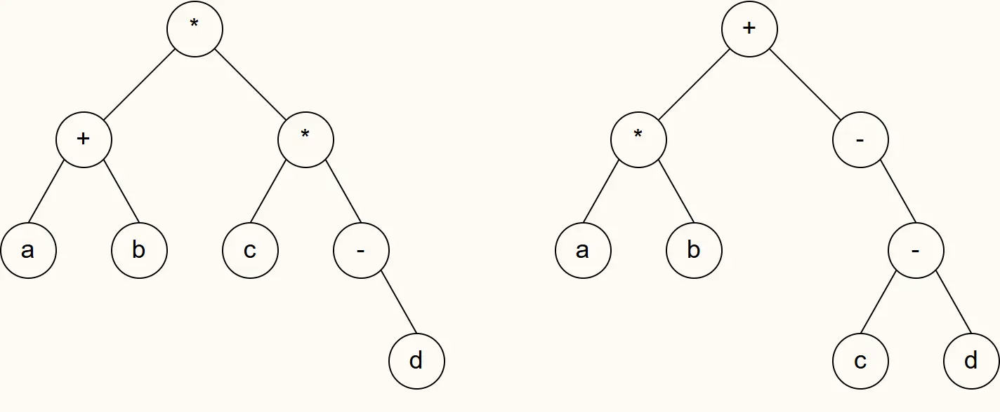

【2017统考真题】请设计一个算法，将给定的表达式树（二叉树）转换为等价的中缀表达式（通过括号反映操作符的计算次序）并输出。例如，当下列两棵表达式树作为算法输入时：

输出的中缀表达式分别为 `(a+b)*(c*(`−`d))` 和 `(a*b)+(`−`(c`−`d))` 。
1）给出算法的基本设计思想。
2）给出二叉树结点的数据类型定义。
3）根据设计思想，采用 C 或 C++ 语言描述算法，关键之处给出注释。
??
1）**算法基本设计思想**  
采用中序遍历递归处理。若当前结点为叶子（操作数），直接输出；若为非叶子结点（操作符），则先输出左括号（根结点除外），递归输出左子树，输出当前操作符，递归输出右子树，最后输出右括号（根结点除外）。通过深度参数 `depth` 控制是否加括号：根结点深度为 0，不加最外层括号；子表达式深度 >0，加括号以正确反映计算次序。

2）**二叉树结点的数据类型定义**  
```c
typedef struct node {
    char data[10];              // 存放操作数或操作符
    struct node *left, *right;  // 左、右孩子指针
} BTree;
```

3）**算法描述（C语言）**  
```c
// T：当前子树根结点，depth：当前深度（根为0）
void InOrder(BTree *T, int depth) {
    if (T == NULL) return;                     // 空结点返回
    
    // 叶子结点：操作数，直接输出
    if (T->left == NULL && T->right == NULL) {
        printf("%s", T->data);
        return;
    }
    
    // 非叶子结点：操作符，需要加括号（根结点除外）
    if (depth > 0) printf("(");                // 子表达式左括号
    InOrder(T->left, depth + 1);               // 递归左子树
    printf("%s", T->data);                     // 输出操作符
    InOrder(T->right, depth + 1);              // 递归右子树
    if (depth > 0) printf(")");                // 子表达式右括号
}
```
调用方式：`InOrder(root, 0);`

**复杂度**：时间复杂度 $O(n)$，空间复杂度 $O(h)$（$h$ 为树高，最坏 $O(n)$）。

**易错点**：① 根结点不加最外层括号，否则输出会多一对括号；② 深度参数从 0 开始，子结点深度 +1；③ 只有非叶子结点（操作符）才需要加括号，叶子直接输出；④ 输出操作符时注意格式，`%s` 用于字符串。