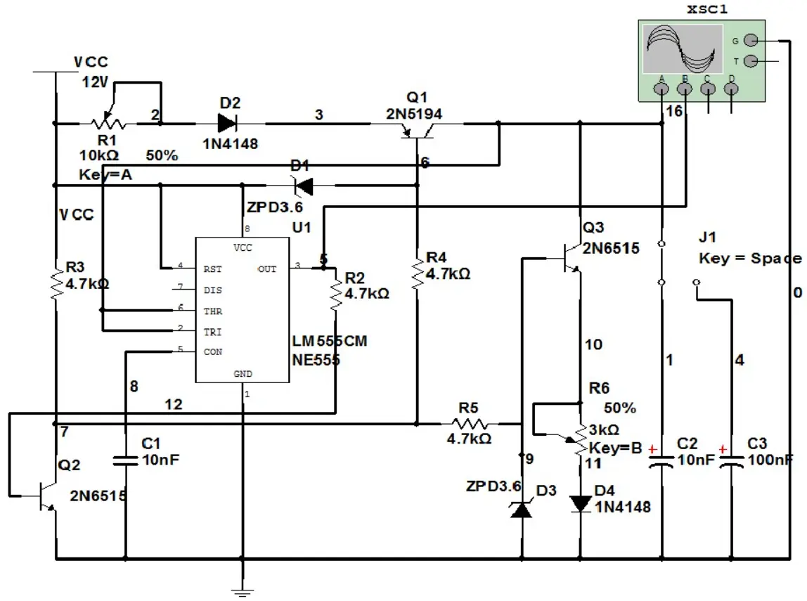
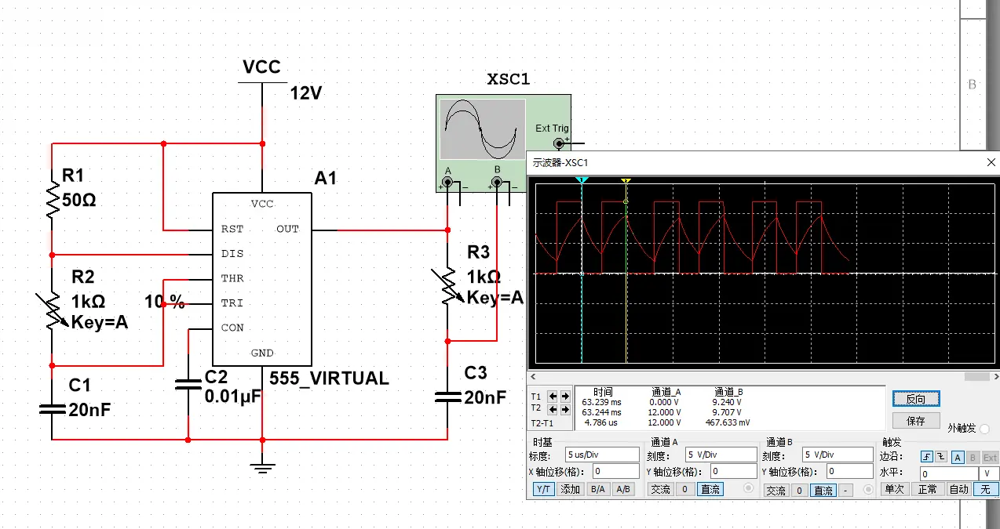
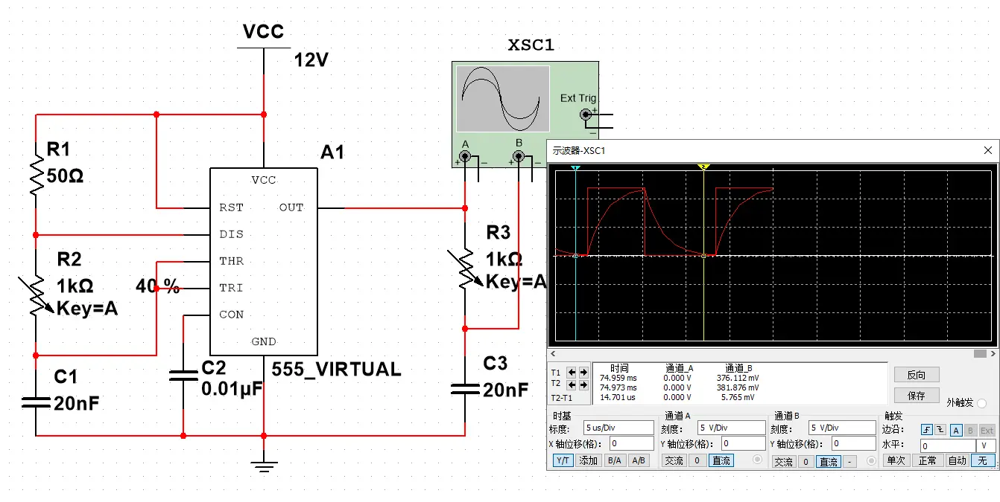

# 待定

## 引脚定义
![[Pasted image 20250827110323.webp]]
NE555有8个引脚
1. GND
2. TRIG
	比较器输入端，输入电压<1/3Vcc，触发输入
3. OUT
	输出，电流可达200mA
4. RESET
	低电平复位，一般接正电压，保持工作
5. CONT
> 引脚5可用于外部输入电压，控制两个电压比较器的比较电压（使得电阻分压电路部分固定的电压三等分，变为可以调节分压的电压），若不需要调节分压（实际很少用到），连接电容0.01uf获悬空即可。
![[Pasted image 20250827103543.webp]]
![[Pasted image 20250827103605.webp]]
6. THRES
	比较器输入端，输入电压>2/3Vcc，清除输入
7. DISCH
	放电输出，两个状态（低电平或悬空）
8. VCC
	4.5V~16V
## 内部
### 比较器（两个）
![[Pasted image 20250827102011.webp]]

### RS触发器
![[Pasted image 20250827102302.webp]]
RESET引脚高电平正常使用，低电平Q引脚输出低电平，Q逆引脚输出高电平

### 非门（输出电路）
![[Pasted image 20250827102500.webp]]
>虽然输出电路与RS触发器的Q引脚电压相同，但是输出电路使用多个三极管驱动能力（输出电流可达200mA）比Q引脚强大
### 分压电阻（分压部分）
![[Pasted image 20250827102906.webp]]
> 位于VCC与GND之间，产生1/3VCC的电压和2/3VCC的电压

### 整体图
![[Pasted image 20250827103007.webp]]
### 触发
![[Pasted image 20250827104329.webp]]

# 实例
## LED与扬声器
![[Pasted image 20250827105854.webp]]
延时时间：
![[Pasted image 20250827110743.webp]]

## NE555产生放波+三角波（方案1，恒流源）

1电路图及电路原理

该三角波发生器常用于电子线路安装实践教学项目中，是一个具有恒流充电和恒流放电的变形多谐振荡器，电路原理图如图1所示。
其中，恒流源l1由Q1、R1、D1、D2构成，恒流源I2由Q3、R6、D3、D4构成，其中R1、R6可调。当电路通电试车时，NE555定时器3脚输出高电平，开关管Q2导通，集电极为低电平，使PNP管Q1导通。恒流源l1通过R1、D2对电容C2或C3充电。当C2或C3两端电压
充至NE555阀值电平时，NE555的第3脚输出低电平，Q2管截止，导致Q1截止，充电回路断开，Q3基极因获得电源电压而导通，C2或C3
则以恒流源I2大小通过R6、D4放电，当C2或C3两端电压放至NE555阀值电平时，NE555的3脚再次输出高电平，使充电回路闭合，开始
第二个周期的充电。由于是恒流充放电，所以电容C2或C3两端电压可用如下公式1表示：
$$U_c=\frac{1}{C}\int Idt$$
由公式可知，在充放电电流恒定的情况或者直线下降，直线斜率反应其充放电速度，与充放电电阻R1
R6（该实验中已设置为可调电阻）和电容本实验中已设置切换开关)有关。

## NE555产生放波+三角波（方案2，RC积分）
满足：
- 扫描周期：5~15us可调；
- 三角波振幅可调
不满足：
- 无锯齿波

原理图

输出高电平时间：$T_H=ln2(R_1+R_2)*C1$ 
输出低电平时间：$T_L=ln2*R_2*C_1$  
振荡周期：$T=ln2(R_1+2R_2)*C1$
当R2远大于R1时，波形可近似等于方波，$T=ln2*2R_2*C_1$

电路工作原理：
在0-t1时间，矩形波为低电平，无电压对电容进行充电，所以输出电压为0。
在t1-t2时间，矩形波为高电平，有电压对电容进行充电，输出电压慢慢上升，由于时间常数τ=RC远大于脉冲的宽度tw，所以t2时间，输出电压无法到达高电平Vm。
在t2-t4时间，矩形波为低电平，电容C开始放电。
积分电路应该满足时间常数τ=RC远大于脉冲的宽度tw，一般大于3tw就行。

- **实验步骤**

1.器件选取说明

R2选取为可调电阻，其值越等于7kΩ，同时使波形频率可调。

若高电平为Vm，低电平为0，$tw = ln2*R_2*C_1 = ln（Vm/Vm-1）*R_3*C_3$。

## NE555产生放波+三角波（方案3，运放积分）
## NE555产生放波+三角波（方案4，）