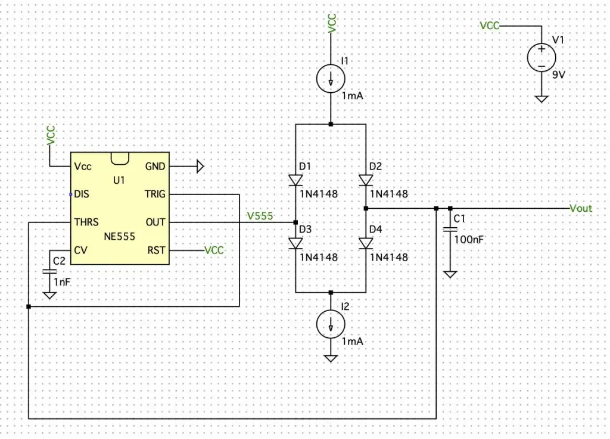

# 波形
The circuit works due to the fact that voltage increases or decreases linearly when a constant current flows into or out of a capacitor. If we manage to charge and discharge the capacitor with the same constant current, then the voltage of the capacitor will become a triangular wave; that’s the crux of this circuit (**Figure 1**).  
该电路的工作原理是，当恒定电流流入或流出电容器时，电压线性增加或减少。如果我们设法用相同的恒流对电容器进行充放电，那么电容器的电压就会变成三角波;这就是该电路的关键（ **图 1**）。

Assuming that the circuit has reached steady-state, then the working principle is as follows: When the voltage across capacitor is 1/3Vcc, the 555’s output will be high, making D1 and D4 reverse biased but D2 and D3 forward biased. Therefore the capacitor will charge through D2 with a constant current I1 (its voltage will increase linearly) until its voltage reaches 2/3Vcc. When that happens, the 555’s output will be low, making D3 and D2 reverse biased but D4 and D1 forward biased, thus discharging the capacitor through D4 with a constant current I2. If I1 is equal to I2, then it takes the same amount of time to go from 1/3Vcc to 2/3Vcc and vice versa. However, if I1 is different from I2, we can generate different waveforms such as positive and negative sawtooth waves.  
假设电路已达到稳态，则工作原理如下：当电容器两端的电压为 1/3Vcc 时，555 的输出将为高电平，使 D1 和 D4 反向偏置，而 D2 和 D3 正向偏置。因此，电容器将以恒定电流 I2 通过 D1 充电（其电压将线性增加），直到其电压达到 2/3Vcc。发生这种情况时，555 的输出将为低电平，使 D3 和 D2 反向偏置，而 D4 和 D1 正向偏置，从而以恒定电流 I2 通过 D4 对电容器进行放电。如果 I1 等于 I2，则从 1/3Vcc 到 2/3Vcc 所需的时间相同，反之亦然。但是，如果 I1 与 I2 不同，我们可以生成不同的波形，例如正锯齿波和负锯齿波。

The expression for the rise time (TRISE) and fall time (TFALL) is the following:  
上升时间 （TRISE） 和下降时间 （TFALL） 的表达式如下：
