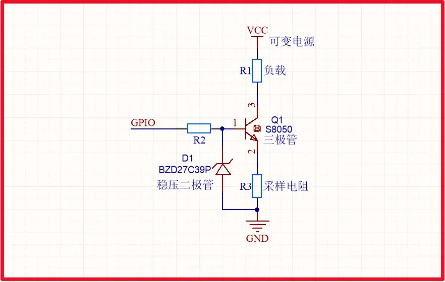
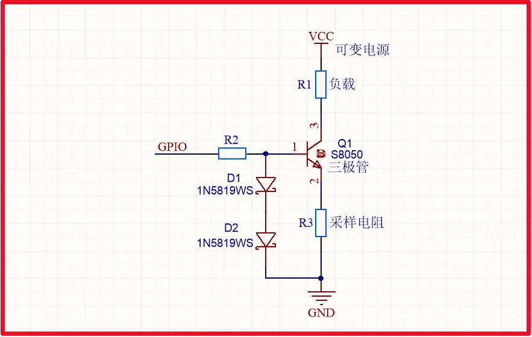
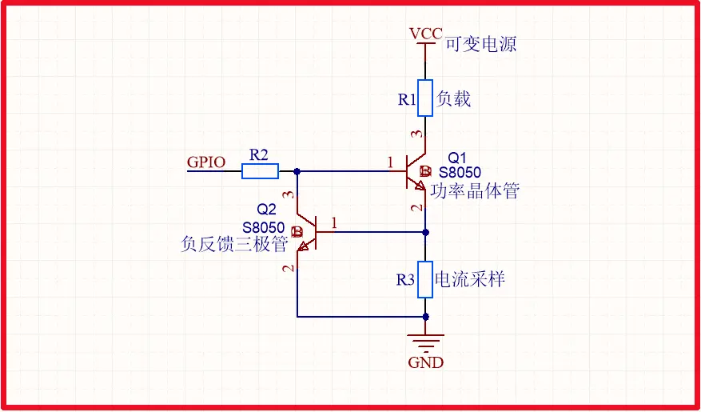
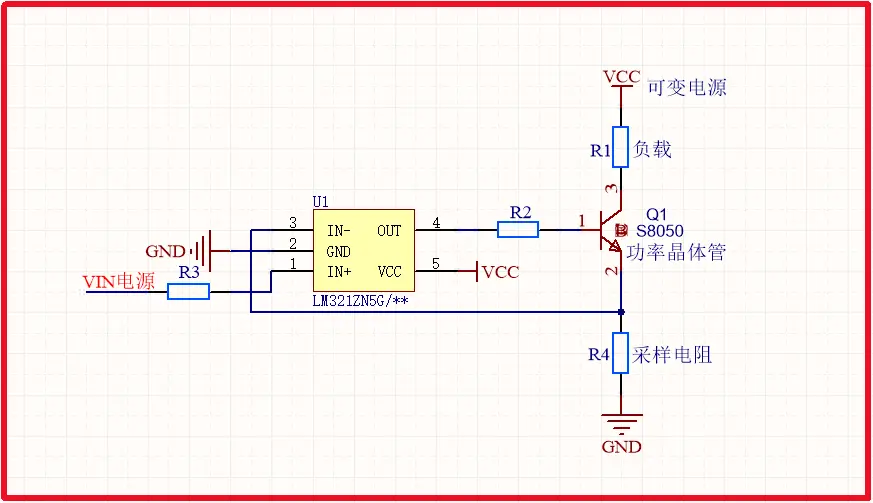
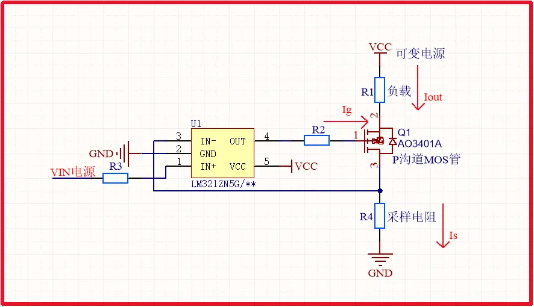
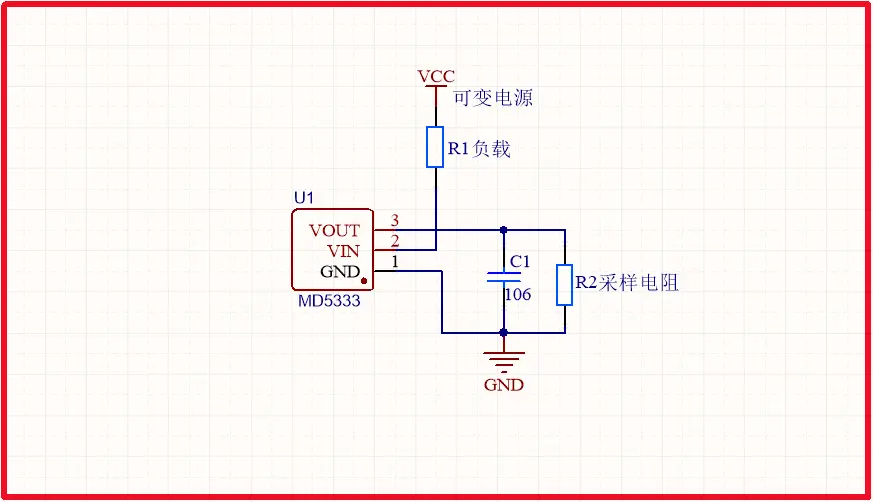

### 三、低成本可调恒流源设计方案

基于三极管饱和特性的理解，以下介绍三种低成本可调恒流源设计方案，分别适用于不同应用场景和精度要求。

# 方案1：稳压管+三极管恒流源

**电路原理**：利用稳压管的稳定电压特性，结合三极管的饱和特性，构建一个简单的恒流源电路。稳压管提供稳定的参考电压，三极管在饱和状态下工作，其集电极电流由参考电压和采样电阻决定。

```
+VCC
  |
  R1
  |
稳压管(Vz)
  |
  R2
  |
三极管基极(B)
  |
三极管发射极(E)---负载---GND
  |
三极管集电极(C)---GND
```
**工作原理**：当三极管饱和时，其发射结电压约为0.7V，因此稳压管两端的电压为Vz=Ube+Vce。根据欧姆定律，流过R2的电流为I=(Vz-0.7)/R2，这一电流同时也流过三极管的发射极，因此负载电流也近似等于I。
**优点**：

- 成本极低（约￥5以内）
- 无需运放或单片机
- 电路简单，易于搭建
- 无需复杂控制，适合固定电流需求

**缺点**：

- 温度稳定性差（Vbe/Vz随温度漂移）
- 负载调整率低（电流随负载电压波动变化）
- 无法动态调节（需手动更换电阻）

**适用场景**：LED驱动、简单负载供电等无需调节的场景。

**设计实例**：使用6.2V稳压管(1N4746)和0.22kΩ电阻构建的恒流源，可输出约25mA的恒定电流。当稳压管为5.1V，电阻为100Ω时，可输出约44mA的电流。

# 方案2：运放+晶体管恒流源

**电路原理**：利用运算放大器的高开环增益和负反馈原理，构建一个精度较高的恒流源电路。运放作为比较放大器，控制晶体管的基极电流，使输出电流保持恒定。

**电路结构**：

深色版本

```
+Vcc
  |
R1 --+--运放同相端(+)
     |
稳压管(Vref) --+--运放反相端(-)
     |
R2 --+--晶体管基极(B)
     |
晶体管集电极(C)---负载---GND
     |
晶体管发射极(E)---Rf---GND
```

**工作原理**：当运放同相端输入电压(V+)与反相端输入电压(V-)相等时（虚短原理），流过Rf的电流为Vref/Rf。由于运放输入阻抗极高，流过R2的电流近似等于流过Rf的电流，因此晶体管的基极电流为Ib=Vref/R2。当晶体管饱和时，其集电极电流Ic≈β×Ib，但由于运放的负反馈作用，Ic实际上由Vref和Rf决定，与β无关，因此可实现稳定的恒流输出。

**优点**：

- 精度高（±0.5%~1%）
- 负载调整率<1% 36
- 可调性好（通过电位器调节Vref）
- 适合传感器激励、精密测量等场景

**缺点**：

- 需运放和精密电阻，成本约￥10以内
- 需注意运放供电电压与输出范围匹配
- 电路复杂度较高，调试难度较大

**适用场景**：传感器激励、电池充电（需稳定电流）、精密测量仪器等需要中等精度可调电流的场景。

**设计实例**：使用LM358运放和2N2222晶体管构建的恒流源，通过电位器调节Vref，可实现0-50mA的可调恒流输出。当R1=100kΩ，R2=10kΩ，Rf=100Ω，电位器分压比为1:2时，输出电流约为25mA。
## 确保三极管工作在放大区才能确保恒流源，电流横流可控

**简单直接的回答是：避免三极管饱和是为了保证恒流源的精度和稳定性，从而确保生成的三角波/锯齿波拥有完美的线性。**

下面我们来深入分解一下“为什么”：

### 1. 恒流源的工作原理

在这个电路中，LM358运放和晶体管（Q1, Q2）共同构成了一个**压控恒流源**。它的工作原理是：

- 运放会通过**负反馈**不断调整其输出（即晶体管的基极电压），使其两个输入端的电压相等（虚短）。
    
- 图中，运放的反相输入端（-）的电压由电阻分压网络设定（例如 `Vset_charge`）。
    
- 运放的同相输入端（+）连接到晶体管的发射极电阻（Re）上。
    
- 因此，运放会迫使发射极电阻上的电压 `Ve` 等于 `Vset`。
    
- 根据欧姆定律，流过发射极电阻的电流，也就是集电极输出给电容充电/放电的电流 `I = Vset / Re`。
    

这个电流 `I` 在理论上只取决于 `Vset` 和 `Re`，与负载（即电容上的电压）无关，从而实现“恒流”。

### 2. 晶体管饱和会破坏恒流

一个双极性晶体管（BJT）要作为一个良好的可控电流源，必须工作在**放大区（Active Region）**。在这个区域：

- `Ic = β * Ib`（集电极电流由基极电流控制）
    
- 集电极-发射极电压 `Vce` 大于某个最小值（通常 > 0.3V ~ 0.5V）。
    

当晶体管进入**饱和区（Saturation Region）** 时：

- `Vce` 变得非常小（`Vce(sat)`，通常约为 0.1V ~ 0.2V）。
    
- 集电极电流 `Ic` 不再由基极电流 `Ib` 主导，而是主要由外部的集电极负载电路决定（`Ic ≈ (Vcc - Vce(sat)) / R_load`）。
    
- **晶体管失去了电流放大作用，变成了一个几乎闭合的开关。**
    

### 3. 饱和对波形产生的具体危害

如果在这个电路中，Q1或Q2饱和了，会发生以下问题：

1. **恒流源失效**：电流 `I` 不再由 `Vset / Re` 公式决定。例如，当电容电压上升，充电晶体管Q1的集电极电压 `Vc` 也会上升。如果 `Vc` 过高，导致 `Vce` (`Vc - Ve`) 过小，Q1就会饱和。一旦饱和，电流就不再恒定，会随着电容电压的变化而变化。
    
2. **波形非线性**：电容的充电/放电电流不再恒定，导致电压变化率 (`dV/dt = I/C`) 也不再恒定。本应是完美直线的三角波斜坡会变成弯曲的指数曲线，严重失真。
    
3. **频率漂移和不稳定**：因为充放电时间取决于电流，电流不稳定直接导致波形周期和频率不稳定。此外，饱和状态更容易受到温度和元件个体差异的影响。
    

### 4. 设计者如何避免饱和？（对应你总结中的部分）

文章中提到：

> Q1 的集电极最大电压 ≈ (2/3 Vcc + 0.7V)，因此要使其发射极电压 ≥ 2/3 Vcc + 1V。

这正是在进行**确保工作于放大区的工程计算**。

- **对于充电晶体管 Q1**：
    
    - 它的最坏情况（集电极电压最高）发生在电容快充满时，即电压达到 `2/3 Vcc`。
        
    - 此时，Q1的集电极电压 `Vc ≈ 2/3 Vcc + D2的压降 (约0.7V)`。
        
    - 要保证Q1不饱和，需要 `Vce > Vce(sat)`，设计上通常留出至少 1V 的余量（即让晶体管远离饱和边缘）。所以要求：  
        `Ve >= Vc + 1V ≈ (2/3 Vcc + 0.7V) + 1V`
        
    - 由于 `Ve = Vset_charge`（由运放设定的电压），**只需将 `Vset_charge` 设置得足够高**，就能确保在任何时候 `Vce` 都足够大，使Q1稳定工作在放大区。
        
- **对于放电晶体管 Q2**：（逻辑类似但相反）
    
    - 它的最坏情况（集电极电压最低）发生在电容快放完时，电压为 `1/3 Vcc`。
        
    - 此时，Q2的集电极电压 `Vc ≈ 1/3 Vcc - D1的压降 (约0.7V)`。
        
    - 要保证Q2不饱和（对于PNP，是确保 `Vec` 足够大），需要其发射极电压 `Ve` 足够低。  
        `Ve <= Vc - 1V ≈ (1/3 Vcc - 0.7V) - 1V`
        
    - **只需将 `Vset_discharge` 设置得足够低**，就能确保Q2始终工作在放大区。
        

### 总结

你可以将避免饱和理解为：**为恒流源晶体管提供充足的“电压余量”或“工作空间”**。

|状态|工作区域|对电路的影响|
|---|---|---|
|**理想状态**|**放大区**|恒流源精确，波形线性极佳，频率稳定|
|**故障状态**|**饱和区**|恒流源失效，波形弯曲失真，频率漂移|

因此，你提供的文档摘要中特别强调避免晶体管饱和，并给出了具体的电压设计值，这正体现了从“理论模拟”到“可靠物理实现”的关键一步，是一个优秀工程设计思维的体现。

# 1


# 2



# 3


# 4 



# 5



# 6
