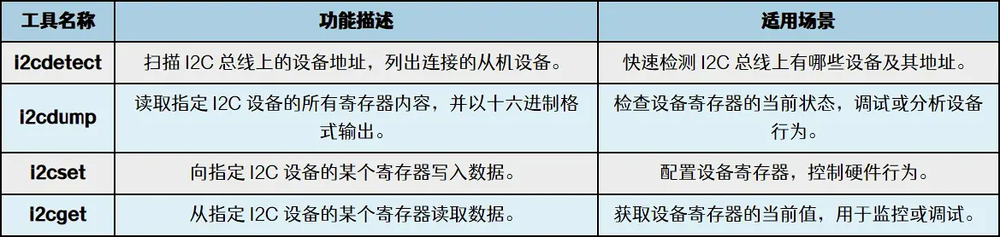

# 环境搭建
# 文件IO
# LED编程
# GPIO编程

# 输入设备编程
# 串口编程
# PWM编程
# I2C编程
## [[I2C|协议基础]]
## I2C Tools
### 安装
```
sudo apt install i2c-tools
```

i2cdetect：
```
i2cdetect -l # list 列出可用总线机器编号
i2cdetect <bus_num> #扫描指定总线，i2cdetect 1，扫描总线1
i2cdetect -F <bus_num> #查看总线支持的功能
```
i2cdump：

```
i2cdump <bus_num> <i2c_address> # 读取寄存器，i2cdump 1 0x38
i2cdump -f <bus_num> <i2c_address> # 强制读取寄存器

i2cdump -f -r 0x80-0xff 1 0x38 # 读取部分寄存器（-r 0x80-0xff ）

```
i2cset：
```
i2cset -f 1  0x38 0x80 0x55 # i2cset <强制写入> <总线1>  <总线地址> <寄存器地址> <寄存器内容> 
```
i2cget：
```
i2cget -f 1 0x38 0x80 # <强制获取> <总线1>  <总线地址> <寄存器地址>
```
i2ctransfer：

0X8047~0x804B和0X80FF这几个寄存器
```
root@ok3506-buildroot:/# i2ctransfer -y -f 0 w2@0x14 0x80 0xFF r1
0xec
root@ok3506-buildroot:/# i2ctransfer -y -f 0 w2@0x14 0x80 0x47 r5
0x4a 0x20 0x03 0x00 0x05


```
### 三、核心操作详解（结合示例）

#### 1. 基础：单独写操作（`w`）

向指定设备写入一串数据（如配置寄存器）。  
**格式**：`[设备地址]@w[数据长度] [数据1] [数据2] ...`

  

示例：向 I2C 总线 `0`、地址 `0x14` 的设备（如 GT9271）写入 3 个字节（`0x80 0x47 0x01`）：

  

bash

```bash
i2ctransfer -y -f 0 0x14@w3 0x80 0x47 0x01
```

  

- 解读：`0x14@w3` 表示向地址 `0x14` 写入 3 个字节，后续 `0x80 0x47 0x01` 是具体数据（可理解为 “寄存器地址 0x8047 + 写入值 0x01”）。

#### 2. 基础：单独读操作（`r`）

从指定设备读取一串数据（如读取状态寄存器）。  
**格式**：`[设备地址]@r[数据长度]`

  

示例：从总线 `0`、地址 `0x14` 的设备读取 5 个字节：

  

bash

```bash
i2ctransfer -y -f 0 0x14@r5
```

  

- 输出：类似 `0x00 0x01 0x02 0x03 0x04`（返回 5 个字节的十六进制数据）。

#### 3. 进阶：先写后读（`w`+`r`，最常用）

先向设备写入 “寄存器地址”，再读取该地址开始的连续数据（绝大多数 I2C 设备的读操作逻辑）。  
**格式**：`[设备地址]@w[写长度] [写数据] r[读长度]`

  

示例：读取 GT9271 触摸屏 `0x8047~0x804B` 寄存器（共 5 个字节）：

  

bash

```bash
i2ctransfer -y -f 0 0x14@w2 0x80 0x47 r5
```

  

- 解读：
    - `w2 0x80 0x47`：先写入 2 个字节（`0x80` 和 `0x47`），表示要读取的寄存器地址 `0x8047`（16 位地址）。
    - `r5`：接着读取 5 个字节（对应 `0x8047` 到 `0x804B` 的数据）。

#### 4. 高级：多阶段传输（复杂交互）

支持多次写 + 读的组合（如先写配置命令，再读状态，再写确认，最后读结果）。

  

示例：向设备发送配置命令（`0x01`），读状态（1 字节），再发送确认（`0x02`），最后读数据（3 字节）：

  

bash

```bash
i2ctransfer -y -f 0 0x14@w1 0x01 r1 w1 0x02 r3
```

  

- 执行流程：
    1. 写 1 字节 `0x01`（配置命令）；
    2. 读 1 字节（状态）；
    3. 写 1 字节 `0x02`（确认）；
    4. 读 3 字节（结果数据）。

#### 5. 批量读写寄存器（连续操作）

一次性读写多个不连续的寄存器（通过多次写 + 读实现）。

  

示例：先读 `0x8047`（2 字节），再读 `0x80FF`（1 字节）：

  

bash

```bash
i2ctransfer -y -f 0 0x14@w2 0x80 0x47 r2 w2 0x80 0xFF r1
```


## I2C应用编程

伪代码流程：读取I2C设备指定寄存器的值
1. 打开I2C设备节点 (例如 /dev/i2c-1)
2. 准备一个i2c_rdwr_ioctl_data结构，它包含两个i2c_msg：
   - 第一个消息：设置写入模式，发送寄存器地址 (flags=0, 表示写)
   - 第二个消息：设置读取模式，准备接收数据 (flags=I2C_M_RD, 表示读)
3. 调用ioctl(fd, I2C_RDWR, &i2c_rdwr_ioctl_data) 一次性完成上述两次传输（包含重复起始位）
4. 处理读取到的数据
5. 关闭设备
简单I2C读写示例：
```c i2c_demo1.c

#include <stdio.h>
#include <stdlib.h>
#include <unistd.h>
#include <fcntl.h>
#include <sys/ioctl.h>
#include <linux/i2c-dev.h>
#include <inttypes.h>

int main() {
    int file;
    const char *dev = "/dev/i2c-1";  // 使用 i2c-1 总线
    file = open(dev, O_RDWR); // 打开 I2C 设备

    if (file < 0) {
        perror("Failed to open the I2C bus");
        exit(1);
    }

    // 设定 I2C 从设备地址
    int addr = 0x68;  // 设备的 I2C 地址
    if (ioctl(file, I2C_SLAVE, addr) < 0) {
        perror("Failed to acquire bus access and/or talk to slave");
        exit(1);
    }

    // 进行读写操作
    unsigned char write_buffer[2]; 
	write_buffer[0] = 0x10; // 寄存器地址
	write_buffer[1] = 0x01; // 写入的值
	
	if (write(file, write_buffer, sizeof(write_buffer)) != sizeof(write_buffer)) {
	    perror("Failed to write to the I2C bus");
	    exit(1);
	}
	// 读
	unsigned char read_buffer[1]; 
	if (read(file, read_buffer, sizeof(read_buffer)) != sizeof(read_buffer)) {
	    perror("Failed to read from the I2C bus");
	    exit(1);
	}
	printf("Read value: 0x%02x\n", read_buffer[0]);

    close(file);
    return 0;
}

```

组合I2C读写示例：
```c i2c_demo2.c
#include <stdio.h>
#include <stdlib.h>
#include <unistd.h>
#include <fcntl.h>
#include <sys/ioctl.h>
#include <linux/i2c-dev.h>
#include <inttypes.h>
#include <linux/i2c.h>

int main() {
    int file;
    const char *dev = "/dev/i2c-1";  // 使用 i2c-1 总线
    file = open(dev, O_RDWR); // 打开 I2C 设备

    if (file < 0) {
        perror("Failed to open the I2C bus");
        exit(1);
    }

    // 设定 I2C 从设备地址
    int addr = 0x68;  // 设备的 I2C 地址
    if (ioctl(file, I2C_SLAVE, addr) < 0) {
        perror("Failed to acquire bus access and/or talk to slave");
        exit(1);
    }

    // 进行读写操作...

    // 写操作
    unsigned char write_buffer[2] = {0x10, 0x01};  // 寄存器地址和写入值
    struct i2c_msg msgs[1] = {
        {
            .addr  = addr,
            .flags = 0,  // 写操作
            .len   = sizeof(write_buffer),
            .buf   = write_buffer
        }
    };

    struct i2c_rdwr_ioctl_data rdwr_data = {
        .msgs = msgs,
        .nmsgs = 1
    };

    if (ioctl(file, I2C_RDWR, &rdwr_data) < 0) {
        perror("Failed to write using i2c_rdwr_ioctl_data");
        exit(1);
    }

    // 读操作
    unsigned char read_buffer[1];
    msgs[0] = (struct i2c_msg){
        .addr  = addr,
        .flags = I2C_M_RD,  // 读操作
        .len   = sizeof(read_buffer),
        .buf   = read_buffer
    };

    rdwr_data.msgs = msgs;
    rdwr_data.nmsgs = 1;

    if (ioctl(file, I2C_RDWR, &rdwr_data) < 0) {
        perror("Failed to read using i2c_rdwr_ioctl_data");
        exit(1);
    }

    printf("Read value: 0x%02x\n", read_buffer[0]);

    close(file);
    return 0;
}

```


# SPI编程
# Socket编程
# CAN编程

