拆解
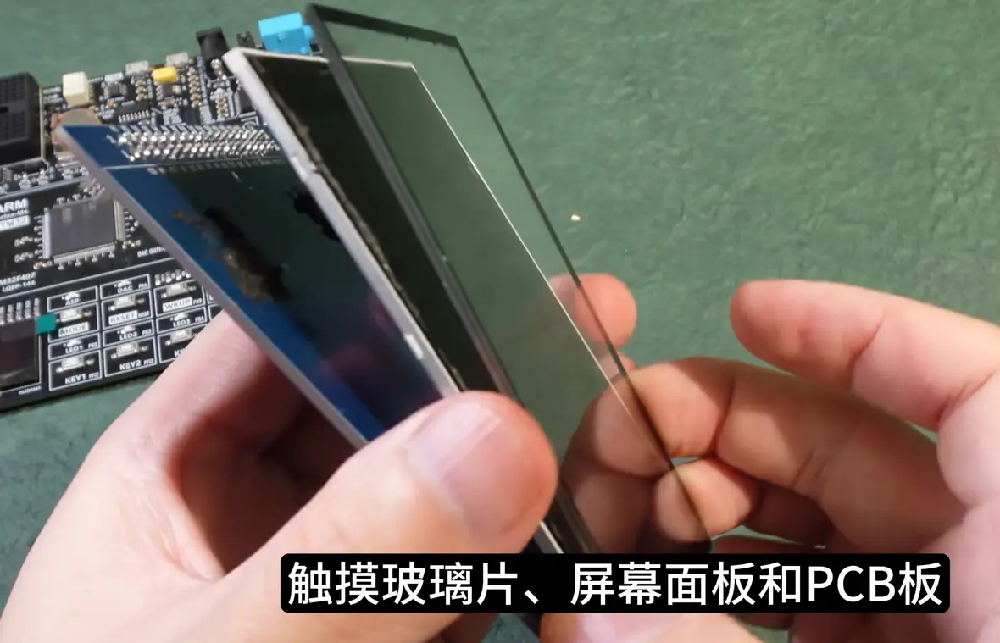

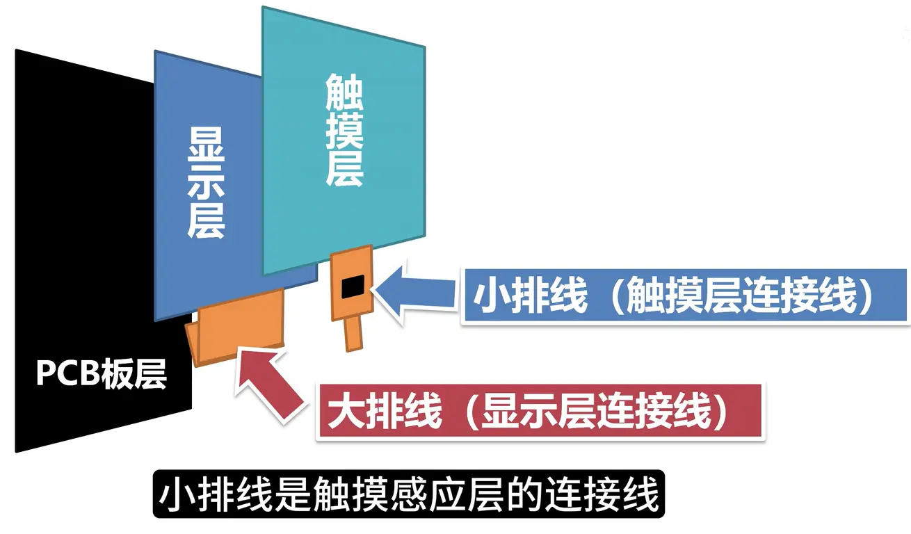

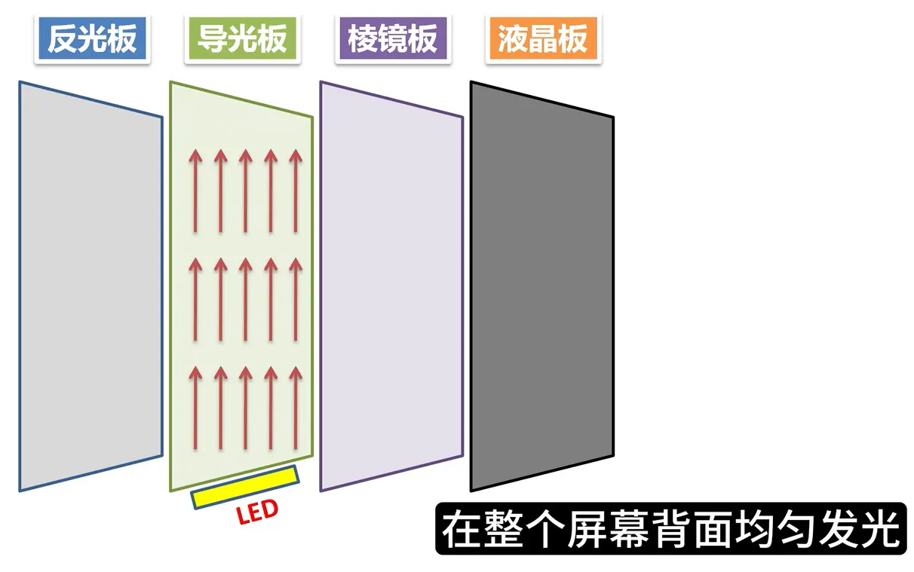

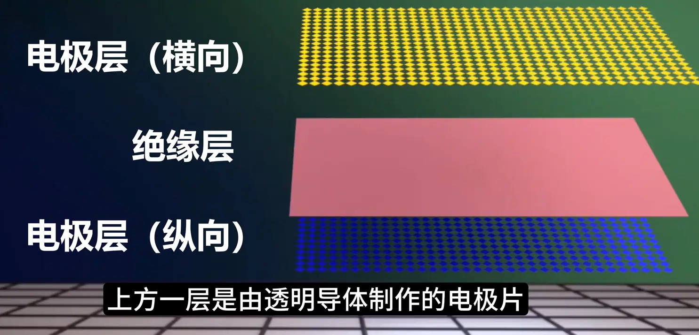
上层是横向，下层是纵向，上下之间构成稳定的电场，手指是导体，触摸时，电场发生改变，上下xy两个方向即可定位

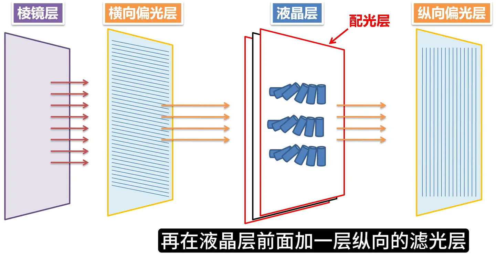
棱镜层，折射出垂直光线，横向偏光层过滤横向光线，液晶层中的液晶体偏转光线 $90^\circ$，通过纵向偏光层，液晶屏变亮
液晶体前后的配光层控制液晶体旋转或竖直，改变光线的旋转，以达到控制亮度的目的
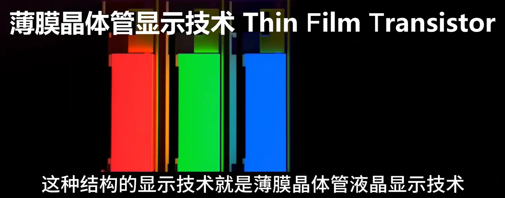
每个像素点旁边都会光刻一个薄膜晶体管，用于控制像素的电极电压，以控制液晶体的偏转，进而控制像素点的打开关闭
这样的技术叫做（Thim Film Transistor Liquid Crystal Display）简称，TFT-LCD

背光调节：
1. DC调光，直流调光，无频闪护眼
2. PWM调光，无肉眼可见频闪

接口定义：
显示部分：

| 引脚     | 作用             |
| ------ | -------------- |
| CS     | 片选             |
| RS     | COMMAND/DATA切换 |
| WR     | 允许写            |
| RD     | 允许读            |
| RST    | 复位引脚           |
| D0~D15 | 并行数据接口         |

背光部分：

| 引脚  | 作用     |
| --- | ------ |
| BL  | 背光控制引脚 |
触摸部分：

| 引脚  | 作用      |
| --- | ------- |
| SDA | I2C数据引脚 |
| SCL | I2C时钟引脚 |
| INT | 触摸中断引脚  |
| RST | 触摸复位引脚  |
电源部分：

| 引脚  | 作用                  |
| --- | ------------------- |
| VDD | 显示层触摸层供电，电流需大于500mA |
| GND | 接地                  |
| 5V  | LED供电，2A以上（有冗余）     |

驱动方式：
1. 普通IO驱动：效果差
2. FSMC： **Flexible Static Memory Controller**，一般用于存储扩展，也可用于屏幕驱动

FSMC接口：
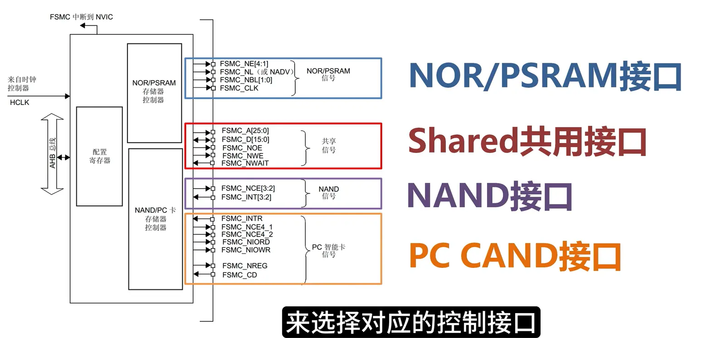

驱动芯片本质上属于SRAM类型：
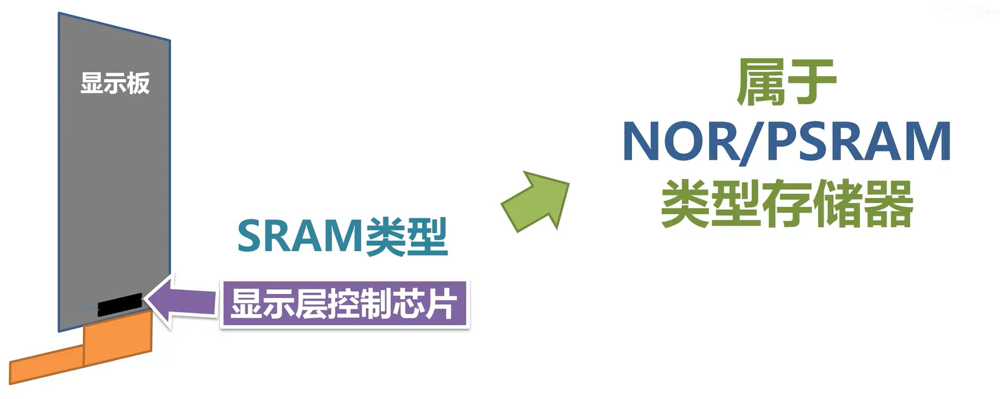

显示层驱动芯片类型：
1. 8080：
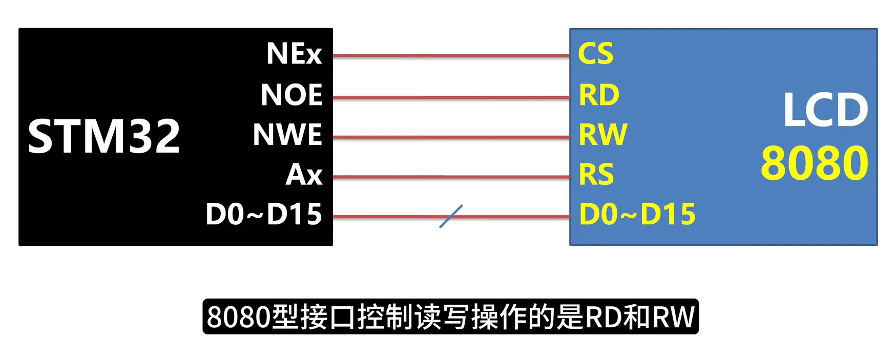
2. 6800：
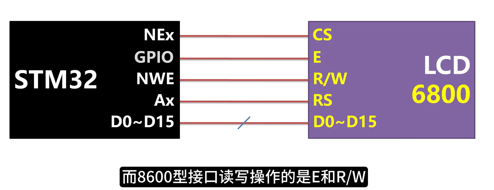

FSMC与8080接口连接示意图：
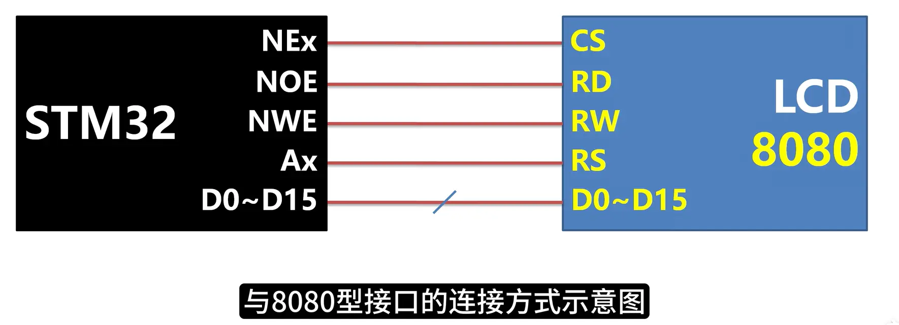

