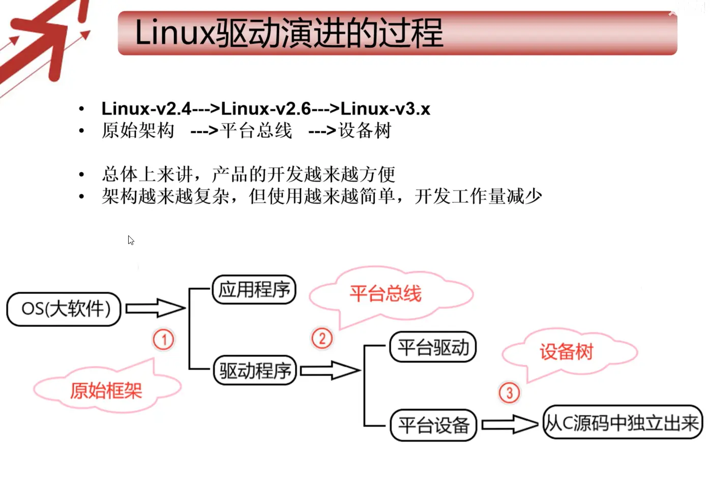
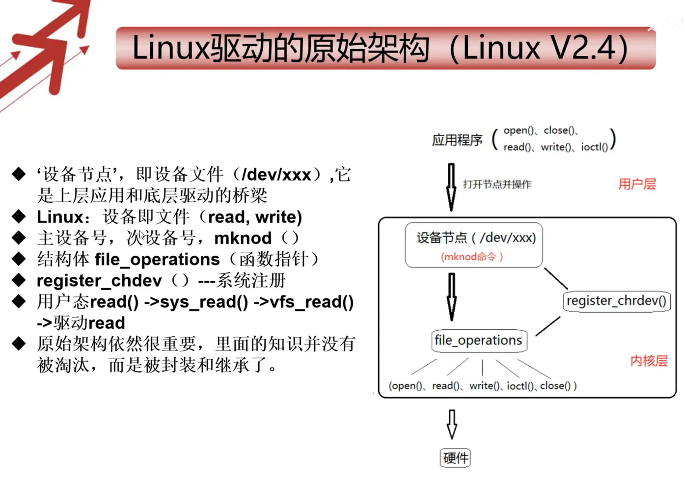

# 发展：



# 原始框架：


设备节点（/dev/xxx）是上层应用和底层驱动的桥梁。（[[#^3a1d98|如何创建设备节点]]）
file_operations，实现驱动的操作。
register_chrdev，绑定设备节点与file_operations。
可以通过用户态的几个文件操作函数，操作设备节点，实现硬件控制

# 平台总线架构

封装了原始驱动框架，platform_driver，platform_device
分开了设备驱动（platform_driver）与资源信息（platform_device硬件信息）
还引入了sysfs文件系统

# 设备树架构
就是把平台总线架构中的platform_device部分（c源码），使用设备树替换（脚本文件）。
设备资源独立了出来（arch/arm/mach-xxx/board-xxx.c），从C文件发展为DTS设备树脚本文件arch/arm/boot/dts/xxx.dts)
换板子不需要重新编译，只要更改设备树文件即可。
设备树架构的出现让BootLoader也有了发展，BootLoard参与传递设备资源（启动时需要把设备树文件传给内核）

## 创建设备节点： ^3a1d98
在 Linux 中，创建设备节点主要有**手动创建**和**自动创建**两种方式，以下是具体方法：
### 一、手动创建设备节点（`mknod` 命令）

1. **前提条件**  
需知道设备的**类型**（字符设备 `c` / 块设备 `b`）、**主设备号**（major）和**次设备号**（minor）。可通过 `cat /proc/devices` 查看已注册的主设备号，或从驱动文档中获取。
2. **命令格式**
```sh
 mknod -m <权限> <设备名> <设备类型> <主设备号> <次设备号>
```
- `-m`：指定设备文件的权限（如 `666` 表示所有用户可读写）；
- 设备名：通常放在 `/dev/` 下（如 `/dev/mydevice`）；
- 设备类型：`c`（字符设备）或 `b`（块设备）；
- 主 / 次设备号：需与驱动中注册的编号一致。
3. **示例**
若要创建一个字符设备节点 `/dev/mychar`，主设备号为 `240`，次设备号为 `0`，权限为 `666`，命令如下：
```
sudo mknod -m 666 /dev/mychar c 240 0
```
### 二、自动创建设备节点（驱动代码）
#### 在驱动代码中自动创建（需驱动支持）
在驱动中通过 `udev` 相关函数自动创建设备节点。

1. **依赖头文件**
```c
#include <linux/device.h>
#include <linux/kdev_t.h>
```

2. **步骤示例**

- **定义设备类**：
```c
static struct class *my_class;
my_class = class_create(THIS_MODULE, "my_class");
```
- **创建设备节点**：
```c
device_create(my_class, NULL, MKDEV(major, minor), NULL, "mydevice");
```

- `major`/`minor`：主 / 次设备号；
- `"mydevice"`：设备名（最终节点为 `/dev/mydevice`）。
- **卸载时清理**：

```c
device_destroy(my_class, MKDEV(major, minor));
class_destroy(my_class);
```