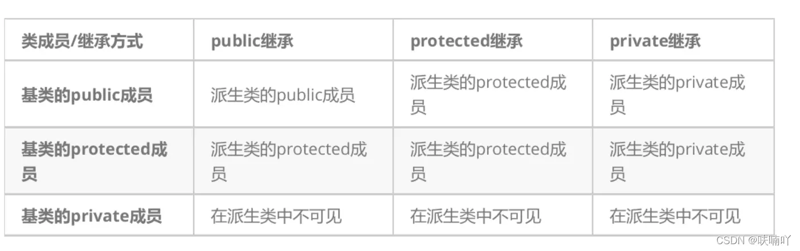

Morden C++十分庞大且折磨

基础
类
函数变量
函数成员
内部声明
外部声明
实现

类的访问修饰符
public
private
protected

类函数的重载特性（静态重载）
同名函数，参数不同
原理：函数名修饰(name Mangling)

析构函数
析构函数不可以重载
构造函数
构造函数可以重载
类的继承
允许新的类中继承public和protected部分，private不能继承
访问限定符与继承控制

虚函数和纯虚函数
虚函数，virtual关键字
纯虚函数，没有实际定义的纯虚函数