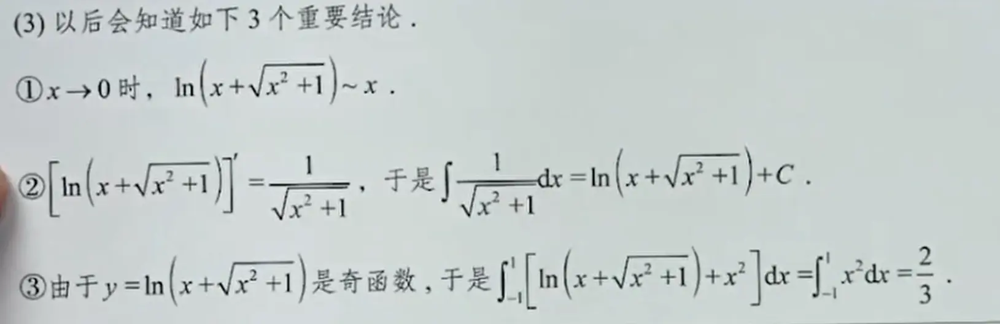
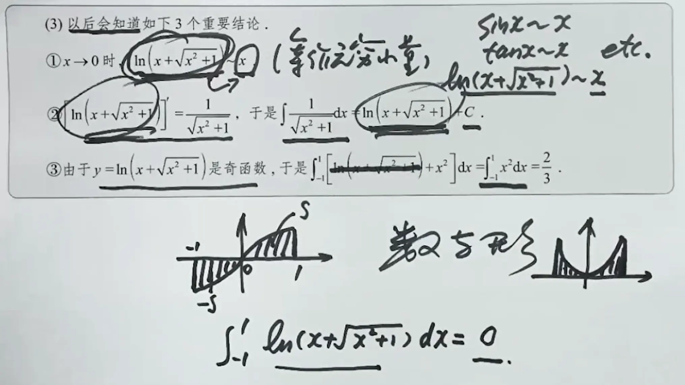

三者关系极其紧密，可以用**“铁三角”**来形容。它们不是三个孤立的东西，而是**同一个数学对象（指数函数 $$e^x$$）的三种不同组合方式**。

我从**代数、恒等式、微积分、几何**四个维度给你画一张关系网：

---

### 1. 代数定义关系（最根本：由 $$e^x$$ 组合而来）

这是它们的“出生证明”，所有关系都源于此：

$$
\sinh x = \frac{e^x - e^{-x}}{2}
$$

（差的二分之一）

$$
\cosh x = \frac{e^x + e^{-x}}{2}
$$

（和的二分之一）

$$
\tanh x = \frac{\sinh x}{\cosh x} = \frac{e^x - e^{-x}}{e^x + e^{-x}}
$$

**反过来看**，它们俩相加正好还原了指数函数：

$$
\sinh x + \cosh x = e^x
$$

（这也正是你给的式子 $$\frac{e^x-1}{e^x+1} = \tanh \frac{x}{2}$$ 的推导来源）

---

### 2. 核心恒等式（对标三角函数的“勾股定理”）

三角函数有 $$\sin^2 + \cos^2 = 1$$，双曲函数有一个极其相似的恒等式，**只差一个符号**：

$$
\cosh^2 x - \sinh^2 x = 1
$$

把这个公式套进去，你的 $$\tanh$$ 就产生了：

$$
\tanh x = \frac{\sinh x}{\cosh x}
$$

由此还能推出一组**互逆公式**（非常常用）：

$$
1 - \tanh^2 x = \frac{1}{\cosh^2 x}
$$

$$
\coth^2 x - 1 = \frac{1}{\sinh^2 x}
$$

---

### 3. 微积分关系（循环求导）

三者的导数形成了一个完美的**闭环**，和三角函数（$$\sin \to \cos \to -\sin$$）神似，但符号全是正的：

| 函数 | 导数 |
| :--- | :--- |
| $$\sinh x$$ | $$\to \cosh x$$ |
| $$\cosh x$$ | $$\to \sinh x$$ |
| $$\tanh x$$ | $$\to 1 - \tanh^2 x = \text{sech}^2 x$$ |

**实用意义**：在神经网络（比如你刚问的 $$\tanh$$）中，求梯度极其方便，因为它的导数可以直接用自身表达出来：

$$
\frac{d}{dx}\tanh x = 1 - \tanh^2 x
$$

---

### 4. 半角关系（打通你给出的那个特殊式子）

你最开始给的函数是：

$$
f(x)=\frac{e^x-1}{e^x+1}
$$

它本质上不是标准的 $$\tanh x$$，而是 **$$\tanh \frac{x}{2}$$**。

为什么？因为：

$$
\tanh \frac{x}{2} = \frac{\sinh(x/2)}{\cosh(x/2)} = \frac{e^{x/2} - e^{-x/2}}{e^{x/2} + e^{-x/2}}
$$

上下同时乘以 $$e^{x/2}$$，就变成了：

$$
\frac{e^x - 1}{e^x + 1}
$$

所以，三者的关系还包含**半角公式**，这在信号处理和控制系统（比如PID的积分饱和）中常用来把指数函数“压缩”成双曲正切。

---

### 5. 几何坐标中的统一视角

回到双曲线 $$x^2 - y^2 = 1$$：

- **横坐标**是 $$\cosh a$$
- **纵坐标**是 $$\sinh a$$
- **斜率**（$$y/x$$）正好是 $$\tanh a$$

所以，**$$\tanh$$ 其实就是“双曲线上的斜率”**，而 $$\sinh$$ 和 $$\cosh$$ 是“双曲线上的两个坐标轴分量”。

---

### 最后，帮你用一句话区分三者的“分工”

| 函数 | 角色类比（家庭关系） | 现实手感 |
| :--- | :--- | :--- |
| $$\sinh$$ | **儿子**（奇函数） | 两头冲，单调递增，无下限 |
| $$\cosh$$ | **女儿**（偶函数） | 两头翘，最低点是 1，像挂在空中的电线 |
| $$\tanh$$ | **他俩的儿子/比例** | 被“压缩”在 -1 和 1 之间，中庸、平滑、AI最爱 |

**记忆口诀**：
> **sinh 单挑指数差，cosh 抱团指数和；两者平方差为 1，tanh 就是除一下。**


# 双曲正切函数图像
$$
f(x)=\frac{e^{x}-1}{e^{x}+1}=\tanh\frac{x}{2}
$$
图像：
```desmos-graph
y=\frac{e^{x}-1}{e^{x}+1}
```

1. 奇函数：$f(-x)=-f(x)$
2. 值域：$(-1,1)$
3. 导数：
$$
f'(x)=\frac{2e^x}{(e^x+1)^2}
$$


# 双曲正弦函数图像

$$
\sinh x = \frac{e^{x} - e^{-x}}{2}
$$

图像：
```desmos-graph
y=\frac{e^{x}-e^{-x}}{2}
```

1. 奇函数：$\sinh(-x)=-\sinh(x)$
2. 值域：$(-\infty, \infty)$
3. 导数：
$$
\frac{d}{dx}\sinh x = \cosh x
$$

---

# 双曲余弦函数图像

$$
\cosh x = \frac{e^{x} + e^{-x}}{2}
$$

图像：
```desmos-graph
bottom=-1
---
y=\frac{e^{x}+e^{-x}}{2}
```

1. 偶函数：$\cosh(-x)=\cosh(x)$
2. 值域：$[1, \infty)$
3. 导数：
$$
\frac{d}{dx}\cosh x = \sinh x
$$


# 反双曲正弦函数

$$
\text{arsinh}(x) = \sinh^{-1}(x) = \ln\left(x + \sqrt{x^2 + 1}\right)
$$

图像：
```desmos-graph
y=\ln\left(x+\sqrt{x^{2}+1}\right)
```

1. 奇函数：$\text{arsinh}(-x) = -\text{arsinh}(x)$
2. 定义域：$(-\infty, \infty)$，值域：$(-\infty, \infty)$
3. 导数：
$$
\frac{d}{dx}\text{arsinh}(x) = \frac{1}{\sqrt{x^2 + 1}}
$$

---

### 与 $\sinh$ 的关系（互逆）
反双曲正弦就是双曲正弦的**反函数**：

$$
y = \text{arsinh}(x) \iff x = \sinh(y)
$$

**图像特点**：它关于原点对称，在 $(-\infty, \infty)$ 上单调递增。当 $x$ 很大时，它近似于 $\ln(2x)$（像对数函数），因此增长速度非常缓慢；当 $x$ 接近 $0$ 时，它近似于 $x$（线性）。



