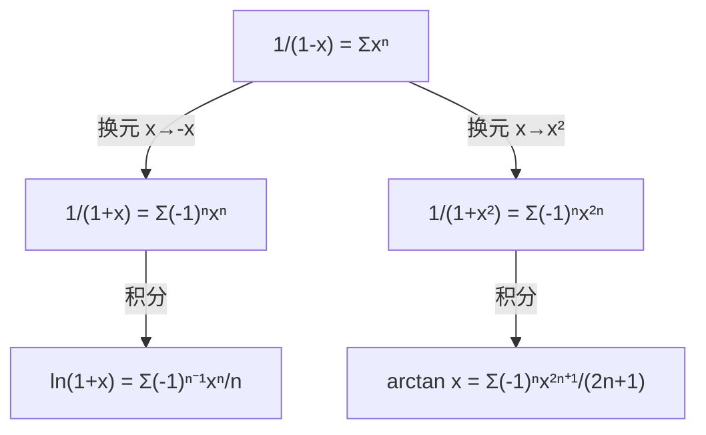
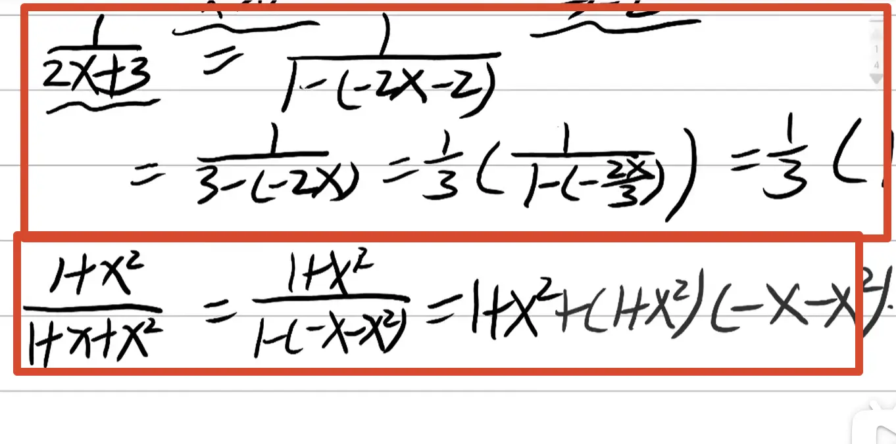

## 泰勒展开 ↔ 等比数列 · 考研数一核心笔记

> **核心结论**：$\dfrac{1}{1-x}$ 的泰勒展开，就是无穷等比数列求和。这是两者最重要的连接点——有理分式、$\ln(1+x)$、$\arctan x$ 的泰勒公式，**全部可以从无穷等比级数通过换元、求导、积分得到**，无需逐阶求导。


### 1. 核心桥梁：无穷等比级数

#### 1.1 有限项等比数列求和

$$
1 + x + x^2 + \dots + x^n = \frac{1 - x^{n+1}}{1 - x} \quad (x \ne 1)
$$

#### 1.2 无穷等比级数（$|x| < 1$）

当 $|x| < 1$ 时，$n \to \infty$ 有 $x^{n+1} \to 0$，因此：

$$
\boxed{\frac{1}{1-x} = 1 + x + x^2 + x^3 + \dots = \sum_{n=0}^{\infty} x^n, \quad |x| < 1}
$$

> 这恰好就是 $f(x) = \dfrac{1}{1-x}$ 在 $x_0 = 0$ 处的**麦克劳林（泰勒）展开**。

#### 1.3 图像验证

```desmos-graph
left=-1; right=1
bottom=0; top=4
grid=true
---
y=1/(1-x)|blue
y=1+x+x^2+x^3+x^4|red
(0.5,2)|label:y=1/(1-x)
(0.5,1.9375)|label:5项近似
```

> 在 $x=0$ 附近，5 项近似与真实函数几乎重合；$x$ 越接近 $0$，误差越小。


### 2. 由此批量推导泰勒公式

#### 2.1 例1：$\dfrac{1}{1+x}$

把核心公式中的 $x$ 替换为 $-x$（$|-x| < 1 \Rightarrow |x| < 1$）：

$$
\boxed{\frac{1}{1+x} = \frac{1}{1-(-x)} = 1 - x + x^2 - x^3 + x^4 - \cdots = \sum_{n=0}^{\infty} (-1)^n x^n}
$$

> **无需逐阶求导**，直接换元即得。

#### 2.2 例2：$\ln(1+x)$

对 $\dfrac{1}{1+x} = 1 - x + x^2 - x^3 + \cdots$ 两边同时积分：

$$
\int_0^x \frac{1}{1+t} \, \mathrm{d}t = \int_0^x (1 - t + t^2 - t^3 + \cdots) \, \mathrm{d}t
$$

**左边**：
$$
\int_0^x \frac{1}{1+t} \, \mathrm{d}t = \ln(1+x)
$$

**右边逐项积分**：
$$
\ln(1+x) = x - \frac{x^2}{2} + \frac{x^3}{3} - \frac{x^4}{4} + \cdots = \sum_{n=1}^{\infty} (-1)^{n-1} \frac{x^n}{n}
$$

$$
\boxed{\ln(1+x) = x - \frac{x^2}{2} + \frac{x^3}{3} - \frac{x^4}{4} + \cdots, \quad -1 < x \le 1}
$$

> ✅ 考研必背的 $\ln(1+x)$ 泰勒，来源就是**无穷等比数列 + 积分**。

#### 2.3 例3：$\arctan x$

由核心公式替换 $x \to x^2$（$|x^2| < 1 \Rightarrow |x| < 1$）：

$$
\frac{1}{1+x^2} = 1 - x^2 + x^4 - x^6 + \cdots
$$

两边同时积分：

$$
\arctan x = \int_0^x \frac{1}{1+t^2} \, \mathrm{d}t = x - \frac{x^3}{3} + \frac{x^5}{5} - \frac{x^7}{7} + \cdots
$$

$$
\boxed{\arctan x = x - \frac{x^3}{3} + \frac{x^5}{5} - \frac{x^7}{7} + \cdots = \sum_{n=0}^{\infty} (-1)^n \frac{x^{2n+1}}{2n+1}}
$$

> 又是一条必背麦克劳林公式，源头仍是 $\dfrac{1}{1-x}$ 的无穷等比级数。

#### 2.4 例4：$\dfrac{1}{1+x^2}$（补充）

$$
\frac{1}{1+x^2} = 1 - x^2 + x^4 - x^6 + \cdots = \sum_{n=0}^{\infty} (-1)^n x^{2n}, \quad |x| < 1
$$

> 这是 $\arctan x$ 求导的来源，本质仍是等比级数换元。


### 3. $e^x$、$\sin x$、$\cos x$ 能用等比数列推吗？

**不能。**

| 函数 | 泰勒来源 | 是否可由等比推导 |
|------|----------|-----------------|
| $\dfrac{1}{1-x}$ | 无穷等比级数 | ✅ 本身即是 |
| $\dfrac{1}{1+x}$ | 等比级数换元 $x \to -x$ | ✅ |
| $\ln(1+x)$ | $\dfrac{1}{1+x}$ 积分 | ✅ |
| $\arctan x$ | $\dfrac{1}{1+x^2}$ 积分 | ✅ |
| $\dfrac{1}{1+x^2}$ | 等比级数换元 $x \to x^2$ | ✅ |
| $e^x$ | 高阶导数 / 微分方程 | ❌ 不属于等比级数 |
| $\sin x$ | 高阶导数 / 微分方程 | ❌ |
| $\cos x$ | 高阶导数 / 微分方程 | ❌ |

> $e^x$、$\sin x$、$\cos x$ 的泰勒展开由**高阶求导**得到，与等比级数无关。它们的系数含阶乘 $n!$，而等比级数的系数是常数 $1$，结构完全不同。


### 4. 总结分类

#### 4.1 可由无穷等比数列推导的函数

**起点**：$\dfrac{1}{1-x} = \sum_{n=0}^{\infty} x^n$（$|x| < 1$）

**变换路径**：



| 函数 | 操作 | 结果 |
|------|------|------|
| $\dfrac{1}{1-x}$ | 直接等比求和 | $\sum x^n$ |
| $\dfrac{1}{1+x}$ | 换元 $x \to -x$ | $\sum (-1)^n x^n$ |
| $\dfrac{1}{1+x^2}$ | 换元 $x \to x^2$ | $\sum (-1)^n x^{2n}$ |
| $\ln(1+x)$ | $\dfrac{1}{1+x}$ 积分 | $\sum (-1)^{n-1} x^n / n$ |
| $\arctan x$ | $\dfrac{1}{1+x^2}$ 积分 | $\sum (-1)^n x^{2n+1} / (2n+1)$ |

#### 4.2 不能由等比数列推导的函数

| 函数 | 泰勒展开 | 来源 |
|------|----------|------|
| $e^x$ | $\sum x^n / n!$ | 高阶导数（$f^{(n)}(0) = 1$） |
| $\sin x$ | $\sum (-1)^n x^{2n+1} / (2n+1)!$ | 高阶导数 |
| $\cos x$ | $\sum (-1)^n x^{2n} / (2n)!$ | 高阶导数 |

> **关键区别**：这三者的系数含**阶乘**，不是等比级数的常数系数，因此无法由 $\dfrac{1}{1-x}$ 通过换元/求导/积分得到。


### 5. 关键区别

| 对比项 | 等比数列 | 泰勒级数 |
|--------|----------|----------|
| **对象** | 离散数列求和 | 函数展开为幂级数 |
| **系数** | 常数（公比 $q$） | 可以是阶乘、分数等 |
| **收敛性** | $|q| < 1$ 时收敛 | 取决于函数和展开点 |
| **关系** | 部分函数的泰勒级数**恰好是**无穷等比级数 | 泰勒级数是更一般的概念 |


### 6. 考研应用：用等比级数思想求极限

> [!example] 典型例题
>
> 求 $\displaystyle \lim_{x \to 0} \frac{\dfrac{1}{1-x} - 1 - x - x^2}{x^3}$
>
> **解**：利用等比级数展开：
> $$
> \frac{1}{1-x} = 1 + x + x^2 + x^3 + x^4 + \cdots
> $$
> 因此：
> $$
> \frac{1}{1-x} - 1 - x - x^2 = x^3 + x^4 + x^5 + \cdots = x^3(1 + x + x^2 + \cdots)
> $$
> 原极限：
> $$
> \lim_{x \to 0} \frac{x^3(1 + x + x^2 + \cdots)}{x^3} = \lim_{x \to 0} (1 + x + x^2 + \cdots) = 1
> $$


### 7. 核心公式速查卡

| 公式 | 收敛域 |
|------|--------|
| $\dfrac{1}{1-x} = \sum_{n=0}^{\infty} x^n$ | $\|x\| < 1$ |
| $\dfrac{1}{1+x} = \sum_{n=0}^{\infty} (-1)^n x^n$ | $\|x\| < 1$ |
| $\dfrac{1}{1+x^2} = \sum_{n=0}^{\infty} (-1)^n x^{2n}$ | $\|x\| < 1$ |
| $\ln(1+x) = \sum_{n=1}^{\infty} (-1)^{n-1} \dfrac{x^n}{n}$ | $-1 < x \le 1$ |
| $\arctan x = \sum_{n=0}^{\infty} (-1)^n \dfrac{x^{2n+1}}{2n+1}$ | $\|x\| \le 1$ |


### Obsidian 双向链接建议

- `[[泰勒展开]]`：泰勒公式的一般理论
- `[[等价无穷小]]`：等价无穷小与泰勒展开的关系
- `[[数列]]`：等比数列的求和公式
- `[[级数]]`：无穷级数的收敛性
- `[[洛必达法则]]`：对比用洛必达法则求极限

---

如需我继续展开 **“用等比级数思想做泰勒求极限的例题集”** 或 **“泰勒展开的收敛域与余项分析”** ，随时告诉我。

