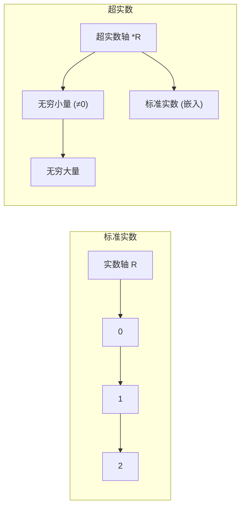

## 超实数 · 考研数一核心笔记

> 超实数（Hyperreal Number）是**非标准分析**（Non-standard Analysis）的核心概念，它将实数系 $\mathbb{R}$ 扩展为包含**无穷小量**和**无穷大量**的数系。考研数一不直接考超实数理论，但理解超实数有助于**深刻理解极限的 $\epsilon-\delta$ 定义**，以及 $\lim_{x\to0}\frac{\sin x}{x}=1$ 等核心结论的本质。在408中，超实数的思想可用于理解**渐进复杂度**中的“忽略低阶项”；在英语一中，`infinitesimal`、`infinite` 等词在科技类阅读中偶有出现。


### 1. 实数系的阿基米德性质

**阿基米德公理**（实数系 $\mathbb{R}$ 的基本性质）：

> 若对任意大的自然数 $n$，均有 $|x| < \dfrac{1}{n}$，则 $x = 0$。

**含义**：
- 实数系中**不存在非零的无穷小量**
- 任何非零实数，无论多小，总能找到一个自然数 $n$，使得 $\frac{1}{n} < |x|$（即任何非零实数都比某个 $\frac{1}{n}$ 大）
- 这是实数系与超实数系的**本质区别**

> 阿基米德性质保证了实数系的“连续性”，但也意味着在标准实数系中，我们只能用 $\epsilon-\delta$ 语言“逼近”无穷小，而不能直接处理它。


### 2. 非零无穷小量与无穷大量

#### 2.1 非零无穷小量

**定义**：若 $x^*$ 满足：
- $x^* \ne 0$
- 对任意大的自然数 $n$，均有 $|x^*| < \dfrac{1}{n}$

则称 $x^*$ 为**非零无穷小量**。

> 在超实数系中，$x^*$ 是一个**比任何正实数都小但不为零**的数。在标准实数系中，这样的数不存在（由阿基米德性质保证）。

#### 2.2 无穷大量

**定义**：若非零无穷小量 $x^*$ 的倒数 $\dfrac{1}{x^*}$，称为**无穷大量**。

即：若 $x^*$ 为非零无穷小量，则 $M = \dfrac{1}{x^*}$ 为无穷大量。

**性质**：
- $\left|\dfrac{1}{x^*}\right|$ 比任何正实数都大
- 无穷大量可以是正的或负的（取决于 $x^*$ 的符号）

#### 2.3 标准部（Standard Part）

对任意有限超实数 $x$，存在唯一的实数 $x_0$ 和一个无穷小量 $x^*$，使得：

$$
x = x_0 + x^*
$$

称 $x_0$ 为 $x$ 的**标准部**，记作 $\operatorname{st}(x) = x_0$。

> 标准部是连接超实数与标准实数的桥梁，也是超实数理论中**求极限的本质**。


### 3. 超实数的定义

**超实数**：将实数系 $\mathbb{R}$ 扩展，加入所有非零无穷小量和无穷大量后得到的数系。

#### 3.1 超实数的分类

设 $x_0$ 为任一实数，$x^*$ 为非零无穷小量：

| 类型 | 形式 | 说明 |
|------|------|------|
| **有限超实数** | $x = x_0 + x^*$ | 实数 + 无穷小量，与 $x_0$ 无限接近 |
| **无穷超实数（无穷大量）** | $x = x_0 + \dfrac{1}{x^*}$ | 实数 + 无穷大量，绝对值比任何实数都大 |

> 标准实数可以看作超实数的特殊情形（无穷小量部分为 0）。

#### 3.2 超实数的直观理解




### 4. 超实数在极限中的应用

#### 4.1 用超实数重新理解极限

**标准定义**（$\epsilon-\delta$）：$\lim_{x \to a} f(x) = L \iff \forall \epsilon > 0, \exists \delta > 0$，使得 $0 < |x-a| < \delta \Rightarrow |f(x)-L| < \epsilon$。

**超实数等价定义**：

$$
\boxed{\lim_{x \to a} f(x) = L \iff \operatorname{st}(f(a + x^*)) = L}
$$

其中 $x^*$ 为任意非零无穷小量。

> 即：**$x$ 无限接近 $a$ 时，$f(x)$ 的标准部等于 $L$**。这比 $\epsilon-\delta$ 语言更直观——“无限逼近”的几何直觉被形式化。

#### 4.2 重要极限 $\lim_{x \to 0} \frac{\sin x}{x} = 1$ 的超实数解释

在超实数系中，取 $x = x^*$（非零无穷小量）：

$$
\operatorname{st}\left(\frac{\sin x^*}{x^*}\right) = 1
$$

即：当 $x$ 为无穷小量时，$\frac{\sin x}{x}$ 的标准部等于 1。换句话说，$\frac{\sin x}{x}$ 与 $1$ 的差是一个无穷小量。

$$
\frac{\sin x}{x} = 1 + o(1)
$$

#### 4.3 导数的超实数定义

$$
\boxed{f'(x) = \operatorname{st}\left(\frac{f(x + x^*) - f(x)}{x^*}\right)}
$$

其中 $x^*$ 为非零无穷小量。

> 这正是莱布尼茨当年使用“无穷小量”定义导数的现代形式——**$f'(x)$ 是差商的标准部**。标准分析中用极限 $\lim_{\Delta x \to 0}$ 来表述，本质上是将“无穷小量”的概念用 $\epsilon-\delta$ 语言重新包装。

#### 4.4 函数连续的超实数定义

函数 $f(x)$ 在 $x_0$ 处连续 $\iff$ 对任意无穷小量 $x^*$，有：

$$
\operatorname{st}(f(x_0 + x^*)) = f(x_0)
$$

即：$x$ 无限接近 $x_0$ 时，$f(x)$ 无限接近 $f(x_0)$。


### 5. 超实数与原实数在极限运算中的应用对比

| 运算 | 标准实数（$\epsilon-\delta$） | 超实数（标准部） |
|------|------------------------------|------------------|
| 极限 | $\lim_{x\to a} f(x) = L$ | $\operatorname{st}(f(a+x^*)) = L$ |
| 导数 | $\lim_{\Delta x \to 0} \frac{f(x+\Delta x)-f(x)}{\Delta x}$ | $\operatorname{st}\left(\frac{f(x+x^*)-f(x)}{x^*}\right)$ |
| 连续性 | $\lim_{x\to x_0} f(x) = f(x_0)$ | $\operatorname{st}(f(x_0+x^*)) = f(x_0)$ |

> **核心区别**：标准分析用“极限”作为桥梁间接处理无穷小量；非标准分析将无穷小量直接作为数引入，用“标准部”提取有限结果。

#### 5.1 超实数处理无穷大的优势

在标准分析中，“$\infty$”只是一个记号，不能参与运算。在超实数中，无穷大量 $\omega = 1/x^*$ 是**合法数字**，可以参与四则运算，只要最后取标准部即可得到标准实数结果。

```desmos-graph
left=0; right=5
bottom=0; top=3
grid=true
---
y=1/x|blue
(0.5,2)|label:y=1/x
(1,1)|label:过(1,1)
```


### 6. 408 关联：超实数与算法分析

| 方向 | 关联内容 |
|------|----------|
| **渐进复杂度** | 算法分析中的“忽略低阶项”本质上是在**超实数意义下取标准部**。如 $T(n) = 2n^2 + 3n + 1 \sim 2n^2$，低阶项在无穷大量 $n$ 下可忽略 |
| **无穷小量类比** | 算法中的 $o(1)$（误差项）可类比为超实数中的无穷小量 |
| **极限与复杂度** | 比较算法复杂度时，$\lim_{n\to\infty} \frac{f(n)}{g(n)}$ 的结论可理解为**在无穷大量 $n$ 下比较两个函数的标准部** |
| **均摊分析** | 均摊复杂度的“忽略常数因子”与无穷小量的“取标准部”思想同源 |


### 7. 英一关联

| 英文 | 中文 | 常考语境 |
|------|------|----------|
| infinitesimal | 无穷小量 | 科技文中的“极其微小” |
| infinite | 无限的 | "infinite series" 无穷级数 |
| hyperreal | 超实数 | — |
| standard part | 标准部 | — |
| approximation | 近似 | "linear approximation" 线性近似 |


### 8. 核心公式速查卡

| 概念 | 公式 |
|------|------|
| 实数阿基米德性质 | $\forall x \ne 0, \exists n \in \mathbb{N}, \frac{1}{n} < |x|$ |
| 非零无穷小量定义 | $x^* \ne 0$，$\forall n \in \mathbb{N}, |x^*| < \frac{1}{n}$ |
| 无穷大量 | $M = \dfrac{1}{x^*}$ |
| 有限超实数 | $x = x_0 + x^*$ |
| 极限的超实数定义 | $\lim_{x\to a} f(x) = L \iff \operatorname{st}(f(a+x^*)) = L$ |
| 导数的超实数定义 | $f'(x) = \operatorname{st}\left(\dfrac{f(x+x^*) - f(x)}{x^*}\right)$ |


### Obsidian 双向链接建议

- `[[极限的定义与性质]]`：$\epsilon-\delta$ 定义与超实数定义的等价性
- `[[无穷小量与无穷大量]]`：标准分析中的无穷小量
- `[[导数与微分]]`：导数的超实数定义
- `[[算法效率的度量]]`：渐进复杂度中的“忽略低阶项”
- `[[洛必达法则]]`：洛必达法则与无穷小量比阶

---

超实数**不直接作为考研考点**，但它为“极限是什么”这个核心问题提供了**更直观、更接近牛顿-莱布尼茨原始思想的解释**。掌握超实数的基本框架，有助于在考场上快速判断极限的存在性，并理解等价无穷小替换、洛必达法则的深层逻辑。

如需我继续展开 **“非标准分析中的微积分”** 或 **“超实数在物理中的应用”** ，随时告诉我。