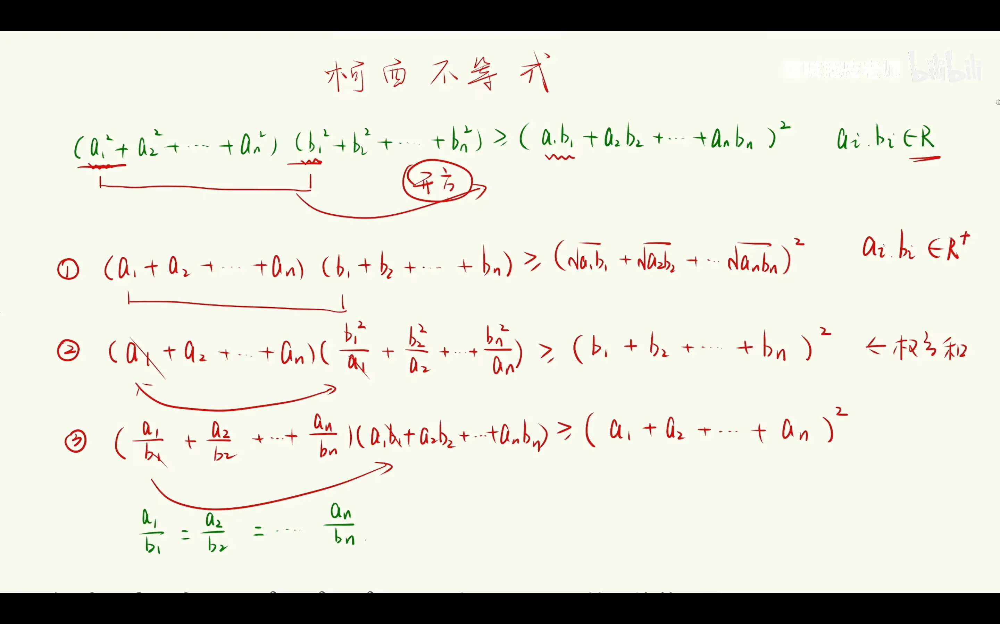
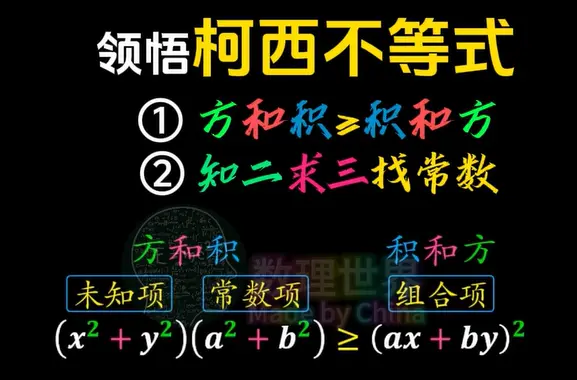
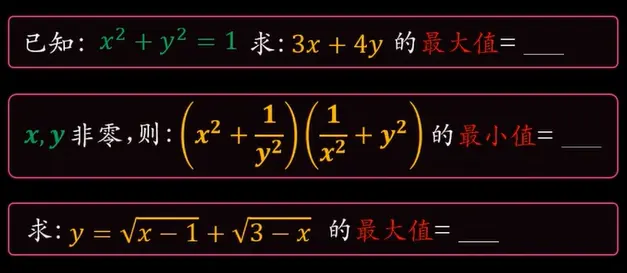

   ## 推广变形

## 🎯 柯西不等式：从口诀到实战

你的核心观察完全正确：柯西不等式本质上就是在描述两组数的“方和积”与“积和方”之间的大小关系。

#### 1. 核心公式与口诀释义

**基本形式（二维）**：对于任意实数 $a, b, c, d$，有
$$(a^2 + b^2)(c^2 + d^2) \ge (ac + bd)^2$$
当且仅当 $ad = bc$ 时取等号。

*   ==**“方和积 ≥ 积和方”**==：左边是“方”与“和”的乘积，右边是“积”的“和”的平方。口诀帮你快速记住不等号的方向：**左边（大方） ≥ 右边（小方）**。
*   ==**“知二求三找常数”**==：这是解题的钥匙。“知二”指题目通常会给出左边两项“方和积”中的一个，或右边“积和方”的值；“求三”就是让你求另一个。核心在于，通过这个“常数”，将已知和未知两部分“组合”起来。你笔记中的题1就是典型：已知“方和”为1，求“积和”的最大值。

#### 2. 三个维度的应用升级（真题视角）

从考研数学的角度看，柯西不等式的应用可以分为三个层次：

*   **层次一：直接套用**。这是最基 础的考法，像你笔记中的题1和题3。解题的关键是**凑配系数**，让待求的表达式能完美匹配柯西不等式的“积和”部分。例如题1，直接将 $(3,4)$ 作为第二组数的“方和”部分： $$(x^2+y^2)(3^2+4^2) \ge (3x+4y)^2$$答案瞬间清晰。
*   **层次二：灵活变形**。当式子没那么标准时，需要先进行“改造”。比如你笔记中的题2：$(x^2 + \frac{1}{y^2})(\frac{1}{x^2} + y^2) \ge (x\cdot\frac{1}{x} + \frac{1}{y}\cdot y)^2 = (1+1)^2 = 4$。这种方法常用来求分式或带约束条件的最值。
*   **层次三：积分形式（数一专属）**。这是数一拉开差距的考点，形式为：
    $$(\int_a^b f^2(x) dx)(\int_a^b g^2(x) dx) \ge (\int_a^b f(x)g(x) dx)^2$$
    处理方法和离散形式完全一致：**左边是“方”的积分乘“方”的积分，右边是“乘积”的积分的平方**。你同样可以用“知二求三找常数”的思路来解题。

### ✍️ 你的笔记题目详解

应用上面的思路，我们来完整解一下你笔记中的三道题，作为总结的实战检验。

1.  **题1**：已知 $x^2 + y^2 = 1$，求 $3x + 4y$ 的最大值。
    **解**：由柯西不等式 $(x^2+y^2)(3^2+4^2) \ge (3x+4y)^2$，即 $1 \times 25 \ge (3x+4y)^2$，所以 $-5 \le 3x+4y \le 5$。**最大值为 5**。

2.  **题2**：$x, y$ 非零，求 $(x^2 + \frac{1}{y^2})(\frac{1}{x^2} + y^2)$ 的最小值。
    **解**：直接套用柯西不等式：
    $$\left(x^2 + \frac{1}{y^2}\right)\left(\frac{1}{x^2} + y^2\right) \ge \left(x\cdot\frac{1}{x} + \frac{1}{y}\cdot y\right)^2 = (1+1)^2 = 4$$
    当且仅当 $x \cdot y = \frac{1}{y} \cdot \frac{1}{x}$，即 $x^2y^2=1$ 时取等。**最小值为 4**。

3.  **题3**：求 $y = \sqrt{x-1} + \sqrt{3-x}$ 的最大值。
    **解**：先确定定义域 $x \in [1, 3]$。将函数视为向量 $(\sqrt{x-1}, \sqrt{3-x})$ 与 $(1, 1)$ 的点积：
    $$(\sqrt{x-1} + \sqrt{3-x})^2 \le [(x-1)+(3-x)](1^2+1^2) = 2 \times 2 = 4$$
    所以 $y \le 2$，当且仅当 $\sqrt{x-1} = \sqrt{3-x}$，即 $x=2$ 时取等。**最大值为 2**。

### 💎 总结

柯西不等式是“构造”的艺术。当遇到**带平方和约束**或**带根号/分式的表达式**时，可以尝试向它的形式靠拢。**核心是识别出两组数，将待求式转化为“积和方”**，然后利用已知的“方和积”来求出范围。

你的口诀“方和积 ≥ 积和方，知二求三找常数”非常有效，熟练后可以大大加快解题速度。如果对数一专有的积分形式或其他变形有疑问，随时可以再来讨论。