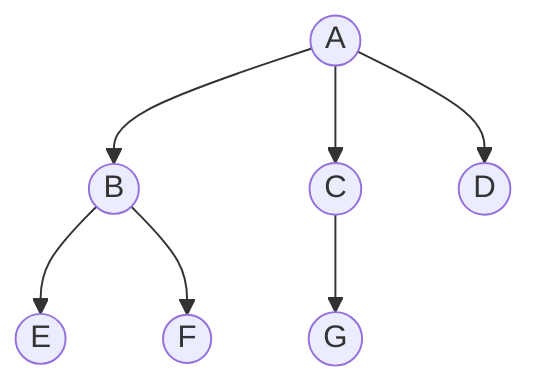

## 树的定义和基本术语

> 树是 $n$（$n \ge 0$）个结点的有限集合，其定义是**递归**的。掌握基本术语是理解后续遍历、存储结构的前提。

### 树的定义

**树**是 $n$（$n \ge 0$）个结点的有限集合。当 $n=0$ 时称为**空树**；当 $n>0$ 时：
- 有且仅有一个**根结点**
- 其余结点可分为 $m$（$m \ge 0$）个互不相交的有限集合，每个集合本身又是一棵树，称为根的**子树**

> 树的定义是**递归**的：树由根和若干子树构成，子树又由根和更小的子树构成。

### 基本术语

| 术语       | 含义                         |
| -------- | -------------------------- |
| **结点**   | 树中的一个元素                    |
| **结点的度** | 结点拥有的子树个数                  |
| **树的度**  | 树中所有结点的度的最大值               |
| **叶子结点** | 度为 $0$ 的结点（终端结点）           |
| **分支结点** | 度不为 $0$ 的结点（非终端结点）         |
| **孩子**   | 结点的子树的根                    |
| **双亲**   | 结点的上层结点                    |
| **兄弟**   | 同一双亲的结点                    |
| **祖先**   | 从根到该结点路径上的所有结点             |
| **子孙**   | 以某结点为根的子树中的所有结点            |
| **层次**   | 根为第 $1$ 层，其孩子为第 $2$ 层，依次类推 |
| **深度**   | 树中结点的最大层次（从上往下数）           |
| **高度**   | 树中结点的最大层次（从下往上数，通常与深度相同）   |
| **有序树**  | 子树有左右次序之分                  |
| **无序树**  | 子树无次序之分                    |
| **森林**   | $m$（$m \ge 0$）棵互不相交的树的集合   |

### 408 常考点

| 考点 | 说明 |
|------|------|
| 树 vs 二叉树 | 二叉树**不是**树的特殊情形，二叉树的左右子树严格有序 |
| 森林定义 | $m \ge 0$ 棵互不相交的树的集合 |
| 度与层次 | 树的度 = 结点度的最大值；根为第 1 层 |

### 相关笔记

- [[树的性质]]：树的四大核心性质
- [[二叉树的定义和基本术语]]：二叉树与树的区别
- [[树的存储结构]]：树的三种存储方式