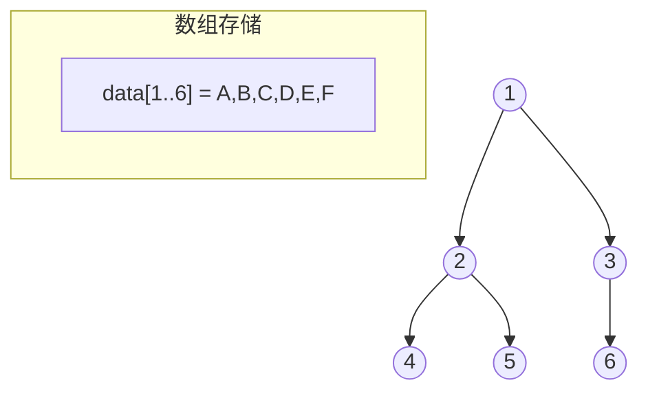
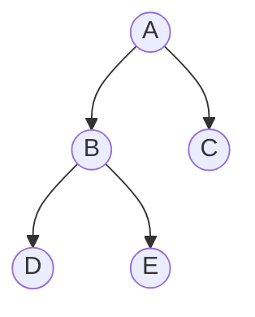
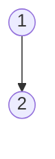

## 二叉树的存储结构

> 二叉树的存储结构分为**顺序存储**和**链式存储**。完全二叉树适合顺序存储，一般二叉树用二叉链表。

### 顺序存储结构

**定义**：用一组**连续存储单元**依次自上而下、自左至右存储完全二叉树的结点。

```cpp
#define MaxSize 100
typedef struct {
    ElemType data[MaxSize];   // 结点数据
    bool isEmpty[MaxSize];    // 标记结点是否为空
} SqTree;
```

**编号规则**（与完全二叉树一致）：

| 结点 | 编号 |
|------|------|
| 根结点 | $1$ |
| 结点 $i$ 的双亲 | $\lfloor i/2 \rfloor$ |
| 结点 $i$ 的左孩子 | $2i$ |
| 结点 $i$ 的右孩子 | $2i+1$ |



> [!important] 顺序存储的适用性
> - **完全二叉树**：顺序存储最合适，无空间浪费
> - **普通二叉树**：需用空标记补齐为完全二叉树，可能浪费大量空间
> - **最坏情况**（单支树）：高度为 $h$ 的二叉树需要 $2^h - 1$ 个存储单元，空间利用率极低

**示例**：单支二叉树（只有左孩子）用顺序存储：

```
     A
    /
   B
  /
 C

数组: [_, A, B, _, C, _, _, ...]  ← 大量空位
```

### 链式存储结构

**二叉链表**（最常用）：

```cpp
typedef struct BiTNode {
    ElemType data;                    // 数据域
    struct BiTNode *lchild, *rchild;  // 左、右孩子指针
} BiTNode, *BiTree;
```

**三叉链表**（增加双亲指针）：

```cpp
typedef struct TriTNode {
    ElemType data;
    struct TriTNode *lchild, *rchild, *parent;  // 增加 parent 指针
} TriTNode, *TriTree;
```



> [!note] $n$ 个结点的二叉链表
> 共有 $2n$ 个指针域，其中 $n-1$ 个用于指向孩子，**$n+1$ 个空指针**（这就是线索二叉树的基础）。

### 二叉树的基本操作：插入

**插入根结点**（初始化空树并建立根）:

```cpp
BiTree root = NULL;   // 定义一棵空树

// 分配根结点空间并初始化
root = (BiTree)malloc(sizeof(BiTNode));
root->data = 1;        // 根结点数据
root->lchild = NULL;   // 左孩子指针置空
root->rchild = NULL;   // 右孩子指针置空
```

**插入新结点**（作为某结点的左/右孩子）:

```cpp
// 分配新结点并初始化
BiTNode *p = (BiTNode*)malloc(sizeof(BiTNode));
p->data = 2;           // 新结点数据
p->lchild = NULL;
p->rchild = NULL;

// 将 p 挂为根结点的左孩子（修改指针即可, $O(1)$）
root->lchild = p;
// 若挂为右孩子: root->rchild = p;
```

对应结构变化：



> [!important] 插入操作的要点
> - 链式插入只需**修改指针**，时间复杂度为 $O(1)$，无需移动元素
> - 新结点插入时两个指针域**必须初始化为空**，否则会成为野指针
> - 若目标位置**已有孩子**，直接赋值会丢失原子树——需先把原子树记录下来或先处理（如将 p 挂为原子树的双亲实现"夹"入）
> - 配套操作还有删除结点（删除某左/右子树时，同样先保存再释放空间）

### 408 常考点

| 考点 | 说明 |
|------|------|
| 顺序存储适用性 | 完全二叉树最合适，单支树浪费严重 |
| 二叉链表的空指针数 | $n+1$ 个（$2n - (n-1)$） |
| 三叉链表 | 增加双亲指针，便于找双亲 |
| 链式插入结点 | 只需改指针，$O(1)$；新结点指针域必须置空 |

### 易错与易混点

| 易错判断 | 正确理解 |
|----------|----------|
| 二叉树的顺序存储总是省空间 | ❌ 只有完全二叉树省空间，普通二叉树浪费严重 |
| 二叉链表有 $2n$ 个空指针 | ❌ 有 $n+1$ 个空指针（$2n - (n-1)$） |

### 相关笔记

- [[二叉树的遍历]]：存储结构上的遍历操作
- [[二叉树的性质]]：顺序存储依赖编号性质
- [[线索二叉树的概念]]：利用二叉链表空指针存放线索
- [[树的存储结构]]：树的双亲/孩子/孩子兄弟表示法