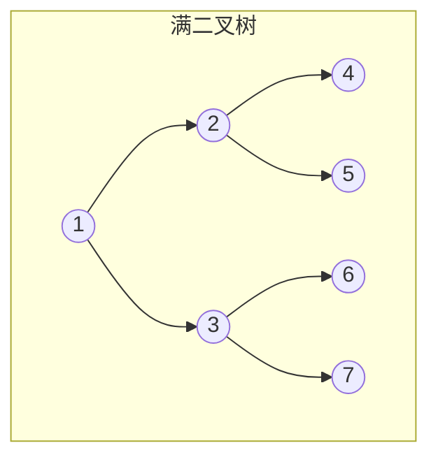
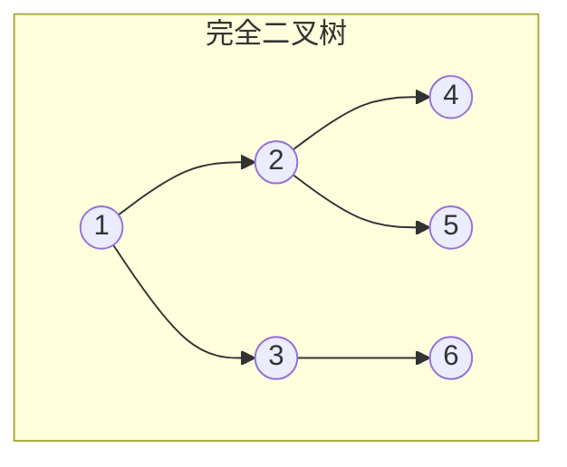

## 二叉树的定义和基本术语

> 二叉树是每个结点至多有两棵子树的树，且左右子树严格有序。注意：二叉树**不是**树的特殊情形。

### 二叉树的定义

**二叉树**是 $n$（$n \ge 0$）个结点的有限集合。当 $n=0$ 时为空二叉树；当 $n>0$ 时：
- 有且仅有一个根结点
- 其余结点分为两个互不相交的子集，分别称为**左子树**和**右子树**，且左右次序不能颠倒

> 二叉树**不是**树的特殊情形——二叉树的左右子树严格有序，而树的子树无序。

### 几种特殊二叉树
 
| 类型        | 定义                            |
| --------- | ----------------------------- |
| **满二叉树**  | 高度为 $h$，且含有 $2^h - 1$ 个结点的二叉树 |
| **完全二叉树** | 结点编号与同高度满二叉树完全对应（允许最后一层右侧缺结点） |
| **二叉排序树** | 左子树所有结点值 < 根 < 右子树所有结点值       |
| **平衡二叉树** | 任意结点左右子树高度差不超过 $1$            |

满二叉树示例：

完全二叉树示例：

### 408 常考点

| 考点            | 说明                      |
| ------------- | ----------------------- |
| 满二叉树 vs 完全二叉树 | 满二叉树一定是完全二叉树，反之不成立      |
| $m$ 叉树 vs 二叉树 | 二叉树不是 $m=2$ 的树，因为左右子树有序 |
| 完全二叉树的编号      | 与顺序存储、堆的实现直接相关          |

### 相关笔记

- [[二叉树的性质]]：结点数、高度等核心公式
- [[二叉树的存储结构]]：顺序存储依赖完全二叉树编号
- [[树的定义和基本术语]]：树与二叉树的区别