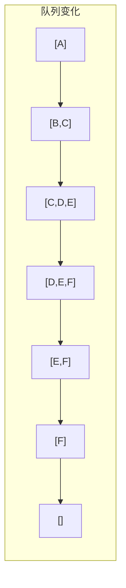
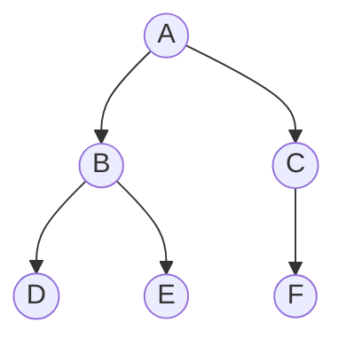

## 二叉树的遍历

> 遍历是二叉树一切操作的基础，也是 408 的**绝对高频考点**。包括深度优先（先序、中序、后序）、广度优先（层次遍历）以及由遍历序列构造二叉树。

### 遍历的定义

**遍历**：按某种次序访问二叉树中所有结点，且每个结点**仅访问一次**。

二叉树定义：
```cpp
typedef struct BiTNode {
    ElemType data;                    // 数据域
    struct BiTNode *lchild, *rchild;  // 左、右孩子指针
} BiTNode, *BiTree;
```

### 先序遍历（PreOrder）

**访问顺序**：根 → 左 → 右

```cpp
void PreOrder(BiTree T) {
    if (T != NULL) {
        visit(T);              // 访问根结点
        PreOrder(T->lchild);   // 递归遍历左子树
        PreOrder(T->rchild);   // 递归遍历右子树
    }
}
```

### 中序遍历（InOrder）

**访问顺序**：左 → 根 → 右

```cpp
void InOrder(BiTree T) {
    if (T != NULL) {
        InOrder(T->lchild);    // 递归遍历左子树
        visit(T);              // 访问根结点
        InOrder(T->rchild);    // 递归遍历右子树
    }
}
```

### 后序遍历（PostOrder）

**访问顺序**：左 → 右 → 根

```cpp
void PostOrder(BiTree T) {
    if (T != NULL) {
        PostOrder(T->lchild);  // 递归遍历左子树
        PostOrder(T->rchild);  // 递归遍历右子树
        visit(T);              // 访问根结点
    }
}
```

### 非递归遍历（用栈模拟）

> 以下代码均为**王道 408 标准写法**：用抽象操作 `InitStack` / `Push` / `Pop` / `GetTop` / `IsEmpty` 描述栈，不依赖具体语言实现（考试作答可写 STL `stack`，含义等价）。

**先序非递归**：

```cpp
void PreOrder2(BiTree T) {
    InitStack(S);                 // 初始化栈 S
    BiTree p = T;                 // p 为遍历指针
    while (p || !IsEmpty(S)) {    // 栈不空或 p 不空时循环
        if (p) {                  // 一路向左
            visit(p);             // 访问根结点（先序：入栈前访问）
            Push(S, p);           // 当前结点入栈
            p = p->lchild;        // 左孩子不空，一直向左走
        } else {                  // 出栈，转向出栈结点的右子树
            Pop(S, p);            // 栈顶元素出栈
            p = p->rchild;        // p 指向当前结点的右孩子
        }
    }
}
```

==**中序非递归**（408 高频）：==

```cpp
void InOrder2(BiTree T) {
    InitStack(S);                 // 初始化栈 S
    BiTree p = T;                 // p 为遍历指针
    while (p || !IsEmpty(S)) {    // 栈不空或 p 不空时循环
        if (p) {                  // 一路向左
            Push(S, p);           // 当前结点入栈
            p = p->lchild;        // 左孩子不空，一直向左走
        } else {                  // 出栈，并转向出栈结点的右子树
            Pop(S, p);            // 栈顶元素出栈
            visit(p);             // 访问出栈结点
            p = p->rchild;        // p 指向当前结点的右孩子
        }
    }
}
```

**后序非递归**（需标记右子树是否已访问）：

```cpp
void PostOrder2(BiTree T) {
    InitStack(S);
    BiTree p = T;
    BiTree r = NULL;              // r 记录最近访问的结点
    while (p || !IsEmpty(S)) {
        if (p) {                  // 一路向左，结点入栈
            Push(S, p);
            p = p->lchild;
        } else {                  // 栈顶结点无左孩子
            GetTop(S, p);         // 取栈顶结点（不出栈）
            if (p->rchild && p->rchild != r) {   // 右孩子存在且未被访问过
                p = p->rchild;    // 转向右子树
            } else {              // 右孩子为空或已访问
                Pop(S, p);
                visit(p);         // 访问该结点
                r = p;            // 记录刚访问过的结点
                p = NULL;         // 置空，防止重复入栈
            }
        }
    }
}
```

> [!tip] 三种非递归的对比
> - **先序**：入栈前访问（`visit` 在 `Push` 前）
> - **中序**：出栈时访问（`visit` 在 `Pop` 后）
> - **后序**：需要 `r` 指针记录最近访问的结点，区分"右子树未访问"和"右子树已访问"，因此**先序/中序**与**后序**的`if(p)`分支逻辑不同——这是最易写错的地方

> [!tip] 递归转非递归的核心
> 递归的本质是**系统栈**。非递归遍历就是**用显式栈模拟系统栈**，将递归调用过程手工管理。

### 层次遍历（LevelOrder）

**访问顺序**：按层从上到下、从左到右。

**核心工具**：**[[队列]]**（FIFO）——王道标准写法用抽象操作 `InitQueue` / `EnQueue` / `DeQueue` / `IsEmpty`：

```cpp
void LevelOrder(BiTree T) {
    InitQueue(Q);                 // 初始化辅助队列
    BiTree p;
    EnQueue(Q, T);                // 将根结点入队
    while (!IsEmpty(Q)) {         // 队列不空则循环
        DeQueue(Q, p);            // 队头结点出队
        visit(p);                 // 访问出队结点
        if (p->lchild != NULL)    // 左子树不空，则左子树根结点入队
            EnQueue(Q, p->lchild);
        if (p->rchild != NULL)    // 右子树不空，则右子树根结点入队
            EnQueue(Q, p->rchild);
    }
}
```

**执行过程演示**（对上图二叉树）：



**遍历序列**：A B C D E F

## 遍历的应用

### **求二叉树高度**：

```cpp
int TreeHeight(BiTree T) {
    if (T == NULL) return 0;
    int lh = TreeHeight(T->lchild);
    int rh = TreeHeight(T->rchild);
    return (lh > rh ? lh : rh) + 1;
}
```

### **求结点个数**：

```cpp
int CountNodes(BiTree T) {
    if (T == NULL) return 0;
    return 1 + CountNodes(T->lchild) + CountNodes(T->rchild);
}
```

### **求叶子结点个数**：

```cpp
int CountLeaves(BiTree T) {
    if (T == NULL) return 0;
    if (T->lchild == NULL && T->rchild == NULL) return 1;
    return CountLeaves(T->lchild) + CountLeaves(T->rchild);
}
```

### **复制二叉树**：

```cpp
BiTree CopyTree(BiTree T) {
    if (T == NULL) return NULL;
    BiTree newNode = (BiTree)malloc(sizeof(BiTNode));
    newNode->data = T->data;
    newNode->lchild = CopyTree(T->lchild);
    newNode->rchild = CopyTree(T->rchild);
    return newNode;
}
```

## 由遍历序列构造二叉树

### 核心结论

==必须有两种遍历顺序，且包含中序遍历，才能唯一确定二叉树==

| 已知序列组合  | 能否唯一确定二叉树 |
| ------- | --------- |
| 先序 + 中序 | ✅ 能       |
| 后序 + 中序 | ✅ 能       |
| 层次 + 中序 | ✅ 能       |
| 先序 + 后序 | ❌ 不能      |
| 先序 + 层次 | ❌ 不能      |

> [!important] 核心原理
> - **先序**的第一个结点一定是**根**
> - **后序**的最后一个结点一定是**根**
> - **中序**中，根左边的所有结点属于**左子树**，右边的所有结点属于**右子树**

### 先序 + 中序构造二叉树

**步骤**：
1. 先序序列的第一个结点为**根结点**
2. 在中序序列中找到该根结点，左边为**左子树中序**，右边为**右子树中序**
3. 根据左子树结点数，在先序序列中确定左子树先序和右子树先序
4. 递归处理左右子树

**示例**：
- 先序：`A B D E C F`
- 中序：`D B E A F C`

**构造过程**：

| 步骤 | 先序 | 中序 | 根 | 左子树 | 右子树 |
|:---:|------|------|:---:|--------|--------|
| 1 | A B D E C F | D B E A F C | A | D B E | F C |
| 2 | B D E | D B E | B | D | E |
| 3 | C F | F C | C | F | 空 |



**代码实现**：

```cpp
BiTree PreInCreate(int pre[], int in[], int l1, int h1, int l2, int h2) {
    if (l1 > h1) return NULL;
    
    BiTree root = (BiTree)malloc(sizeof(BiTNode));
    root->data = pre[l1];                  // 先序第一个为根
    
    int i;
    for (i = l2; in[i] != pre[l1]; i++);   // 在中序中找根的位置
    
    int leftLen = i - l2;                  // 左子树结点数
    root->lchild = PreInCreate(pre, in, l1+1, l1+leftLen, l2, i-1);
    root->rchild = PreInCreate(pre, in, l1+leftLen+1, h1, i+1, h2);
    
    return root;
}
```

### 后序 + 中序构造二叉树

**步骤**：
1. 后序序列的最后一个结点为**根结点**
2. 在中序序列中找到该根结点，划分左右子树
3. 根据左右子树结点数，在后序序列中划分
4. 递归处理

**示例**：
- 后序：`D E B F C A`
- 中序：`D B E A F C`

**构造结果**：与上例相同。

### 层次 + 中序构造二叉树

**思路**：层次序列的第一个结点为根，在中序中划分左右子树，再根据左右子树的结点集合，在层次序列中筛选出左右子树的层次序列，递归处理。

> [!tip] 408 考法
> 选择题常考"下列哪组序列可以唯一确定二叉树"或"根据给定序列画出二叉树"。**先序+后序不能唯一确定**是高频陷阱。

## 408 常考点

| 考点 | 说明 |
|------|------|
| 遍历序列互推 | 已知两种序列可唯一确定二叉树（必须有中序） |
| 先序/后序+中序 | 可唯一确定二叉树 |
| 先序+后序 | **不能**唯一确定二叉树 |
| 非递归遍历 | 用栈模拟，先序/中序/后序三种都要会 |
| 后序非递归 | 需 $r$ 指针标记右子树是否已访问 |
| 层次遍历 | 用队列实现 |
| 遍历与高度/结点数 | 递归遍历的典型应用 |

## 易错与易混点

| 易错判断 | 正确理解 |
|----------|----------|
| 先序+后序可以唯一确定二叉树 | ❌ 不能，必须含中序 |
| 层次遍历用栈实现 | ❌ 用**队列**，栈实现的是深度优先 |
| 中序非递归不需要栈 | ❌ 必须用栈保存回溯路径 |
| 后序遍历最后访问的一定是根 | ✅ 正确 |

## 相关笔记

- [[二叉树的存储结构]]：遍历建立在存储结构之上
- [[二叉树的定义和基本术语]]：二叉树的基本概念
- [[二叉树的线索化]]：中序线索化依赖中序遍历
- [[在线索二叉树中找前驱后继]]：线索加速遍历