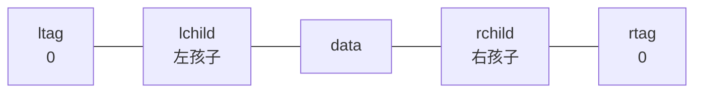
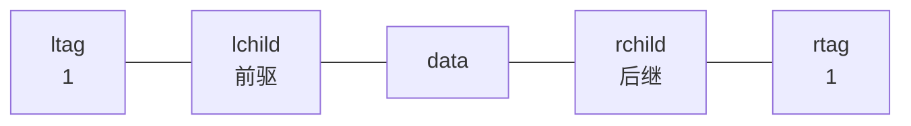

## 线索二叉树的概念

> 线索二叉树利用二叉链表中的**空指针**存放前驱后继信息，实现**不用栈的遍历**。

### 为什么需要线索二叉树？

在含 $n$ 个结点的二叉链表中，共有 $2n$ 个指针域，其中：
- $n-1$ 个用于指向孩子
- **$n+1$ 个空指针**

这些空指针浪费了空间。**线索二叉树**利用这些空指针，存放结点的**前驱**和**后继**信息。

### 定义

**线索**：指向前驱或后继的指针。
**线索化**：把二叉链表中的空指针改为线索的过程。

**结点结构**：

```cpp
typedef struct ThreadNode {
    ElemType data;
    struct ThreadNode *lchild, *rchild;
    int ltag, rtag;    // 左右标志位
} ThreadNode, *ThreadTree;
```

|  标志位   |  值  | 含义                 |
| :----: | :-: | ------------------ |
| `ltag` |  0  | `lchild` 指向**左孩子** |
| `ltag` |  1  | `lchild` 指向**前驱**  |
| `rtag` |  0  | `rchild` 指向**右孩子** |
| `rtag` |  1  | `rchild` 指向**后继**  |
普通节点：


线索节点：



### 三种线索二叉树

| 类型 | 线索化顺序 | 用途 |
|------|-----------|------|
| **先序线索二叉树** | 按先序遍历顺序 | 求先序前驱/后继 |
| **中序线索二叉树** | 按中序遍历顺序 | **最常用**，求中序前驱/后继 |
| **后序线索二叉树** | 按后序遍历顺序 | 求后序前驱/后继 |

### 408 常考点

| 考点 | 说明 |
|------|------|
| 线索二叉树结点结构 | `ltag`、`rtag` 的含义 |
| 线索的载体 | 利用原有**空指针**，不额外增加指针域 |

### 易错与易混点

| 易错判断 | 正确理解 |
|----------|----------|
| 线索二叉树就是给每个结点加两个指针 | ❌ 是利用原有的**空指针**存放线索 |
| `ltag=1` 表示指向孩子 | ❌ `ltag=1` 表示指向**前驱** |

### 相关笔记

- [[二叉树的线索化]]：如何把空指针改为线索
- [[二叉树的存储结构]]：$n+1$ 个空指针的来源
- [[在线索二叉树中找前驱后继]]：线索的具体使用