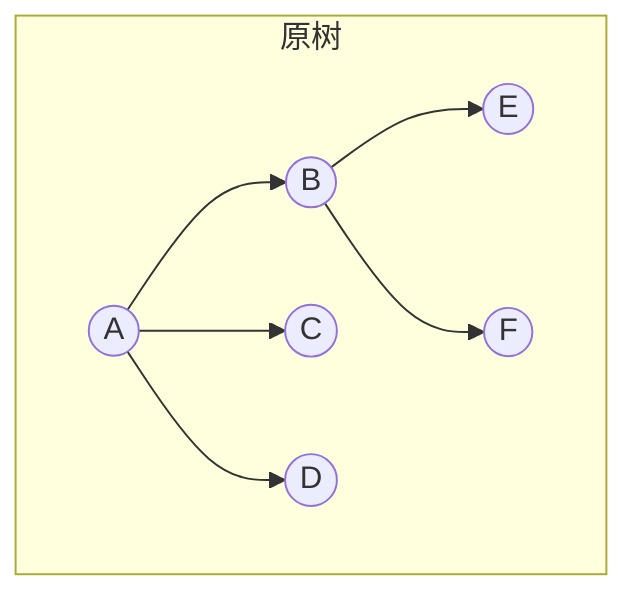
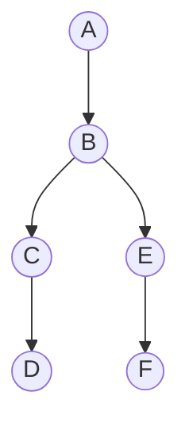
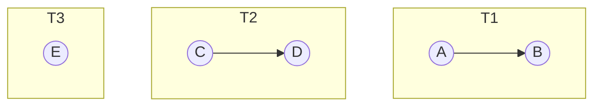
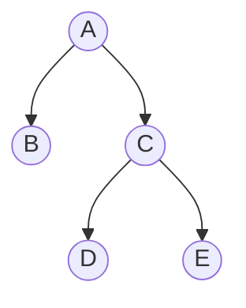

## 树、森林与二叉树的转换

> 转换核心基于**孩子兄弟表示法**，口诀是"左孩子，右兄弟"。

### 树 → 二叉树

**口诀**：**"左孩子，右兄弟"**

**步骤**：
1. 每个结点的**第一个孩子**作为左孩子
2. 每个结点的**下一个兄弟**作为右孩子

**示例**：

转换后：

> 验证：A 的左孩子是 B（A 的第一个孩子），B 的右孩子是 C（B 的下一个兄弟）。

### 森林 → 二叉树

**口诀**：**"先把每棵树转成二叉树，再以第一棵树的根为总根，依次将后一棵树作为前一棵树根的右孩子"**

**步骤**：
1. 将森林中每棵树分别转换为二叉树
2. 第一棵树的根作为最终二叉树的根
3. 后续每棵树的根作为前一棵树根的**右孩子**（即兄弟关系）

**示例**：三棵树 $T_1, T_2, T_3$ 组成的森林

转换后：

### 二叉树 → 树

**口诀**：**"左孩子，右兄弟"的逆操作**

**步骤**：
1. 二叉树的根即为树的根
2. 二叉树中某结点的**左孩子**即为树中该结点的**第一个孩子**
3. 二叉树中某结点的**右孩子**即为树中该结点的**下一个兄弟**

### 二叉树 → 森林

**判断**：若二叉树的根有右孩子，则对应**森林**；否则对应**一棵树**。

**步骤**：
1. 从根开始，沿**右链**断开，每条右链对应的子树构成一棵树
2. 每棵子树按"二叉树 → 树"的规则还原

### 转换关系总结

| 转换方向 | 核心规则 |
|----------|----------|
| 树 → 二叉树 | 左孩子，右兄弟 |
| 森林 → 二叉树 | 第一棵树根为总根，后续树根为前树根的右孩子 |
| 二叉树 → 树 | 左孩子是第一个孩子，右孩子是下一个兄弟 |
| 二叉树 → 森林 | 沿右链断开 |

### 408 常考点

| 考点 | 说明 |
|------|------|
| 树 → 二叉树 | 左孩子，右兄弟 |
| 森林 → 二叉树 | 第一棵树根为总根，后续树根为右孩子 |
| 二叉树 → 森林 | 沿右链断开 |

### 易错与易混点

| 易错判断 | 正确理解 |
|----------|----------|
| 二叉树 → 森林时所有二叉树都能转 | ❌ 只有根有右孩子的二叉树才对应森林 |

### 相关笔记

- [[树的存储结构]]：孩子兄弟表示法是转换基础
- [[树和森林的遍历]]：转换后遍历的对应关系