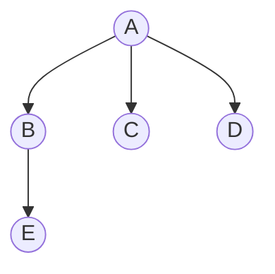

## 树和森林的遍历

> 树/森林的遍历通过与**对应二叉树**的遍历建立联系：先根↔先序，后根↔中序。

### 树的遍历

| 遍历方式 | 访问顺序 | 对应二叉树的遍历 |
|----------|----------|------------------|
| **先根遍历** | 根 → 依次遍历每棵子树 | **先序遍历** |
| **后根遍历** | 依次遍历每棵子树 → 根 | **中序遍历** |
| **层次遍历** | 按层从上到下 | 层次遍历 |

| 遍历方式 | 序列 |
|----------|------|
| 先根遍历 | A B E C D |
| 后根遍历 | E B C D A |

### 森林的遍历

| 遍历方式 | 定义 | 对应二叉树的遍历 |
|----------|------|------------------|
| **先序遍历** | 依次对每棵树进行先根遍历 | **先序遍历** |
| **中序遍历** | 依次对每棵树进行后根遍历 | **中序遍历** |

> [!important] 关键对应关系
> - 树的**先根遍历** = 对应二叉树的**先序遍历**
> - 树的**后根遍历** = 对应二叉树的**中序遍历**
> - 森林的**先序遍历** = 对应二叉树的**先序遍历**
> - 森林的**中序遍历** = 对应二叉树的**中序遍历**

### 遍历示例（森林）

**森林**：$T_1 = \{A, B\}$，$T_2 = \{C, D, E\}$

| 遍历方式 | 序列 |
|----------|------|
| 森林先序遍历 | A B C D E |
| 森林中序遍历 | B A D E C |

### 408 常考点

| 考点 | 说明 |
|------|------|
| 树/森林遍历对应关系 | 先根对应先序，后根对应中序 |

### 易错与易混点

| 易错判断 | 正确理解 |
|----------|----------|
| 树的后根遍历 = 二叉树的后序遍历 | ❌ 树的后根遍历 = 二叉树的**中序遍历** |
| 森林的先序遍历 = 二叉树的后序遍历 | ❌ 森林的先序遍历 = 二叉树的**先序遍历** |

### 相关笔记

- [[树、森林与二叉树的转换]]：遍历对应关系的前提是转换
- [[二叉树的遍历]]：对应二叉树的遍历算法