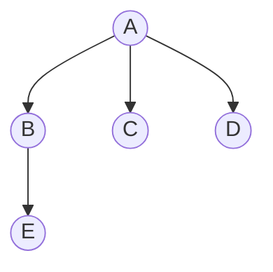
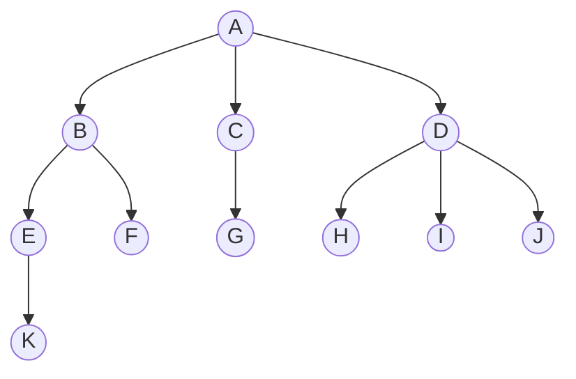
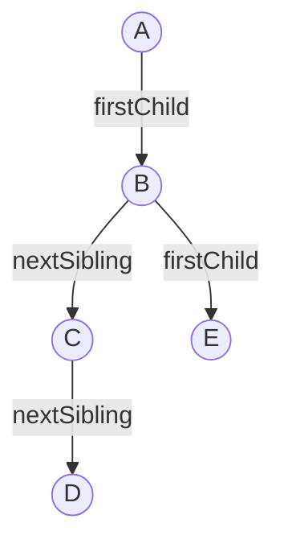
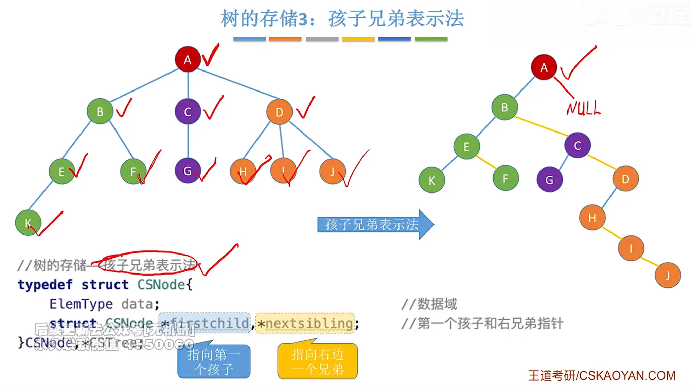

## 树的存储结构 · 考研408核心笔记

> 树的三种存储结构：**双亲表示法**、**孩子表示法**、**孩子兄弟表示法**。其中孩子兄弟表示法 = 二叉链表，是树与二叉树转换的桥梁。

---

### 一、双亲表示法

**思路**：用一组连续空间存储结点，每个结点附加一个**双亲下标**。

```cpp
#define MAX_TREE_SIZE 100
typedef struct {
    ElemType data;
    int parent;         // 双亲在数组中的下标
} PTNode;

typedef struct {
    PTNode nodes[MAX_TREE_SIZE];
    int n;              // 结点数
} PTree;
```

**示例**：



| 下标 | data | parent |
|:---:|:---:|:---:|
| 0 | A | $-1$ |
| 1 | B | 0 |
| 2 | C | 0 |
| 3 | D | 0 |
| 4 | E | 1 |

> [!tip] 特点
> - **找双亲** $O(1)$，**找孩子**需遍历 $O(n)$
> - 适合**频繁查找双亲**的场景（如并查集）

---

### 二、孩子表示法

**思路**：每个结点用一个链表存储其所有孩子。顺序表存储所有结点，每个结点含一个指向孩子链表的指针。

```cpp
typedef struct CTNode {
    int child;              // 孩子在数组中的下标
    struct CTNode *next;
} *ChildPtr;

typedef struct {
    ElemType data;
    ChildPtr firstChild;    // 指向第一个孩子的链表
} CTBox;

typedef struct {
    CTBox nodes[MAX_TREE_SIZE];
    int n;
} CTree;
```

#### 王道标准图示解析

下图展示了孩子表示法的典型存储结构（数组 + 孩子链表）：

```
下标  data   *firstChild
 0     A   ──→ [1] → [2] → [3] ∧
 1     B   ──→ [4] → [5] ∧
 2     C   ──→ [6] ∧
 3     D   ──→ [7] → [8] → [9] ∧
 4     E   ──→ [10] ∧
 5     F   ──→ ∧
 6     G   ──→ ∧
 7     H   ──→ ∧
 8     I   ──→ ∧
 9     J   ──→ ∧
10     K   ──→ ∧
```

**逐行解读**：

| 下标 | 结点 | 孩子链表 | 含义 |
|:---:|:---:|:---|:---|
| 0 | A | `1 → 2 → 3` | A 的孩子是下标 1, 2, 3（即 B, C, D） |
| 1 | B | `4 → 5` | B 的孩子是下标 4, 5（即 E, F） |
| 2 | C | `6` | C 的孩子是下标 6（即 G） |
| 3 | D | `7 → 8 → 9` | D 的孩子是下标 7, 8, 9（即 H, I, J） |
| 4 | E | `10` | E 的孩子是下标 10（即 K） |
| 5~10 | F~K | `∧`（空） | 均为叶子结点 |

**还原出的树形结构**：



> [!tip] 特点
> - **找孩子** $O(1)$（第一个孩子），找所有孩子需遍历链表，最坏 $O(n)$
> - **找双亲** 需遍历整个顺序表或所有孩子链表，$O(n)$
> - 适合**频繁查找孩子**的场景

---

### 三、孩子兄弟表示法（重点 ⭐）

**思路**：每个结点用两个指针，**左指针指向第一个孩子，右指针指向下一个兄弟**。

```cpp
typedef struct CSNode {
    ElemType data;
    struct CSNode *firstChild;   // 指向第一个孩子
    struct CSNode *nextSibling;  // 指向下一个兄弟
} CSNode, *CSTree;
```



> [!important] 核心地位
> **孩子兄弟表示法 = 二叉链表**。这是树与二叉树转换的**唯一桥梁**，也是 408 的绝对重点。



---

### 四、三种存储结构对比

| 存储方式        |  找双亲   |     找孩子     | 结点结构                                  | 典型应用    |
| ----------- | :----: | :---------: | ------------------------------------- | ------- |
| **双亲表示法**   | $O(1)$ |   $O(n)$    | `data` + `parent`                     | 并查集     |
| **孩子表示法**   | $O(n)$ | $O(1)$（第一个） | `data` + 孩子链表                         | 家谱系统    |
| **孩子兄弟表示法** | $O(n)$ | $O(1)$（第一个） | `data` + `firstChild` + `nextSibling` | 树↔二叉树转换 |

> [!warning] 孩子表示法 vs 孩子兄弟表示法（极易混淆）
>
> | 对比项 | 孩子表示法 | 孩子兄弟表示法 |
> |------|:---|:---|
> | **存储方式** | 顺序表 + 孩子链表 | 纯二叉链表 |
> | **结点结构** | `data` + `*firstChild` | `data` + `*firstChild` + `*nextSibling` |
> | **物理结构** | 数组（顺序存储）为主 | 二叉链表（链式存储）为主 |
> | **本质** | 多叉树存储结构 | **二叉链表**，树与二叉树转换的桥梁 |
> | **408考频** | 选择题偶尔考 | **绝对重点**，大题常考 |

---

### 五、408 常考点

| 考点 | 说明 |
|------|------|
| 孩子兄弟表示法 | 树与二叉树转换的桥梁 |
| 孩子兄弟表示法的结点结构 | `firstChild` 和 `nextSibling` |
| 双亲表示法找双亲 | $O(1)$，适合并查集 |
| 孩子表示法 | 每个结点用一个链表存孩子 |
| 三种方法找双亲/孩子的复杂度 | 双亲 $O(1)$，孩子 $O(n)$；孩子 $O(1)$，双亲 $O(n)$ |

---

### 六、易错与易混点

| 易错判断 | 正确理解 |
|----------|----------|
| 孩子兄弟表示法左指针指向下一个兄弟 | ❌ 左指针指向**第一个孩子**，右指针指向**下一个兄弟** |
| 树的存储结构必须用孩子兄弟表示法 | ❌ 还有双亲表示法、孩子表示法，但孩子兄弟法最通用 |
| 孩子表示法中找双亲是 $O(1)$ | ❌ 需遍历所有结点的孩子链表，$O(n)$ |
| 孩子兄弟表示法就是二叉树 | ❌ 结构上相同，但语义不同（一个是树的存储，一个是二叉树） |
| 双亲表示法找孩子是 $O(1)$ | ❌ 需遍历整个数组，$O(n)$ |

---

### 相关笔记

- [[树、森林与二叉树的转换]]：孩子兄弟法作为转换桥梁
- [[并查集]]：双亲表示法的典型应用
- [[二叉树的存储结构]]：孩子兄弟法在结构上就是二叉链表