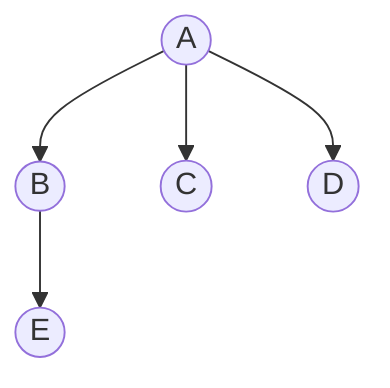
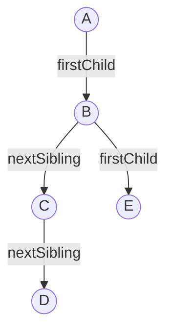

## 树的存储结构

> 树的三种存储结构：**双亲表示法**、**孩子表示法**、**孩子兄弟表示法**。其中孩子兄弟表示法 = 二叉链表，是树与二叉树转换的桥梁。

### 双亲表示法

**思路**：用一组连续空间存储结点，每个结点附加一个**双亲下标**。

```cpp
#define MAX_TREE_SIZE 100
typedef struct {
    ElemType data;
    int parent;         // 双亲在数组中的下标
} PTNode;

typedef struct {
    PTNode nodes[MAX_TREE_SIZE];
    int n;              // 结点数
} PTree;
```

**示例**：



| 下标 | data | parent |
|:---:|:---:|:---:|
| 0 | A | -1 |
| 1 | B | 0 |
| 2 | C | 0 |
| 3 | D | 0 |
| 4 | E | 1 |

> [!tip] 特点
> - **找双亲** $O(1)$，**找孩子**需遍历 $O(n)$
> - 适合**频繁查找双亲**的场景（如并查集）

### 孩子表示法

**思路**：每个结点用一个链表存储其所有孩子。

```cpp
typedef struct CTNode {
    int child;              // 孩子在数组中的下标
    struct CTNode *next;
} *ChildPtr;

typedef struct {
    ElemType data;
    ChildPtr firstChild;    // 指向第一个孩子的链表
} CTBox;

typedef struct {
    CTBox nodes[MAX_TREE_SIZE];
    int n;
} CTree;
```

> 找孩子 $O(1)$（第一个孩子），找双亲需遍历 $O(n)$。

### 孩子兄弟表示法（重点 ⭐）

**思路**：每个结点用两个指针，**左指针指向第一个孩子，右指针指向下一个兄弟**。

```cpp
typedef struct CSNode {
    ElemType data;
    struct CSNode *firstChild;   // 指向第一个孩子
    struct CSNode *nextSibling;  // 指向下一个兄弟
} CSNode, *CSTree;
```



> [!important] 核心地位
> **孩子兄弟表示法 = 二叉链表**。这是树与二叉树转换的**唯一桥梁**，也是 408 的绝对重点。

### 408 常考点

| 考点 | 说明 |
|------|------|
| 孩子兄弟表示法 | 树与二叉树转换的桥梁 |
| 孩子兄弟表示法的结点结构 | `firstChild` 和 `nextSibling` |
| 双亲表示法找双亲 | $O(1)$，适合并查集 |

### 易错与易混点

| 易错判断 | 正确理解 |
|----------|----------|
| 孩子兄弟表示法左指针指向下一个兄弟 | ❌ 左指针指向**第一个孩子**，右指针指向**下一个兄弟** |
| 树的存储结构必须用孩子兄弟表示法 | ❌ 还有双亲表示法、孩子表示法，但孩子兄弟法最通用 |

### 相关笔记

- [[树、森林与二叉树的转换]]：孩子兄弟法作为转换桥梁
- [[并查集]]：双亲表示法的典型应用
- [[二叉树的存储结构]]：孩子兄弟法在结构上就是二叉链表