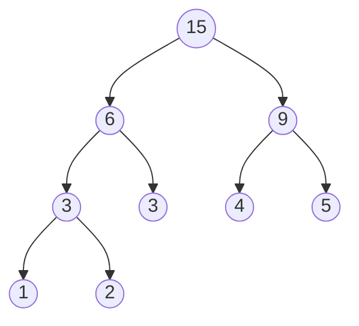
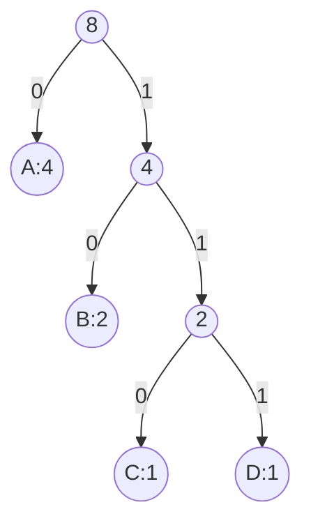

## 哈夫曼树

> 哈夫曼树（Huffman Tree）是**带权路径长度（WPL）最小**的二叉树，又称**最优二叉树**。它广泛应用于数据压缩（哈夫曼编码），是 408 树章节的**高频考点**，常考 WPL 计算、哈夫曼树构造及编码长度分析。

### 基本概念

#### 路径与路径长度

| 术语 | 定义 |
|------|------|
| **路径** | 从树中一个结点到另一个结点所经过的分支序列 |
| **路径长度** | 路径上分支的数目 |
| **结点的带权路径长度** | 从根到该结点的路径长度 × 该结点的权值 |
| **树的带权路径长度（WPL）** | 所有**叶子结点**的带权路径长度之和 |

$$
\text{WPL} = \sum_{i=1}^{n} w_i \cdot l_i
$$

其中 $w_i$ 为第 $i$ 个叶子结点的权值，$l_i$ 为该叶子结点到根的路径长度（边数）。

#### 哈夫曼树的定义

**哈夫曼树**：在含有 $n$ 个带权叶子结点的所有二叉树中，**WPL 最小**的二叉树。

> 又称**最优二叉树**。

### 哈夫曼树的构造

#### 构造算法（贪心策略）

**核心思想**：每次选取**权值最小的两个结点**合并。

**步骤**：
1. 将 $n$ 个权值看作 $n$ 棵单结点树，组成森林
2. 从森林中选出**根权值最小**的两棵树，合并为一棵新树，新树根的权值为两者之和
3. 将新树放回森林
4. 重复步骤 2~3，直到森林中只剩一棵树

#### 构造示例

**叶子权值**：$\{1, 2, 3, 4, 5\}$

**构造过程**：

| 步骤 | 操作 | 森林（权值） | 新结点权值 |
|:---:|------|-------------|:---:|
| 1 | 选 1、2 合并 | $\{3, 3, 4, 5\}$ | 3 |
| 2 | 选 3、3 合并 | $\{4, 5, 6\}$ | 6 |
| 3 | 选 4、5 合并 | $\{6, 9\}$ | 9 |
| 4 | 选 6、9 合并 | $\{15\}$ | 15 |

**最终哈夫曼树**：

**WPL 计算**：

| 叶子 | 权值 | 路径长度 | 带权路径长度 |
|:---:|:---:|:---:|:---:|
| 1 | 1 | 3 | 3 |
| 2 | 2 | 3 | 6 |
| 3 | 3 | 2 | 6 |
| 4 | 4 | 2 | 8 |
| 5 | 5 | 2 | 10 |

$$
\text{WPL} = 3 + 6 + 6 + 8 + 10 = 33
$$

> **快速验证**：WPL = 所有非叶子结点的权值之和（含根）
> $$
> 3 + 6 + 9 + 15 = 33
> $$
> 两者一致。

#### 哈夫曼树的特点

| 特点 | 说明 |
|------|------|
| **没有度为 1 的结点** | 每个非叶子结点都有两个孩子 |
| **$n$ 个叶子结点的哈夫曼树共有 $2n-1$ 个结点** | $n$ 个叶子 + $n-1$ 个非叶子 |
| **权值越大的叶子离根越近** | 贪心策略的自然结果 |
| **哈夫曼树不唯一** | 合并时左右孩子可交换，但 WPL 相同 |

### 哈夫曼编码

#### 编码背景

**问题**：如何用最少的二进制位表示一组字符？

| 编码方式 | 特点 | 问题 |
|----------|------|------|
| **等长编码** | 每个字符用相同位数 | 空间浪费 |
| **前缀编码** | 任一编码不是另一编码的前缀 | 无歧义解码 |
| **哈夫曼编码** | 根据频率构造最优前缀编码 | 最优 |

#### 构造哈夫曼编码

**步骤**：
1. 统计每个字符的出现频率（作为权值）
2. 构造哈夫曼树（频率为权值）
3. 左分支标记为 `0`，右分支标记为 `1`
4. 从根到叶子的路径即为该字符的编码

**示例**：字符频率 $\{A: 4, B: 2, C: 1, D: 1\}$

**构造过程**：

| 步骤 | 操作 | 森林 | 新结点 |
|:---:|------|------|:---:|
| 1 | 选 C(1)、D(1) 合并 | $\{A:4, B:2, 2\}$ | 2 |
| 2 | 选 B(2)、新(2) 合并 | $\{A:4, 4\}$ | 4 |
| 3 | 选 A(4)、新(4) 合并 | $\{8\}$ | 8 |

**哈夫曼树**：

**编码表**：

| 字符 | 频率 | 编码 | 码长 |
|:---:|:---:|:---:|:---:|
| A | 4 | 0 | 1 |
| B | 2 | 10 | 2 |
| C | 1 | 110 | 3 |
| D | 1 | 111 | 3 |

**编码总长度** = $4 \times 1 + 2 \times 2 + 1 \times 3 + 1 \times 3 = 14$ 位。

这也等于 WPL = 14。

#### 哈夫曼编码的特点

| 特点 | 说明 |
|------|------|
| **前缀编码** | 任一编码都不是另一编码的前缀，解码无歧义 |
| **最优性** | 对所有前缀编码方案，总长度最短 |
| **不唯一** | 左右子树交换可得到不同编码，但长度相同 |
| **不等长** | 频率高的字符编码短，频率低的编码长 |

#### 解码过程

从根出发，遇到 `0` 走左，遇到 `1` 走右，到达叶子即解出一个字符。

**示例**：编码 `010110111`

| 步骤 | 路径 | 输出 |
|:---:|------|:---:|
| 1 | 0 | A |
| 2 | 1→0 | B |
| 3 | 1→1→0 | C |
| 4 | 1→1→1 | D |

**解码结果**：A B C D

### 408 常考点

| 考点 | 说明 |
|------|------|
| WPL 计算 | $\sum w_i \cdot l_i$，或快速公式（所有非叶子结点权值之和） |
| 哈夫曼树构造 | 每次选最小两个合并 |
| 哈夫曼树结点数 | $2n - 1$ |
| 哈夫曼编码 | 左 0 右 1，前缀编码 |
| 编码长度 | 等于 WPL |
| 哈夫曼树不唯一 | 但 WPL 相同 |
| 没有度为 1 的结点 | 所有非叶子都有两个孩子 |

### 易错与易混点

| 易错判断 | 正确理解 |
|----------|----------|
| 哈夫曼树中度为 1 的结点存在 | ❌ 不存在，所有非叶子都有两个孩子 |
| 哈夫曼树唯一 | ❌ 不唯一，左右交换可得到不同树，但 WPL 相同 |
| WPL 计算只算非叶子 | ❌ WPL = 所有**叶子**的带权路径长度之和 |
| 哈夫曼编码是等长编码 | ❌ 是不等长的前缀编码 |
| $n$ 个叶子的哈夫曼树有 $2n$ 个结点 | ❌ 有 $2n - 1$ 个结点 |
| 频率高的字符编码更长 | ❌ 频率高的字符编码**更短** |
| 快速计算 WPL 时包括根结点 | ✅ 包括根结点（所有非叶子结点权值之和） |

### 核心公式速查卡

| 公式 | 说明 |
|------|------|
| $\text{WPL} = \sum_{i=1}^{n} w_i \cdot l_i$ | 带权路径长度 |
| $n$ 个叶子的哈夫曼树共 $2n-1$ 个结点 | $n$ 叶子 + $n-1$ 非叶子 |
| 哈夫曼编码总长度 = WPL | 编码最优性 |
| 快速计算 WPL | 所有非叶子结点权值之和（含根） |

### 相关笔记

- [[二叉树的定义和基本术语]]：满二叉树/完全二叉树背景
- [[二叉树的遍历]]：树的路径与层次
- [[并查集]]：另一种树的应用（贪心思想对比）