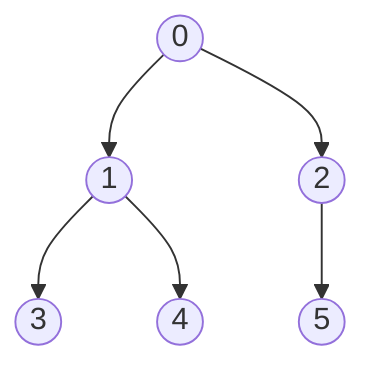
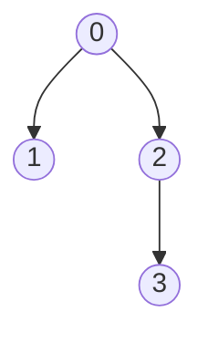

## 并查集

> 并查集（Disjoint Set Union，DSU）是一种**管理不相交集合**的数据结构，支持两种核心操作：**查找（Find）** 和 **合并（Union）**。它本质上是**双亲表示法的树结构**，广泛应用于图论（Kruskal 算法）、等价类划分等场景。

### 基本概念

#### 定义

**并查集**：一种维护**不相交集合族**的数据结构，支持：
- **Find(S, x)**：查找元素 $x$ 所属的集合（返回代表元/根结点）
- **Union(S, Root1, Root2)**：将两个不相交集合合并为一个

> 并查集本质是**双亲表示法的树**，每棵树代表一个集合，树的根结点是该集合的**代表元**。

#### 存储结构

用**数组**存储，每个元素记录其**双亲下标**：

```cpp
#define SIZE 100
int UFSets[SIZE];    // 并查集数组

// 初始化：每个元素自成一个集合，双亲指向自己
void Initial(int S[]) {
    for (int i = 0; i < SIZE; i++) {
        S[i] = -1;    // -1 表示根结点
    }
}
```

> [!important] 两种常见约定
> - **约定一**：根结点的双亲为 `-1`，其余结点存储双亲下标
> - **约定二**：根结点的双亲为**负数**，其绝对值表示该集合的元素个数（用于按大小合并）
>
> 408 考试中两种都可能出现，看题目要求。

### 核心操作

#### 查找操作（Find）

**功能**：查找元素 $x$ 所属集合的**根结点**。

```cpp
int Find(int S[], int x) {
    while (S[x] >= 0) {     // 沿双亲指针向上找
        x = S[x];
    }
    return x;               // 返回根结点下标
}
```

**执行示例**：数组 `S = [-1, 0, 0, 1, 1, 2]`



- `Find(S, 3)` → 3 → 1 → 0，返回 **0**
- `Find(S, 5)` → 5 → 2 → 0，返回 **0**

> [!note] 时间复杂度
> 查找的时间复杂度为 $O(h)$，$h$ 为树的高度。最坏情况（链状）为 $O(n)$。

#### 合并操作（Union）

**功能**：将两个集合合并为一个。

```cpp
void Union(int S[], int Root1, int Root2) {
    if (Root1 == Root2) return;   // 同一集合，无需合并
    S[Root2] = Root1;             // 将 Root2 挂到 Root1 下
}
```

**执行示例**：`S = [-1, 0, 0, 1, 1, 2]`，合并 `Find(S, 3)=0` 和 `Find(S, 5)=0`？

两者根相同（都是 0），无需合并。

若 `S = [-1, 0, -1, 2]`（两个集合：{0,1} 和 {2,3}）

- `Union(S, 0, 2)` → `S[2] = 0`，数组变为 `[-1, 0, 0, 2]`



### 应用

#### Kruskal 算法（最小生成树）

**思路**：按边权从小到大排序，依次选取边，若边的两个端点不在同一集合（不构成环），则加入。

```cpp
// Kruskal 算法核心
int Kruskal(Edge edges[], int n, int m) {
    Initial(S);
    sort(edges, edges + m);        // 按边权排序
    int count = 0, sum = 0;
    for (int i = 0; i < m; i++) {
        int root1 = Find(S, edges[i].u);
        int root2 = Find(S, edges[i].v);
        if (root1 != root2) {       // 不在同一集合
            Union(S, root1, root2);
            sum += edges[i].w;
            count++;
            if (count == n - 1) break;
        }
    }
    return sum;
}
```

#### 等价类划分

将满足某种等价关系的元素归入同一集合。

#### 朋友圈问题

$n$ 个人，$m$ 对好友关系，求朋友圈个数。

```cpp
int FindCircleNum(int n, int relations[][2], int m) {
    Initial(S);
    for (int i = 0; i < m; i++) {
        int r1 = Find(S, relations[i][0]);
        int r2 = Find(S, relations[i][1]);
        if (r1 != r2) Union(S, r1, r2);
    }
    int count = 0;
    for (int i = 0; i < n; i++) {
        if (S[i] < 0) count++;      // 根结点数量 = 集合数量
    }
    return count;
}
```

### 408 常考点

| 考点 | 说明 |
|------|------|
| 并查集的存储结构 | 双亲表示法的数组 |
| 初始化 | 每个元素自成一个集合，`S[i] = -1` |
| Find 操作 | 沿双亲指针向上找根 |
| Union 操作 | 将一棵树的根挂到另一棵树的根下 |
| Kruskal 算法 | 并查集的典型应用 |

### 易错与易混点

| 易错判断 | 正确理解 |
|----------|----------|
| 并查集的根结点双亲为 `0` | ❌ 根结点的双亲通常为 `-1`（或负数） |
| 并查集是一棵二叉树 | ❌ 并查集是**多叉树**，不一定是二叉树 |
| Union 操作直接合并两个元素 | ❌ Union 操作的是两个**根结点**，不是任意元素 |

### 核心公式速查卡

| 公式/结论 | 说明 |
|-----------|------|
| `S[i] = -1` | 根结点初始化 |
| `Find(S, x)`：沿双亲向上 | 找根，$O(h)$ |
| `Union(S, r1, r2)`：`S[r2] = r1` | 合并两棵树 |
| 并查集集合数量 | 根结点个数 |

### 相关笔记

- [[并查集的进一步优化]]：按秩合并与路径压缩
- [[树的存储结构]]：双亲表示法
- [[哈夫曼树]]：贪心思想的另一应用