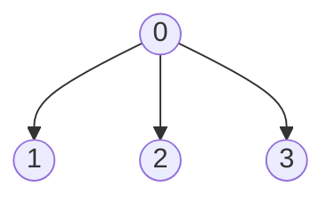

## 并查集的进一步优化

> 朴素并查集最坏情况会退化为链（$O(n)$ 查找）。**按秩合并**与**路径压缩**两种优化可将均摊复杂度降到 $O(\alpha(n))$，近似常数。

### 问题：树可能退化为链

如果总是将大树挂到小树上，树的高度可能达到 $O(n)$，查找效率退化。

**优化目标**：控制树的高度，使查找接近 $O(1)$。

### 优化一：按秩合并（Union by Rank）

**思路**：合并时，将**矮树挂到高树**下（或小树挂到大树下）。

**用根结点的绝对值表示树的结点数**：

```cpp
void Union(int S[], int Root1, int Root2) {
    if (Root1 == Root2) return;
    if (S[Root1] > S[Root2]) {     // S[Root1] 绝对值小，说明树更小
        S[Root2] += S[Root1];      // 累加结点数
        S[Root1] = Root2;          // 小树挂到大树下
    } else {
        S[Root1] += S[Root2];
        S[Root2] = Root1;
    }
}
```

> 按大小合并后，树的高度不超过 $\lfloor \log_2 n \rfloor + 1$。

### 优化二：路径压缩（Path Compression）

**思路**：查找时，将路径上所有结点**直接挂到根结点**下。

```cpp
int Find(int S[], int x) {
    int root = x;
    while (S[root] >= 0) {         // 第一步：找到根
        root = S[root];
    }
    while (x != root) {            // 第二步：路径压缩
        int temp = S[x];
        S[x] = root;               // 直接挂到根下
        x = temp;
    }
    return root;
}
```

**递归写法**：

```cpp
int Find(int S[], int x) {
    if (S[x] < 0) return x;        // 根结点
    else {
        S[x] = Find(S, S[x]);      // 递归查找并压缩
        return S[x];
    }
}
```

**执行示例**：链状树 `0 ← 1 ← 2 ← 3`，`Find(S, 3)`

压缩前：


压缩后：


> [!important] 路径压缩 + 按秩合并
> 两者结合后，并查集操作的**均摊时间复杂度**为 $O(\alpha(n))$，其中 $\alpha(n)$ 是反阿克曼函数，增长极慢，可视为常数。

### 408 常考点

| 考点 | 说明 |
|------|------|
| 按秩合并 | 小树挂到大树下，高度 $O(\log n)$ |
| 路径压缩 | 查找时将所有结点直接挂到根下 |
| 均摊复杂度 | 两者结合后为 $O(\alpha(n))$，近似 $O(1)$ |

### 易错与易混点

| 易错判断 | 正确理解 |
|----------|----------|
| 路径压缩后树的高度一定为 1 | ❌ 路径压缩只压缩查找路径上的结点，其他路径可能未压缩 |
| 按秩合并后树高 $O(1)$ | ❌ 树高 $O(\log n)$，加路径压缩后均摊 $O(\alpha(n))$ |
| 路径压缩改变树的逻辑结构 | ❌ 只改变存储结构，不改变集合划分 |

### 核心公式速查卡

| 公式/结论 | 说明 |
|-----------|------|
| 按秩合并树高 | $O(\log n)$ |
| 路径压缩 + 按秩合并 | 均摊 $O(\alpha(n)) \approx O(1)$ |

### 相关笔记

- [[并查集]]：Find/Union 基础操作
- [[树的性质]]：树的高度与查找效率的关系