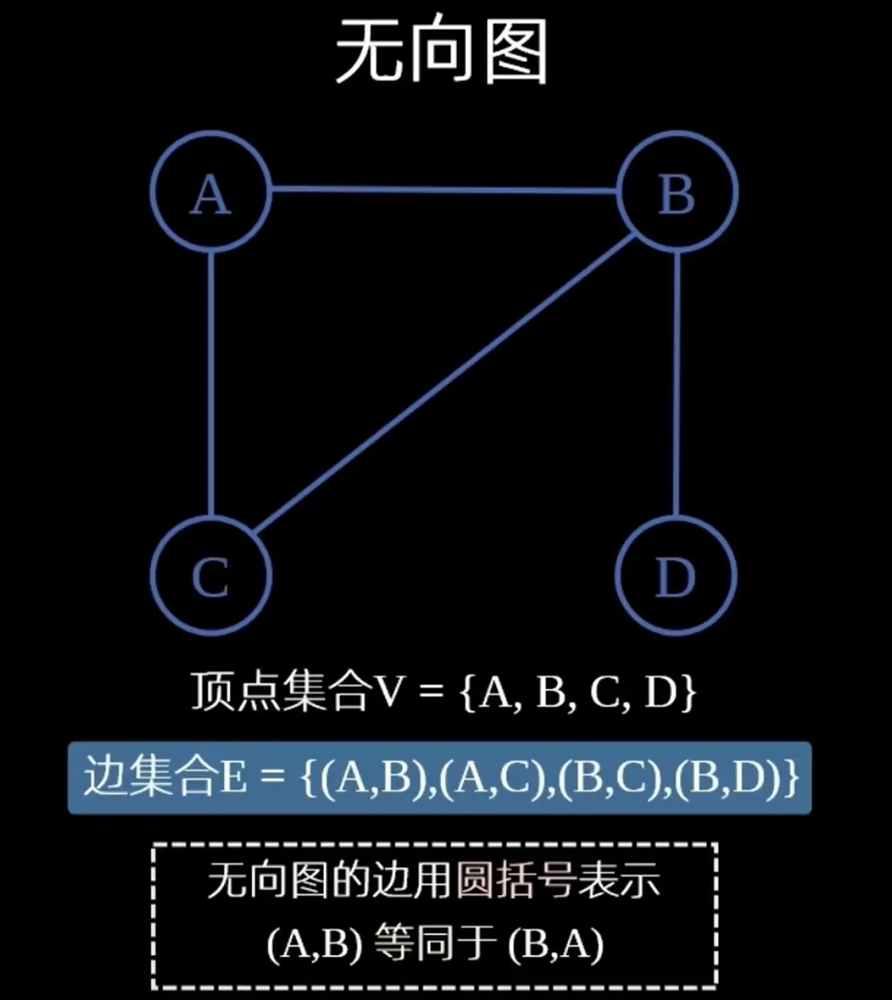
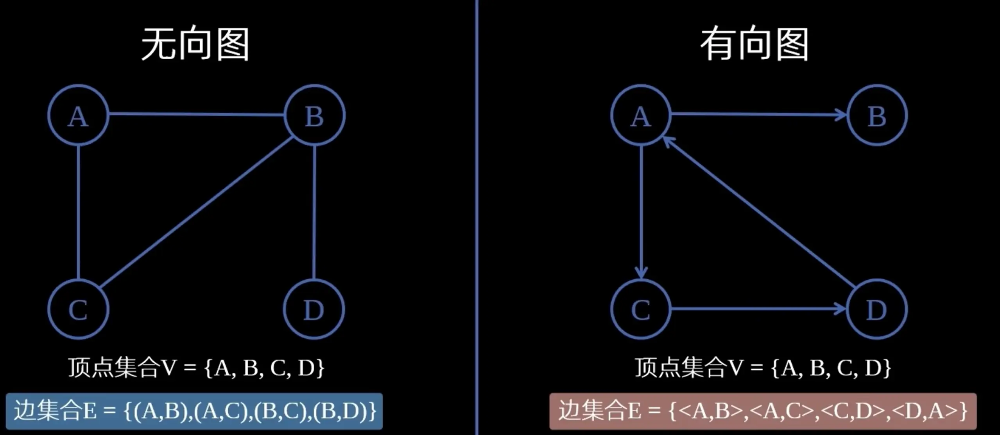
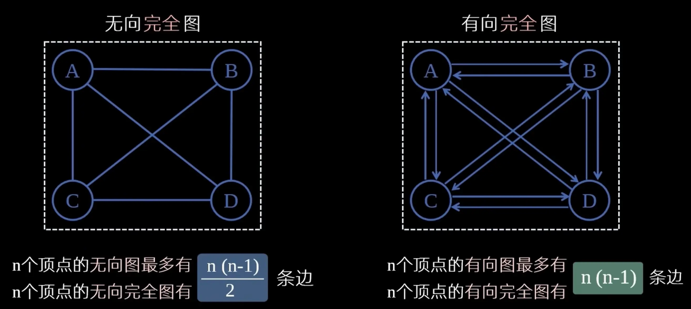

## 图的基本概念 · 考研408核心笔记

> 图是数据结构中最复杂、最灵活的结构，用于描述多对多的关系。本章是图论的基础，涵盖图的定义、分类、术语、度与握手定理、连通性等核心概念。在考研数一中，图论与矩阵、关系有交叉；在英语一中，`graph`、`vertex`、`edge` 等词常见于科技类阅读；在408中，本章是后续存储、遍历、最短路径等算法的基石。
>
> **说明**：以下笔记中留有多处插图空位，采用 Markdown 空图链接表示，您可自行插入截图或手绘图片。

### 一、图的定义

图 $G$ 由**顶点集** $V$ 和**边集** $E$ 组成，记为：

$$
G = (V, E)
$$

其中 $V$ 是非空有限集合，$E$ 是 $V$ 中顶点对（无序或有序）的集合。

> **直观理解**：顶点表示对象，边表示对象之间的关系。

### 二、图的分类

| 分类标准 | 类型 | 说明 |
| :--- | :--- | :--- |
| 边是否有向 | **无向图** | 边是无序对 $(v,w)$ |
| | **有向图** | 边是有序对 $\langle v,w \rangle$ |
| 边是否允许重复 | **简单图** | 无重边、无自环 |
| | **多重图** | 允许重边或自环 |
| 边是否带权 | **无权图** | 边只表示关系 |
| | **带权图（网）** | 边附带权值 |
| 边数多少 | **稀疏图** | $e < n\log n$ |
| | **稠密图** | $e$ 接近 $n^2$ |

### 三、完全图

- **无向完全图**：任意两个顶点之间都有边，边数为
$$
\frac{n(n-1)}{2}
$$
- **有向完全图**：任意两个顶点之间都有两条方向相反的弧，弧数为
$$
n(n-1)
$$

### 四、基本术语

- **子图**：若 $V' \subseteq V$ 且 $E' \subseteq E$，则 $G'=(V',E')$ 是 $G$ 的子图。
- **生成子图**：包含所有顶点的子图。
- **连通图**（无向图）：任意两个顶点之间都有路径。
- **连通分量**：无向图中的极大连通子图。
- **强连通图**（有向图）：任意两个顶点之间都有双向路径。
- **强连通分量**：有向图中的极大强连通子图。
- **生成树**：连通图的极小连通子图，含 $n$ 个顶点、$n-1$ 条边。
- **生成森林**：非连通图的每个连通分量的生成树组成的集合。
- **简单路径**：顶点不重复的路径。
- **简单回路**：除起点终点外顶点不重复的回路。
- **距离**：两顶点间最短路径的长度。
- **有向树**：一个顶点入度为 0，其余顶点入度为 1 的有向图。

### 五、顶点的度

- **无向图**：顶点 $v$ 的度 $TD(v)$ 是与其关联的边数。
- **有向图**：
  - 入度 $ID(v)$：以 $v$ 为终点的弧数。
  - 出度 $OD(v)$：以 $v$ 为起点的弧数。
  - 度 $TD(v)=ID(v)+OD(v)$。

### 六、握手定理

**无向图**：所有顶点的度之和等于边数的两倍。

$$
\sum_{v \in V} TD(v) = 2e
$$

**有向图**：所有顶点的入度之和等于出度之和，等于边数。

$$
\sum_{v \in V} ID(v) = \sum_{v \in V} OD(v) = e
$$

> **推论**：无向图中度为奇数的顶点个数必为偶数。

### 七、路径与回路

- **路径**：顶点序列 $v_0, v_1, \dots, v_k$，满足相邻顶点间有边。
- **回路**：起点和终点相同的路径。
- **简单路径**：顶点不重复出现。
- **简单回路**：除起点终点外，顶点不重复出现。

### 八、408 常考点

| 考点 | 说明 |
| :--- | :--- |
| 完全图边数 | 无向 $n(n-1)/2$，有向 $n(n-1)$ |
| 握手定理 | $\sum TD(v)=2e$，奇度顶点个数为偶数 |
| 连通分量与强连通分量 | 极大连通子图 |
| 生成树边数 | $n-1$ |
| 简单路径与简单回路 | 顶点不重复 |
| 稀疏图与稠密图 | 边数相对顶点数 |

### 九、简单发散

- **数一**：图可用邻接矩阵表示，与线性代数中矩阵、二次型有联系；图的连通性可转化为矩阵的幂。
- **英语一**：`graph`、`vertex`（复数 vertices）、`edge`、`path`、`cycle` 等是科技阅读高频词。
- **408**：本章是后续存储结构（邻接矩阵、邻接表）、遍历（BFS/DFS）、最短路径、最小生成树、拓扑排序的基础。

### 十、示例：一个简单的无向图

> 该图有 4 个顶点、5 条边。顶点度：$A:2, B:3, C:3, D:2$，度之和 $10 = 2 \times 5$，满足握手定理。

### 十一、核心公式速查

| 公式 | 说明 |
| :--- | :--- |
| $G=(V,E)$ | 图的定义 |
| $\frac{n(n-1)}{2}$ | 无向完全图边数 |
| $n(n-1)$ | 有向完全图弧数 |
| $\sum TD(v) = 2e$ | 无向图握手定理 |
| $\sum ID(v) = \sum OD(v) = e$ | 有向图握手定理 |
| $n-1$ | 生成树边数 |

### Obsidian 双向链接

- [[2、图的存储结构]]
- [[图的遍历]]
- [[最小生成树]]
- [[最短路径问题]]
- [[拓扑排序]]
- [[关键路径]]
- [[树与二叉树]]
- [[算法效率的度量]]

---

> 本章是图论的开篇，重点掌握基本术语、完全图边数、握手定理。后续章节将深入图的存储与算法。