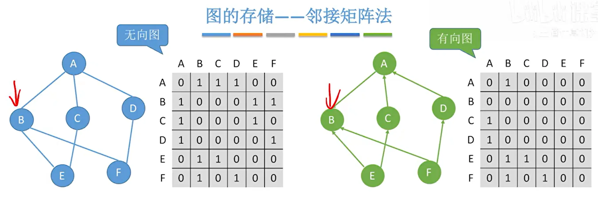
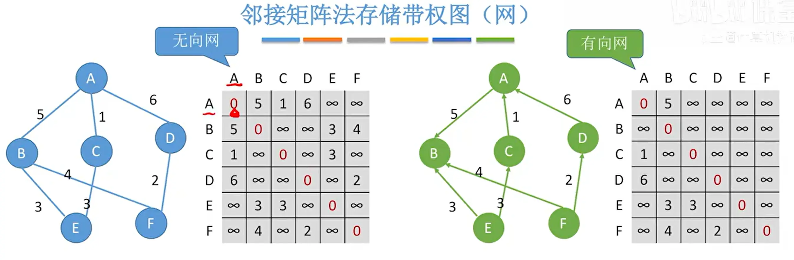
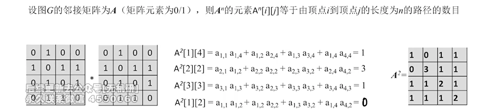
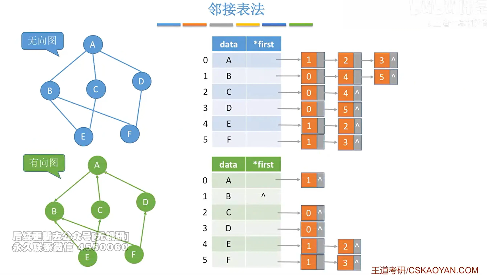
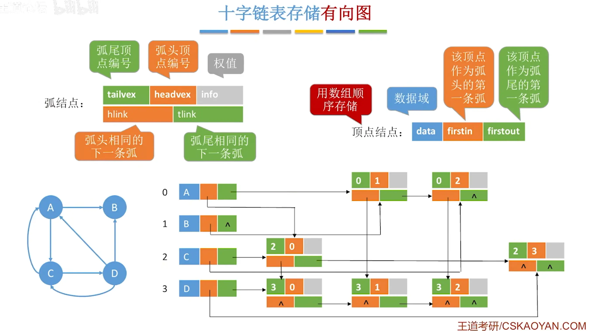
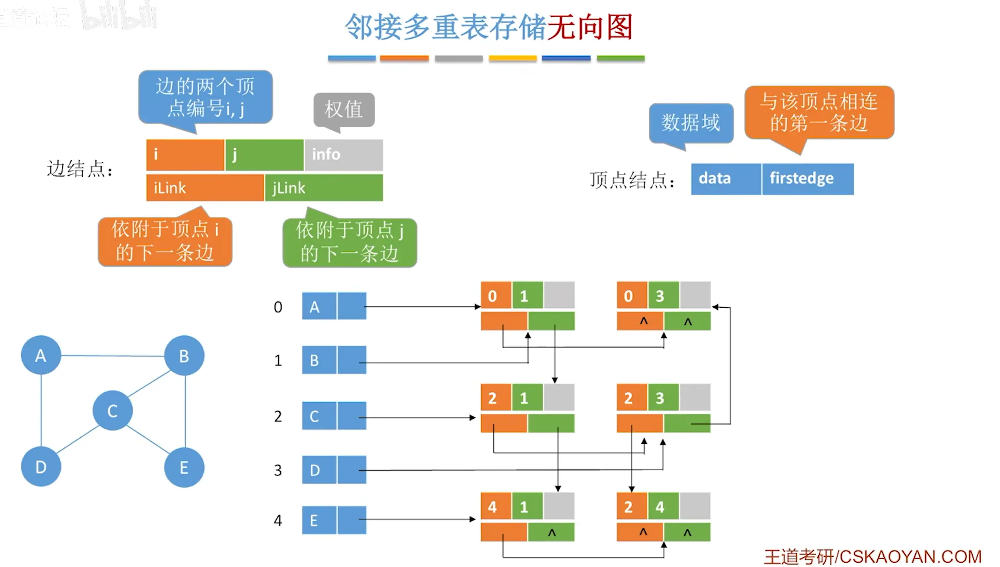

## 图的存储结构 · 考研408核心笔记

> 图的结构复杂，存储方式多样。本章介绍四种主要存储结构：邻接矩阵、邻接表、十字链表、邻接多重表，并总结图的基本操作。代码严格遵循王道408教材写法。
>
> **说明**：以下笔记中留有多处插图空位，采用 Markdown 空图链接表示，可自行插入截图或手绘图片。

### 一、邻接矩阵法

#### 1. 无权图

```c
#define MaxVertexNum 100        // 顶点数目的最大值

typedef struct {
    char Vex[MaxVertexNum];                 // 顶点表
    int Edge[MaxVertexNum][MaxVertexNum];   // 邻接矩阵，边表
    int vexnum, arcnum;                     // 图的当前顶点数和边数
} MGraph;
```

#### 2. 带权图

```c
#define MaxVertexNum 100
#define INFINITY 0x3f3f3f3f     // 无穷大，表示无边

typedef char VertexType;
typedef int EdgeType;

typedef struct {
    VertexType Vex[MaxVertexNum];           // 顶点表
    EdgeType Edge[MaxVertexNum][MaxVertexNum]; // 边的权值
    int vexnum, arcnum;                     // 顶点数和边数
} MGraph;
```



#### 3. 特点

- 空间复杂度 $O(n^2)$，适合**稠密图**。
- 判断两点是否相邻 $O(1)$。
- 找某顶点的所有邻接点 $O(n)$。
- 无向图邻接矩阵对称。
- $A^n[i][j]$ 表示 $i$ 到 $j$ 长度为 $n$ 的路径数。


### 二、邻接表法

```c
#define MaxVertexNum 100

typedef struct ArcNode {
    int adjvex;                     // 该弧所指向的顶点的位置
    struct ArcNode *next;           // 指向下一条弧的指针
    // InfoType info;               // 网的边权值
} ArcNode;

typedef struct VNode {
    VertexType data;                // 顶点信息
    ArcNode *first;                 // 指向第一条依附该顶点的弧
} VNode, AdjList[MaxVertexNum];

typedef struct {
    AdjList vertices;               // 邻接表
    int vexnum, arcnum;             // 顶点数和弧数
} ALGraph;
```



#### 特点

- 空间复杂度 $O(n+e)$，适合**稀疏图**。
- 无向图边结点数 $2e$，有向图边结点数 $e$。
- 求出度方便，求入度不便（需逆邻接表）。

### 三、十字链表（有向图）

```c
#define MaxVertexNum 100

typedef struct ArcBox {
    int tailvex, headvex;           // 弧尾、弧头顶点位置
    struct ArcBox *hlink, *tlink;   // 弧头相同、弧尾相同的下一条弧
    // InfoType info;
} ArcBox;

typedef struct VexNode {
    VertexType data;
    ArcBox *firstin, *firstout;     // 第一条入弧、出弧
} VexNode;

typedef struct {
    VexNode xlist[MaxVertexNum];    // 顶点表
    int vexnum, arcnum;             // 顶点数和弧数
} OLGraph;
```


  
#### 特点

- 空间 $O(n+e)$。
- 求入度、出度均方便。
- 有向图专用。

### 四、邻接多重表（无向图）

```c
#define MaxVertexNum 100

typedef struct EBox {
    int ivex, jvex;                 // 该边依附的两个顶点
    struct EBox *ilink, *jlink;     // 依附 ivex、jvex 的下一条边
    // InfoType info;
} EBox;

typedef struct VexBox {
    VertexType data;
    EBox *firstedge;                // 第一条依附该顶点的边
} VexBox;

typedef struct {
    VexBox adjmulist[MaxVertexNum]; // 顶点表
    int vexnum, edgenum;            // 顶点数和边数
} AMLGraph;
```



#### 特点

- 空间 $O(n+e)$。
- 每条边只存一个结点，便于删除边。
- 无向图专用。

### 五、图的基本操作

| 操作 | 含义 | 邻接矩阵 | 邻接表 |
| :--- | :--- | :--- | :--- |
| `Adjacent(G,x,y)` | 判断边是否存在 | $O(1)$ | $O(deg(x))$ |
| `Neighbors(G,x)` | 列出所有邻接点 | $O(n)$ | $O(deg(x))$ |
| `InsertVertex(G,x)` | 插入顶点 | $O(1)$ | $O(1)$ |
| `DeleteVertex(G,x)` | 删除顶点 | $O(n^2)$ | $O(n+e)$ |
| `AddEdge(G,x,y)` | 添加边 | $O(1)$ | $O(1)$ |
| `RemoveEdge(G,x,y)` | 删除边 | $O(1)$ | $O(deg(x))$ |
| `Get_edge_value` | 取边权 | $O(1)$ | $O(deg(x))$ |
| `Set_edge_value` | 设置边权 | $O(1)$ | $O(deg(x))$ |


### 六、四种存储结构对比

| 存储结构  | 适用图 | 空间       | 判断邻接     | 找邻接点     | 求度                  | 特点          |
| :---- | :-- | :------- | :------- | :------- | :------------------ | :---------- |
| 邻接矩阵  | 稠密图 | $O(n^2)$ | $O(1)$   | $O(n)$   | 入/出度均 $O(n)$        | 简单，空间浪费     |
| 邻接表   | 稀疏图 | $O(n+e)$ | $O(deg)$ | $O(deg)$ | 出度 $O(1)$，入度 $O(n)$ | 空间高效，入度不便   |
| 十字链表  | 有向图 | $O(n+e)$ | $O(deg)$ | $O(deg)$ | 入/出度均方便             | 有向图专用       |
| 邻接多重表 | 无向图 | $O(n+e)$ | $O(deg)$ | $O(deg)$ | 度方便                 | 无向图专用，边只存一次 |

### 七、考点与易错点

| 考点 | 说明 |
| :--- | :--- |
| 邻接矩阵空间 | $O(n^2)$，适合稠密图 |
| 邻接表空间 | $O(n+e)$，适合稀疏图 |
| 无向图邻接表边结点数 | $2e$ |
| 有向图邻接表边结点数 | $e$ |
| 有向图求入度 | 邻接表不便，需逆邻接表或十字链表 |
| 十字链表的弧结点 | `tailvex, headvex, hlink, tlink` |
| 邻接多重表的边结点 | `ivex, jvex, ilink, jlink` |


### 八、简单发散

- **数一**：邻接矩阵与线性代数矩阵、二次型联系紧密，$A^n$ 的元素表示路径数。
- **英语一**：`adjacency matrix`、`adjacency list`、`orthogonal list`、`adjacency multilist` 等术语常见于科技文献。
- **408**：本章是图的遍历、最小生成树、最短路径、拓扑排序等算法实现的基础。

### Obsidian 双向链接

- [[图的基本概念]]
- [[图的遍历]]
- [[最小生成树]]
- [[6、最短路径问题]]
- [[8、拓扑排序]]
- [[9、关键路径]]
- [[算法效率的度量]]

---

> 本章重点：邻接矩阵与邻接表的对比、各自的适用场景、基本操作复杂度。十字链表和邻接多重表了解结构即可。代码严格遵循王道408教材写法。