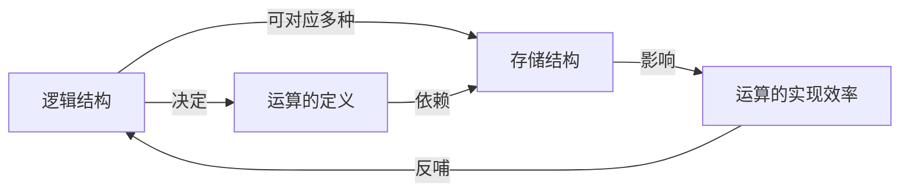

## 数据结构三要素

> 数据结构是一门研究**数据**如何组织、**逻辑**如何描述、**存储**如何实现以及**操作**如何定义的学科。

数据结构包含三个核心要素：**逻辑结构**、**存储结构（物理结构）** 和**数据的运算（算法）**。

> [!tip] 记忆口诀
> **"逻存算"** —— 逻辑结构、存储结构、数据运算

---

### 1. 逻辑结构

**定义**：数据元素之间的**抽象关系**，独立于计算机，是数据结构的"**数学模型**"。

> [!note] 核心观点
> 逻辑结构是**数据本身的组织形式**，与存储方式和算法无关。简答题中描述一个ADT时，首先就要说明它的逻辑结构。

#### 1.1 分类（按数据元素之间的关系）

| 类别       | 关系描述         | 典型例子       |
| -------- | ------------ | ---------- |
| **集合结构** | 同属一个集合，无其他关系 | 并查集        |
| **线性结构** | 一对一（前驱-后继）   | 线性表、栈、队列、串 |
| **树形结构** | 一对多（层次/分支）   | 树、二叉树、堆    |
| **图状结构** | 多对多（网状）      | 图、有向图、无向图  |

> [!example] 考研常见问法
> "栈属于哪种逻辑结构？" → 答：**线性结构**，因为栈中每个元素（除栈顶和栈底）都有唯一的前驱和后继。

---

### 2. 存储结构（物理结构）

**定义**：逻辑结构在计算机**内存中的表示（映像）** ，即数据的存储实现。

> [!note] 核心观点
> 存储结构是逻辑结构在计算机中的"**物理载体**"。同一个逻辑结构可以对应多种存储结构。

#### 2.1 四种基本存储方式

| 存储方式     | 核心思想                    | 优点            | 缺点               |
| -------- | ----------------------- | ------------- | ---------------- |
| **顺序存储** | 用一组**连续的存储单元**依次存储      | 随机存取、无需额外空间   | 插入删除需移动大量元素      |
| **链式存储** | 用**不连续的存储单元**，通过指针链接    | 插入删除方便、动态分配   | 需要额外指针空间、不支持随机存取 |
| **索引存储** | 建立**索引表**，通过索引项定位数据     | 检索速度快         | 索引表占用额外空间        |
| **散列存储** | 根据关键字**直接计算**存储地址（Hash） | 查找、插入、删除均O(1) | 存在冲突问题           |

> [!important] 考研高频考点
> - **顺序存储 vs 链式存储**的对比（时间复杂度、空间利用率、适用场景）
> - **散列存储**：装填因子、冲突解决方法（开放地址法、链地址法）

---

### 3. 数据的运算（算法）

***程序=数据结构+算法***

- 数据结构是要处理的信息
- 算法是处理信息的步骤

**定义**：对数据施加的**操作**，即**算法**。

> [!note] 核心观点
> 运算定义在逻辑结构上，但**实现依赖于存储结构**。

#### 3.1 运算的分类

| 类型           | 描述               | 举例                 |
| ------------ | ---------------- | ------------------ |
| **定义（逻辑层面）** | 描述"做什么"，与存储无关    | ADT中定义的插入、删除、查找等操作 |
| **实现（物理层面）** | 描述"怎么做"，依赖具体存储结构 | 基于数组或链表实现的插入函数代码   |

#### 3.2 算法的五个重要特征

> [!cite] 严蔚敏《数据结构》
> 1.  **有穷性**：算法的执行步骤是有限的
> 2.  **确定性**：每一步都有明确含义，无歧义
> 3.  **可行性**：每一步都是可以通过有限次基本运算实现的
> 4.  **输入**：有零个或多个输入
> 5.  **输出**：有一个或多个输出

> **好算法特性**
> 1. 正确性：算法应能够正确地解决求解问题。
> 2. 可读性：算法应具有良好的可读性，以帮助人们理解。
> 3. 健壮性：输入非法数据时，算法能适当地做出反应或进行处理，而不会产生莫名其妙的输出结果。
> 4. 高效率与低存储量需求：时间复杂度低，空间复杂度低
#### 3.3 [[算法效率的度量|算法效率]]的评价指标

| 指标        | 含义               | 考研侧重              |
| --------- | ---------------- | ----------------- |
| **时间复杂度** | 算法执行时间随数据规模增长的趋势 | 用大O记号表示，是**绝对重点** |
| **空间复杂度** | 算法运行所需的额外存储空间    | 关注递归算法的栈空间        |

> [!warning] 常见误区
> "算法的时间复杂度越小越好" ❌  
> 正确说法是：**在满足问题要求的前提下**，时间复杂度越低越好。有时为了降低时间复杂度（如用哈希表），需要牺牲空间复杂度。

---

### 三要素之间的关系（核心逻辑）

> [!summary] 一句话总结
> **逻辑结构**是数据的"逻辑蓝图"，**存储结构**是蓝图的"物理施工图"，**数据运算**是在这张图上"盖楼和使用的过程"。

---

### 考研常考题型

| 题型        | 常见设问方式                                         |
| --------- | ---------------------------------------------- |
| **选择题**   | "以下哪个不是逻辑结构？" / "栈属于哪种逻辑结构？" / "折半查找适合哪种存储结构？" |
| **简答题**   | "简述逻辑结构和存储结构的区别与联系。"                           |
| **算法设计题** | "给定ADT定义，写出基于某存储结构的操作实现。"                      |

> [!FAQ]- 标准简答题模板
> **问**：简述逻辑结构与存储结构的区别与联系。
> 
> **答**：
> - **区别**：逻辑结构是数据元素之间的抽象关系，独立于计算机，是数据在问题域中的描述；存储结构是逻辑结构在计算机内存中的具体表示方式，如顺序存储、链式存储等。
> - **联系**：存储结构必须服务于逻辑结构，同一逻辑结构可采用多种存储结构实现，且存储结构的选择直接影响运算的效率（时间/空间复杂度）。

---

### Obsidian 使用建议

- 将 `> [!tip]`、`> [!important]` 等 callout 块用 `/` 命令快速插入
- 你可以将本文与 `ADT与C++的class` 笔记建立双向链接（`[[ADT与C++的class]]`）
- 考试前复习时，重点看 `> [!important]` 和 `> [!warning]` 标记的块

---

如果需要我继续整理`线性表`或`栈和队列`的三要素分解，或者补充时间复杂度分析的详细题型，随时告诉我。