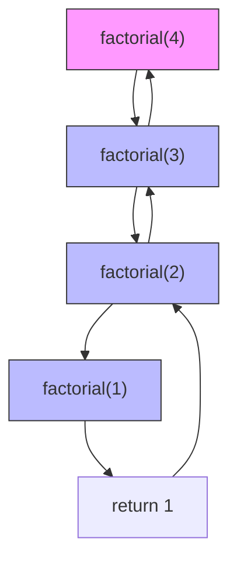

这是关于**空间复杂度的栈帧分析**的专题笔记，延续Obsidian格式，直接补充到你的考研知识库中。

---

## 空间复杂度 · 栈帧分析（考研专题）

> 空间复杂度衡量的是算法运行所需的**额外存储空间**，对于递归算法，核心在于理解**函数调用栈（Call Stack）**的栈帧分配与释放机制。

---

### 1. 栈帧（Stack Frame）是什么？

> [!note] 栈帧的定义
> 每次函数调用时，系统会在**调用栈（Call Stack）**顶部为本次调用分配一块连续的内存区域，这块区域称为**栈帧**。

每个栈帧通常包含：

| 栈帧组成部分       | 作用                       |
| ------------ | ------------------------ |
| **返回地址**     | 函数执行完后，返回到调用处的下一条指令地址    |
| **局部变量**     | 函数内部定义的非静态变量             |
| **函数参数**     | 调用时传入的实参（部分由寄存器传递，部分在栈上） |
| **保存的寄存器状态** | 调用前需保存的寄存器值，用于恢复现场       |
| **临时变量**     | 编译器生成的中间计算结果             |

> [!important] 核心原则
> - 递归调用的**深度**决定了栈帧的**数量**。
> - 每个栈帧的大小通常为**常数**（取决于参数和局部变量的数量）。
> - 递归算法的空间复杂度 = **递归深度 × 每个栈帧的大小**（大O表示）。

---

### 2. 考研栈帧分析三步法

| 步骤 | 操作 | 说明 |
|------|------|------|
| **Step 1** | 分析递归终止条件 | 确定递归的最大深度（最坏情况下递归调用多少层） |
| **Step 2** | 分析每个栈帧的空间开销 | 参数、局部变量、返回地址等（通常用 $O(1)$ 或 $O(n)$ 表示） |
| **Step 3** | 相乘得到总空间复杂度 | 深度 × 单帧大小，取大O |

---

### 3. 经典例题

#### 例题1 · 简单递归（$O(n)$）

```cpp
int factorial(int n) {
    if (n <= 1) return 1;
    return n * factorial(n - 1);
}
```

**栈帧分析**：

- **递归深度**：$n$（从 $n$ 递归到 $1$）
- **单帧大小**：$O(1)$（仅存储参数 `n` 和返回地址）
- **总空间**：$O(n) \times O(1) = O(n)$



> [!check] 结论
> $$S(n) = O(n)$$

---

#### 例题2 · 每帧带大数组（$O(n^2)$）

```cpp
void f(int n) {
    if (n <= 0) return;
    int arr[100];   // 常数大小数组，仍为 O(1)
    f(n - 1);
}
```

> 此例中数组大小为常数 $100$，不随 $n$ 变化，所以每帧仍为 $O(1)$，总空间仍为 $O(n)$。

**变式**：若每帧数组大小随 $n$ 变化：

```cpp
void f(int n) {
    if (n <= 0) return;
    int *arr = (int*)malloc(n * sizeof(int));  // O(n) 空间
    f(n - 1);
    free(arr);
}
```

**栈帧分析**：

- **递归深度**：$n$
- **单帧大小**：$O(n)$（每帧分配一个大小为 $n$ 的数组）
- **总空间**：$O(n) \times O(n) = O(n^2)$

> [!warning] 注意
> 不要误以为每帧的数组在递归返回后才释放。实际上，**递归调用发生在 `malloc` 之后**，所以父帧的数组会**一直占用空间**，直到子递归全部完成返回后才释放。

---

#### 例题3 · 二叉树递归遍历（$O(\text{树高})$）

```cpp
void preorder(TreeNode* root) {
    if (root == NULL) return;
    visit(root);                    // O(1)
    preorder(root->left);
    preorder(root->right);
}
```

**栈帧分析**：

- **递归深度**：二叉树的高度 $h$（最坏情况下，链状树 $h = n$；最好情况下，平衡树 $h = \log n$）
- **单帧大小**：$O(1)$（只存储指针 `root` 和返回地址）
- **总空间**：$O(h)$

> [!important] 考研常考点
> - **平衡二叉树**：空间复杂度 $O(\log n)$
> - **链状二叉树（最坏情况）**：空间复杂度 $O(n)$
> - 空间复杂度与**树的结构**有关，而不仅仅是节点数！

---

#### 例题4 · 尾递归优化（考研进阶）

```cpp
int tail_factorial(int n, int acc) {
    if (n <= 1) return acc;
    return tail_factorial(n - 1, n * acc);
}
```

**栈帧分析**：

- 普通递归：需要保存每层的状态，空间 $O(n)$。
- **尾递归**：递归调用是函数体**最后一步操作**，不需要保存当前栈帧的状态。
- **优化效果**：如果编译器支持**尾递归优化（Tail Call Optimization，TCO）**，可以复用当前栈帧，空间降为 $O(1)$。

> [!note] 考研补充
> 虽然C/C++标准不强制要求尾递归优化，但408考试中通常会假设**未优化**的情况，此时 `tail_factorial` 的空间复杂度仍视为 $O(n)$（因为你需要理解栈帧保存的原理）。但作为拓展，理解这个优化思路有助于应对高阶题目。

---

### 4. 总结表格：各类递归的空间复杂度

| 算法模式       | 递归深度        | 单帧空间   | 总空间复杂度      | 典型例子           |
| ---------- | ----------- | ------ | ----------- | -------------- |
| 线性递归（单分支）  | $O(n)$      | $O(1)$ | $O(n)$      | 阶乘、斐波那契（朴素）    |
| 线性递归（带大数组） | $O(n)$      | $O(n)$ | $O(n^2)$    | 每帧申请 $O(n)$ 数组 |
| 平衡二分递归     | $O(\log n)$ | $O(1)$ | $O(\log n)$ | 二分查找、平衡二叉树遍历   |
| 链状二分递归（最坏） | $O(n)$      | $O(1)$ | $O(n)$      | 退化二叉树遍历        |
| 尾递归（未优化）   | $O(n)$      | $O(1)$ | $O(n)$      | 尾递归阶乘          |
| 尾递归（已优化）   | $O(1)$      | $O(1)$ | $O(1)$      | 支持TCO的编译器      |

---

### 5. 考研常见混淆点辨析

| 混淆问题                           | 正确理解                                         |
| ------------------------------ | -------------------------------------------- |
| "递归的空间复杂度就是 $O(1)$，因为没有额外数组" ❌ | 递归需要**调用栈空间**，所以至少是 $O(\text{递归深度})$         |
| "二叉树遍历的空间复杂度是 $O(n)$" ⚠️       | 不严谨。准确说法是 $O(h)$，平衡时为 $O(\log n)$，最坏为 $O(n)$ |
| "栈帧大小是固定的，所以空间复杂度总是 $O(1)$" ❌  | 栈帧大小可以是变量，例如每帧分配 $O(n)$ 的数组                  |
| "空间复杂度只看显式定义的变量" ❌             | 还要考虑**隐式开销**：返回地址、寄存器保存、参数传递等                |

---

### 6. 栈空间与堆空间的区别（考研补充）

> [!cite] 408考试中，空间复杂度通常只关注**额外空间**，但理解栈/堆的划分有助于分析程序内存占用。

| 对比维度     | 栈（Stack）         | 堆（Heap）              |
| -------- | ---------------- | -------------------- |
| **管理方式** | 编译器自动管理（入栈/出栈）   | 程序员手动管理（malloc/free） |
| **分配速度** | 快                | 慢                    |
| **大小限制** | 较小（通常MB级别），容易栈溢出 | 较大（受限于物理内存）          |
| **存储内容** | 局部变量、函数参数、返回地址   | 动态分配的大对象、数组          |
| **生命周期** | 随函数调用创建，函数返回销毁   | 由程序员控制，直到显式释放        |

> [!warning] 考研高频陷阱
> 有些同学一看递归就只关注 `malloc` 的堆空间，忽视了栈帧本身占用的空间。正确的空间复杂度是**栈空间 + 堆空间**的总和。

**示例**：归并排序的 `merge` 操作

```cpp
void mergeSort(int arr[], int l, int r) {
    if (l >= r) return;
    int mid = (l + r) / 2;
    mergeSort(arr, l, mid);
    mergeSort(arr, mid + 1, r);
    
    int *temp = (int*)malloc((r-l+1) * sizeof(int));  // O(n) 堆空间
    // ... merge 操作 ...
    free(temp);
}
```

**空间复杂度分析**：

- **栈空间**：递归深度 $O(\log n)$，每帧 $O(1)$ → $O(\log n)$
- **堆空间**：`temp` 数组大小 $O(n)$ → $O(n)$
- **总空间复杂度**：$O(n + \log n) = O(n)$

> [!important] 关键结论
> 考研中，若题目未特别说明，**空间复杂度指额外空间**（不包括输入数据本身），且需要同时考虑栈空间和堆空间。

---

### 7. 解题模板（简答题）

> [!example] 标准答题结构
> 
> **问**：分析算法 $X$ 的空间复杂度。
> 
> **答**：
> 1. 该算法采用**递归/迭代**实现，递归深度为 $O(\_\_)$。
> 2. 每层栈帧的空间开销为 $O(\_\_)$，主要包括参数、局部变量和返回地址。
> 3. （如有动态分配）算法中还使用了 $O(\_\_)$ 的堆空间。
> 4. 因此总空间复杂度 $S(n) = O(\_\_)$。

---

### Obsidian 使用建议

- 建议建立双向链接：`[[算法效率的度量]]` ↔ `[[空间复杂度的栈帧分析]]`
- 将第4节"总结表格"用 `> [!example]` 块单独高亮，复习时一目了然
- 第6节的栈与堆对比，可与 `[[操作系统-内存管理]]` 建立跨科目链接

---

如果需要我继续补充**非递归算法（迭代）的空间复杂度分析**（如BFS的队列空间），或者**原地算法的判断标准**，随时告诉我。