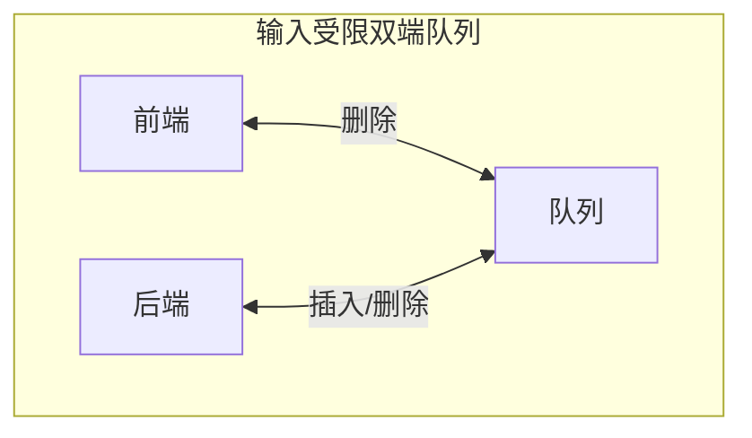

## 双端队列与受限双端队列 · 考研408核心笔记

> 双端队列（Deque）是队列的“集大成者”——**两端均可插入和删除**。在408中，考查重点并非其实现，而是**判断某个序列能否由某种受限双端队列产生**。在STL中，`deque`是`stack`和`queue`的默认底层容器。


### 1. 双端队列的定义

**双端队列（Deque，Double-Ended Queue）** ：允许从**两端**插入、**两端**删除的线性表。

> 双端队列兼具**栈**和**队列**的性质——两端都可操作，是限制最松的线性结构。

| 数据结构 | 插入端 | 删除端 |
|----------|--------|--------|
| 栈 | 仅一端 | 仅一端 |
| 队列 | 一端（队尾） | 另一端（队头） |
| **双端队列** | **两端均可** | **两端均可** |

栈和队列都是双端队列的**特例**：只在一端插删就是栈，一端只插、另一端只删就是队列。


### 2. 双端队列的基本操作

| 操作 | 含义 |
|------|------|
| `push_front(x)` | 在队头插入元素 $x$ |
| `push_back(x)` | 在队尾插入元素 $x$ |
| `pop_front()` | 删除并返回队头元素 |
| `pop_back()` | 删除并返回队尾元素 |
| `front()` | 获取队头元素（不删除） |
| `back()` | 获取队尾元素（不删除） |
| `empty()` | 判断队列是否为空 |
| `size()` | 返回队列中元素个数 |


### 3. 受限双端队列（408核心考点）

408真题考查的并非普通双端队列，而是两种**受限变体**：

> [!note] 关键理解
> 受限的是**动作**，不是**端**。输入受限 = 插入只能在一端（rear），删除两端都行；输出受限 = 删除只能在一端（front），插入两端都行。

#### 3.1 输入受限的双端队列

**定义**：只允许从**一端插入**，但从**两端删除**的线性表。



> [!tip] 输入受限的**关键性质**
> 由于只能从 rear 端插入，元素按编号顺序进入，**队内元素永远按编号递增排列**——front 端最小、rear 端最大。每一步能输出的只有**队内的最小值或最大值**。

#### 3.2 输出受限的双端队列

**定义**：只允许从**两端插入**，但从**一端删除**的线性表。


> [!tip] 输出受限的判定方法
> 没有输入受限那样的“队内有序”捷径。判定方法：**倒着剥端点**——把目标序列从后往前看，检查每一步“最后插入的那个元素是否位于当时的某一端”。


### 4. 考研考点：输出序列合法性判定（绝对重点）

408中双端队列的考题几乎都是：**给定输入序列，判断某输出序列能否由某种受限双端队列产生**。

> [!important] 基础结论
> 在**栈**中合法的输出序列，在**双端队列**中必定合法。因为双端队列的限制比栈更松。


#### 4.1 考点一：判断能否由输入受限双端队列产生

**判定方法**：由于输入受限，队列中元素永远按编号递增排列，front端最小、rear端最大。检查目标序列中**第一个元素**，它必须是当时队列的**最小元素**或**最大元素**。

> [!example] **经典判别序列：输入为 1 2 3 4**
>
> | 目标序列 | 栈 | 输入受限 | 说明 |
> |----------|-----|---------|------|
> | `4 1 3 2` | ✗ | ✅ | 栈产生不了（弹出4后栈顶是3，取不到1） |
> | `4 2 1 3` | ✗ | ✗ | 输入受限也无法产生 |
> | `3 1 2 4` | ✗ | ✅ |  |

#### 4.2 考点二：判断能否由输出受限双端队列产生

**判定方法**：倒着剥端点——从目标序列末尾开始倒推，检查每个元素是否曾位于队列端点。

> [!example] **2010年统考真题**（受限双端队列）
>
> **题目**：某队列允许在其两端进行入队操作，但仅允许在一端进行出队操作。元素 $a,b,c,d,e$ 依次入此队列后再进行出队操作，则**不可能**得到的出队序列是？
>
> **答案**：**C. dbcae**
>
> **解析**：出队序列 `d b c a e` 对应的队列内部序列为 `[B] e, a, c, b, d [A]`。元素 $b$ 在 $a$ 的右侧，说明 $b$ 必须从 A 端入队；但元素 $c$ 无论如何也无法插入到 $a, b$ 之间。因此该序列不可能产生。

#### 4.3 快速判定口诀

| 类型 | 判定方法 |
|------|----------|
| **输入受限** | 队内有序，每一步只能输出**当前最小或最大** |
| **输出受限** | 倒着剥端点，检查元素是否位于端点 |


### 5. STL源码剖析：`std::deque` 的实现

> 本节基于SGI STL源码及侯捷《STL源码剖析》。

#### 5.1 核心设计思想

`deque`（双端队列）是一种**双向开口的连续线性空间**容器。其最大特点：

1. **常数时间**的头尾插入/删除
2. **无容量（capacity）概念**——动态分段组合，随时增加新空间
3. **逻辑连续，物理分段**——对用户是连续的，底层由多个定量连续空间（缓冲区）构成

> `vector` 是“单向开口”，`deque` 是“双向开口”。`vector` 扩容需要“开空间→拷贝→释放”，代价极高；`deque` 扩容只需**新增一段连续空间**并串接到原空间，无需移动已有元素。

#### 5.2 中控器（Map）

`deque` 采用 **map（中控器）** 来管理分段空间：

- **map** 是一块连续空间，每个元素都是一个指针，指向一个**缓冲区（buffer）** 
- **缓冲区** 是实际存储数据的连续空间

```
┌─────────────────────────────────────────────────────────────┐
│                        中控器 (Map)                        │
│  ┌──────┬──────┬──────┬──────┬──────┬──────┬──────┐       │
│  │ ptr  │ ptr  │ ptr  │ ptr  │ ptr  │ ptr  │ ptr  │       │
│  └──┬───┴──┬───┴──┬───┴──┬───┴──┬───┴──┬───┴──┬───┘       │
│     │      │      │      │      │      │      │           │
│     ▼      ▼      ▼      ▼      ▼      ▼      ▼           │
│  ┌─────┐┌─────┐┌─────┐┌─────┐┌─────┐┌─────┐┌─────┐      │
│  │buf 0││buf 1││buf 2││buf 3││buf 4││buf 5││buf 6│      │
│  └─────┘└─────┘└─────┘└─────┘└─────┘└─────┘└─────┘      │
│  <─────────── 缓冲区（实际存储数据）─────────────────>     │
└─────────────────────────────────────────────────────────────┘
```

**关键源码**（SGI STL）：

```cpp
template <class T, class Alloc = alloc, size_t BufSiz = 0>
class deque {
protected:
    typedef pointer* map_pointer;
    map_pointer map;        // 指向中控器的指针
    size_type map_size;     // 中控器可容纳的指针数量
    iterator start;         // 指向第一个元素的迭代器
    iterator finish;        // 指向最后一个元素的后一个位置
};

```

#### 5.3 缓冲区大小

SGI STL中，缓冲区大小可指定（第三个模板参数），默认值 `0` 表示使用 **512 字节**：

```cpp
size_type buffer_size() {
    return BufSiz != 0 ? BufSiz : (sizeof(T) < 512 ? 512 / sizeof(T) : 1);
}
```

> 若元素大小小于512字节，可容纳 `512 / sizeof(T)` 个元素；若元素大于等于512字节，缓冲区只容纳 **1** 个元素。

#### 5.4 构造与内存管理

构造时，map的节点数至少为 **8**，最多为所需节点数加 **2**：

```cpp
template <class T, class Alloc, size_t BufSize>
void deque<T, Alloc, BufSize>::create_map_and_nodes(size_type num_elements) {
    size_type num_nodes = num_elements / buffer_size() + 1;
    map_size = max(initial_map_size(), num_nodes + 2);  // 至少8个，两侧各多1个
    map = map_allocator::allocate(map_size);
    
    // 将节点放在 map 的中央位置
    map_pointer nstart = map + (map_size - num_nodes) / 2;
    map_pointer nfinish = nstart + num_nodes - 1;
    
    // 为每个节点分配缓冲区
    for (cur = nstart; cur <= nfinish; ++cur)
        *cur = allocate_node();
    
    start.set_node(nstart);
    finish.set_node(nfinish);
}

```

> [!important] 为什么放在中央？
> 将节点放在map中央，头尾两端都预留了空间，使得 `push_front` 和 `push_back` 无需频繁扩容。

#### 5.5 迭代器

`deque` 维护的空间整体不连续，因此**不能使用原生指针作为迭代器**。

**迭代器的四个核心成员**：

```cpp
template <class T, class Ref, class Ptr>
struct _Deque_iterator {
    T* cur;      // 指向当前缓冲区中的当前位置
    T* first;    // 指向当前缓冲区的起始位置
    T* last;     // 指向当前缓冲区的末尾
    T** node;    // 指向中控器中当前缓冲区的位置
};

```

**迭代器如何实现“连续”假象**：

```cpp
_Self& operator++() {
    ++cur;
    if (cur == last) {           // 到达当前缓冲区末尾
        set_node(node + 1);      // 跳到下一个缓冲区
        cur = first;             // 指向新缓冲区的起始
    }
    return *this;
}

```

> `++` 操作需要判断是否到达缓冲区边界，若到达则通过中控器跳到下一个缓冲区。`+n` 等随机访问操作也需要跨缓冲区计算。

#### 5.6 核心操作源码

**`push_back` 尾部插入**：

```cpp
void push_back(const T& x) {
    if (finish.cur != finish.last - 1) {
        construct(finish.cur, x);
        ++finish.cur;
    } else {
        _M_push_back_aux(x);    // 当前缓冲区已满，需分配新缓冲区
    }
}
```

**`push_front` 头部插入**（同理）：

```cpp
void push_front(const T& x) {
    if (start.cur != start.first) {
        construct(start.cur - 1, x);
        --start.cur;
    } else {
        _M_push_front_aux(x);   // 头部缓冲区已满，分配新缓冲区
    }
}
```

**`insert` 中间插入**：

```cpp
iterator insert(iterator pos, const T& x) {
    if (pos.cur == start.cur) {      // 插入位置在头部
        push_front(x);
        return start;
    } else if (pos.cur == finish.cur) { // 插入位置在尾部
        push_back(x);
        return finish - 1;
    } else {
        return _M_insert_aux(pos, x);   // 中间插入
    }
}
```

> `_M_insert_aux` 会比较插入点前后元素数量，**选择元素较少的一端进行移动**，以最小化拷贝次数。

**`erase` 删除**：

```cpp
iterator erase(iterator pos) {
    iterator next = pos;
    ++next;
    difference_type n = pos - start;
    if (n < size() - n) {        // 前面的元素少
        copy_backward(start, pos, next);
        pop_front();
    } else {                      // 后面的元素少
        copy(next, finish, pos);
        pop_back();
    }
    return start + n;
}
```

> 与 `insert` 类似，`erase` 也采用**移动较少元素**的策略。

**随机访问 `operator[]`** ：

```cpp
reference operator[](size_type n) {
    return start[n];   // 通过迭代器实现，需两次指针解引用
}
```

> `deque` 的下标访问需要**两次指针解引用**（先找缓冲区，再找元素），效率低于 `vector` 的一次解引用。

#### 5.7 时间复杂度总结

| 操作 | 时间复杂度 |
|------|-----------|
| 头部插入/删除（`push_front`/`pop_front`） | $O(1)$ |
| 尾部插入/删除（`push_back`/`pop_back`） | $O(1)$ |
| 随机访问（`operator[]`） | $O(1)$（间接） |
| 中间插入/删除（`insert`/`erase`） | $O(n)$（选择移动较少一端） |

#### 5.8 为什么 `stack` 和 `queue` 默认用 `deque`？

`stack` 和 `queue` 是**容器适配器（Container Adapter）** ，默认以 `deque` 为底层容器：

| 原因 | 说明 |
|------|------|
| **双端操作高效** | `deque` 头尾插入/删除均为 $O(1)$，完美匹配栈和队列需求 |
| **无扩容抖动** | `deque` 无需整体搬移元素，`vector` 扩容需拷贝所有元素 |
| **优于 `list`** | `deque` 内存连续性强于 `list`，缓存命中率更高 |


### 6. 408命题规律总结

| 考点 | 考查方式 |
|------|----------|
| **受限双端队列出队序列** | 选择题（判断某序列是否可由输入/输出受限双端队列产生） |
| **双端队列模拟操作** | 给出入队操作，判断出队序列 |
| **STL deque特性** | 时间复杂度、底层实现、与vector的区别 |
| **容器适配器** | stack和queue默认以deque为底层容器 |

> [!important] 核心结论
> 408 关心的不是 `deque` 怎么实现（实现就是循环队列的两端版），而是 **“某个序列能不能由某种受限双端队列产生”** 。方法与出栈序列判定同源——**模拟**，只是每种受限形式的可用动作集不同。


### Obsidian 双向链接建议

- `[[队列的定义概念]]`：双端队列是队列的扩展
- `[[栈的定义概念]]`：栈是双端队列的特例
- `[[deque源码剖析]]`：STL deque 的完整实现
- `[[stack与queue源码剖析]]`：stack和queue以deque为底层容器

---

如需我继续展开 **“输入受限/输出受限双端队列的判定题完整解法”** 或 **“双端队列的循环数组实现”** ，随时告诉我。