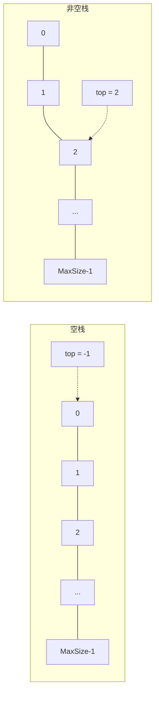
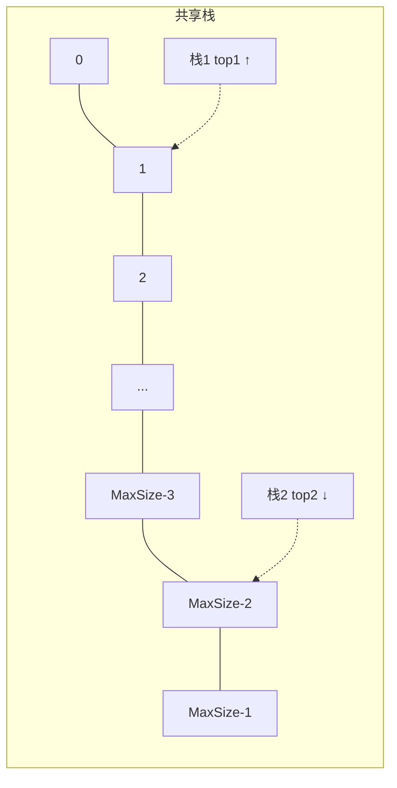
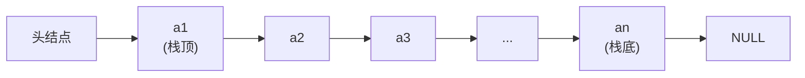

## 栈 · 考研408核心笔记

> 栈是**操作受限**的线性表，只允许在一端（栈顶）进行插入和删除操作，具有 **LIFO（Last In First Out，后进先出）** 的特性。在408中，栈是考察频率最高的线性结构之一，常与递归、表达式求值、括号匹配等结合出题。在SGI STL中，stack被设计为**容器适配器（Container Adapter）** ，而非独立容器。


### 1. 栈的定义

**栈（Stack）** ：只允许在一端进行插入或删除操作的线性表。

- **栈顶（Top）** ：允许插入和删除的一端。
- **栈底（Bottom）** ：固定不动的一端。
- **空栈**：不含任何元素的栈。

**特点**：后进先出（LIFO，Last In First Out）。

> [!note] 数一关联
> 栈的后进先出特性可用**递推数列**描述。$n$ 个不同元素进栈的出栈序列个数为**卡特兰数（Catalan Number）** ：
> $$
> C_n = \frac{1}{n+1}\binom{2n}{n}
> $$
> 如 $n=3$ 时，出栈序列有 $C_3 = \frac{1}{4}\binom{6}{3} = 5$ 种。


### 2. 栈的基本操作（ADT定义）

```text
ADT Stack {
    数据对象：D = {a_i | a_i ∈ ElemType, i = 1,2,...,n, n ≥ 0}
    数据关系：R = {<a_{i-1}, a_i> | a_{i-1}, a_i ∈ D, i = 2,...,n}
    基本操作：
        InitStack(&S)          // 初始化，构造空栈
        DestroyStack(&S)       // 销毁栈，释放空间
        Push(&S, e)            // 入栈，将 e 压入栈顶
        Pop(&S, &e)            // 出栈，弹出栈顶元素并用 e 返回
        GetTop(S, &e)          // 取栈顶元素，不弹出
        StackEmpty(S)          // 判断栈是否为空
        StackLength(S)         // 返回栈中元素个数
}
```


### 3. 栈的顺序存储实现（顺序栈）

#### 3.1 顺序栈的定义

```cpp
#define MaxSize 100

typedef struct {
    ElemType data[MaxSize];   // 存储栈中元素
    int top;                  // 栈顶指针
} SqStack;
```

- `top` 指向栈顶元素时，初始 `top = -1`（空栈）
- 入栈：先 `top++`，再 `data[top] = e`
- 出栈：先 `e = data[top]`，再 `top--`



> 栈中元素从 `data[0]` 开始依次存放，`top` 指向最后一个元素的索引位置。

#### 3.2 顺序栈的基本操作

```cpp
// 初始化
void InitStack(SqStack &S) {
    S.top = -1;
}

// 判空
bool StackEmpty(SqStack S) {
    return S.top == -1;
}

// 判满
bool StackFull(SqStack S) {
    return S.top == MaxSize - 1;
}

// 入栈
bool Push(SqStack &S, ElemType e) {
    if (StackFull(S)) return false;   // 栈满
    S.data[++S.top] = e;              // top先加1，再赋值
    return true;
}

// 出栈
bool Pop(SqStack &S, ElemType &e) {
    if (StackEmpty(S)) return false;  // 栈空
    e = S.data[S.top--];              // 先取值，top再减1
    return true;
}

// 取栈顶
bool GetTop(SqStack S, ElemType &e) {
    if (StackEmpty(S)) return false;
    e = S.data[S.top];
    return true;
}
```

> [!warning] 易错
> 入栈时**先移动 top 再赋值**，出栈时**先取值再移动 top**，顺序不能颠倒！

#### 3.3 共享栈（考研考点）

两个栈共享同一数组空间，从两端向中间生长：

```cpp
typedef struct {
    ElemType data[MaxSize];
    int top1;          // 栈1栈顶，从0开始向上
    int top2;          // 栈2栈顶，从MaxSize-1开始向下
} ShareStack;
```



- 初始化：`top1 = -1`，`top2 = MaxSize`
- 判满条件：`top1 + 1 == top2`
- 入栈时分别从两端向中间生长，提高了空间利用率


### 4. 栈的链式存储实现（链栈）

#### 4.1 链栈的定义

链栈本质上是**带头结点的单链表**，但只允许在**头结点之后**进行插入和删除。

```cpp
typedef struct StackNode {
    ElemType data;
    struct StackNode *next;
} StackNode, *LinkStack;
```



> 链栈不存在栈满问题（除非内存耗尽），且**插入删除都在链表头部**，时间复杂度均为 $O(1)$。

#### 4.2 链栈的基本操作

```cpp
// 初始化
void InitStack(LinkStack &S) {
    S = (StackNode*)malloc(sizeof(StackNode));
    S->next = NULL;
}

// 判空
bool StackEmpty(LinkStack S) {
    return S->next == NULL;
}

// 入栈（头插法）
bool Push(LinkStack &S, ElemType e) {
    StackNode *s = (StackNode*)malloc(sizeof(StackNode));
    s->data = e;
    s->next = S->next;    // 新结点指向原栈顶
    S->next = s;          // 头结点指向新结点
    return true;
}

// 出栈（头删法）
bool Pop(LinkStack &S, ElemType &e) {
    if (StackEmpty(S)) return false;
    StackNode *p = S->next;
    e = p->data;
    S->next = p->next;
    free(p);
    return true;
}
```

> [!tip] 与顺序栈的对比
> 链栈无需判满，入栈/出栈均为 $O(1)$，但每个结点需要额外存储 `next` 指针，存储密度较低。


### 5. STL源码剖析：`std::stack` 的实现

> 本节基于 SGI STL 源码及《STL源码剖析》（侯捷），深入分析容器适配器 `stack` 的底层实现原理。

#### 5.1 容器适配器（Container Adapter）的本质

在SGI STL中，`stack` **不被归类为容器（container）** ，而被归类为**容器适配器（container adapter）** 。它本身不实现底层存储逻辑，而是对已有顺序容器进行封装，对外提供严格的 LIFO 语义。

**核心思想**：`stack` 的所有操作都**完全委托**给底层容器对象，自身只做**接口裁剪与语义约束**——这是典型的**适配器设计模式（Adapter Pattern）** 。

#### 5.2 模板声明与核心成员

SGI STL 中 `stack` 的模板声明：

```cpp
template <class T, class Sequence = deque<T> >
class stack {
    // ...
};
```

- **`T`** ：存储元素的类型
- **`Sequence`** ：底层容器类型，**默认使用 `deque<T>`** 

**核心成员变量**：

```cpp
protected:
    Sequence c;    // 底层容器对象，所有栈操作都委托给它
```

**关键设计决策**：`stack` 只有一个受保护成员变量 `c`，所有对外接口（`push`、`pop`、`top`、`empty`、`size`）都是通过调用 `c` 的对应方法实现的。

#### 5.3 SGI STL `stack` 完整源码剖析

以下是 SGI STL 中 `<stl_stack.h>` 的核心源码（带注释）：

```cpp
template <class T, class Sequence = deque<T> >
class stack {
    // 友元声明：支持比较操作
    friend bool operator== (const stack&, const stack&);
    friend bool operator<  (const stack&, const stack&);

public:
    // 类型定义（全部来自底层容器 Sequence）
    typedef typename Sequence::value_type      value_type;
    typedef typename Sequence::size_type       size_type;
    typedef typename Sequence::reference       reference;
    typedef typename Sequence::const_reference const_reference;

protected:
    Sequence c;    // 底层容器 —— 一切操作都委托给它

public:
    // 判空：委托给 c.empty()
    bool empty() const { return c.empty(); }

    // 求长度：委托给 c.size()
    size_type size() const { return c.size(); }

    // 取栈顶：委托给 c.back()（返回引用）
    reference top() { return c.back(); }
    const_reference top() const { return c.back(); }

    // 入栈：委托给 c.push_back()
    void push(const value_type& x) { c.push_back(x); }

    // 出栈：委托给 c.pop_back()（注意：不返回元素）
    void pop() { c.pop_back(); }
};

// 比较操作：直接比较底层容器
template <class T, class Sequence>
bool operator==(const stack<T, Sequence>& x, const stack<T, Sequence>& y) {
    return x.c == y.c;
}
```

> [!important] 源码关键点
> 1. **`top()` 返回引用**：允许直接修改栈顶元素
> 2. **`pop()` 不返回值**：若需获取栈顶元素，必须先调 `top()` 再调 `pop()`
> 3. **无迭代器**：栈不允许遍历，因此不提供迭代器
> 4. **比较操作**：`==` 和 `<` 直接比较底层容器，其余比较运算符由它们推导

#### 5.4 为什么默认底层容器是 `deque`？

`stack` 只在尾部操作，理论上 `vector`、`deque`、`list` 都能作为底层容器。最终选择 `deque` 是综合性能、稳定性、内存特性的最优解。

| 对比项 | `deque`（默认） | `vector` | `list` |
|--------|----------------|----------|--------|
| **尾部插入稳定性** | 稳定 $O(1)$，无扩容抖动 | 均摊 $O(1)$，扩容时需拷贝所有元素 | $O(1)$ |
| **内存连续性** | 分段连续，无需大块连续内存 | 需整块连续内存，大栈易失败 | 完全不连续 |
| **内存开销** | 低 | 最低 | 高（每个结点两个指针） |
| **缓存局部性** | 好 | 最好 | 差 |

**选择 `deque` 的核心原因**：

1. **避免扩容性能抖动**：`vector` 扩容时需要重新分配整块连续内存 + 拷贝所有元素，有明显性能开销和内存峰值；`deque` 分段存储，扩容只需新增数据块，不移动已有元素，`push_back` 是**稳定的 $O(1)$**
2. **内存利用率更高**：`vector` 需要大块连续内存，大栈场景易失败；`deque` 分段存储，无此问题
3. **优于 `list`**：`list` 每个结点需额外存储前后指针，内存开销大，且结点地址不连续，缓存命中率极低

> [!tip] 考研补充
> 虽然默认是 `deque`，但用户可以手动指定底层容器：
> ```cpp
> stack<int, vector<int>> s1;   // 用 vector 做底层
> stack<int, list<int>> s2;     // 用 list 做底层
> ```
> 只要底层容器支持 `back()`、`push_back()`、`pop_back()`、`empty()`、`size()` 即可。


### 6. 顺序栈 vs 链栈 vs STL stack

| 对比项 | 顺序栈 | 链栈 | STL `std::stack` |
|--------|--------|------|------------------|
| 存储方式 | 数组（连续） | 链表（不连续） | 委托给底层容器（默认 `deque`） |
| 判满 | `top == MaxSize-1` | 无需判满 | 取决于底层容器 |
| 入栈 | $O(1)$ | $O(1)$ | $O(1)$（底层容器决定） |
| 出栈 | $O(1)$ | $O(1)$ | $O(1)$（底层容器决定） |
| 存储密度 | 高 | 低 | 取决于底层容器 |
| 迭代器 | 无 | 无 | 无 |
| 设计模式 | — | — | 适配器模式 |


### 7. 408 常考点

| 考点 | 说明 |
|------|------|
| **出栈序列合法性** | 给定入栈顺序（如 1,2,3），判断出栈序列是否合法（如 3,1,2 非法） |
| **栈的递归应用** | 递归过程本质是系统栈的压入和弹出 |
| **表达式求值** | 中缀表达式转后缀表达式，利用栈计算 |
| **括号匹配** | 利用栈判断括号是否成对匹配 |
| **共享栈** | 两个栈共享一个数组空间，求最大可利用空间 |
| **卡特兰数** | $n$ 个元素出栈序列数为 $\frac{1}{n+1}\binom{2n}{n}$ |
| **STL stack** | 容器适配器、默认底层容器为 `deque`、无迭代器 |


### Obsidian 双向链接建议

- [[线性表]]：栈是操作受限的线性表
- [[队列]]：栈和队列的对比
- `[[递归与栈]]`：递归调用的栈帧分析
- [[卡特兰数]]：出栈序列计数

---

如需我继续展开 **“栈的经典应用（表达式求值、括号匹配、递归改非递归）”** ，随时告诉我。