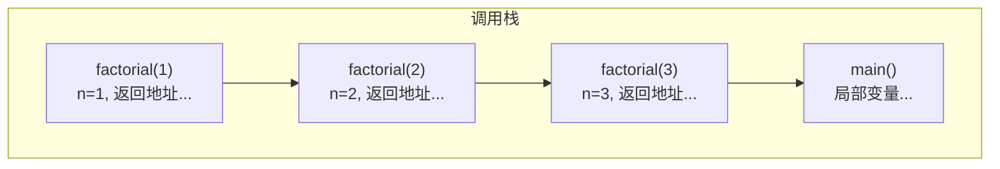
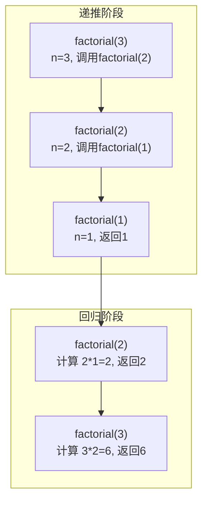

## 栈与递归 · 考研408核心笔记

> 递归是算法设计中最重要的思想之一，而**系统栈**是递归能够实现的底层支撑。理解栈与递归的关系，是理解递归算法执行过程、分析递归算法时空复杂度、以及将递归算法改写为迭代算法的前提。在408中，递归相关题目每年必考；在数一中，递推数列与递归算法同构；在英语一中，`recursion`、`iterative` 等词在科技类阅读中偶有出现。


### 1. 递归的定义

**递归（Recursion）** ：一个函数直接或间接调用自身的编程方式。

- **直接递归**：函数 `f` 调用自身
- **间接递归**：函数 `f` 调用 `g`，`g` 再调用 `f`

```cpp
// 直接递归：阶乘
int factorial(int n) {
    if (n <= 1) return 1;           // 递归基（终止条件）
    return n * factorial(n - 1);    // 递归调用
}

// 间接递归（示例）
void f(int n) { if (n > 0) g(n - 1); }
void g(int n) { if (n > 0) f(n - 1); }
```

**递归的三要素**：

| 要素 | 说明 | 示例（阶乘） |
|------|------|-------------|
| **递归基（Base Case）** | 递归终止条件，不再调用自身 | `n <= 1` |
| **递归体（Recursive Case）** | 将大问题分解为子问题，调用自身 | `n * factorial(n-1)` |
| **递推关系** | 问题规模缩小的规律 | $f(n) = n \cdot f(n-1)$ |


### 2. 递归的执行过程：系统栈

#### 2.1 系统栈（调用栈）

每次函数调用时，系统会在**调用栈（Call Stack）** 顶部为本次调用分配一个**栈帧（Stack Frame）** ，用于存储：

| 栈帧内容 | 作用 |
|----------|------|
| **返回地址** | 函数执行完后，返回到调用处的下一条指令地址 |
| **局部变量** | 函数内部定义的非静态变量 |
| **函数参数** | 调用时传入的实参 |
| **保存的寄存器状态** | 调用前需保存的寄存器值，用于恢复现场 |
| **临时变量** | 编译器生成的中间计算结果 |



> 函数返回时，其栈帧被**弹出**（销毁），控制权返回给调用者（通过返回地址）。

#### 2.2 递归执行过程示例：`factorial(3)`

```cpp
int factorial(int n) {
    if (n <= 1) return 1;
    return n * factorial(n - 1);
}
```

调用 `factorial(3)` 的执行过程：



| 阶段 | 操作 | 栈变化 |
|------|------|--------|
| 递推 | 调用 `factorial(3)` | 压入 `factorial(3)` 栈帧 |
| 递推 | 调用 `factorial(2)` | 压入 `factorial(2)` 栈帧 |
| 递推 | 调用 `factorial(1)` | 压入 `factorial(1)` 栈帧 |
| 回归 | `factorial(1)` 返回 1 | 弹出 `factorial(1)` 栈帧 |
| 回归 | `factorial(2)` 返回 2 | 弹出 `factorial(2)` 栈帧 |
| 回归 | `factorial(3)` 返回 6 | 弹出 `factorial(3)` 栈帧 |

#### 2.3 递归的时空复杂度

| 指标 | 公式 | 说明 |
|------|------|------|
| 时间复杂度 | $T(n) =$ 递归调用次数 × 每次操作时间 | 由递推关系求解 |
| 空间复杂度 | $S(n) =$ 递归深度 × 每帧空间 | **关键在于递归深度** |

> 递归的空间复杂度**不等于 $O(1)$**！每次递归调用都会占用栈空间，因此递归深度直接决定空间复杂度。

**常见递归复杂度**：

| 递归形式 | 递推关系 | 时间复杂度 | 空间复杂度 | 示例 |
|----------|----------|-----------|-----------|------|
| 线性递归 | $T(n) = T(n-1) + O(1)$ | $O(n)$ | $O(n)$ | 阶乘、求和 |
| 线性递归（带线性操作） | $T(n) = T(n-1) + O(n)$ | $O(n^2)$ | $O(n)$ | 递归版选择排序 |
| 二分递归 | $T(n) = 2T(n/2) + O(1)$ | $O(n)$ | $O(\log n)$ | 遍历平衡树 |
| 二分递归（带线性操作） | $T(n) = 2T(n/2) + O(n)$ | $O(n\log n)$ | $O(\log n)$ | 归并排序 |
| 指数递归 | $T(n) = T(n-1) + T(n-2) + O(1)$ | $O(2^n)$ | $O(n)$ | 斐波那契（朴素） |


### 3. 递归与迭代的转换

#### 3.1 尾递归（Tail Recursion）

**定义**：递归调用是函数体中**最后一条语句**，且返回值直接返回递归调用的结果。

```cpp
// 尾递归：factorial 的尾递归版本
int factorial_tail(int n, int acc = 1) {
    if (n <= 1) return acc;
    return factorial_tail(n - 1, n * acc);   // 最后一步只有递归调用
}

// 非尾递归：普通阶乘
int factorial(int n) {
    if (n <= 1) return 1;
    return n * factorial(n - 1);              // 最后一步还要乘 n
}
```

> [!important] 尾递归的优势
> 尾递归的递归调用是最后一步，**不需要保存当前栈帧**（因为没有后续操作）。优化编译器（如 GCC 的 `-O2`）可以将尾递归**优化为迭代**，空间复杂度从 $O(n)$ 降为 $O(1)$。
>
> 但需注意：**C++ 标准不要求编译器必须做尾递归优化**。在考研题目中，若未说明编译器支持 TCO，递归空间复杂度仍按 $O(n)$ 计算。

#### 3.2 递归转迭代（通用方法）

**核心思想**：用**显式栈**模拟系统栈，手动管理栈帧。

```cpp
// 递归版本：二叉树前序遍历
void preorder_recursive(TreeNode* root) {
    if (!root) return;
    visit(root);
    preorder_recursive(root->left);
    preorder_recursive(root->right);
}

// 迭代版本：用显式栈模拟
void preorder_iterative(TreeNode* root) {
    if (!root) return;
    stack<TreeNode*> stk;
    stk.push(root);
    while (!stk.empty()) {
        TreeNode* node = stk.top(); stk.pop();
        visit(node);
        if (node->right) stk.push(node->right);  // 右先入栈（左后出）
        if (node->left) stk.push(node->left);
    }
}
```


### 4. 递归的典型应用

| 应用场景 | 说明 | 示例 |
|----------|------|------|
| **树/图的遍历** | 天然递归结构 | 前/中/后序遍历、DFS |
| **分治算法** | 大问题分解为同构子问题 | 归并排序、快速排序 |
| **回溯算法** | 探索所有可能解 | N皇后、迷宫、全排列 |
| **动态规划（记忆化）** | 递归+备忘录 | 斐波那契、背包问题 |
| **数学定义** | 递归定义的函数 | 阶乘、斐波那契数列 |
| **表达式求值** | 递归下降解析 | 语法分析、表达式计算 |
| **文件系统遍历** | 目录结构天然递归 | 搜索所有子目录 |
| **链表操作** | 递归处理链式结构 | 链表反转、归并链表 |


### 5. 考研面试常考点

#### 5.1 递归的优缺点

| 优点 | 缺点 |
|------|------|
| 代码简洁、逻辑清晰，易于理解 | 空间开销大（栈帧累积） |
| 天然适合树/图/分治问题 | 调用开销大，效率低于迭代 |
| 易于证明正确性（数学归纳法） | 递归深度过大可能**栈溢出** |

#### 5.2 常见考题类型

| 题型 | 示例 | 考点 |
|------|------|------|
| **递归执行过程分析** | 给定递归函数，求 `f(5)` 的返回值 | 手动模拟递归调用 |
| **递归转非递归** | 将某递归函数改写为迭代版本 | 显式栈的使用 |
| **递归复杂度分析** | 分析某递归算法的时间/空间复杂度 | 递推关系求解 |
| **尾递归判断** | 指出下面哪个是尾递归函数 | 尾递归定义 |
| **递归深度计算** | 某递归函数的最大递归深度 | 递归深度与问题规模的关系 |

> [!example] 典型例题
>
> **题目**：分析以下递归函数的时空复杂度。
> ```cpp
> void f(int n) {
>     if (n <= 0) return;
>     for (int i = 0; i < n; i++) {
>         cout << i;
>     }
>     f(n / 2);
> }
> ```
>
> **解**：
> - 递归深度：$O(\log n)$（每次 $n$ 减半）
> - 每次调用执行 $O(n)$ 次循环
> - 递推关系：$T(n) = T(n/2) + O(n)$
> - 由主定理，$T(n) = O(n)$
> - 空间复杂度：$O(\log n)$（递归栈深度）
>
> **答案**：时间复杂度 $O(n)$，空间复杂度 $O(\log n)$


### 6. 数一关联：递推数列与递归

递归算法的递推关系 $T(n) = T(n-1) + O(1)$ 在数学上对应**一阶线性递推数列**：

| 递归类型 | 递推关系 | 数一对应 |
|----------|----------|----------|
| 线性递归 | $T(n) = T(n-1) + O(1)$ | 等差数列 |
| 分治递归 | $T(n) = 2T(n/2) + O(n)$ | 归并排序递推式 |
| 指数递归 | $F_n = F_{n-1} + F_{n-2}$ | 斐波那契数列 |

数一中求解递推数列的方法（特征方程、迭代法、主定理）可直接用于递归算法的复杂度分析。


### 7. 408 命题规律总结

| 考点 | 考查方式 | 频率 |
|------|----------|------|
| **递归执行过程** | 选择题（栈帧变化、返回值） | ⭐⭐⭐⭐ |
| **递归转迭代** | 算法设计题（用栈模拟递归） | ⭐⭐⭐ |
| **尾递归判断与优化** | 选择题/简答题 | ⭐⭐ |
| **递归时空复杂度** | 选择题（递推关系求解） | ⭐⭐⭐⭐⭐ |
| **递归与系统栈** | 选择题（递归深度、栈溢出） | ⭐⭐⭐⭐ |

> [!important] 核心结论
> 递归的本质是**系统栈的自动管理**。理解这一点，就理解了递归的执行过程、空间开销、以及为什么尾递归可以优化为迭代。
>
> 递归的空间复杂度**不能仅看代码中有没有申请数组**——递归深度带来的栈空间开销是递归算法空间复杂度的主要来源。


### Obsidian 双向链接建议

- [[栈]]：系统栈与 ADT 栈的本质联系
- `[[空间复杂度的栈帧分析]]`：递归栈空间的详细分析方法
- [[算法效率的度量]]：递归算法的时间/空间复杂度分析
- `[[栈在表达式求值中的应用]]`：递归下降解析器中的栈
- `[[树与二叉树]]`：树的递归遍历

---

如需我继续展开 **“递归的经典例题集（含递归转非递归的完整代码）”** 或 **“分治递归与主定理详解”** ，随时告诉我。