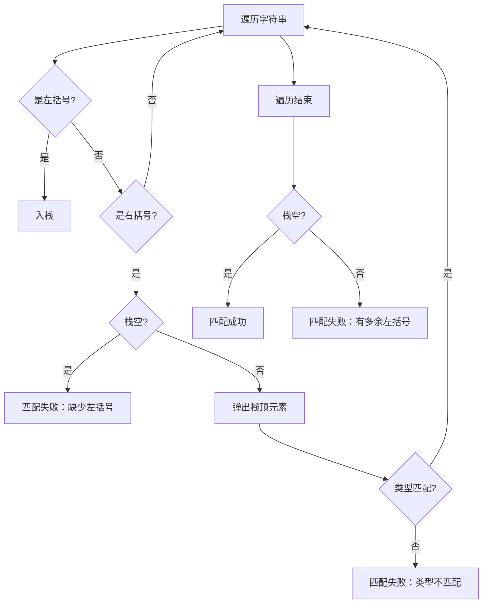

## 栈在括号匹配中的应用 · 考研408核心笔记

> 括号匹配是栈最经典的应用之一，也是408中栈的必考考点。它体现了栈 **“后进先出”** 特性在**嵌套结构匹配**中的天然优势。在编译原理中，括号匹配是**语法分析**的基础；在数一中，嵌套结构对应**递推关系**；在英语一中，`parentheses`、`bracket`、`nesting` 等词在科技类阅读中偶有出现。


### 1. 问题描述

给定一个字符串，其中包含多种括号：圆括号 `()`、方括号 `[]`、花括号 `{}`。设计算法判断该字符串中的括号是否**正确匹配**。

**正确匹配的条件**：

| 条件 | 说明 |
|------|------|
| ① 左右括号**成对出现** | 每个左括号都有对应的右括号 |
| ② 括号**类型匹配** | `(` 与 `)` 匹配，`[` 与 `]` 匹配，`{` 与 `}` 匹配 |
| ③ 括号**顺序正确** | 右括号必须与最近的未匹配左括号匹配（嵌套结构） |

**正确示例**：
- `()`、`[]`、`{}`、`()[]{}`、`{[()]}`、`{()}[]`

**错误示例**：
- `(]`、`([)]`、`(()`、`)(`


### 2. 算法思想

**核心思路**：利用栈的 **LIFO** 特性，**后出现的左括号先被匹配**。




### 3. 代码实现（C++）

```cpp
#include <stack>
#include <string>
using namespace std;

bool isMatchingPair(char left, char right) {
    return (left == '(' && right == ')') ||
           (left == '[' && right == ']') ||
           (left == '{' && right == '}');
}

bool isBalanced(const string& str) {
    stack<char> stk;

    for (char ch : str) {
        // 左括号：入栈
        if (ch == '(' || ch == '[' || ch == '{') {
            stk.push(ch);
        }
        // 右括号：检查匹配
        else if (ch == ')' || ch == ']' || ch == '}') {
            // 情况1：栈空 → 缺少左括号
            if (stk.empty()) return false;

            // 情况2：弹出栈顶，检查是否匹配
            char top = stk.top();
            stk.pop();
            if (!isMatchingPair(top, ch)) return false;
        }
        // 非括号字符：跳过
    }

    // 遍历结束，栈空 → 匹配成功；栈非空 → 有多余左括号
    return stk.empty();
}
```


### 4. 执行过程示例

**输入**：`{[()]}`

| 步骤 | 当前字符 | 操作 | 栈 |
|------|----------|------|-----|
| 1 | `{` | 左括号，入栈 | `{` |
| 2 | `[` | 左括号，入栈 | `{ [` |
| 3 | `(` | 左括号，入栈 | `{ [ (` |
| 4 | `)` | 右括号，弹出 `(`，匹配 ✅ | `{ [` |
| 5 | `]` | 右括号，弹出 `[`，匹配 ✅ | `{` |
| 6 | `}` | 右括号，弹出 `{`，匹配 ✅ | 空 |
| 结束 | — | 栈空 ✅ | 空 |

**输出**：匹配成功 ✅


### 5. 多类型括号匹配的细节

#### 5.1 为什么单类型括号可以用计数器？

若只有 `()` 一种括号，只需一个计数器：
- 遇到 `(` → `++`
- 遇到 `)` → `--`
- 若中间 `count < 0` 或最终 `count != 0`，则错误

#### 5.2 为什么多类型括号必须用栈？

多类型括号时，计数器无法解决**类型匹配**问题。以 `([)]` 为例：
- 栈方案：`(` 入栈，`[` 入栈，遇到 `)` 时栈顶是 `[`，类型不匹配 → 正确报错
- 计数器方案：左右括号数量都匹配，但顺序错误，无法检测

> [!important] 核心结论
> 多类型括号匹配**必须用栈**，因为栈记录了**括号的嵌套顺序**。


### 6. 408 常见考法

| 题型 | 示例 | 核心考点 |
|------|------|----------|
| **选择题** | 给定字符串，判断括号匹配是否正确 | 模拟栈操作 |
| **填空题** | 补全括号匹配算法的代码 | 栈的基本操作 |
| **算法设计题** | 设计括号匹配算法，要求 $O(n)$ 时间 | 栈的ADT操作 |
| **判断题** | 判断多种括号是否正确匹配 | 多类型匹配细节 |
| **递归关联** | 递归调用与栈的关系 | 系统栈原理 |


### 7. 扩展应用

| 场景 | 说明 |
|------|------|
| **HTML/XML标签匹配** | `<div>` 和 `</div>` 的配对，本质相同 |
| **编译原理语法分析** | 表达式语法中的括号嵌套 |
| **表达式求值** | 中缀表达式转后缀表达式 |
| **递归调用跟踪** | 函数调用的系统栈与括号嵌套同构 |
| **JSON/XML格式验证** | 大括号、方括号的嵌套结构 |


### Obsidian 双向链接建议

- `[[栈的定义概念]]`：栈的ADT定义与基本操作
- `[[栈在表达式求值中的应用]]`：栈的另一个经典应用
- `[[递归与栈]]`：递归调用的系统栈本质
- `[[STL stack源码剖析]]`：std::stack的底层实现

---

如需我继续展开 **“栈在表达式求值中的应用”** 或 **“栈在递归调用中的应用”** ，随时告诉我。