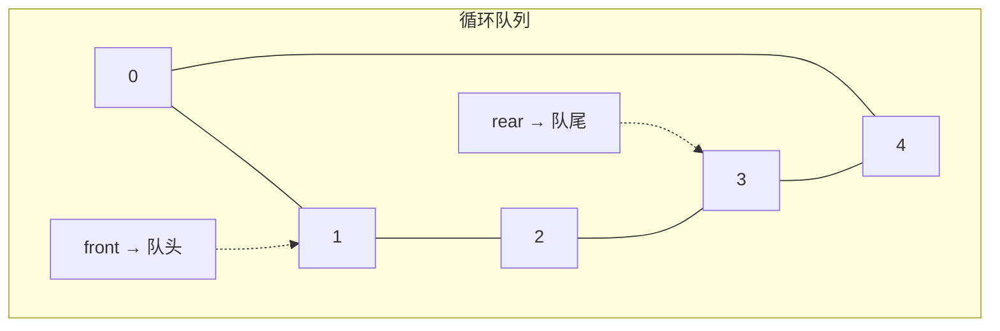
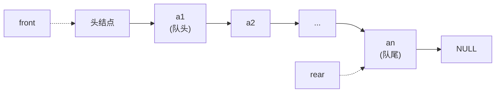

## 队列 · 考研408核心笔记

> 队列是**操作受限**的线性表，只允许在**队尾**插入、**队头**删除，具有 **FIFO（First In First Out，先进先出）** 的特性。在408中，队列是BFS、层次遍历、缓冲区管理等算法的核心数据结构。在数一中，队列的“先进先出”特性与数列的递推顺序相关；在英语一中，`queue`、`enqueue`、`dequeue` 等词在科技类阅读中偶有出现。


### 1. 队列的定义

**队列（Queue）** ：只允许在一端（队尾）进行插入、在另一端（队头）进行删除的线性表。

- **队头（Front）** ：允许删除的一端。
- **队尾（Rear）** ：允许插入的一端。
- **空队列**：不含任何元素的队列。

**特点**：先进先出（FIFO，First In First Out）。

> [!note] 数一关联
> 队列的FIFO特性可类比**排队论**中的顾客服务模型——先到达的顾客先被服务，是随机过程（数一概率论）的基础概念之一。


### 2. 队列的基本操作（ADT定义）

```text
ADT Queue {
    数据对象：D = {a_i | a_i ∈ ElemType, i = 1,2,...,n, n ≥ 0}
    数据关系：R = {<a_{i-1}, a_i> | a_{i-1}, a_i ∈ D, i = 2,...,n}
    基本操作：
        InitQueue(&Q)          // 初始化，构造空队列
        DestroyQueue(&Q)       // 销毁队列，释放空间
        EnQueue(&Q, e)         // 入队，将 e 插入队尾
        DeQueue(&Q, &e)        // 出队，删除队头元素并用 e 返回
        GetHead(Q, &e)         // 取队头元素，不删除
        QueueEmpty(Q)          // 判断队列是否为空
        QueueLength(Q)         // 返回队列中元素个数
}
```

> [!important] 408命题方向
> - 给出一个操作序列，判断最终队列状态
> - 循环队列的判空/判满条件
> - 双端队列的合法性判断


### 3. 队列的顺序存储实现（循环队列）

#### 3.1 顺序队列的定义

```cpp
#define MaxSize 100

typedef struct {
    ElemType data[MaxSize];   // 存储队列中元素
    int front;                // 队头指针
    int rear;                 // 队尾指针
} SqQueue;
```

**初始状态**：`front = rear = 0`

**关键问题**：普通顺序队列存在“假溢出”——队尾已满但队头还有空闲空间。

**解决方案**：**循环队列**——将数组视为首尾相接的环。



#### 3.2 循环队列的核心公式（408必背）

| 操作      | 公式                                       | 说明              |
| ------- | ---------------------------------------- | --------------- |
| 入队      | `Q.rear = (Q.rear + 1) % MaxSize`        | 队尾指针后移          |
| 出队      | `Q.front = (Q.front + 1) % MaxSize`      | 队头指针后移          |
| 判空      | `Q.front == Q.rear`                      | 队头等于队尾          |
| 判满（方式一） | `(Q.rear + 1) % MaxSize == Q.front`      | **牺牲一个单元**区分空/满 |
| 判满（方式二） | 增设 `size` 或 `tag` 变量                     | 不浪费空间           |
| 队列长度    | `(Q.rear - Q.front + MaxSize) % MaxSize` | 元素个数            |

> [!warning] 易错
> 循环队列的判空和判满条件相同（`front == rear`），因此必须**牺牲一个存储单元**来区分空和满。考研中默认采用“牺牲一个单元”的方式。

#### 3.3 顺序队列的基本操作

```cpp
// 初始化
void InitQueue(SqQueue &Q) {
    Q.front = Q.rear = 0;
}

// 判空
bool QueueEmpty(SqQueue Q) {
    return Q.front == Q.rear;
}

// 判满（牺牲一个单元）
bool QueueFull(SqQueue Q) {
    return (Q.rear + 1) % MaxSize == Q.front;
}

// 入队
bool EnQueue(SqQueue &Q, ElemType e) {
    if (QueueFull(Q)) return false;
    Q.data[Q.rear] = e;
    Q.rear = (Q.rear + 1) % MaxSize;
    return true;
}

// 出队
bool DeQueue(SqQueue &Q, ElemType &e) {
    if (QueueEmpty(Q)) return false;
    e = Q.data[Q.front];
    Q.front = (Q.front + 1) % MaxSize;
    return true;
}

// 取队头
bool GetHead(SqQueue Q, ElemType &e) {
    if (QueueEmpty(Q)) return false;
    e = Q.data[Q.front];
    return true;
}
```


### 4. 队列的链式存储实现（链队列）

#### 4.1 链队列的定义

链队列本质上是**带头结点的单链表**，但只允许在**队尾插入、队头删除**。

```cpp
typedef struct QNode {
    ElemType data;
    struct QNode *next;
} QNode, *QueuePtr;

typedef struct {
    QueuePtr front;   // 队头指针（指向头结点）
    QueuePtr rear;    // 队尾指针
} LinkQueue;
```



> 链队列不存在“假溢出”问题，**入队/出队均在两端操作**，时间复杂度均为 $O(1)$。

#### 4.2 链队列的基本操作

```cpp
// 初始化
void InitQueue(LinkQueue &Q) {
    Q.front = Q.rear = (QueuePtr)malloc(sizeof(QNode));
    Q.front->next = NULL;
}

// 判空
bool QueueEmpty(LinkQueue Q) {
    return Q.front == Q.rear;
}

// 入队（尾插法）
void EnQueue(LinkQueue &Q, ElemType e) {
    QueuePtr s = (QueuePtr)malloc(sizeof(QNode));
    s->data = e;
    s->next = NULL;
    Q.rear->next = s;   // 原队尾指向新结点
    Q.rear = s;         // 更新队尾指针
}

// 出队（头删法）
bool DeQueue(LinkQueue &Q, ElemType &e) {
    if (QueueEmpty(Q)) return false;
    QueuePtr p = Q.front->next;   // p 指向队头结点
    e = p->data;
    Q.front->next = p->next;      // 头结点指向下一个结点
    if (Q.rear == p) {            // 若删除的是最后一个结点
        Q.rear = Q.front;         // 重置 rear 指向头结点
    }
    free(p);
    return true;
}
```


### 5. 顺序队列 vs 链队列

| 对比项 | 顺序队列（循环队列） | 链队列 |
|--------|---------------------|--------|
| 存储空间 | 预先分配，连续 | 动态分配，不连续 |
| 判满 | `(rear+1)%MaxSize == front` | 无需判满（除非内存耗尽） |
| 入队 | $O(1)$ | $O(1)$ |
| 出队 | $O(1)$ | $O(1)$ |
| 假溢出 | ❌ 循环队列已解决 | ✅ 不存在 |
| 存储密度 | 高 | 低（需 `next` 指针） |
| 适用场景 | 队列最大长度已知 | 长度不确定、频繁动态变化 |


### 6. STL源码剖析：`std::queue` 的实现

> 本节基于 SGI STL 源码及《STL源码剖析》（侯捷），深入分析容器适配器 `queue` 的底层实现原理。

#### 6.1 容器适配器（Container Adapter）的本质

在 SGI STL 中，`queue` **不被归类为容器（container）** ，而被归类为**容器适配器（container adapter）** 。它本身不实现底层存储逻辑，而是对已有顺序容器进行封装，对外提供严格的 FIFO 语义。

**核心思想**：`queue` 的所有操作都**完全委托**给底层容器对象，自身只做**接口裁剪与语义约束**——这是典型的**适配器设计模式（Adapter Pattern）** 。

> [!note] 为什么叫“适配器”？
> `queue` 和 `stack` 底部完全借助 `deque`，所有操作都由底层的 `deque` 供应。它们“修改某物接口，形成另一种风貌”，因此被称为 **adapter（配接器）** 。

#### 6.2 模板声明与核心成员

SGI STL 中 `queue` 的模板声明：

```cpp
template <class _Tp, class _Sequence __STL_DEPENDENT_DEFAULT_TMPL(deque<_Tp>)>
class queue;
```

- **`_Tp`** ：存储元素的类型
- **`_Sequence`** ：底层容器类型，**默认使用 `deque<_Tp>`** 

**核心成员变量**：

```cpp
protected:
    _Sequence c;    // 底层容器对象，所有队列操作都委托给它
```

**关键设计决策**：`queue` 只有一个受保护成员变量 `c`，所有对外接口都是通过调用 `c` 的对应方法实现的。

#### 6.3 SGI STL `queue` 核心源码剖析

以下是 SGI STL 中 `<stl_queue.h>` 的核心源码：

```cpp
template <class _Tp, class _Sequence>
class queue {
public:
    typedef typename _Sequence::value_type      value_type;
    typedef typename _Sequence::size_type       size_type;
    typedef _Sequence container_type;
    typedef typename _Sequence::reference       reference;
    typedef typename _Sequence::const_reference const_reference;

protected:
    _Sequence c;    // 底层容器 —— 一切操作都委托给它

public:
    // 构造
    queue() : c() {}
    explicit queue(const _Sequence& __c) : c(__c) {}

    // 判空：委托给 c.empty()
    bool empty() const { return c.empty(); }

    // 求长度：委托给 c.size()
    size_type size() const { return c.size(); }

    // 取队头：委托给 c.front()
    reference front() { return c.front(); }
    const_reference front() const { return c.front(); }

    // 取队尾：委托给 c.back()
    reference back() { return c.back(); }
    const_reference back() const { return c.back(); }

    // 入队：委托给 c.push_back()
    void push(const value_type& __x) { c.push_back(__x); }

    // 出队：委托给 c.pop_front()
    void pop() { c.pop_front(); }
};
```

> [!important] 源码关键点
> 1. **`front()` 和 `back()` 返回引用**：允许直接访问队头和队尾元素
> 2. **`pop()` 不返回值**：若需获取队头元素，必须先调 `front()` 再调 `pop()`
> 3. **无迭代器**：队列不允许遍历，因此不提供迭代器
> 4. **底层容器必需接口**：`empty()`、`size()`、`front()`、`back()`、`push_back()`、`pop_front()`

#### 6.4 为什么默认底层容器是 `std::deque`？

`queue` 默认以 `deque` 作为底部结构。选择 `deque` 是性能、内存与稳定性综合权衡的结果。

**底层容器的准入条件**：

| 必需操作 | 说明 |
|----------|------|
| `push_back()` | 尾部插入（入队） |
| `pop_front()` | 头部删除（出队） |
| `front()` | 访问队头元素 |
| `back()` | 访问队尾元素 |
| `empty()` / `size()` | 判空与获取长度 |

STL 中原生满足全部要求的容器有两个：
- **`std::deque`** ：默认选项，双端操作均为稳定 $O(1)$
- **`std::list`** ：双向链表，双端操作 $O(1)$，但缓存局部性差

**`std::vector` 无法作为 `queue` 的底层容器**——它只提供 $O(n)$ 的头部删除，不满足队列的性能要求。

**最终选择 `deque` 的三点理由**：

| 理由 | 说明 |
|------|------|
| **① 双端操作效率** | `deque` 在头尾两端插入/删除均为 $O(1)$，天然匹配队列需求 |
| **② 无扩容抖动** | `deque` 分段存储，扩容时无需搬移已有元素；而 `vector` 扩容需重新分配整块连续内存并拷贝所有元素 |
| **③ 缓存友好性优于 `list`** | `deque` 分段连续存储，缓存命中率高于 `list` 的离散节点 |

> [!tip] 408补充
> 虽然默认是 `deque`，但用户可以手动指定底层容器：
> ```cpp
> queue<int, list<int>> q;   // 用 list 做底层
> ```
> 只要底层容器支持 `back()`、`push_back()`、`pop_front()`、`empty()`、`size()` 即可。

#### 6.5 `queue` 的特性总结

| 特性 | 说明 |
|------|------|
| **分类** | 容器适配器（Container Adapter），非独立容器 |
| **默认底层容器** | `std::deque<T>` |
| **可替换底层容器** | `std::list<T>` 等满足接口要求的容器 |
| **迭代器** | **不提供**（队列不允许遍历） |
| **设计模式** | 适配器模式（Adapter Pattern） |


### 7. 408 常考点

| 考点 | 说明 |
|------|------|
| **循环队列判空/判满** | `front == rear`（空），`(rear+1)%MaxSize == front`（满） |
| **循环队列长度计算** | `(rear - front + MaxSize) % MaxSize` |
| **双端队列合法性** | 给定输入输出序列，判断是否可由双端队列实现 |
| **队列的递归应用** | BFS、树的层次遍历 |
| **缓冲区管理** | 生产-消费者问题中的队列 |
| **STL queue** | 容器适配器、默认底层容器为 `deque`、无迭代器 |


### Obsidian 双向链接建议

- `[[栈的定义概念]]`：栈和队列的对比（LIFO vs FIFO）
- `[[线性表]]`：队列是操作受限的线性表
- `[[树与二叉树]]`：层次遍历使用队列
- `[[BFS算法]]`：广度优先搜索依赖队列

---

如需我继续展开 **“双端队列（Deque）”** 或 **“队列的经典应用（层次遍历、BFS、缓冲区）”** ，随时告诉我。