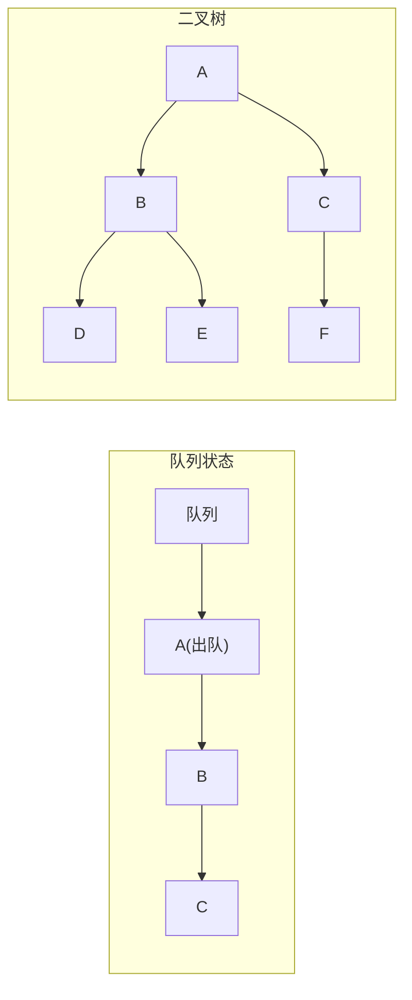
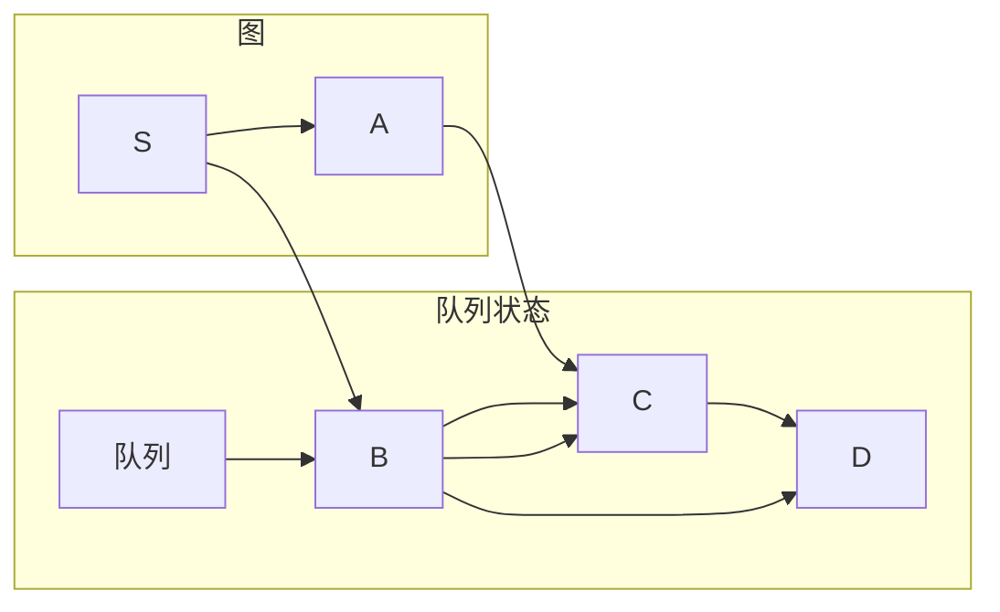
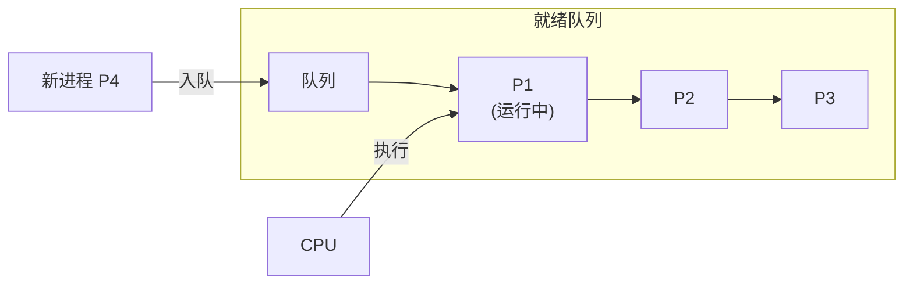

## 队列应用 · 考研408核心笔记

> 队列的 **FIFO（先进先出）** 特性使其成为**按层次/顺序处理**问题的天然数据结构。在408中，队列的三大经典应用——树的层次遍历、图的广度优先遍历、操作系统的FCFS调度——覆盖了数据结构、算法和操作系统三个核心板块。在数一中，BFS与最短路径问题中的**动态规划**思想相通；在英语一中，`queue`、`breadth-first`、`scheduling` 等词在科技类阅读中偶有出现。


### 1. 队列在树的层次遍历中的应用

#### 1.1 问题描述

给定一棵二叉树（或任意多叉树），按**从上到下、从左到右**的顺序访问所有结点。

#### 1.2 算法思想

**核心思路**：利用队列的 FIFO 特性，逐层处理结点。

1. 将根结点入队
2. 循环执行以下操作，直到队列为空：
   - 从队列中取出一个结点（出队）
   - 访问该结点
   - 将该结点的所有子结点依次入队（左→右）



> 层次遍历顺序：`A → B → C → D → E → F`

#### 1.3 代码实现（C++）

```cpp
#include <queue>
using namespace std;

struct TreeNode {
    int val;
    TreeNode *left, *right;
    TreeNode(int x) : val(x), left(nullptr), right(nullptr) {}
};

void levelOrder(TreeNode* root) {
    if (root == nullptr) return;

    queue<TreeNode*> q;
    q.push(root);

    while (!q.empty()) {
        TreeNode* node = q.front();
        q.pop();

        cout << node->val << " ";    // 访问当前结点

        if (node->left) q.push(node->left);
        if (node->right) q.push(node->right);
    }
}
```

#### 1.4 逐层输出（408 高频变式）

若要求**按层分组输出**（每层单独一行），需在每层处理前记录队列长度：

```cpp
vector<vector<int>> levelOrderGrouped(TreeNode* root) {
    vector<vector<int>> result;
    if (!root) return result;

    queue<TreeNode*> q;
    q.push(root);

    while (!q.empty()) {
        int levelSize = q.size();          // 当前层的结点数
        vector<int> currentLevel;

        for (int i = 0; i < levelSize; i++) {
            TreeNode* node = q.front();
            q.pop();
            currentLevel.push_back(node->val);

            if (node->left) q.push(node->left);
            if (node->right) q.push(node->right);
        }

        result.push_back(currentLevel);
    }

    return result;
}
```

#### 1.5 时空复杂度

| 指标 | 复杂度 | 说明 |
|------|--------|------|
| 时间复杂度 | **$O(n)$** | 每个结点入队、出队一次 |
| 空间复杂度 | **$O(w)$** | $w$ 为树的最大宽度（队列中最多容纳一层结点） |

> [!tip] 与递归遍历的对比
> - **前/中/后序遍历**（DFS）：使用栈（递归或显式栈），深度优先
> - **层次遍历**（BFS）：使用队列，广度优先

> [!note] 数一关联
> 层次遍历中“逐层处理”的思想与**数学归纳法**同构——第 $k$ 层的处理依赖于第 $k-1$ 层的结果，体现了递推关系。


### 2. 队列在图的最短路径（BFS）中的应用

#### 2.1 问题描述

给定一个无权图（或无权重图），求从起点 $s$ 到所有其他顶点的**最短路径**（最少边数）。

#### 2.2 算法思想

**核心思路**：BFS 按距离起点从近到远的顺序访问顶点——**第一次访问到某顶点时，路径一定是最短的**。

1. 将起点 $s$ 入队，标记为已访问，距离 $dist[s] = 0$
2. 循环执行以下操作，直到队列为空：
   - 从队列中取出顶点 $u$（出队）
   - 遍历 $u$ 的所有邻接顶点 $v$：
     - 若 $v$ 未被访问，则标记为已访问，设置 $dist[v] = dist[u] + 1$，将 $v$ 入队



> BFS 按距离逐层扩展：先访问距离为 1 的顶点，再访问距离为 2 的顶点……

#### 2.3 代码实现（C++）

```cpp
#include <queue>
#include <vector>
using namespace std;

void BFS(vector<vector<int>>& graph, int start) {
    int n = graph.size();
    vector<bool> visited(n, false);
    vector<int> dist(n, -1);

    queue<int> q;
    visited[start] = true;
    dist[start] = 0;
    q.push(start);

    while (!q.empty()) {
        int u = q.front();
        q.pop();

        cout << "顶点 " << u << "，距离: " << dist[u] << endl;

        for (int v : graph[u]) {          // 遍历所有邻接顶点
            if (!visited[v]) {
                visited[v] = true;
                dist[v] = dist[u] + 1;
                q.push(v);
            }
        }
    }
}
```

#### 2.4 BFS 求最短路径的证明（408 简答题高频）

> 为什么 BFS 第一次访问到某顶点时路径一定最短？

**证明要点**：
1. BFS 按**入队顺序**处理顶点，队列保证了**先入队的顶点距离更近**
2. 假设顶点 $v$ 在第 $k$ 层被访问，则存在一条长度为 $k$ 的路径 $s \to \cdots \to v$
3. 若存在更短路径（长度 $< k$），则 $v$ 应在更早的层被访问，与“第 $k$ 层首次访问”矛盾
4. 因此首次访问时的路径必然最短

> 这是 BFS 区别于 DFS 的核心性质——**BFS 天然适合求无权图的最短路径**。

#### 2.5 时空复杂度

| 指标 | 复杂度 | 说明 |
|------|--------|------|
| 时间复杂度 | **$O(V + E)$** | 每个顶点入队一次，每条边检查一次 |
| 空间复杂度 | **$O(V)$** | 队列、visited 数组、dist 数组 |

> [!note] 数一关联
> BFS 求最短路径与数一中的**动态规划**思想相通——$dist[v] = dist[u] + 1$ 是最优子结构的体现。
> 在数一中，类似的最短路径问题可用 **Dijkstra 算法**（贪心）或 **Bellman-Ford 算法**（动态规划）求解，而 BFS 是它们的特例（所有边权为 1）。


### 3. 队列在操作系统中的应用（FCFS 调度）

#### 3.1 问题描述

在操作系统中，多个进程（或任务）同时请求 CPU，需要一种**调度策略**决定执行顺序。**先来先服务（FCFS，First Come First Served）** 是最基本的调度算法——按进程到达的先后顺序依次执行。

#### 3.2 算法思想

**核心思路**：用**就绪队列**（Ready Queue）按到达顺序存放所有就绪进程，CPU 每次从队头取出一个进程执行。

1. 新进程到达时，插入就绪队列**队尾**
2. CPU 空闲时，从就绪队列**队头**取出一个进程执行
3. 进程执行完毕（或阻塞）后，CPU 继续从队头取下一个进程



> FCFS 调度完全遵循 **FIFO** 原则——先到达的进程先被服务。

#### 3.3 代码实现（模拟）

```cpp
#include <queue>
#include <iostream>
using namespace std;

struct Process {
    int id;
    int arrival_time;
    int burst_time;        // 需要的 CPU 时间
};

void FCFS_Scheduling(queue<Process>& readyQueue) {
    int current_time = 0;

    while (!readyQueue.empty()) {
        Process p = readyQueue.front();
        readyQueue.pop();

        // 模拟进程执行
        cout << "进程 P" << p.id << " 开始执行，时间: " << current_time << endl;
        current_time += p.burst_time;
        cout << "进程 P" << p.id << " 执行完毕，时间: " << current_time << endl;
    }
}
```

#### 3.4 FCFS 的性能分析（408 高频考点）

| 指标 | 说明 |
|------|------|
| **平均等待时间** | 取决于进程到达顺序和运行时间 |
| **平均周转时间** | 完成时间 - 到达时间 |
| **CPU 利用率** | 通常较高（除非所有进程都在等待 I/O） |
| **吞吐量** | 单位时间内完成的进程数 |

> [!warning] FCFS 的缺陷
> **护航效应（Convoy Effect）** ：一个运行时间长的进程先到达，会导致后续所有短进程等待，平均等待时间大幅增加。
>
> 例如：进程按 $P_1(24ms), P_2(3ms), P_3(3ms)$ 顺序到达，平均等待时间为 $(0 + 24 + 27)/3 = 17ms$。若短进程先执行，平均等待时间仅为 $(0 + 3 + 6)/3 = 3ms$。

> [!tip] 与其他调度算法的对比
> | 调度算法 | 数据结构 | 特点 |
> |----------|----------|------|
> | **FCFS** | 队列 | 公平但平均等待时间长 |
> | **SJF（短作业优先）** | 优先队列 | 最小平均等待时间，但可能导致长作业饥饿 |
> | **RR（时间片轮转）** | 队列 | 响应时间短，适合交互式系统 |
> | **优先级调度** | 优先队列 | 支持不同优先级，可能导致饥饿 |

> [!note] 英一关联
> FCFS 调度中的术语在考研英语阅读中可能出现：
> - `scheduling`：调度
> - `queue`：队列
> - `burst time`：执行时间（爆发时间）
> - `turnaround time`：周转时间
> - `convoy effect`：护航效应


### 4. 三种应用对比总结

| 应用场景 | 核心问题 | 队列的作用 | 处理顺序 | 数据结构 | 408 科目 |
|----------|----------|-----------|----------|----------|----------|
| **树的层次遍历** | 按层访问所有结点 | 暂存待访问的结点 | 先进先出（按层） | 队列 | 数据结构 |
| **图的 BFS** | 求无权图最短路径 | 暂存待探索的顶点 | 先进先出（按距离） | 队列 | 数据结构/算法 |
| **FCFS 调度** | 按到达顺序执行进程 | 暂存就绪进程 | 先进先出（按时间） | 队列 | 操作系统 |

> [!important] 核心结论
> 队列的 FIFO 特性决定了它在**顺序处理、按层扩展、先到先服务**等场景中的不可替代性。无论是在数据结构（层次遍历、BFS）还是操作系统（FCFS）中，队列都扮演着 **“待处理任务的缓冲区”** 这一统一角色。


### Obsidian 双向链接建议

- [[队列]]：队列的 ADT 定义与基本操作
- `[[树与二叉树]]`：树的遍历方法汇总
- `[[图]]`：图的存储与遍历
- `[[操作系统-进程调度]]`：FCFS、SJF、RR 等调度算法
- `[[栈与递归]]`：对比栈（DFS/递归）与队列（BFS/层次）的应用场景

---

如需我继续展开 **“优先队列（堆）在操作系统调度中的应用”** 或 **“BFS 在迷宫最短路径中的完整例题”** ，随时告诉我。