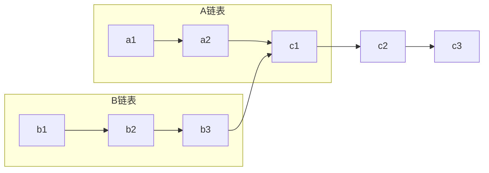

## 两个单链表找公共结点 · 考研408笔记

> 两个单链表的公共结点问题，是 408 中**链表双指针**的经典考法。它考察的是对**链表结构特性**和**指针同步移动**的理解。

---

### 一、问题描述

给定两个单链表，找出它们的**第一个公共结点**（即从该结点开始，两个链表完全重合，形成 **Y 字形**，而非 X 形）。

> [!important] 关键性质
> 单链表每个结点只有一个 `next` 指针，因此一旦两个链表在某结点重合，之后的所有结点必然**全部重合**。结构呈 **Y 型**，而非 X 型。


### 二、三种解法思路分析

| 解法 | 核心思想 | 时间复杂度 | 空间复杂度 |
|------|----------|-----------|-----------|
| **暴力法** | 双重循环，逐一比较结点地址 | $O(m \times n)$ | $O(1)$ |
| **哈希表法** | 遍历 A 存地址，遍历 B 查地址 | $O(m+n)$ | $O(m)$ |
| **双指针法（最优）** | 消除长度差，同步遍历 | $O(m+n)$ | $O(1)$ |


### 三、最优算法思想（双指针法）

**核心思路**：让两个指针**从同一起跑线出发**，消除两个链表长度差的影响，然后同步移动，相遇点即为公共结点。

#### 3.1 方案一：先求长度差，再同步走（直观法）

**步骤**：
1. 分别遍历两个链表，求出长度 $lenA$ 和 $lenB$
2. 计算长度差 $diff = |lenA - lenB|$
3. 让**较长的链表**先走 $diff$ 步，此时两个指针**剩余长度相同**
4. 两个指针同步向后移动，**第一个地址相同的结点**即为公共结点

#### 3.2 方案二：交替遍历（优雅法，无需求长度）

**步骤**：
1. 指针 `pa` 指向 A 的头，`pb` 指向 B 的头
2. 同时遍历：
   - 若 `pa == pb`，返回该结点（相遇）
   - 若 `pa` 走到 `NULL`，则转向 B 的头继续走
   - 若 `pb` 走到 `NULL`，则转向 A 的头继续走
3. 若不相交，最终同时为 `NULL`

> [!example] 数学原理（数一关联）
> 设 A 独享长度为 $a$，B 独享长度为 $b$，公共长度为 $c$。
> - `pa` 走的路程：$a + c + b$
> - `pb` 走的路程：$b + c + a$
> 
> 两者**路程相等**，因此必在交点相遇。这本质是**路径长度的线性方程组**：
> $$a + c + b = b + c + a$$


### 四、图示（Y 型结构）



> A 独享部分：`a1→a2`（长度 $a=2$）  
> B 独享部分：`b1→b2→b3`（长度 $b=3$）  
> 公共部分：`c1→c2→c3`（长度 $c=3$）


### 五、代码实现（C++）

#### 方案一：先求长度差（推荐，易理解）

```cpp
int getLength(ListNode *head) {
    int len = 0;
    while (head) { len++; head = head->next; }
    return len;
}

ListNode* getIntersectionNode(ListNode *headA, ListNode *headB) {
    int lenA = getLength(headA);
    int lenB = getLength(headB);

    // 让较长的链表先走 diff 步
    while (lenA > lenB) {
        headA = headA->next;
        lenA--;
    }
    while (lenB > lenA) {
        headB = headB->next;
        lenB--;
    }

    // 同步走，找第一个相同结点
    while (headA != headB) {
        headA = headA->next;
        headB = headB->next;
    }
    return headA;  // 若不相交，返回 NULL
}
```

#### 方案二：交替遍历（代码更简洁）

```cpp
ListNode* getIntersectionNode(ListNode *headA, ListNode *headB) {
    if (!headA || !headB) return NULL;
    ListNode *pa = headA, *pb = headB;
    while (pa != pb) {
        pa = pa ? pa->next : headB;
        pb = pb ? pb->next : headA;
    }
    return pa;
}
```


### 六、时空复杂度

| 指标 | 复杂度 | 说明 |
|------|--------|------|
| 时间复杂度 | **$O(m+n)$** | 最多遍历两倍长度 |
| 空间复杂度 | **$O(1)$** | 只用了常数个指针 |


### 七、注意事项

| 要点 | 说明 |
|------|------|
| **比较的是地址，不是值** | 公共结点要求**同一块内存**，而非 `data` 相等 |
| **Y 型而非 X 型** | 单链表结点只有一个 `next`，不可能先分后合 |
| **边界处理** | 若不相交，方案二最终 `pa = pb = NULL`，返回 `NULL` |
| **带头结点** | 若有头结点，遍历从 `L->next` 开始，长度计算不含头结点 |


### 八、易错与易混点

| 易错判断 | 正确理解 |
|----------|----------|
| “比较 `pa->data == pb->data` 即可” | ❌ 错误。**必须比较地址**（`pa == pb`），数据相同不代表同一结点 |
| “公共结点之后两个链表各自继续” | ❌ 错误。公共结点之后**完全重合**（Y 型），不会分开 |
| “方案二会死循环” | ✅ 注意：交替遍历最多走 $m+n$ 步，不会死循环 |
| “不带头结点时无法求长度” | ✅ 可以求，只是遍历起点不同 |


### Obsidian 双向链接建议

- `[[链表综合应用题]]`：归入双指针类题型
- `[[单链表原地逆置]]`：同属链表指针操作
- `[[算法效率的度量]]`：复杂度分析

---

如需我继续展开 **“两个链表找公共结点的变式题”**（如带环链表找交点），随时告诉我。