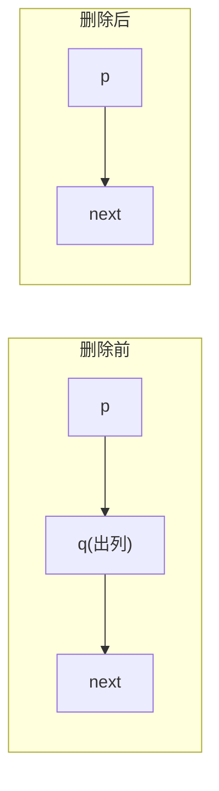

## 约瑟夫环（Josephus Problem）· 考研408核心笔记

> 约瑟夫环是考研数据结构**循环链表**章节的经典应用题，也是408中**链表模拟**与**数学递推**两种思维的代表性问题。在数一中，其递推公式对应**数列的递推关系**；在英语一中，`circular`、`eliminate`、`survivor` 等词为高频科技词汇。

---

### 1. 问题描述

$n$ 个人围成一圈，从第 $1$ 个人开始报数，每报到 $m$ 的人出列，然后从下一个人重新开始报数，如此循环，直到剩下最后一个人。求最后幸存者的编号。

**形式化定义**：
- 输入：$n$（人数），$m$（报数值）
- 输出：最后幸存者的编号（通常从 1 开始）

> [!example] 经典示例
> $n = 5$，$m = 3$ 时，出列顺序为：3，1，5，2，最后幸存者为 **4**。

---

### 2. 三种核心解法

| 解法 | 时间复杂度 | 空间复杂度 | 适用场景 |
|------|-----------|-----------|----------|
| **循环链表模拟** | $O(n \times m)$ | $O(n)$ | **算法大题**（必会手写） |
| **数组模拟** | $O(n \times m)$ | $O(n)$ | 链表操作不熟时的替代 |
| **数学递推** | $O(n)$ | $O(1)$ | **选择题**（求最后编号） |

---

### 3. 解法一：循环链表模拟（数据结构标准解）

**思路**：用循环单链表模拟围坐和报数过程，每报到 $m$ 就删除对应节点。

```cpp
#include <iostream>
using namespace std;

typedef struct LNode {
    int data;
    struct LNode *next;
} LNode, *LinkList;

int josephus_LinkedList(int n, int m) {
    // 1. 创建循环链表（带头结点）
    LNode *head = NULL, *tail = NULL;
    for (int i = 1; i <= n; i++) {
        LNode *s = (LNode*)malloc(sizeof(LNode));
        s->data = i;
        s->next = NULL;
        if (head == NULL) head = s;
        else tail->next = s;
        tail = s;
    }
    tail->next = head;  // 构成环

    // 2. 模拟报数
    LNode *p = tail;    // p 指向当前节点的前驱（方便删除）
    while (p->next != p) {  // 只剩一个节点时停止
        // 报数 m 次，实际只需移动 m-1 次
        for (int i = 1; i < m; i++) {
            p = p->next;
        }
        // p->next 为要出列的人
        LNode *q = p->next;
        cout << q->data << " ";  // 输出出列顺序
        p->next = q->next;       // 删除 q
        free(q);
    }
    return p->data;  // 最后幸存者
}
```

**图示**（删除节点过程）：



> [!important] 408 应试建议
> 如果算法大题要求“写出约瑟夫环的实现过程”，**优先写循环链表解法**。逻辑清晰、代码可靠性高，阅卷老师容易给分。注意：
> - 必须用 `free(q)` 释放节点（体现内存管理意识）
> - 出列顺序的输出可作为调试和验证的依据

---

### 4. 解法二：数组模拟（链表操作的替代方案）

**思路**：用数组标记每个人是否还在圈内，遍历时跳过已出列的人。

```cpp
int josephus_Array(int n, int m) {
    bool eliminated[n + 1] = {false};  // false 表示还在圈内
    int remaining = n;                 // 剩余人数
    int pos = 0;                       // 当前位置（0-based）
    int count = 0;                     // 当前报数

    while (remaining > 1) {
        pos = (pos + 1) % n;           // 移到下一个人
        if (eliminated[pos]) continue;
        count++;
        if (count == m) {
            eliminated[pos] = true;
            remaining--;
            count = 0;
        }
    }

    // 找出唯一未出列的人
    for (int i = 1; i <= n; i++) {
        if (!eliminated[i]) return i;
    }
    return -1;
}
```

> [!warning] 注意
> 数组法的下标逻辑容易出错，建议使用 **1-based 编号**，用 `pos = pos % n + 1` 的方式移动。

---

### 5. 解法三：数学递推（选择题神器）

**思路**：从最后一个人的情况倒推，建立递推关系。

**递推公式**：

$$
\boxed{f(1) = 0}
$$

$$
\boxed{f(i) = (f(i-1) + m) \bmod i \quad (i \ge 2)}
$$

其中 $f(i)$ 表示 $i$ 个人时幸存者的**索引**（从 0 开始）。最终结果若要求从 1 开始编号，返回 $f(n) + 1$。

```cpp
int josephus_Math(int n, int m) {
    int survivor = 0;  // n = 1 时，幸存者索引为 0
    for (int i = 2; i <= n; i++) {
        survivor = (survivor + m) % i;
    }
    return survivor + 1;  // 转为 1-based 编号
}
```

**递推过程示例**（$n = 5, m = 3$）：

| $i$ | 计算过程 | $f(i)$ |
|-----|----------|--------|
| 1 | 初始值 | 0 |
| 2 | $(0 + 3) \% 2$ | 1 |
| 3 | $(1 + 3) \% 3$ | 1 |
| 4 | $(1 + 3) \% 4$ | 0 |
| 5 | $(0 + 3) \% 5$ | 3 |

最终结果：$f(5) + 1 = 3 + 1 = \boxed{4}$ ✅

> [!tip] 递推公式的理解
> 第一轮删除编号为 $(m-1) \bmod n$ 的人。之后 $n-1$ 个人重新编号为 $0, 1, \dots, n-2$，其幸存者编号为 $f(n-1)$。映射回原编号时，需要**加上 $m$**（因为从被删除的下一个人重新开始），再对 $n$ 取模。

---

### 6. 数一关联：递推与数列

约瑟夫环的数学递推公式 $f(i) = (f(i-1) + m) \bmod i$ 本质上是**一阶线性递推数列**。在数一中，这类递推关系常用于：
- 数列极限的求解
- 差分方程的基本形式
- 组合数学中的计数问题

---

### 7. 408 常见考法

| 题型 | 示例 | 推荐解法 |
|------|------|----------|
| 选择题：求最后幸存者编号 | $n = 10, m = 4$ 时最后剩下的是？ | **数学递推**（30秒出答案） |
| 选择题：求第 $k$ 个出列的人 | 约瑟夫环出列顺序第 $k$ 个是谁？ | 链表模拟或数学方法 |
| 算法大题：模拟报数过程 | “用循环链表实现约瑟夫环，输出出列顺序” | **循环链表模拟** |
| 算法大题：变式条件 | $m$ 很大（如 $m > n$）时的优化 | 数学递推 + 取模优化 |

> [!warning] 如果 $m \ge n$
> 当 $m$ 远大于 $n$ 时，链表模拟需要移动 $m$ 次，可能超时。此时优先使用**数学递推**，它不受 $m$ 大小的影响。

---

### 8. 核心公式速查卡

| 公式 | 说明 |
|------|------|
| $f(1) = 0$ | 1 个人时幸存者索引为 0 |
| $f(i) = (f(i-1) + m) \bmod i$ | 递推公式（$i \ge 2$） |
| 结果编号 = $f(n) + 1$ | 转为 1-based 编号 |
| 链表删除操作 | $p \to \text{next} = q \to \text{next}$；$\text{free}(q)$ |

---

### Obsidian 双向链接建议

- `[[循环链表]]`：约瑟夫环是循环链表的典型应用
- `[[单链表]]`：链表操作的基础
- `[[数列]]`：递推公式与数一数列的关联
- `[[算法效率的度量]]`：三种解法的时间复杂度对比

---

如需我继续展开**约瑟夫环的变式题**（如 $m$ 非固定值、已知幸存者反推 $n$ 等），随时告诉我。