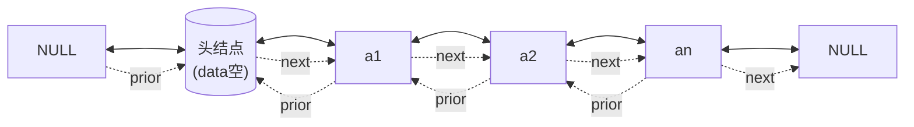
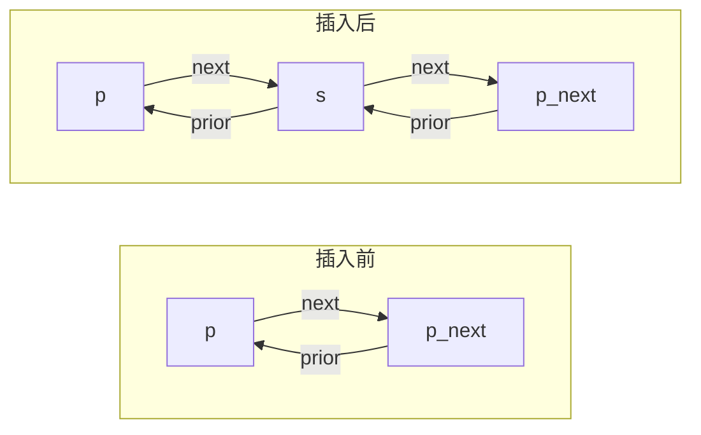
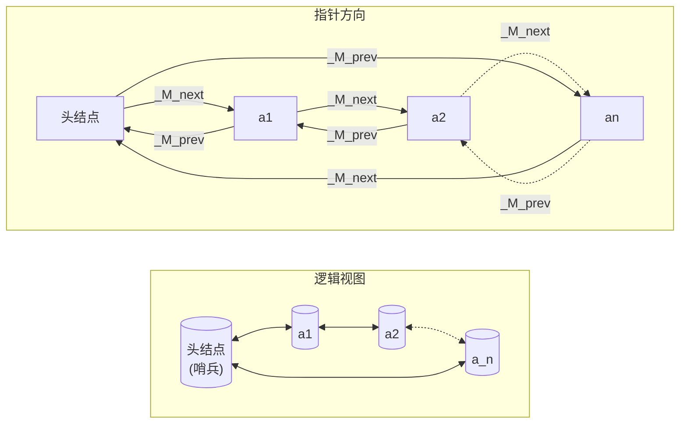

## 双链表（Doubly Linked List）· 考研408核心笔记

> 双链表是线性表的**链式存储结构**的一种，每个结点包含**两个指针**，分别指向前驱和后继，支持**双向遍历**。在408中，双链表是考察链表操作综合能力的重点；在数一中，双链表的双向遍历对应**数列的双向递推**；在英语一中，`predecessor`、`successor`、`bidirectional` 等词为高频科技词汇。

---

### 1. 双链表的定义

**定义**：双链表每个结点包含**数据域**、**前驱指针（prior）** 和**后继指针（next）**，通过两个指针建立元素之间的双向线性关系。

$$
\text{Node} = (\text{prior}, \text{data}, \text{next})
$$

**存储结构（C++描述）**：

```cpp
typedef struct DNode {
    ElemType data;           // 数据域
    struct DNode *prior;     // 前驱指针，指向前一个结点
    struct DNode *next;      // 后继指针，指向后一个结点
} DNode, *DLinkList;         // DLinkList 为指向头结点的指针类型
```

**带头结点双链表图示**：



> [!important] 408 约定
> 双链表的考题中，**默认使用带头结点的双链表**，以统一空表与非空表的操作。注意 `prior` 和 `next` 两个指针必须同时维护，**缺一不可**。

---

### 2. 双链表 vs 单链表（对比速查）

| 对比维度  | 单链表           | 双链表                   |
| ----- | ------------- | --------------------- |
| 指针数量  | 1 个（`next`）   | 2 个（`prior` + `next`） |
| 遍历方向  | **单向**（只能向前）  | **双向**（可前可后）          |
| 插入/删除 | 只需修改 1~2 个指针  | 需修改 4 个指针（注意顺序）       |
| 查找前驱  | $O(n)$（需从头遍历） | $O(1)$（直接 `p->prior`） |
| 存储密度  | 高             | 低（额外一个指针）             |
| 空间占用  | 小             | 大（每个结点多一个指针）          |

> [!tip] 记忆口诀
> **“双链多指针，插入四步走；能前又能后，空间换自由”**

---

### 3. 双链表的基本操作（带头结点）

#### 3.1 初始化操作

构造一个带头结点的空双链表。

```cpp
bool InitDLinkList(DLinkList &L) {
    L = (DNode*)malloc(sizeof(DNode));  // 分配头结点
    if (L == NULL) return false;        // 内存分配失败
    L->prior = NULL;                    // 头结点的 prior 指向 NULL
    L->next = NULL;                     // 头结点的 next 指向 NULL
    return true;
}
```

> [!warning] 易错点
> - 头结点的 `prior` 必须置 `NULL`（表示链表头部）
> - 头结点的 `next` 必须置 `NULL`（表示空表）
> - **带头结点判空**：`L->next == NULL`

---

#### 3.2 插入操作

##### （1）在结点 `*p` 之后插入新结点 `*s`（后插）

**实现步骤**（注意指针修改顺序，防止断链）：

```cpp
bool InsertNextDNode(DNode *p, DNode *s) {
    if (p == NULL || s == NULL) return false;
    
    // 步骤1：s 的后继指向 p 的后继
    s->next = p->next;
    
    // 步骤2：s 的前驱指向 p
    s->prior = p;
    
    // 步骤3：p 的后继的前驱指向 s（注意：若 p 是尾结点，p->next 为 NULL，需判断）
    if (p->next != NULL) {
        p->next->prior = s;
    }
    
    // 步骤4：p 的后继指向 s
    p->next = s;
    
    return true;
}
```

**分步图解**：



> [!important] 指针修改顺序（必须先 `s->next = p->next`，后 `p->next = s`）
> **顺序错误会导致链表断裂**，丢失 `p` 的后继结点。可以借助记忆口诀“**先连后，再接前**”来强化记忆。

##### （2）在结点 `*p` 之前插入新结点 `*s`（前插）

```cpp
bool InsertPriorDNode(DNode *p, DNode *s) {
    if (p == NULL || s == NULL) return false;
    
    // 利用双链表的 prior 指针：相当于在 p->prior 之后插入 s
    s->prior = p->prior;
    s->next = p;
    p->prior->next = s;      // 注意：若 p 是头结点，p->prior 为 NULL，需判断
    p->prior = s;
    
    return true;
}
```

> [!tip] 双链表优势
> 在双链表中，**已知结点 `*p` 即可在其前插入**，无需遍历找前驱，这是双链表相对于单链表**最大的优势**。

==前插后插的顺序不要乱，首先，把新节点前后指针填满，之后把非p节点的指针指向新节点，最后，把p节点的指针指向新节点==

---

#### 3.3 删除操作

##### （1）删除结点 `*p` 的后继结点

```cpp
bool DeleteNextDNode(DNode *p) {
    if (p == NULL) return false;
    DNode *q = p->next;          // q 指向被删除结点
    if (q == NULL) return false; // p 是尾结点，无可删后继
    p->next = q->next;           // p 的后继指向 q 的后继
    if (q->next != NULL) {
        q->next->prior = p;      // q 的后继的前驱指向 p
    }
    free(q);
    return true;
}
```

**时间复杂度**：$O(1)$

##### （2）删除已知结点 `*p`

```cpp
bool DeleteDNode(DNode *p) {
    if (p == NULL) return false;
    p->prior->next = p->next;    // 前驱指向 p 的后继
    if (p->next != NULL) {
        p->next->prior = p->prior; // 后继的前驱指向 p 的前驱
    }
    free(p);
    return true;
}
```

> [!warning] 易错提醒
> - 删除结点时，**两个指针都要处理**，不能遗漏
> - 若 `*p` 是尾结点，则 `p->next` 为 `NULL`，不能再访问 `p->next->prior`
> - 若 `*p` 是头结点，则 `p->prior` 为 `NULL`，不能再访问 `p->prior->next`（一般不会删除头结点）

##### （3）删除整表（表置空）

```cpp
void DestroyDLinkList(DLinkList &L) {
    DNode *p = L->next, *q;
    while (p != NULL) {
        q = p->next;
        free(p);
        p = q;
    }
    L->next = NULL;              // 头结点的 next 置空
    L->prior = NULL;             // 头结点的 prior 置空
}
```

> [!tip] 与单链表销毁对比
> 双链表和单链表的销毁过程完全相同，都是从头到尾逐个 `free` 结点。双链表的 `prior` 指针在销毁过程中不需要维护，只需 `free` 所有数据结点。

---

#### 3.4 按位查找

```cpp
DNode *GetElem(DLinkList L, int i) {
    if (i < 0) return NULL;      // 位序从 0 开始（0 表示头结点）
    DNode *p = L;
    int j = 0;
    while (p != NULL && j < i) {
        p = p->next;
        j++;
    }
    return p;                    // 返回第 i 个结点的指针，若 i 超过表长则返回 NULL
}
```

**时间复杂度**：$O(n)$

> [!tip] 双链表优化
> 如果已知 `i` 在链表的后半部分，可以从表尾开始向前遍历（前提是知道表尾指针，或 `i` 已知）。但考研中双链表查找通常按**顺序存取**，时间复杂度仍为 $O(n)$。

---

#### 3.5 按值查找

```cpp
DNode *LocateElem(DLinkList L, ElemType e) {
    DNode *p = L->next;          // 从首元结点开始
    while (p != NULL && p->data != e) {
        p = p->next;
    }
    return p;                    // 返回第一个值为 e 的结点指针，若不存在返回 NULL
}
```

**时间复杂度**：$O(n)$

---

#### 3.6 求表长

```cpp
int ListLength(DLinkList L) {
    int len = 0;
    DNode *p = L->next;
    while (p != NULL) {
        len++;
        p = p->next;
    }
    return len;
}
```

**时间复杂度**：$O(n)$

---

### 4. 双链表插入/删除的指针操作总结

| 操作 | 需修改的指针数 | 注意事项 |
|------|---------------|----------|
| 在 `*p` 后插入 `*s` | 4 个 | 先连 `s->next` 和 `s->prior`，后修改 `p` 和 `p->next` |
| 在 `*p` 前插入 `*s` | 4 个 | 利用 `p->prior`，本质是在 `p` 的前驱之后插入 |
| 删除 `*p` | 2 个 | 同时处理 `p->prior` 和 `p->next` 的指针 |
| 删除 `*p` 的后继 | 2 个 | 需判断 `p->next` 是否为空 |

> [!important] 指针操作口诀
> **“插入先连新结点，再拆旧指针；删除前后都要接，尾结点要留心。”**

---

### 5. 双链表的两种基本插入场景代码速查

**（1）在 `*p` 之后插入 `*s`（最通用）**

```cpp
s->next = p->next;
s->prior = p;
if (p->next != NULL) p->next->prior = s;
p->next = s;
```

**（2）在 `*p` 之前插入 `*s`（利用前驱）**

```cpp
s->next = p;
s->prior = p->prior;
p->prior->next = s;
p->prior = s;
```

> [!note] 与单链表的对比
> 单链表在已知 `*p` 的情况下无法在 `*p` 之前插入（只能遍历找前驱），而双链表利用 `*p->prior` 可直接插入，体现双链表的优势。

---

### 6. 408 典型例题

| 题型 | 示例 | 核心考点 |
|------|------|----------|
| 双链表插入 | 在双链表的结点 `*p` 之后插入结点 `*s`，写出正确的指针修改顺序 | 四步指针赋值，尾结点判断 |
| 双链表删除 | 删除双链表的结点 `*p`，写出正确的指针修改顺序 | `p->prior->next = p->next`；若 `p->next != NULL`，`p->next->prior = p->prior` |
| 双链表逆置 | 将带头结点的双链表就地逆置 | 遍历每个结点，交换其 `prior` 和 `next` |
| 双链表判空 | `L->next == NULL` 且 `L->prior == NULL` | 双链表空表判断 |
| 双向循环链表 | 双向循环链表中，已知 `*p` 如何删除自己？ | `p->prior->next = p->next; p->next->prior = p->prior;`（无需判断 NULL） |

> [!example] 经典考题
> **题目**：在带头结点的双链表中，已知结点 `*p`（非尾结点），请写出删除该结点的代码。
>
> **答案**：
> ```cpp
> p->prior->next = p->next;
> p->next->prior = p->prior;
> free(p);
> ```

---

### 7. STL 源码剖析：`list` 的底层实现

> 本节基于侯捷《STL源码剖析》及 SGI STL 源码，深入分析双向链表容器 `list` 的底层实现原理。

#### 7.1 数据结构：环状双向链表

SGI STL 的 `list` 是一个**环状双向链表**，只需一个指针即可完整表现整个链表。其数据结构如下：

```cpp
template <class T, class Alloc = alloc>
class list {
protected:
    _List_node<T>* _M_node;   // 指向一个哨兵结点（头结点）
    // ...
};

// 节点结构
template <class T>
struct _List_node : public _List_node_base {
    T _M_data;
};

// 节点基类（只含指针）
struct _List_node_base {
    _List_node_base* _M_next;
    _List_node_base* _M_prev;
};
```

**环状链表图示**：




> [!important] 哨兵结点的特殊设计
> SGI STL 的 `list` 中，**头结点本身不存储数据**，仅作为链表的“哨兵”：
> - `_M_node->next` 指向第一个有效结点（首元结点）
> - `_M_node->prev` 指向最后一个有效结点（尾结点）
> - 尾结点的 `next` 指向头结点，头结点的 `prev` 指向尾结点
> - 这样设计使得 `begin()` 返回 `_M_node->next`，`end()` 返回 `_M_node`，**迭代器区间为前闭后开 `[begin, end)`**

#### 7.2 迭代器设计

`list` 的迭代器属于**双向迭代器（Bidirectional Iterator）** ，支持 `++` 和 `--` 操作：

```cpp
template <class T, class Ref, class Ptr>
struct _List_iterator : public _List_iterator_base {
    // 重载 operator*、operator->、operator++、operator-- 等
};

struct _List_iterator_base {
    _List_node_base* _M_node;   // 指向节点
    
    void _M_incr() { _M_node = _M_node->_M_next; }   // 前进
    void _M_decr() { _M_node = _M_node->_M_prev; }   // 后退
};
```

> [!note] 迭代器有效性
> `list` 的迭代器在插入/删除操作后**不会失效**（除了被删除的节点本身）。这是因为 `list` 的节点是独立分配的，插入删除只修改指针，不影响其他节点的内存地址。这与 `vector` 的迭代器失效机制形成鲜明对比。

#### 7.3 核心操作实现

**（1）`insert` 在指定位置之前插入**

```cpp
iterator insert(iterator position, const T& x) {
    _List_node* __tmp = _M_create_node(x);
    __tmp->_M_next = position._M_node;
    __tmp->_M_prev = position._M_node->_M_prev;
    position._M_node->_M_prev->_M_next = __tmp;
    position._M_node->_M_prev = __tmp;
    return __tmp;
}
```

**时间复杂度**：$O(1)$（在已知位置插入）

**（2）`push_back` 与 `push_front`**

```cpp
void push_back(const T& x) { insert(end(), x); }    // 在哨兵之前插入 → 尾部
void push_front(const T& x) { insert(begin(), x); } // 在首元之前插入 → 头部
```

**（3）`erase` 删除指定位置元素**

```cpp
iterator erase(iterator position) {
    _List_node_base* __next = position._M_node->_M_next;
    _List_node_base* __prev = position._M_node->_M_prev;
    __prev->_M_next = __next;
    __next->_M_prev = __prev;
    _M_destroy_node(position._M_node);
    return iterator((_List_node*)__next);
}
```

**时间复杂度**：$O(1)$

**（4）`transfer` 内部核心操作（`splice` 的基础）**

`transfer` 是 `list` 中最核心的内部操作，用于将一段连续范围的节点**整体移动**到另一个位置：

```cpp
void transfer(iterator position, iterator first, iterator last) {
    if (position != last) {
        // 1. 切断原位置：last 的前驱的 next 指向 position
        last._M_node->_M_prev->_M_next = position._M_node;
        // 2. 切断原位置：first 的前驱的 next 指向 last
        first._M_node->_M_prev->_M_next = last._M_node;
        // 3. 调整 last 的前驱指向 first 的原前驱
        position._M_node->_M_prev->_M_next = first._M_node;
        // 4. 调整 first 的原前驱和 last 的关系
        _List_node_base* __tmp = position._M_node->_M_prev;
        position._M_node->_M_prev = last._M_node->_M_prev;
        last._M_node->_M_prev = first._M_node->_M_prev;
        first._M_node->_M_prev = __tmp;
    }
}
```

> [!important] `splice` 操作
> `splice`（接合）是 `list` 特有的高效操作，可在 $O(1)$ 时间内将另一个 `list` 的一段节点**整体移动**到当前位置，而不进行元素的复制或分配。这是 `list` 相比 `vector` 的一大优势。

**（5）`sort` 归并排序**

`list` 的 `sort` 函数采用**归并排序**实现，原因是 `list` 不支持随机访问，无法使用快速排序：

```cpp
template <class T, class Alloc>
void list<T, Alloc>::sort() {
    if (_M_node->_M_next == _M_node || 
        _M_node->_M_next->_M_next == _M_node) return;
    
    _List<T, Alloc> __carry;
    _List<T, Alloc> __counter[64];
    int __fill = 0;
    
    while (!empty()) {
        __carry.splice(__carry.begin(), this, begin());
        int __i = 0;
        while (__i < __fill && !__counter[__i].empty()) {
            __counter[__i].merge(__carry);
            __carry.swap(__counter[__i]);
            ++__i;
        }
        __carry.swap(__counter[__i]);
        if (__i == __fill) ++__fill;
    }
    
    for (int __i = 1; __i < __fill; ++__i)
        __counter[__i].merge(__counter[__i - 1]);
    swap(__counter[__fill - 1]);
}
```

**时间复杂度**：$O(n \log n)$

> [!note] 考研视角
> 了解 `list::sort` 的实现有助于理解“链表的排序为什么不用快排”——因为链表无法随机访问，归并排序是自然选择。

---

### 8. `list` vs `vector` vs `slist` 对比（考研核心）

| 对比维度 | `vector`（顺序表） | `slist`（单链表） | `list`（双链表） |
|----------|-------------------|-------------------|------------------|
| 存储空间 | 连续 | 不连续 | 不连续 |
| 随机存取 | ✅ $O(1)$ | ❌ | ❌ |
| 插入/删除（尾部） | 均摊 $O(1)$ | ❌（无 `push_back`） | $O(1)$ |
| 插入/删除（任意位置） | $O(n)$ | $O(n)$（需找前驱） | $O(1)$ |
| 插入/删除（已知位置） | $O(n)$ | $O(1)$（后插） | $O(1)$ |
| 双向遍历 | ❌ | ❌ | ✅ |
| 迭代器失效 | 插入/删除易失效 | 不失效 | 不失效 |
| 空间开销 | 最小 | 中（1个指针） | 大（2个指针） |
| 适用场景 | 频繁查询，少插入删除 | 头部操作频繁 | 频繁任意位置插入删除 |

> [!tip] 考研选择原则
> - **需要频繁随机访问** → `vector`
> - **只需头部插入/删除** → `slist` / `forward_list`
> - **需要频繁任意位置插入/删除 + 双向遍历** → `list`

---

### 9. 英语一关联

| 英文 | 中文 | 常考语境 |
|------|------|----------|
| predecessor | 前驱 | "the predecessor of the current node" |
| successor | 后继 | "the successor of the current node" |
| bidirectional | 双向的 | "bidirectional traversal" 双向遍历 |
| pointer | 指针 | "prior pointer and next pointer" |
| node | 结点 | "each node contains data and two pointers" |
| splice | 拼接、接合 | "splice two lists" |

> [!tip] 写作句式
> - `Each node contains two pointers: one to its predecessor and one to its successor.`
> - `The list supports bidirectional traversal, allowing both forward and backward iteration.`

---

### 10. 易错与易混点

| 易错判断 | 正确理解 |
|----------|----------|
| “双链表插入操作只需修改 2 个指针” | ❌ 错误。双链表插入需修改 **4 个指针**（`s->prior`、`s->next`、`p->next->prior`、`p->next`） |
| “双链表删除操作只需修改 1 个指针” | ❌ 错误。删除需修改 **2 个指针**（`p->prior->next` 和 `p->next->prior`） |
| “双链表支持随机存取” | ❌ 错误。双链表仍然是**顺序存取**，访问第 $i$ 个元素需 $O(n)$ |
| “双链表判空条件为 `L == NULL`” | ❌ 错误。带头结点时判空为 `L->next == NULL` |
| “双链表的 `prior` 指针可以省略” | ❌ 错误。`prior` 是双链表的核心，省略后无法进行前向操作 |
| “`list` 的迭代器在插入后可能失效” | ❌ 错误。`list` 的迭代器插入/删除后**不失效**（被删除的除外） |
| “`list` 支持 `operator[]`” | ❌ 错误。`list` 不支持随机访问，没有 `operator[]` |

---

### 11. 核心公式速查卡

| 操作 | 时间复杂度 | 说明 |
|------|-----------|------|
| 按位查找 | $O(n)$ | 需从头或从尾遍历 |
| 按值查找 | $O(n)$ | 需遍历 |
| 已知 `*p` 后插入 | $O(1)$ | 修改 4 个指针 |
| 已知 `*p` 前插入 | $O(1)$ | 利用 `p->prior` |
| 已知 `*p` 删除 | $O(1)$ | 修改 2 个指针 |
| `push_back` / `push_front` | $O(1)$ | 利用哨兵结点 |
| 求表长 | $O(n)$ | 需遍历所有结点 |

---

### Obsidian 双向链接建议

- `[[单链表]]`：双链表是单链表的扩展
- `[[顺序表]]`：对比三种存储结构
- `[[C++ STL list]]`：双链表的 STL 实现
- `[[算法效率的度量]]`：时间复杂度分析

---

如需继续展开**循环链表**（单循环 / 双循环）的笔记，随时告诉我。


