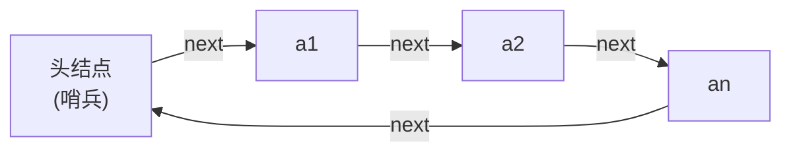
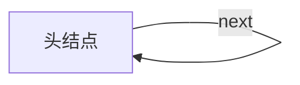
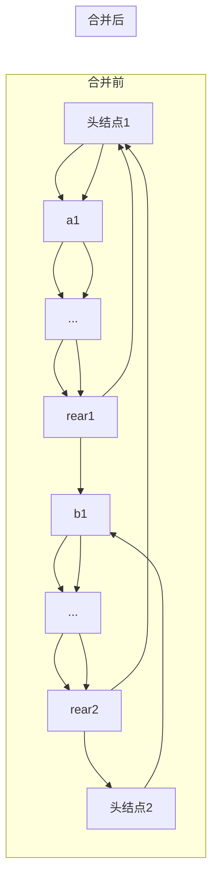
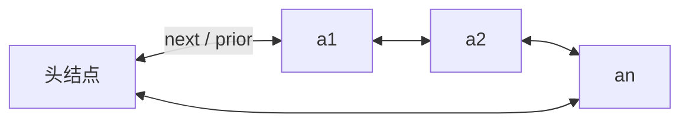
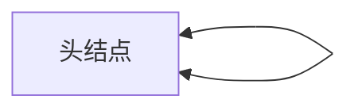

## 循环链表（Circular Linked List）· 考研408核心笔记

> 循环链表是链式存储结构的**重要变体**，其核心特征是**尾结点的指针域指向头结点（或首元结点）**，使整个链表形成一个**环**。在数一中，循环结构对应**递推关系的周期性**；在英语一中，`circular`、`cycle`、`loop` 等词为高频科技词汇。

---

### 1. 循环链表的核心特征

| 对比项 | 普通链表 | 循环链表 |
|--------|----------|----------|
| **尾结点指针** | 指向 `NULL` | 指向**头结点**（或首元结点） |
| **判空条件**（带头结点） | `L->next == NULL` | `L->next == L`（或 `head->next == head`） |
| **遍历终止条件** | `p != NULL` | `p != head` |
| **环状结构** | 线性，有终点 | 环形，无终点（可无限遍历） |

> [!important] 408 约定
> **默认使用带头结点的循环链表**。空表时，头结点的 `next` 指向**自身**（`head->next = head`），而非 `NULL`。

---

### 2. 循环单链表

#### 2.1 定义与图示

```cpp
typedef struct LNode {
    ElemType data;
    struct LNode *next;
} LNode, *LinkList;
```



**空表**：



> 头结点的 `next` 指向**自身**，形成自环。

#### 2.2 判空与遍历

```cpp
// 判空
bool IsEmpty(LinkList L) {
    return L->next == L;        // 头结点指向自身
}

// 遍历（从首元结点开始）
void Traverse(LinkList L) {
    LNode *p = L->next;         // 从首元结点开始
    while (p != L) {            // 终止条件：回到头结点
        visit(p->data);
        p = p->next;
    }
}
```

#### 2.3 插入与删除

循环单链表的插入/删除代码与普通单链表**基本相同**，区别在于：
- 尾结点的 `next` 不再指向 `NULL`，而是指向 `L`
- 因此**在表尾插入/删除**时，无需特殊处理 `NULL`，但仍需遍历找尾

```cpp
// 在表尾插入（带头结点）
bool InsertTail(LinkList L, ElemType e) {
    LNode *p = L;
    while (p->next != L) p = p->next;   // 找到尾结点（next 指向头结点）
    LNode *s = (LNode*)malloc(sizeof(LNode));
    s->data = e;
    s->next = p->next;                  // s->next = L
    p->next = s;
    return true;
}
```

#### 2.4 合并两个循环单链表（考研高频 ⭐）

**题目**：已知两个循环单链表 `L1` 和 `L2`（均带头结点，**仅给出尾指针** `rear1` 和 `rear2`），将 `L2` 合并到 `L1` 后面，要求 $O(1)$ 时间。

**分析**：若只有头指针，合并需遍历找尾，为 $O(n)$。但若给出**尾指针**，可利用循环特性实现 $O(1)$。

```cpp
LinkList Merge(LinkList rear1, LinkList rear2) {
    // rear1 指向 L1 的尾结点，rear2 指向 L2 的尾结点
    LNode *p = rear1->next;          // p = L1 的头结点
    rear1->next = rear2->next->next; // L1 尾指向 L2 的首元结点
    rear2->next = p;                 // L2 尾指向 L1 的头结点
    return rear2;                    // 返回合并后的尾指针（或头指针）
}
```

**图解**：



> [!important] 核心技巧
> 利用循环链表的**尾指针**，合并无需遍历，时间复杂度 $O(1)$。如果只知道头指针，需要先找尾结点，为 $O(n)$。

---

### 3. 循环双链表

#### 3.1 定义与图示

```cpp
typedef struct DNode {
    ElemType data;
    struct DNode *prior;
    struct DNode *next;
} DNode, *DLinkList;
```



**空表**：



> 头结点的 `prior` 和 `next` 都指向**自身**。

#### 3.2 判空与遍历

```cpp
// 判空
bool IsEmpty(DLinkList L) {
    return L->next == L;          // 或 L->prior == L
}

// 正向遍历
void TraverseForward(DLinkList L) {
    DNode *p = L->next;
    while (p != L) {
        visit(p->data);
        p = p->next;
    }
}

// 反向遍历
void TraverseBackward(DLinkList L) {
    DNode *p = L->prior;          // 从尾结点开始
    while (p != L) {
        visit(p->data);
        p = p->prior;
    }
}
```

#### 3.3 插入操作（核心优势：无需判空！）

循环双链表最大的优势是：**所有插入/删除操作均无需判断 `NULL`**，因为每个结点的 `next` 和 `prior` 永远指向某个有效结点（至少指向头结点）。

**在结点 `p` 之后插入 `s`**：

```cpp
bool InsertAfter(DNode *p, DNode *s) {
    // 无需判断 p == NULL，因为循环链表中 p 永远有效
    s->next = p->next;
    s->prior = p;
    p->next->prior = s;           // 无需 if 判断！因为 p->next 永远存在
    p->next = s;
    return true;
}
```

> 对比普通双链表，此处**省略了 `if (p->next != NULL)` 的判断**，代码更简洁且更安全。

**在结点 `p` 之前插入 `s`**：

```cpp
bool InsertBefore(DNode *p, DNode *s) {
    s->prior = p->prior;
    s->next = p;
    p->prior->next = s;           // 无需 if 判断！
    p->prior = s;
    return true;
}
```

#### 3.4 删除操作（同样无需判空）

```cpp
bool DeleteNode(DNode *p) {
    if (p == NULL) return false;
    // 无需判断 p->next 是否为 NULL
    p->prior->next = p->next;
    p->next->prior = p->prior;    // 无需 if 判断！
    free(p);
    return true;
}
```

> [!tip] 核心结论
> 循环双链表的插入/删除**没有 `NULL` 边界问题**，代码比普通双链表更简洁，且不易出错。

---

### 4. 四种链表对比速查

| 对比项 | 普通单链表 | 循环单链表 | 普通双链表 | 循环双链表 |
|--------|-----------|-----------|-----------|-----------|
| 尾结点 `next` | `NULL` | 指向头结点 | `NULL` | 指向头结点 |
| 头结点 `prior` | `NULL` | — | `NULL` | 指向尾结点 |
| 判空条件 | `L->next == NULL` | `L->next == L` | `L->next == NULL` | `L->next == L` |
| 遍历终止条件 | `p == NULL` | `p == L` | `p == NULL` | `p == L` |
| 插入/删除判空 | 需判断 | 需判断 | 需判断 `NULL` | **无需判断** |
| 合并（尾指针） | $O(n)$ | $O(1)$ | $O(n)$ | $O(1)$ |
| 从尾到头遍历 | ❌ | ❌ | ✅ | ✅ |

---

### 5. 408 典型例题

| 题型       | 示例                         | 核心考点                     |
| -------- | -------------------------- | ------------------------ |
| 判空条件     | 带头结点的循环单链表判空条件为？           | `L->next == L`           |
| 遍历次数     | 循环单链表中，判断是否遍历完的标志是？        | `p != L`（而非 `p != NULL`） |
| 合并       | 已知两个循环单链表的尾指针，合并为一个大链表     | $O(1)$ 合并                |
| 循环双链表插入  | 在循环双链表中，插入结点是否需要判断 `NULL`？ | 不需要，因为环状结构保证了指针永远有效      |
| [[约瑟夫环（循环链表）]] | 用循环单链表解决约瑟夫问题              | 循环链表的经典应用                |

> [!example] 约瑟夫环（Josephus Problem）
> $n$ 个人围成一圈，从第 $k$ 个开始报数，报到 $m$ 的人出列，求最后剩下的人。
> **循环链表解法**：用循环单链表模拟围坐，每次报数移动 $m-1$ 步，删除结点，直至只剩一个。

---

### 6. 循环链表与普通链表的转换

| 操作 | 方法 |
|------|------|
| 普通链表 → 循环链表 | 找到尾结点，令 `tail->next = head` |
| 循环链表 → 普通链表 | 找到尾结点，令 `tail->next = NULL` |

> [!note] 数一关联：周期性与递推
> 循环链表的**周期性**与数一中**周期函数**的思想一致——遍历到终点后自动回到起点。在算法分析中，循环链表的遍历次数常涉及**同余运算**（约瑟夫环），与数一的数论知识相关联。

---

### 7. 英语一关联

| 英文 | 中文 | 常考语境 |
|------|------|----------|
| circular | 循环的 | "circular linked list" 循环链表 |
| cycle | 环、周期 | "cycle detection" 环检测 |
| loop | 循环、回路 | "infinite loop" 死循环 |
| merge | 合并 | "merge two lists" |

> [!tip] 写作句式
> - `The circular linked list has no NULL pointers.`
> - `Traversal terminates when the pointer returns to the head node.`

---

### 8. 核心公式速查卡

| 操作 | 条件 | 说明 |
|------|------|------|
| 判空（循环单链表） | `L->next == L` | 头结点指向自身 |
| 判空（循环双链表） | `L->next == L` 或 `L->prior == L` | 头结点自环 |
| 遍历终止 | `p != L` | 回到头结点即完成一圈 |
| 合并（尾指针） | `O(1)` | 利用尾指针免遍历 |
| 合并（头指针） | `O(n)` | 需先找尾结点 |
| 插入/删除（循环双链表） | 无需判断 `NULL` | 环状结构保证指针永远有效 |

---

### Obsidian 双向链接建议

- `[[单链表]]`：循环单链表是单链表的变体
- `[[双链表]]`：循环双链表是双链表的变体
- `[[顺序表]]`：对比三种存储结构
- `[[算法效率的度量]]`：时间复杂度分析

---

如需继续展开**约瑟夫环的完整代码实现**或**循环链表在操作系统（如进程调度）中的应用**，随时告诉我。