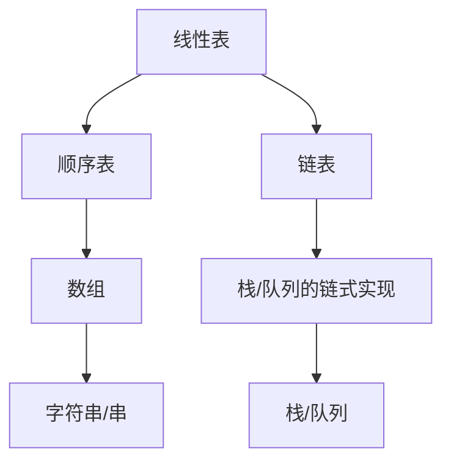

下面是一份**线性表的定义和基本操作**笔记，严格符合 Obsidian 的 LaTeX 标准（独立公式用 `$$`，行内公式用 `$...$`），并适度发散到数一、英一、408 的相关知识点。

---

## 线性表（Linear List）· 考研全科核心笔记

> 线性表是数据结构（408）的**基础中的基础**。所有的线性结构（栈、队列、串、数组）都是线性表的特例或扩展。在数一中，线性表的顺序存储对应**向量**和**矩阵**的存储方式；在英语一中，`linear`、`sequential`、`index` 等词属于高频科技词汇。

---

### 1. 线性表的定义

**定义**：线性表是由 $n$（$n \ge 0$）个**相同类型**的数据元素组成的**有限序列**。

$$
L = (a_1, a_2, a_3, \dots, a_n)
$$

其中：
- $n$ 称为线性表的**长度**（$n = 0$ 时称为**空表**）
- $a_1$ 为**第一个元素**（表头），$a_n$ 为**最后一个元素**（表尾）
- 元素之间是**一对一**的线性关系：除第一个元素外，每个元素有且仅有一个**直接前驱**；除最后一个元素外，每个元素有且仅有一个**直接后继**

> [!note] 数一关联：有限序列
> 数一中，**数列**也是有限或无限序列。线性表本质上就是一个**有限数列**，只是每个元素可以是任意类型（不仅是数）。

---

### 2. 线性表的基本操作（ADT 定义）

ADT（抽象数据类型）强调“**做什么**”而不是“**如何做**”。以下是考研 408 标准定义：

```C++
ADT LinearList {
    数据对象：D = {a_i | a_i ∈ ElemType, i = 1,2,...,n, n ≥ 0}
    数据关系：R = {<a_{i-1}, a_i> | a_{i-1}, a_i ∈ D, i = 2,...,n}
    基本操作：
        InitList(&L)          // 初始化，构造空表
        DestroyList(&L)       // 销毁表，释放空间
        ListInsert(&L, i, e)  // 在第 i 个位置插入元素 e
        ListDelete(&L, i, &e) // 删除第 i 个元素，用 e 返回其值
        GetElem(L, i, &e)     // 取第 i 个元素的值
        LocateElem(L, e)      // 查找第一个值为 e 的元素，返回位序
        ListLength(L)         // 返回表长
        IsEmpty(L)            // 判断是否为空表
        PrintList(L)          // 遍历输出（或称为 Traverse）
}
```

> [!example] 408 命题方向
> - 给出一个操作序列，判断最终表的状态
> - 给出一段代码，识别它实现了哪个 ADT 操作
> - 算法设计题中，直接调用上述操作而不纠结底层实现

---

### 3. [[顺序表|顺序存储]]（Sequential Storage）

**定义**：用**一组地址连续的存储单元**依次存储线性表的元素。

**特点**：
- **逻辑相邻** $\iff$ **物理相邻**
- 支持**随机存取**（$O(1)$ 时间定位第 $i$ 个元素）
- 插入/删除需要**移动大量元素**（$O(n)$）

**存储结构定义（C++ 风格）**：

```cpp
#define MAXSIZE 100
typedef struct {
    ElemType data[MAXSIZE];
    int length;          // 当前长度
} SqList;               // Sq 表示 Sequential
```

> [!important] 408 关键公式
> 在顺序表中，假设每个元素占 $c$ 个存储单元，则第 $i$ 个元素的存储地址为：
> $$
> \text{Loc}(a_i) = \text{Loc}(a_1) + (i - 1) \times c
> $$
> 该公式是**数一线性代数中向量存储**的基础，也是**408 中数组寻址**的核心。

**插入操作时间复杂度**：
- 在位置 $i$ 插入，需移动 $n - i + 1$ 个元素
- 平均移动次数：$\frac{n}{2}$
- 时间复杂度：$O(n)$

**删除操作时间复杂度**：
- 删除位置 $i$，需移动 $n - i$ 个元素
- 平均移动次数：$\frac{n-1}{2}$
- 时间复杂度：$O(n)$

> [!info] 数一关联：矩阵的按行/按列存储
> 数一线性代数中，矩阵的“按行优先存储”和“按列优先存储”本质就是顺序表的一维展开。二维数组在内存中就是顺序表：
> - 按行优先：$A[i][j]$ 的地址为 $\text{Loc}(A[0][0]) + (i \times n + j) \times c$
> - 按列优先：$A[i][j]$ 的地址为 $\text{Loc}(A[0][0]) + (j \times m + i) \times c$

---

### 4. 链式存储（Linked Storage）

**定义**：用**一组任意的存储单元**存储元素，通过**指针（地址）** 链接相邻元素。

**特点**：
- 逻辑相邻 $\neq$ 物理相邻
- 不支持随机存取，查找需要**遍历**（$O(n)$）
- 插入/删除**无需移动元素**，只需修改指针（$O(1)$，前提是已知插入位置）

**单链表的存储结构定义（C++ 风格）**：

```cpp
typedef struct LNode {
    ElemType data;
    struct LNode *next;
} LNode, *LinkList;      // LinkList 为指向头结点的指针
```

**常用链表类型**：

| 类型 | 特点 | 应用场景 |
|------|------|----------|
| 单链表 | 每个节点只存指向下一个节点的指针 | 最基本的链式结构 |
| 双向链表 | 每个节点存指向前驱和后续的两个指针 | 需要频繁双向遍历（如 LRU 缓存） |
| 循环链表 | 最后一个节点指向第一个节点 | 约瑟夫环问题（数一组合数学） |
| 静态链表 | 用数组模拟链表，游标代替指针 | 不支持指针的语言（如早期 BASIC） |

> [!note] 数一关联：指针与递推
> 链表的遍历本质是递推：$p = p \to \text{next}$。分析链表算法的时间复杂度时，常涉及数列求和，与数一中数列极限的思想相通。

---

### 5. 顺序存储 vs 链式存储（408 绝对高频）

| 对比维度 | 顺序表 | 链表 |
|----------|--------|------|
| 存储空间 | 预先分配，连续 | 动态分配，不连续 |
| 空间利用率 | 需要预分配，可能浪费 | 按需分配，无浪费，但需额外指针空间 |
| 随机存取 | ✅ $O(1)$ | ❌ $O(n)$ |
| 插入/删除 | ❌ $O(n)$（需移动元素） | ✅ $O(1)$（已知位置） |
| 查找（按值） | $O(n)$ | $O(n)$ |
| 适用场景 | 频繁查询、很少插入/删除 | 频繁插入/删除、很少查询 |

> [!tip] 考研记忆口诀
> **“顺序查快改慢，链表改快查慢”**

---

### 6. 线性表与数组、字符串、栈、队列的关系



| 数据结构          | 与线性表的关系                 | 408 常见考法       |
| ------------- | ----------------------- | -------------- |
| 数组（Array）     | 顺序表的一种，大小固定             | 多维数组的地址计算      |
| 字符串（String/串） | 元素为字符的线性表               | KMP 算法（408 高频） |
| 栈（Stack）      | **操作受限**的线性表（后进先出 LIFO） | 括号匹配、表达式求值     |
| 队列（Queue）     | **操作受限**的线性表（先进先出 FIFO） | 层次遍历、缓冲区管理     |

> [!important] 408 高频考点
> **“栈和队列是操作受限的线性表”**——这句话是简答题的标准答案。它们的逻辑结构仍然是线性结构，只是对插入和删除的位置做了限制。

---

### 7. 408 典型例题速览

| 题型 | 示例 | 核心考点 |
|------|------|----------|
| 顺序表插入 | 在长度为 $n$ 的顺序表中插入元素，平均移动元素次数为？ | 平均移动次数 $= n/2$ |
| 链表遍历 | 单链表判空条件？ | `head == NULL` 或 `head->next == NULL`（带头结点） |
| 双向链表插入 | 在双向链表中插入节点，指针修改顺序？ | 先改新节点指针，再改前后节点指针（注意顺序） |
| 静态链表 | 静态链表的特点？ | 用数组模拟链表，游标代替指针 |
| 综合设计 | 将两个递增有序链表合并为一个递增有序链表 | 归并思想，$O(m+n)$ |

---

### 8. 英语一关联：线性表相关高频词汇

| 英文         | 中文      | 常考语境                      |
| ---------- | ------- | ------------------------- |
| linear     | 线性的     | 阅读中描述“线性过程 / 因果关系”        |
| sequential | 顺序的、连续的 | 科技文中常见 "sequential order" |
| list       | 列表、目录   | 泛指“清单、列举”                 |
| index      | 索引、下标   | 阅读中表示“指标、指数”              |
| traverse   | 遍历、横贯   | 可用于写作中表示“涉及、覆盖”           |
| insert     | 插入      | 写作中表示“插入、嵌入观点”            |
| delete     | 删除      | 阅读中表示“删除、去除”              |

> [!tip] 写作句式
> 表示“列举一系列事物”时，可用：
> - `We can list several reasons for this phenomenon.`
> - `The paper presents a linear narrative of historical events.`
>
> 表示“遍历/覆盖”时，可用：
> - `The study traverses multiple disciplines, from computer science to mathematics.`

---

### 9. 易错与易混点

| 易错判断 | 正确理解 |
|----------|----------|
| “链表支持随机存取” | ❌ 错误。链表只能顺序存取，$O(n)$ |
| “顺序表插入操作是 $O(1)$” | ❌ 错误。插入需移动元素，$O(n)$。随机存取的是查询操作 |
| “线性表的每个元素必须相同类型” | ✅ 正确。这是线性表定义中的“相同类型”约束 |
| “空表就是 $n=0$ 的线性表” | ✅ 正确 |
| “带头结点的单链表判空条件为 `head == NULL`” | ❌ 错误。带头结点时，判空为 `head->next == NULL` |

---

### 10. 核心公式速查（408 + 数一交汇）

**顺序表第 $i$ 个元素地址（从 1 开始编号）**：
$$
\text{Loc}(a_i) = \text{Loc}(a_1) + (i - 1) \times c
$$

**二维数组按行优先地址（数一矩阵存储）**：
$$
\text{Loc}(A[i][j]) = \text{Loc}(A[0][0]) + (i \times n + j) \times c
$$

**二维数组按列优先地址**：
$$
\text{Loc}(A[i][j]) = \text{Loc}(A[0][0]) + (j \times m + i) \times c
$$

**顺序表插入平均移动次数**：
$$
\frac{1}{n+1} \sum_{i=1}^{n+1} (n - i + 1) = \frac{n}{2}
$$

**顺序表删除平均移动次数**：
$$
\frac{1}{n} \sum_{i=1}^{n} (n - i) = \frac{n-1}{2}
$$

---

### Obsidian 双向链接建议

- `[[数据结构三要素]]`：线性表的 ADT 定义是三要素（逻辑结构、存储结构、数据运算）的典型体现
- `[[栈和队列]]`：作为线性表的特例，对比学习
- `[[算法效率的度量]]`：顺序表/链表操作的时间复杂度分析
- `[[数列]]`：线性表的顺序存储与数列的有限形式
- `[[英语一-阅读高频词]]`：建立 `[[linear]]`、`[[index]]` 等词条

---

如果需要我继续展开**栈和队列**的笔记（作为线性表的特例），或者**KMP 算法**中串的详细分析，随时告诉我。