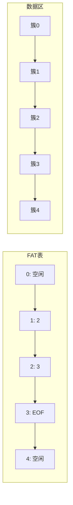

好的，以下是按**定义 → 基本操作 → 例题重点**结构整理的静态链表笔记：


## 静态链表 · 考研408核心笔记

> 静态链表是用**数组+游标**模拟链表，兼具顺序存储和链式存储的特点。

---

### 1. 定义

```cpp
#define MaxSize 100

typedef struct {
    ElemType data;    // 存储数据元素
    int next;         // 下一个元素的数组下标（游标）
} SLinkList[MaxSize];
```

| 组成     | 说明                                      |
| ------ | --------------------------------------- |
| `data` | 数据域，存储元素值                               |
| `next` | 游标域，存储**下一个结点的数组下标**（相当于单链表的 `next` 指针） |
| 空指针    | `next == -1`（或 `0`，取决于实现）               |

> [!note] 两种链表
> - **数据链表**：从 `space[0].next` 开始，存储有效数据
> - **备用链表**：从 `space[0]` 的头结点开始，管理空闲结点

---

### 2. 基本操作

#### 2.1 初始化

```cpp
void InitSLinkList(SLinkList &space) {
    // 将数组所有结点链接成一条备用链表
    for (int i = 0; i < MaxSize - 1; i++) {
        space[i].next = i + 1;        // 每个结点指向下一个
    }
    space[MaxSize - 1].next = -1;     // 最后一个指向 -1（空指针）
    space[0].next = -1;               // 数据链表初始为空
}
```

**初始化后的内存结构**：

| 下标 | 0 | 1 | 2 | 3 | ... | MaxSize-1 |
|------|---|---|---|---|-----|-----------|
| data | — | — | — | — | — | — |
| next | -1 | 2 | 3 | 4 | ... | -1 |

> 备用链表：`0 → 1 → 2 → 3 → ... → MaxSize-1 → -1`

---

#### 2.2 分配结点（从备用链表取）

```cpp
int Malloc(SLinkList &space) {
    int i = space[0].next;           // 取备用链表第一个结点
    if (i != -1) {
        space[0].next = space[i].next; // 从备用链表移除 i
    }
    return i;                        // 返回分配结点的下标
}
```

---

#### 2.3 回收结点（放回备用链表）

```cpp
void Free(SLinkList &space, int i) {
    space[i].next = space[0].next;   // 将 i 插入备用链表头部
    space[0].next = i;
}
```

---

#### 2.4 插入操作（在第 $i$ 个位置插入 $e$）

```cpp
bool ListInsert(SLinkList &space, int i, ElemType e) {
    // 1. 检查位置合法性
    if (i < 1 || i > ListLength(space) + 1) return false;

    // 2. 找前驱（第 i-1 个结点）
    int p = 0;                       // 从头结点开始
    int j = 0;
    while (j < i - 1) {
        p = space[p].next;
        j++;
    }

    // 3. 分配新结点
    int s = Malloc(space);
    if (s == -1) return false;       // 分配失败

    // 4. 插入（改游标）
    space[s].data = e;
    space[s].next = space[p].next;
    space[p].next = s;

    return true;
}
```

**游标变化**：

```
插入前：  ... → p → q → ...
插入后：  ... → p → s → q → ...
```

---

#### 2.5 删除操作（删除第 $i$ 个元素）

```cpp
bool ListDelete(SLinkList &space, int i, ElemType &e) {
    // 1. 检查位置合法性
    if (i < 1 || i > ListLength(space)) return false;

    // 2. 找前驱
    int p = 0;
    int j = 0;
    while (j < i - 1) {
        p = space[p].next;
        j++;
    }

    // 3. 删除
    int q = space[p].next;           // q 为被删除结点
    e = space[q].data;
    space[p].next = space[q].next;   // 绕过 q
    Free(space, q);                  // 回收 q

    return true;
}
```

---

#### 2.6 按位查找

```cpp
int GetElem(SLinkList space, int i) {
    if (i < 1) return -1;
    int p = space[0].next;           // 从首元结点开始
    int j = 1;
    while (p != -1 && j < i) {
        p = space[p].next;
        j++;
    }
    return p;                        // 返回下标，-1 表示查找失败
}
```

---

#### 2.7 按值查找

```cpp
int LocateElem(SLinkList space, ElemType e) {
    int p = space[0].next;
    while (p != -1 && space[p].data != e) {
        p = space[p].next;
    }
    return p;                        // 返回下标，-1 表示查找失败
}
```

---

#### 2.8 求表长

```cpp
int ListLength(SLinkList space) {
    int len = 0;
    int p = space[0].next;
    while (p != -1) {
        len++;
        p = space[p].next;
    }
    return len;
}
```

---

### 3. 例题重点

#### 3.1 经典真题：游标遍历

**题目**：已知静态链表数组 `space` 如下图所示，求 `LocateElem(space, 5)` 的返回值（返回下标）。

| 下标 | 0 | 1 | 2 | 3 | 4 | 5 |
|------|---|---|---|---|---|---|
| data | — | 3 | 5 | 8 | 2 | 1 |
| next | 1 | 3 | -1 | 5 | 2 | 4 |

**解**：从头结点（下标 0）的 `next = 1` 开始遍历：

```
0 → 1 (data=3) → 3 (data=8) → 5 (data=1) → 4 (data=2) → 2 (data=5) → -1
```

值为 5 的结点在下标 **2**。

**答案**：2

---

#### 3.2 常见选择题考点

| 考点 | 结论 |
|------|------|
| 判空条件 | `space[0].next == -1`（或 `0`） |
| 遍历终止条件 | `p == -1`（或 `p == 0`） |
| 插入操作游标修改 | **先改新结点 `next`，再改前驱 `next`** |
| 删除操作游标修改 | `space[p].next = space[q].next` |

---

#### 3.3 与普通链表对比

| 操作 | 静态链表 | 普通链表 |
|------|----------|----------|
| 链接方式 | **游标（下标）** | **指针（地址）** |
| 判空 | `space[0].next == -1` | `L == NULL` |
| 遍历终止 | `p == -1` | `p == NULL` |
| 插入/删除 | 改游标 | 改指针 |
| 空间分配 | 预先分配，固定大小 | 动态分配，按需增长 |

---

#### 3.4. 核心速查

```cpp
// 判空
space[0].next == -1;

// 分配结点
int p = Malloc(space);

// 回收结点
Free(space, p);

// 遍历
for (int p = space[0].next; p != -1; p = space[p].next) {
    // 访问 space[p].data
}
```

---

如需继续展开**静态链表的备选实现（`cur = 0` 表示空指针）**或**静态链表在408中的新趋势**，随时告诉我。

### 4. 扩展：[[FAT（文件分配表）]]

> FAT（File Allocation Table，文件分配表）是操作系统文件系统中**静态链表思想的经典应用**。在408中，FAT常出现在**操作系统**部分的考题中，但其底层数据结构本质就是**静态链表**。

---

#### 4.1 FAT 与静态链表的对应关系

| 静态链表 | FAT 文件系统 |
|----------|-------------|
| 数组 | FAT 表（存储在磁盘上） |
| 数组下标 | **簇号**（Cluster Number） |
| `data` 域 | 文件数据（存储在对应簇中） |
| `next` 游标 | 下一簇号（FAT 表项值） |
| `next = -1` | `0xFFFF` / `0xFFFFFFFF`（文件结束标志） |
| `next = 0` | 空闲簇 |
| 备用链表 | FAT 中通过特殊标记管理空闲簇 |

---

#### 4.2 FAT 的核心思想



> 文件 A 占用的簇链：`1 → 2 → 3 → EOF`

---

#### 4.3 为什么 FAT 是“静态链表”？

| FAT 特征 | 静态链表特征 | 结论 |
|----------|-------------|------|
| 用数组存储下一簇号 | 用数组存储下一结点下标 | ✅ 结构相同 |
| 通过簇号跳转 | 通过下标跳转 | ✅ 访问方式相同 |
| 文件占用多个不连续簇 | 链表占用多个不连续数组位置 | ✅ 逻辑相同 |
| 空闲簇用特殊标记管理 | 空闲结点用备用链表管理 | ✅ 管理方式相同 |

> [!important] 408 考点
> **“FAT 表本身就是一个静态链表”** —— 这是操作系统与数据结构交叉的核心结论。FAT 将文件占用的簇组织成一条链，支持**顺序存取**，但不支持随机存取（读取文件中间某块需从开头遍历）。

---

#### 4.4 FAT 的优缺点

| 优点 | 缺点 |
|------|------|
| 实现简单，便于管理 | FAT 表需常驻内存，占用空间 |
| 支持非连续存储，无外部碎片 | 文件越大，FAT 链遍历越慢 |
| 链式结构天然支持文件增长 | 不支持随机存取 |
| 删除文件只需修改 FAT 表项 | FAT 损坏会导致整个文件系统崩溃 |

---

#### 4.5 例题：FAT 表项遍历

**题目**：某 FAT 文件系统中，FAT 表部分内容如下（簇号从 0 开始）：

| 簇号 | 0 | 1 | 2 | 3 | 4 | 5 | 6 |
|------|---|---|---|---|---|---|---|
| FAT 值 | EOF | 3 | EOF | 5 | 0 | EOF | 2 |

问：文件 A 从簇 1 开始，占用哪些簇？

**解**：

```
1 → 3 → 5 → EOF
```

文件 A 占用的簇为：**1，3，5** ✅

> 这就是静态链表遍历：`p = space[p].next`，直到 `p == EOF` 终止。

---

#### 4.6 总结

| 视角 | 静态链表 | FAT 文件系统 |
|------|----------|-------------|
| **数据结构** | 数组 + 游标 | FAT 表 + 簇号 |
| **逻辑结构** | 链表 | 文件簇链 |
| **空指针** | `-1` 或 `0` | `EOF`（如 `0xFFFF`） |
| **空闲管理** | 备用链表 | 空闲簇链表 |
| **408 科目** | 数据结构 | 操作系统 |

> [!tip] 记忆技巧
> **FAT = 磁盘版的静态链表**。理解静态链表的游标遍历，就理解了 FAT 的文件簇链遍历。两个知识点可以互相印证记忆。