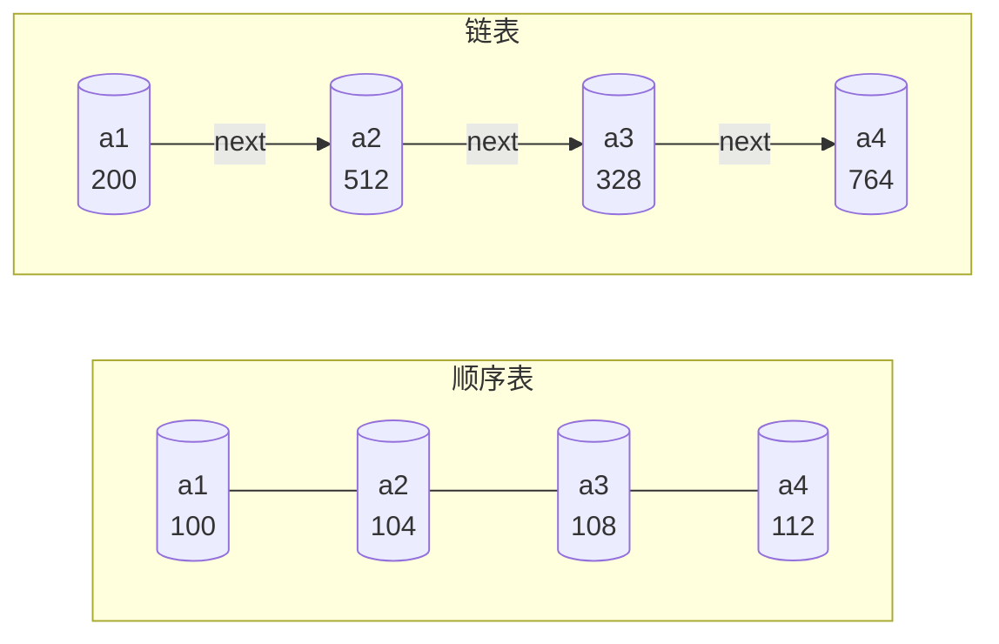

## 顺序表 vs 链表 · 全方位对比（408核心）

> 顺序表和链表是线性表的两种基本存储结构，408中几乎每年都会以选择题或大题形式考察两者的对比。以下从**存取方式、逻辑结构、物理结构、查找、插入、删除、空间**七个维度展开。

---

### 1. 对比总表

| 对比维度 | 顺序表 | 链表 |
|----------|--------|------|
| **存取方式** | **随机存取**（直接通过下标访问） | **顺序存取**（需从头遍历） |
| **逻辑结构** | 线性结构（一对一） | 线性结构（一对一） |
| **物理结构** | **地址连续**，占用一整块空间 | **地址不连续**，分散存储 |
| **按位查找** | $O(1)$（随机存取） | $O(n)$（需遍历） |
| **按值查找** | $O(n)$（无序） | $O(n)$（无序） |
| **插入（已知位置）** | $O(n)$（需移动元素） | $O(1)$（只改指针） |
| **删除（已知位置）** | $O(n)$（需移动元素） | $O(1)$（只改指针） |
| **空间分配** | **静态分配**（预先分配） | **动态分配**（按需分配） |
| **存储密度** | **高**（仅数据，无额外开销） | **低**（数据 + 指针） |
| **扩容** | 困难（需整体移动） | 容易（随时分配新结点） |

---

### 2. 存取方式

| 存取方式 | 顺序表 | 链表 |
|----------|--------|------|
| 类型 | **随机存取** | **顺序存取** |
| 含义 | 可直接访问第 $i$ 个元素，无需遍历 | 访问第 $i$ 个元素需从头开始逐个查找 |
| 时间复杂度 | $O(1)$ | $O(n)$ |
| 公式 | $\text{Loc}(a_i) = \text{Loc}(a_1) + (i-1) \times c$ | 无法直接计算地址，需遍历 |
| 408 常见表述 | “顺序表支持随机存取” | “链表只支持顺序存取” |

> [!tip] 记忆要点
> - **“随机”** = 任意时刻、任意位置都能直接访问
> - **“顺序”** = 必须按顺序从头走到尾
>
> 顺序表是“查字典”（按索引直接翻），链表是“数扑克牌”（一张一张数到第 $n$ 张）。

---

### 3. 逻辑结构与物理结构

| 结构 | 顺序表 | 链表 |
|------|--------|------|
| **逻辑结构** | 线性结构（一对一） | 线性结构（一对一） |
| **物理结构** | **地址连续** | **地址不连续** |
| 逻辑相邻与物理相邻关系 | ✅ **逻辑相邻 = 物理相邻** | ❌ **逻辑相邻 ≠ 物理相邻** |
| 存储空间 | 一整块连续空间 | 分散的零碎空间（动态分配） |
| 存储密度 | 高（`data` 占全部空间） | 低（`data` + `next`，有指针开销） |

> [!note] 408 常见设问
> 选择题常考：“以下哪种存储结构支持随机存取？”
> 答案：只有顺序表（数组）支持随机存取。链表、栈、队列均不支持。

---

### 4. 查找操作

| 查找类型 | 顺序表 | 链表 |
|----------|--------|------|
| **按位查找**（取第 $i$ 个元素） | $O(1)$ ✅ | $O(n)$ ❌ |
| **按值查找**（查找值为 $e$ 的元素） | $O(n)$（平均 $n/2$ 次） | $O(n)$（平均 $n/2$ 次） |
| 是否支持随机存取 | ✅ | ❌ |

> [!important] 结论
> - 按位查找：**顺序表完胜**（$O(1)$ vs $O(n)$）
> - 按值查找：**两者均为 $O(n)$**（无序情况下），因为都要遍历比较

---

### 5. 插入与删除操作

| 操作 | 顺序表 | 链表 |
|------|--------|------|
| **插入（已知位置）** | $O(n)$（需移动元素） | $O(1)$（只改指针） |
| **插入（按值插入，需先查找）** | $O(n) + O(n) = O(n)$ | $O(n) + O(1) = O(n)$ |
| **删除（已知位置）** | $O(n)$（需移动元素） | $O(1)$（只改指针） |
| **删除（按值删除，需先查找）** | $O(n) + O(n) = O(n)$ | $O(n) + O(1) = O(n)$ |
| 平均移动次数 | 插入：$n/2$，删除：$(n-1)/2$ | **0**（只改指针） |

> [!tip] 记忆口诀
> **“顺序查快改慢，链表改快查慢”**

> [!example] 插入操作的对比示例
> 在顺序表中，若在表头插入元素，后面所有 $n$ 个元素都要后移一位；
> 在链表中，若在表头插入元素，只需修改头指针：
> ```cpp
> s->next = L->next;  // 新结点指向原首元
> L->next = s;        // 头结点指向新结点
> ```

---

### 6. 空间对比

| 空间维度 | 顺序表 | 链表 |
|----------|--------|------|
| **分配方式** | **静态分配**（预先指定大小） | **动态分配**（按需分配） |
| **空间利用率** | 需预先分配，可能浪费 | 按需分配，无浪费 |
| **存储密度** | **高**（约 1） | **低**（约 $1/2$） |
| **扩容** | 困难（需重新分配整块空间） | 容易（随时分配新结点） |
| **内存碎片** | 无内部碎片，但可能产生外部碎片（无法分配大块） | 无外部碎片，但有指针开销 |
| **能否就地扩容** | ❌ 不能（需申请新空间 + 复制） | ✅ 能（每个结点独立分配） |

> [!warning] 注意
> 顺序表的“浪费”是**预先分配导致的**（无论是否装满，空间已占满）。链表的“浪费”是**指针开销导致的**（每个结点多存一个指针）。

---

### 7. 综合对比可视化




> 顺序表：逻辑相邻 = 物理相邻（连续存储）  
> 链表：逻辑相邻 ≠ 物理相邻（分散存储，通过指针链接）

---

### 8. 选择指南

| 场景 | 推荐存储结构 |
|------|-------------|
| 频繁按位查找，很少插入/删除 | ✅ 顺序表 |
| 频繁插入/删除，很少查找 | ✅ 链表 |
| 元素个数预先已知 | ✅ 顺序表 |
| 元素个数不确定、动态变化 | ✅ 链表 |
| 需要高效随机存取 | ✅ 顺序表 |
| 需要高效增删改 | ✅ 链表 |
| 存储密度要求高 | ✅ 顺序表 |
| 内存紧张、需按需分配 | ✅ 链表 |

> [!important] 408 选择题高频考点
> - **“频繁查找” → 选择顺序表**
> - **“频繁插入/删除” → 选择链表**
> - **“随机存取” → 只有顺序表支持**

---

### 9. 常用时空复杂度对照表

| 操作 | 顺序表时间复杂度 | 链表时间复杂度 |
|------|----------------|----------------|
| 按位查找 | $O(1)$ | $O(n)$ |
| 按值查找 | $O(n)$ | $O(n)$ |
| 插入（表头） | $O(n)$ | $O(1)$ |
| 插入（表尾） | $O(1)$ | $O(n)$（有尾指针则为 $O(1)$） |
| 插入（任意位置） | $O(n)$ | $O(n)$（查找）+ $O(1)$（改指针） |
| 删除（表头） | $O(n)$ | $O(1)$ |
| 删除（表尾） | $O(1)$ | $O(n)$（需找前驱） |
| 删除（任意位置） | $O(n)$ | $O(n)$（查找）+ $O(1)$（改指针） |
| 求表长 | $O(1)$（维护 `length`） | $O(n)$（需遍历计数） |

> [!tip] 特殊情况
> 链表若维护**尾指针**，表尾插入/删除时间复杂度可降为 $O(1)$（但删除仍需找前驱）。

---

### 10. 易错与易混点

| 易错判断 | 正确理解 |
|----------|----------|
| “顺序表的插入操作是 $O(1)$” | ❌ 错误。顺序表随机存取的是**查找/取值**操作，插入需移动元素，为 $O(n)$ |
| “链表的按位查找是 $O(1)$” | ❌ 错误。链表只支持顺序存取，按位查找需 $O(n)$ |
| “链表存储密度高” | ❌ 错误。链表因指针开销存储密度低，顺序表存储密度高 |
| “顺序表支持顺序存取” | ⚠️ 不准确。顺序表支持**随机存取**，也支持顺序存取（但这不是它的优势） |
| “链表支持随机存取” | ❌ 错误。链表只支持顺序存取 |

---

### Obsidian 双向链接建议

- `[[顺序表]]`：顺序存储的完整笔记
- `[[单链表]]`：链式存储的完整笔记
- `[[算法效率的度量]]`：时间/空间复杂度分析
- `[[静态链表]]`：两种存储结构的融合

---

如需我继续展开**C++ STL 中 `vector` vs `list` 的选择对比**，或**不同存储结构对算法设计的影响**，随时告诉我。