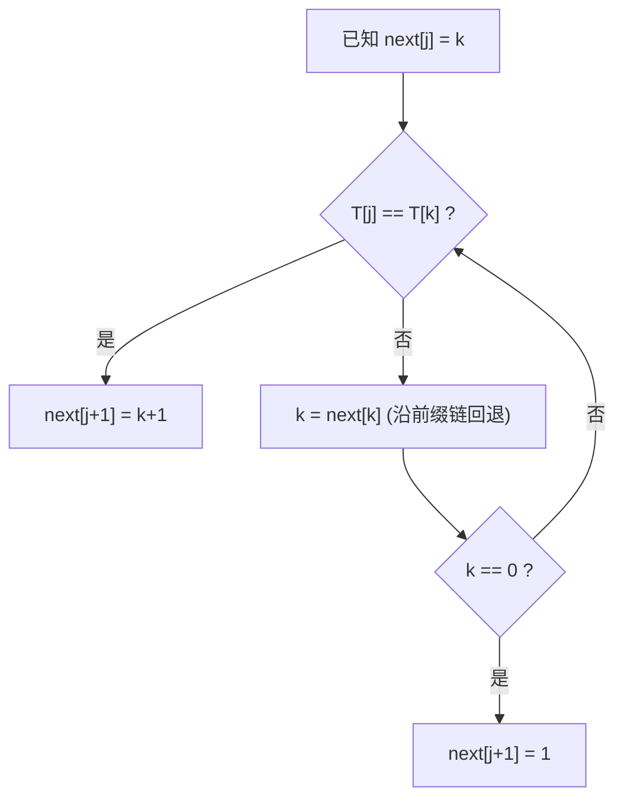

## 串 · 考研408核心笔记（五）求 next 数组

> next 数组是 [[KMP算法]] 的灵魂。手工求 next 是 408 选择题的**必考题型**（给一个模式串，求 next 或 nextval）；代码级求法（`get_next`）也常出现在大题中。掌握"**递推思想 + 手工三步法**"两条路线即可满分拿下。


### 1. 手工求 next 的三步法（王道标准）

对模式串 $T = 't_1t_2\cdots t_m'$，下标从 1 开始：

1. **$\text{next}[1] = 0$**（固定边界）
2. **$\text{next}[2] = 1$**（固定：前 1 个字符无前后缀可比，无脑为 1）
3. 对 $j \ge 3$：看 $T[1..j-1]$（前 $j-1$ 个字符）的**最长相等前后缀**长度 $L$，则
   $$
   \text{next}[j] = L + 1
   $$

> [!warning] 前后缀规则
> 前 $j-1$ 个字符子串的**前缀**以 $T_1$ 开头、**后缀**以 $T_{j-1}$ 结尾，二者**都不能取整个子串本身**。例如 `abab` 的前缀是 a、ab、aba，后缀是 b、ab、bab，最长相等的是 `ab`，长度 2。


### 2. 手工例题：$T = 'ababaa'$

| $j$ | 前 $j-1$ 个字符 | 尝试匹配过程 | $L$ | $\text{next}[j]$ |
| --- | --- | --- | --- | --- |
| 1 | — | — | — | **0** |
| 2 | `a` | 无前后缀 | 0 | 1 |
| 3 | `ab` | a vs b ✗ | 0 | 1 |
| 4 | `aba` | a=a ✔，ab vs ba ✗ | 1 | 2 |
| 5 | `abab` | a=a，ab=ab ✔，aba vs bab ✗ | 2 | 3 |
| 6 | `ababa` | a=a，ab=ab，aba=aba ✔ | 3 | 4 |

$$
\text{next} = [0,\ 1,\ 1,\ 2,\ 3,\ 4]
$$

> [!tip] 快速检查
> `ababaa` 的 next 呈"每多匹配一对前后缀就 +1"的规律（0,1,1,2,3,4），发现递推关系：$\text{next}[j+1] = \text{next}[j] + 1$ 当且仅当 $T[j] = T[\text{next}[j]]$。


### 3. 递推公式（理论依据）

已知 $\text{next}[1] = 0$。设已求出 $\text{next}[j] = k$，则求 $\text{next}[j+1]$：

- 若 $T[j] = T[k]$：$\text{next}[j+1] = k + 1$
- 若 $T[j] \ne T[k]$：令 $k = \text{next}[k]$ 继续比较，直到
  - $T[j] = T[k]$：$\text{next}[j+1] = k + 1$；或
  - $k = 0$：$\text{next}[j+1] = 1$




### 4. 递推代码实现（`get_next`，王道风格）

```cpp
// 求模式串 T 的 next 数组（下标从 1 开始）
void get_next(SString T, int next[]) {
    int i = 1, j = 0;          // i 指向当前求到的位置，j 为"待比较前缀指针"
    next[1] = 0;
    while (i < T.length) {     // 依次求出 next[2] ~ next[T.length]
        if (j == 0 || T.ch[i] == T.ch[j]) {
            ++i;
            ++j;
            next[i] = j;       // 得到 next[i]：兼顾"j==0 时 next=1"的边界
        } else {
            j = next[j];       // 失配：沿 next 链回退（对应递推公式第 2 种情况）
        }
    }
}
```

**运行轨迹示例**（$T = 'ababaa'$，`ch[1..6]`）：

| 迭代 | $i$ | $j$ | 比较 | 动作 | next 更新 |
| --- | --- | --- | --- | --- | --- |
| 初始 | 1 | 0 | — | — | next[1]=0 |
| ① | 1 | 0 | j==0 | i=2, j=1 | next[2]=1 |
| ② | 2 | 1 | b vs a ✗ | j=next[1]=0 | — |
| ③ | 2 | 0 | j==0 | i=3, j=1 | next[3]=1 |
| ④ | 3 | 1 | a vs a ✔ | i=4, j=2 | next[4]=2 |
| ⑤ | 4 | 2 | b vs b ✔ | i=5, j=3 | next[5]=3 |
| ⑥ | 5 | 3 | a vs a ✔ | i=6, j=4 | next[6]=4 |

得到 $\text{next} = [0,1,1,2,3,4]$，与手工三步法结果一致 ✔

> [!note] 为什么这个代码高效？
> $j$ 要么 +1（匹配），要么沿 next 回退（失配），所以求 next 的总比较次数 ≈ $O(m)$，与匹配阶段同阶，不会破坏 KMP 整体的 $O(n+m)$。

### 5. 更多手算练习

**例 1：$T = 'aaaab'$**

| $j$ | 前 $j-1$ 个字符 | $L$ | next |
| --- | --- | --- | --- |
| 1 | — | — | 0 |
| 2 | `a` | 0 | 1 |
| 3 | `aa` | 1 | 2 |
| 4 | `aaa` | 2 | 3 |
| 5 | `aaaa` | 3 | 4 |

$$
\text{next} = [0,\ 1,\ 2,\ 3,\ 4]
$$

**例 2：$T = 'abaabc'$**

| $j$ | 前 $j-1$ 个字符 | $L$ | next |
| --- | --- | --- | --- |
| 1 | — | — | 0 |
| 2 | `a` | 0 | 1 |
| 3 | `ab` | 0 | 1 |
| 4 | `aba` | 1 | 2 |
| 5 | `abaa` | 1 | 2 |
| 6 | `abaab` | 2 | 3 |

$$
\text{next} = [0,\ 1,\ 1,\ 2,\ 2,\ 3]
$$


### 6. 408 常考点与易错

| 考点/易错 | 说明 |
| --- | --- |
| next[1] = 0、next[2] = 1 | 固定结论，下标从 1 的约定 |
| 最长相等前后缀 | 前后缀都不能是整个子串；`abab` 的最长是 `ab`（2） |
| 下标从 0 的变体 | 若约定下标从 0 开始，则 next[0] = -1、next[1] = 0，递推代码需同步修改——看清题目标注 |
| 递推方向 | next[j+1] 由 next[j] 及其回退链决定，逐位后移，不回头 |
| 复杂度 | `get_next` 为 $O(m)$ |


### Obsidian 双向链接建议

- [[KMP算法]]：next 数组的使用者
- [[KMP算法的进一步优化]]：由 next 递推 nextval
- [[朴素模式匹配算法]]：为什么需要 next 的对比背景
- [[串的存储结构]]：下标从 1 的存储约定


### Tags

#408/数据结构 #408/串 #408/必背


### Related Notes

- [[KMP算法]]：next[j] = 失配时 j 的跳转位置
- [[KMP算法的进一步优化]]：nextval = 修正后的 next
- [[朴素模式匹配算法]]：没有 next 的暴力版本
- [[串的存储结构]]：`ch[0]` 闲置、下标从 1