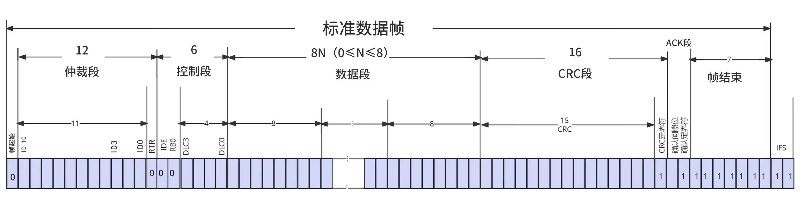

# 基础知识
## CAN总线介绍
CAN（Controller Area Network） 总线是由博世（Bosch） 公司于 1986 年推出的串行通信协  
议， 专为汽车电子系统设计， 旨在减少车辆中线束数量， 实现多个电子控制单元（ECU） 之间  
的高效通信。
### 1. CAN 总线核心特点   
CAN 总线支持多主通信， 所有节点均可主动发送数据， 无需依赖中心控制器。 其采用非破  
坏性仲裁机制， 通过 ID 优先级解决总线冲突， 确保高优先级数据优先传输。  
CAN 总线具备高可靠性， 内置 CRC 校验、 错误检测与恢复机制， 同时采用差分信号增强抗  
电磁干扰能力。 此外， CAN 总线通过简化布线和降低系统复杂度， 实现了低成本的优势。  
### 2. 应用领域  
(1)汽车电子： 发动机控制、 车身模块（灯光/门窗） 、 诊断系统（OBD-II） 等。  
(2)工业自动化： PLC、 传感器网络、 机器人控制。  
(3)其他领域： 医疗设备、 航空航天、 智能楼宇。  
### 3. 发展历程  
- 1983 年： Bosch 启动汽车网络技术研究。  
- 1986 年： 正式发布 CAN 协议。  
- 1987 年： 英特尔与飞利浦推出首款 CAN 控制器芯片。  
- 1991 年： CAN 2.0 规范发布， 首次应用于奔驰 S 级轿车。  
- 1993 年： 成为国际标准（ISO 11898） 。  
- 2015 年： CAN FD（Flexible Data Rate） 标准化（支持更高速率与 64 字节数据） 。  
- 2020 年： 下一代 CAN XL 发布， 带宽进一步提升。

> 工业领域广泛应用的是1993 年的国际标准（ISO 11898） 
> 而汽车电子领域应用FD或XL等更新的标准

## 硬件连接
在 CAN 总线硬件连接中， 有 CPU 自带 CAN 控制器和 CPU 没有 CAN 控制器需外设转接（如SPI 转 CAN） 这两种情况， 本小节将对这两种连接方式进行讲解。

### 1. CPU 自带 CAN 控制器


### 2. CPU 没有 CAN 控制器


## CAN 总线电气属性
CAN总线特征:
两根通信线（CAN_H、CAN_L），线路少，无需共地
差分信号通信，抗干扰能力强
高速CAN （ISO11898）：125k~1Mbps,<40m
低速CAN （ISO11519） ： 10k~125kbps,<1km
异步，无需时钟线，通信速率由设备各自约定
半双工，可挂载多设备，多设备同时发送数据时通过仲裁判断先后顺序
11位/29位报文ID，用于区分消息功能，同时决定优先级
可配置1~8字节的有效载荷
可实现广播式和请求式两种传输方式
应答、CRC校验、位填充、位同步、错误处理等特性


# CAN总线帧格式
## 数据帧


一帧数据帧


## 遥控帧

## 错误帧

## 过载帧

## 帧间隔

## 位填充
位填充是 CAN 协议中用于确保数据传输过程中信号同步的重要机制， 其作用是在数据帧中避免出现长时间不变的信号电平， 从而保障发送端与接收端的同步。  
位填充规则： 当数据中出现 5 个连续的相同极性位时， 在第 6 位插入一个与这些位极性相反的填充位。

>填充范围： 从帧起始部分到 CRC 字段之间进行， CRC 字段之后的数据（如 ACK 字段和帧结束） 不进行填充


## CAN总线波形实例分析

# 如何使用CAN总线
## [[设备树|使能CAN设备树]]
需要确保设备书中开启CAN总线设备树使能，
## 使能内核驱动
```Kconfig
>Networking support
	>CAN bus subsystem support
		>CAN Device Drivers
			<*>Platform CAN drivers with Netlink support
```


使用`ifconfig -a`命令查看所有网络设备，CAN设备节点不再/dev目录下，在网络设备下，
## iproute2移植
使用工具操作CAN接口，iproute2是linux下的TCP/IP工具。
### 移植方法1
1. 下载源码
	https://www.kernel.org/pub/linux/utils/net/iproute2/ 
	[iproute2-6.9.0.tar.gz](https://www.kernel.org/pub/linux/utils/net/iproute2/iproute2-6.9.0.tar.gz)
	
	下载完成后拷贝到虚拟机中
2. 解压
```sh
tar -vzxf iproute2-6.9.0.tar.gz
```
3. 配置Makefile
```sh
cd iproute2-6.9.0
./configure
# 只需要用到ip工具，编辑MAakefile文件
SUBIDIRS=lib ip
# 删除SUBDIRS的其他工具
```
4. 交叉编译
```sh
Make CC=/path/to/your/cross/gcc
```
5. 检测架构
```
file ./ip/ip
```
编译完成后ip目录的ip命令放到开发板上就能使用了
> 此方法使用于自定义rootfs，如busybox，buildroot有更简单的移植方法

### 移植方法2
```Kconfig
Target packages
	Networking applications
		iproute2
```
>debian及其衍生系统，使用apt命令安装即可

## canutils 工具移植
canutils 是一个常用的 CAN 通信测试工具包， 包含 canconfig、 candump、 canecho、 cansend 和 cansequence 5 个独立的工具

接下来对移植过程进行讲解， 由于 canutils 依赖于 libsocketcan 库， 因此需要先编译 libsocketcan 库， 然后再编译 canutils 工具。 libsocketcan 库源码可以从下方链接获取
http://www.pengutronix.de/software/libsocketcan/download/ 
### 移植方法1
libsocketcan-0.0.12 目录下， 使用以下 4 条命令配置交叉编译器以及配置源码。 注  
意交叉编译器所在路径需换成自己开发环境中交叉编译器所在的实际路径。
1. 配置环境变量以及生成makefile文件
```
export ARCH=arm64  
export CROSS_COMPILE=/home/topeet/work/linux_sdk/prebuilts/gcc/linux-x86/aarch64/gcc-linaro-6.3.1-2017.05-x86_64_aarch64-linux-gnu/bin/aarch64-linux-gnu
export PATH=$PATH:/home/topeet/work/linux_sdk/prebuilts/gcc/linux-x86/aarch64/gcc-linaro-6.3.1-2017.05-x86_64_aarch64-linux-gnu/bin/
./configure --host=aarch64-linux-gnu --prefix=/home/topeet/can/libsocketcan-0.0.12/out
```
2. 编译
```
make
file ./out/lib/libsocketcan.so.2.3.1
make install
```
`file ./out/lib/libsocketcan.so.2.3.1`查看是否是对应建构的文件，不是的话`make clean`检查环境变量，重启终端等操作，重新编译。
编译成功
```
make install
```

好了，至此， 关于 libsocketcan 源码的编译就完成了， 然后移植 canutils 工具， canutils 源码下载地址为
https://public.pengutronix.de/software/socket-can/canutils/v4.0/
下载完成之后拷贝到虚拟机 ubuntu 上并解压。

然后进入到 canutils-4.0.6 目录下对 config/autoconf/config.sub 文件进行修改， 添加代码清单如下图所示内容增加对 aarch64 的支持。


然后对 configure 配置文件进行修改， 将 2604 行编译器修改为 aarch64-linux-gnu-gcc， 修改完成如下图所示


然后使用以下命令对源码和编译器进行配置， 需要注意命令中的编译好的 libsocketcan 库所在环境的路径需要根据自己环境的实际路径来编写。
```sh
export ARCH=arm64  
export CROSS_COMPILE=/home/topeet/work/linux_sdk/prebuilts/gcc/linux-x86/aarch64/gcc-linaro-6.3.1-2017.0  
5-x86_64_aarch64-linux-gnu/bin/aarch64-linux-gnuexport PATH=$PATH:/home/topeet/work/linux_sdk/prebuilts/gcc/linux-x86/aarch64/gcc-linaro-6.3.1-2017.05-x8  
6_64_aarch64-linux-gnu/bin/  
./configure \  
--host=aarch64-linux-gnu \  
--prefix=/home/topeet/can/canutils-4.0.6/out \  
libsocketcan_LIBS="-L/home/topeet/can/libsocketcan-0.0.12/out/lib -lsocketcan" \  
libsocketcan_LDFLAGS="-L/home/topeet/can/libsocketcan-0.0.12/out/lib" \  
libsocketcan_CFLAGS="-I/home/topeet/can/libsocketcan-0.0.12/out/include" \  
CFLAGS="-I/home/topeet/can/libsocketcan-0.0.12/out/include"
```
然后执行 make && make install 命令进行编译和安装，编译成功后工具在.out/bin和.out/sbin

### 移植方法2
如果使用的是buildroot文件系统，可以直接在编译文件系统的时候集成进去。
按照以下路径选中can-utils
```
Target packages  --->
	Networking applications  --->
		can-utils  
Target packages  --->
	Libraries  --->
		Networking  --->
			libsocketcan
```
之后编译的buildroot就带有工具了
>debian及其衍生系统，使用apt命令安装即可

# 工具使用
2.设置 CAN 接囗的波特率  
CAN 接口的波特率可以通过 ip 命令设置， 例如可以通过 ip link set can0 type can bitrate  
250000 命令设置 CAN0 接口的波特率为 250 k， 如图 219.23 所示。  

图 219.23  
3.启动和关闭 CAN 接口  
（1） 方法 1： 使用 ifconfig 命令  
通过 ifconfig can0 up 命令启动 CAN 接口， 如图 219.24 所示。  

图 219.24  
关闭 CAN 接口使用 ifconfig can0 down 命令。  
（2） 方法 2： 使用 ip 命令  
使用 ip link set can0 up 命令启动 CAN 接口， 如图 219.25 所示。  

图 219.25  
关闭 CAN 接口使用 ip link set can0 down 命令。

4.检查 CAN 接口状态  
（1） 使用 ifconfig can0 命令检查， 如图 219.26 所示。  

图 219.26  
（2） 使用 ip -details link show can0 命令检查， 如图 219.27 所示。  

图 219.27  
5.使用 CAN 工具测试通信  
（1） 使用 candump 接收数据  
candump 用于从 CAN 总线接口接收数据， 并以十六进制形式打印到标准输出。 命令格式  
为 candump <接口> [选项]。 使用 candump can0 -L &命令开启接收， 如图 219.28 所示。  

图 219.28  
然后使用 USB 转 CAN 的上位机软件向开发板发送数据， 如果发送成功在开发板上会收  
到数据， 如图 219.29 所示。  

图 219.29
（2） 使用 cansend 发送数据  
cansend 用于向 CAN 总线接口发送不同的帧， 发送不同帧的示例如下：  
· 发送标准数据帧
命令格式： cansend <接口> <帧 ID>#<数据>  
<接口>： CAN 接口名称（如 can0） 。  
<帧 ID>： CAN 帧的 ID（11 位， 十六进制） 。  
<数据>： CAN 帧的数据（十六进制） 。  
示例： 使用 cansend can0 123#DEADBEEF 命令向 can0 发送一个标准数据帧， ID 为 0x123，  
数据为 DE AD BE EF， 如图 219.30 所示。  

图 219.30

如果发送成功在 USB 转 CAN 的上位机软件中会显示接收到数据， 如图 219.31 所示。  

图 219.31  
· 发送远程帧  
命令格式： cansend <接口> <帧 ID>#R  
R： 表示远程帧。  
示例： 使用 cansend can0 123#R 命令向 can0 发送一个标准远程帧， ID 为 0x123， 如图 219.32  
所示。  

图 219.32  
如果发送成功在 USB 转 CAN 的上位机软件中会显示接收到数据， 如图 219.33 所示。

图 219.33
· 发送扩展数据帧  
命令格式： cansend <接口> <帧 ID>#<数据>  
<帧 ID>： CAN 帧的 ID（29 位， 十六进制） 。  
示例： 使用 cansend can0 00000123#12345678 命令向 can0 发送一个扩展数据帧， ID 为  
0x00000123， 数据为 12 34 56 78， 如图 219.34 所示。  

图 219.34  
如果发送成功在 USB 转 CAN 的上位机软件中会显示接收到数据， 如图 219.35 所示。  

图 219.35  
· 发送扩展远程帧  
命令格式： cansend <接口> <帧 ID>#R  
R： 表示远程帧。  
示例： 使用 cansend can0 00000123#R 命令向 can0 发送一个扩展远程帧， ID 为 0x00000123，  
如图 219.36 所示。

图 219.36  
如果发送成功在 USB 转 CAN 的上位机软件中会显示接收到数据， 如图 219.37 所示。  

图 219.37