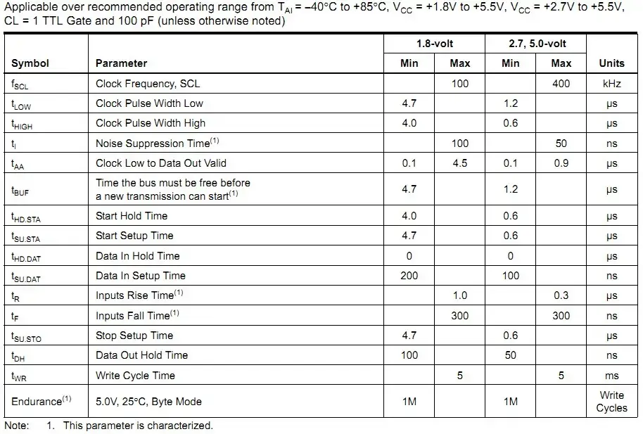

# 波形
- 起始：时钟线SCL为高时，数据线SDA由高到低 ^0a7776
- 停止：时钟线SCL为高时，数据线SDA由低到高

# I2C引脚为什么要配置为开漏，上拉？
首先，什么是开漏，上拉？
## 1. 什么是开漏输出（Open-Drain）？
- **普通推挽输出（Push-Pull）**：可以主动输出高电平（连接到 VCC）或低电平（连接到 GND）。
- **开漏输出（Open-Drain）**：
	- 只能主动**拉低**电平（内部 MOSFET 导通，连接到 GND）。
	- **不能主动输出高电平**。当内部 MOSFET 关断时，引脚处于**高阻态**（High-Impedance, Hi-Z），相当于“断开”或“悬空”。
## 2. 为什么需要上拉电阻？
因为开漏输出自己无法产生高电平，所以必须依赖一个外部元件来将总线拉到高电平。这个元件就是**上拉电阻**（Pull-up Resistor）。
- **作用**：在没有任何设备拉低总线时，上拉电阻将 SDA 和 SCL 线通过一个电阻连接到电源（VCC），使其保持在逻辑高电平（1）。
- **典型值**：4.7kΩ 或 10kΩ（具体值取决于总线电容、速度和电源电压）。
回到开头，I2C引脚为什么要配置为开漏，上拉？

### 原因1：总线仲裁
- I2C是多主多从架构的总线协议，为了更好的实现总线仲裁，利用了开漏输出+上拉电阻的线与特性。
> **“线与”**：在 I2C 总线上，**只要有一个设备将总线拉低（输出 0），整个总线的电平就是低（0）**。只有当**所有**连接到总线的设备都释放总线（不拉低，即高阻态）时，上拉电阻才能将总线拉高（1）。

- 仲裁过程，主机A发起通信，发出[[I2C#^0a7776|起始信号]]，此时主机A进行[[#^8475c8|空闲检测]]（高SCL，高SDA持续时间>= $t_{BUF}$ ），SDA顺利拉低，正当此时，主机B也想发起通信，B 在发送“1”的同时会**监测**总线电平。它发现总线是“0”而不是它期望的“1”，就知道**有另一个主设备正在主导总线**（这就是冲突检测）。主设备 B 会立即**退出**（停止驱动总线），让主设备 B 继续通信。（这就是总线仲裁）

- **关键点**：这种仲裁是**无损的**，不会损坏硬件，因为两个设备都在“拉低”或“释放”，没有设备在“强推”高电平对抗“强拉”低电平（这会导致大电流和可能的损坏）。
### 原因2：时钟同步
- SCL 线也是开漏，所有设备（主和从）都可以拉低 SCL。
- 从设备可以通过拉低 SCL 来“拉伸时钟”（Clock Stretching），告诉主设备“我还没准备好，请慢一点”。
- 主设备在发送时钟脉冲时，会监测 SCL 线。如果从设备拉低了 SCL，主设备就必须等待，直到 SCL 被释放（变高）才继续。
- **关键点**：多个从设备都可以通过拉低 SCL 来请求暂停，它们的行为是“线与”的——只要有一个在拉低，时钟就被拉低。
### 杂因3：避免短路
- 若使用推挽输出，可能会电源直接接地，造成短路。
- 开漏 + 上拉的设计**从根本上避免了这种冲突**。设备只能拉低或释放。拉低是主动的（强下拉），释放是被动的（弱上拉）。永远不会出现一个设备“强推”高电平对抗另一个设备“强拉”低电平的情况。

### 空闲检测

^8475c8

大致讲清了为什么I2C总线要配置为开漏，上拉模式，但对于仲裁过程，我还有疑惑，比如数据传输过程中（或者说单主单从正在正常通信）也会有高SCL，高SDA的情况出现，此时要是有其他主机发起[[#^0a7776|起始信号]]怎么办呢？
**先说结论：其他主机不会发起通信。**
为什么不会？
因为主机A会监测总线空闲状态，怎么检测？如图：

I2C主机会检测 $t_{BUF}$ 时间内SCL和SDA都为高才会认为空闲，而这在单主单从正常通信的过程中显然是做不到的。
$t_{BUF}$ ：如上图表中所示，我认为是一个时钟低电平的时间，所以空闲状态检测时间大于SCL时钟高电平的时间，不会错误的检测到空闲状态。

